# Deploy-pad v2 — Architecture documentation (arc42)

The umbrella architecture description of the **deploy-pad v2 engine**, following the [arc42](https://arc42.org) template (all twelve sections) with [C4](https://c4model.com) diagrams for the structural and deployment views.

> **Status:** Draft, derived from this design set — the same standing as [requirements.md](../requirements.md).
> **Audience:** engineers implementing, reviewing, or extending the engine, and anyone who needs to answer *"how does this system actually work?"* before touching it. The config-authoring audience is served by [specs/](../specs/); this document is one level above the file formats.
> **Position in the doc set:** **downstream of the specs.** [specs/](../specs/) owns field-level semantics, [architecture/](.) owns the run's conceptual design phase by phase, and this document ties both into one architectural picture. Where this document and a spec disagree, **the spec wins** and this document needs correcting.

**The diagrams are inline Mermaid**, so they render wherever this file is read — the same convention the rest of the doc set follows. Ten views, in the sections that own them:

| View | C4 level | Section |
|---|---|---|
| System context | 1 | [§3](#3-context-and-scope) |
| Containers | 2 | [§5.1](#51-level-1--the-engine-and-its-neighbours) |
| Engine components | 3 | [§5.2](#52-level-2--inside-the-engine-process) |
| Step pipeline and multisig branch | 3 | [§5.3](#53-level-3--the-step-pipeline-and-the-multisig-branch) |
| Deployment | deployment | [§7](#7-deployment-view) |
| Runtime — an EOA run | sequence | [§6.1](#61-scenario-1--an-eoa-run-happy-path) |
| Runtime — a deploying step | sequence | [§6.2](#62-scenario-2--a-deploying-step-across-the-deployment-interface) |
| Runtime — resume and the freezes | sequence | [§6.3](#63-scenario-3--resuming-an-unfinished-deployment) |
| Runtime — a multisig launch | sequence | [§6.4](#64-scenario-4--a-multisig-launch-across-invocations) |
| Runtime — a credential end to end | sequence | [§8.4](#84-secrets-and-redaction) |

---

## Table of contents

1. [Introduction and goals](#1-introduction-and-goals)
2. [Architecture constraints](#2-architecture-constraints)
3. [Context and scope](#3-context-and-scope)
4. [Solution strategy](#4-solution-strategy)
5. [Building block view](#5-building-block-view)
6. [Runtime view](#6-runtime-view)
7. [Deployment view](#7-deployment-view)
8. [Cross-cutting concepts](#8-cross-cutting-concepts)
9. [Architecture decisions](#9-architecture-decisions)
10. [Quality requirements](#10-quality-requirements)
11. [Risks and technical debt](#11-risks-and-technical-debt)
12. [Glossary](#12-glossary)

---

## 1. Introduction and goals

### 1.1 What the system does

Launching a smart-contract protocol is a **sequence of deployments and calls, in a specific order, on many chains at once** — deploy a factory, deploy a router through it, transfer ownership, configure fees, then repeat on ten networks with per-network addresses, keys and explorer accounts. Done by hand it is error-prone, unrepeatable and hard to audit.

Deploy-pad turns that process into **configuration plus a single command**. Teams declare what can be deployed, in what order and with which concrete values; the engine prepares the source code, resolves every parameter, executes the steps chain by chain, records everything immutably, and can resume exactly where it stopped.

The organizing principle of v2, which everything in this document is a consequence of:

> **Action = interface. Workflow = structure. Plan = values.**

The complete, numbered functional scope lives in [requirements.md](../requirements.md); this document does not restate it. The requirements this architecture must satisfy, in one paragraph: read and validate a mounted YAML configuration set, resolve every value through a closed set of reference namespaces, verify on-chain preconditions, prepare each release pin, execute the resolved steps per chain either from an EOA or through a Gnosis Safe, and leave records from which the launch can be reconstructed — all of it unattended, resumable, and with no credential in any file the engine writes.

### 1.2 Quality goals

The five qualities that shaped the architecture, in priority order. Each is measurable through the scenarios in [§10](#10-quality-requirements).

| # | Quality goal | What it means here | Primary architectural consequence |
|---|---|---|---|
| Q1 | **Auditability** | Every launch is reconstructible from its own records: what ran, with which values and code, sent by whom — and never a secret among them. | The results tree is the system of record ([§8.11](#811-records-and-reporting)); secrets are tagged at the load layer and redacted mechanically ([§8.4](#84-secrets-and-redaction)). |
| Q2 | **Safety before the first transaction** | Everything that can fail statically fails statically; everything else fails on a cheap probe. Only one phase changes on-chain state. | The eight-phase ordering with phase 7 as the only mutating phase ([§5.1](#51-level-1--the-engine-and-its-neighbours)), plus the preflight phase ([§8.2](#82-configuration-and-validation)). |
| Q3 | **Reproducibility** | The same configuration, environment and deployment id produce the same deployment — and a half-finished one cannot silently change shape between invocations. | Fully static strategy resolution, deterministic salt derivation, and the three resume freezes ([§8.6](#86-idempotency-resume-and-the-state-freeze)). |
| Q4 | **Operability** | The same invocation works on a laptop and in CI, waits for no human, and resumes by being re-run. | Exit-code contract, flag-less resume, and the exit-and-poll model for signature collection ([§8.8](#88-error-handling-and-exit-codes)). |
| Q5 | **Security of credentials** | Committed configuration never needs a credential; a credential reaches exactly the process that needs it and nothing else. | Vault indirection, `SEC_`-only delivery, ephemeral git auth, in-process keys for in-process operations ([§8.4](#84-secrets-and-redaction), [§8.12](#812-security)). |

A sixth quality, **config reviewability** (plain-diff YAML, explicit references, schema-validated), is a constraint on the configuration surface rather than on the engine's internals — see [§2](#2-architecture-constraints).

### 1.3 Stakeholders

| Stakeholder | What they expect from the architecture |
|---|---|
| **Action author** | Declaring a repo's deployable units never requires chain context, values, or engine knowledge; a new repo is onboarded by adding entries, not by editing the engine. |
| **Workflow author** | Order, wiring and deploy strategy are expressible without touching values, and a deviation from a base workflow is a named, reviewable entry. |
| **Release operator** | One command launches; a failure is retried by re-running it; the report says what happened per chain and per step. |
| **Multisig owner** | A human-readable proposal report and the exact hash their wallet will show — and the certainty that the engine holds no owner key. |
| **Security reviewer / auditor** | Records that answer "what ran, with what values, signed by whom" without access to the configs that produced them. |
| **CI system** | No prompts, distinct exit codes per failure class, a machine-readable summary, and resume by re-triggering the same job. |
| **Business analyst** | Traceability from a numbered requirement to the design that satisfies it ([requirements.md § 11](../requirements.md#11-traceability-appendix)). |
| **Engine engineer** | A decomposition where each phase has one job and a named artifact contract, so a change has a predictable blast radius. |

---

## 2. Architecture constraints

Constraints are given, not chosen — the design works within them. Where a constraint was in fact a decision, [§9](#9-architecture-decisions) records why.

### Technical constraints

| Id | Constraint | Source |
|---|---|---|
| TC-1 | The engine is a **command-line process** — TypeScript on Node.js, no server, no daemon, no scheduler. Every capability is reachable through one of five commands. | [cli.md](../specs/cli.md) |
| TC-2 | There is **no database**. The results tree on disk is the only persistent state, and the idempotency index is rebuilt from it at startup. | [results.md](../specs/results.md), [engine-internals.md → Idempotency lookup](../specs/engine-internals.md#idempotency-lookup) |
| TC-3 | Configuration is **YAML only** (UTF-8, LF, two-space indent), restricted to plain mappings, sequences, scalars and comments — no anchors, aliases, merge keys or custom tags — and validated against **JSON Schema Draft 2020-12** authored in YAML form. | [README.md → Conventions](../README.md#conventions) |
| TC-4 | The engine supports **exactly one config format version** at a time, compared exactly, per file. | [engine-internals.md → Config version check](../specs/engine-internals.md#config-version-check) |
| TC-5 | Configuration is read from **one mounted directory**, and what is mounted is the allowlist of what the run can use. | [cli.md → Common flags](../specs/cli.md#common-flags) |
| TC-6 | Deployment work runs **out of process, in the repository's own toolchain** — Foundry, Hardhat 2, Hardhat 3 with Ignition, `make`, or a `bash`/`node`/`tsx` script. The engine never parses framework deployment records; the [deployment interface](../specs/engine-internals.md#the-deployment-interface) is the only channel. | [engine-internals.md](../specs/engine-internals.md) |
| TC-7 | **Hardhat 3 deploys through Ignition**, which offers no CREATE3 strategy and no dry-run transaction extraction. Both gaps are hard limits: `create3` on a Hardhat 3 step is a validation error, and Hardhat 3 deploying steps are rejected in multisig mode. | [engine-internals.md → Built-in commands](../specs/engine-internals.md#built-in-commands), [multisig.md → Limitations](../specs/multisig.md#limitations--non-goals) |
| TC-8 | **Safe ecosystem shape**: a Safe transaction is a per-chain, per-nonce object (so MultiSend signatures scale as `chains × batches`); MultiSend reverts wholesale and must fit one transaction; not every chain has a Transaction Service. | [multisig.md](../specs/multisig.md) |
| TC-9 | The Merkle backend **reuses the audited, MIT-licensed Sphinx module contracts** and their Merkle-tree specification rather than shipping new security-critical Solidity (the Gnosis Safe contracts they consume are LGPL v3). | [design-decisions.md → Multisig execution backends](../specs/design-decisions.md#multisig-execution-backends-multisend-first-merkle-second) |
| TC-10 | In-process chain access and ABI encoding use **ethers v6**. | [engine-internals.md → Transforms](../specs/engine-internals.md#transforms) |
| TC-11 | Preflight checks are **out-of-process TypeScript scripts** with no machine-readable result channel (exit code plus printed output), no configurable timeout, and no access to secrets. | [engine.md](../specs/engine.md), [phase-5-preflight.md](phase-5-preflight.md) |
| TC-12 | Records are **immutable once written** and evolve **additively within a record version**; the one deliberate exception is the frozen parameter set, rewritable only by an explicit `--refreeze`. | [results.md → The three rules](../specs/results.md#the-three-rules) |
| TC-13 | **Owner keys never enter the engine**, and the engine implements no signing UI. Approval stays with the Safe owners and their own wallets. | [multisig.md → Credentials](../specs/multisig.md#credentials) |

### Organizational and process constraints

| Id | Constraint | Source |
|---|---|---|
| OC-1 | **Docs-first.** This design set is the source of truth the implementation is built from; this document and [requirements.md](../requirements.md) are derived artifacts and lose to the specs on conflict. | [README.md → Status](../README.md#status) |
| OC-2 | The **v1 → v2 migration is deferred** as one coordinated sweep. This document describes the v2 target, not the current v1 implementation. | [design-decisions.md → Format migration](../specs/design-decisions.md#format-migration) |
| OC-3 | The **visual editor** and editor-specific configuration are out of scope, though they share the configuration set. | [README.md → Out of scope](../README.md#out-of-scope-for-this-folder-today) |
| OC-4 | Architecture docs stay **conceptual**: responsibilities, decisions, data flow and failure modes rather than code. [engine-internals.md](../specs/engine-internals.md) is the deliberate exception and is where component-level names belong. | [run-lifecycle.md → How phase docs are written](run-lifecycle.md#how-phase-docs-are-written) |

### Conventions

| Id | Convention | Source |
|---|---|---|
| CV-1 | Identifiers: action ids are `<repoId>.<generationId>.<actionId>`; author-declared names match `^[a-zA-Z][a-zA-Z0-9_]*$` with `SCREAMING_SNAKE_CASE` recommended; chain, profile, set and multisig-entry names match `^[a-z][a-z0-9-]*$`. | [naming.md](../specs/naming.md), [references.md](../specs/references.md) |
| CV-2 | Every `${...}` reference carries one of **six explicit namespaces** (`global.`, `system.`, `secret.`, `vault.`, `random.`, `env.`) — a closed set; the bare `${VAR}` form does not exist in v2. | [references.md](../specs/references.md) |
| CV-3 | Values reach a command's environment under **three role prefixes**: `SYS_` (system context), `SEC_` (secrets), `OPS_` (author-declared and remaining engine-managed parameters). | [engine-internals.md → Built-in enrichers](../specs/engine-internals.md#built-in-enrichers) |
| CV-4 | Engine-owned parameter keys live in the disjoint `builtin.<NAME>` key class — the dot makes collision with user identifiers structurally impossible. | [design-decisions.md → Built-in command parameters](../specs/design-decisions.md#built-in-command-parameters) |

---

## 3. Context and scope

C4 level 1 — who uses the engine and what it talks to:

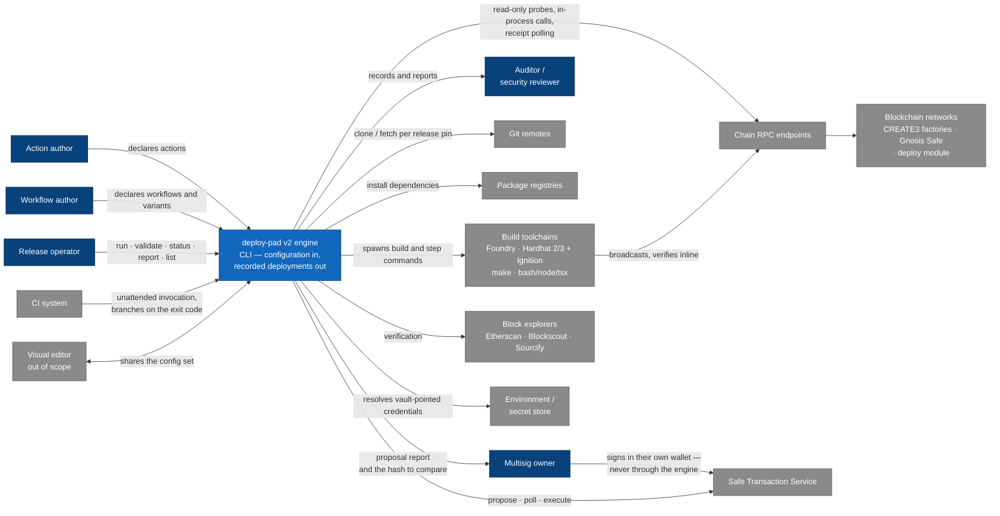

### 3.1 Business context

| Partner | Direction | What crosses the boundary |
|---|---|---|
| **Action / workflow author** | in | Configuration: the actions catalog, workflows and their method variants. Validated and listed through the CLI. |
| **Release operator** | in / out | A launch invocation (plan, preset, chain scope, sender mode); out: the printed per-chain summary, the report, and the exit code. |
| **CI system** | in / out | The same invocation, unattended, with secrets from the job environment; out: the exit code and `summary.json`. |
| **Multisig owner** | out (and around) | The proposal report and the hash to compare — then signatures given **to the Safe, not to the engine**. |
| **Security reviewer / auditor** | out | The deployment records: launch parameters, frozen values, per-attempt history, confirmed addresses, artifacts. |
| **Visual editor** | — | Shares the configuration files. Out of scope here; noted because the file formats are a shared contract. |

### 3.2 Technical context

| Interface | Direction | Technology | Notes | Owning doc |
|---|---|---|---|---|
| Command line | in | argv, exit codes | Five commands, flags validated per command; no flag ever carries a credential value. | [cli.md](../specs/cli.md) |
| Config mount | in | YAML files on disk | `actions.yaml`, `workflows.yaml`, `plans/`, `known-chains.yaml`, `global-params.yaml`, `multisig.yaml`, optional `engine.yaml`, plus operator check scripts. The mount is the allowlist. | [cli.md → Common flags](../specs/cli.md#common-flags) |
| Process environment | in | env vars | Where credentials actually live; the vault maps roles onto variable names. The wrapper sources `configs/.env`; CI exports the same variables. | [secrets.md](../specs/secrets.md) |
| Git remotes | out | git over HTTPS | One clone/fetch per release pin, credential injected per git process. | [engine-internals.md → Repository authentication](../specs/engine-internals.md#repository-authentication) |
| Package registries | out | package manager | Dependency installation during prepare. | [phase-6-repo-prepare.md](phase-6-repo-prepare.md) |
| Framework toolchains | out | child processes | Build and step execution; data exchanged only through the deployment interface. | [engine-internals.md](../specs/engine-internals.md) |
| Chain RPC | out | JSON-RPC over HTTPS | Selected per chain by named RPC profile, with optional custom headers. Used by preflight probes, in-process calls, broadcasting commands and Safe polling. | [known-chains.md](../specs/known-chains.md) |
| Block explorers | out | HTTPS | Verification per selected profile, in the `etherscan`, `blockscout` or `sourcify` dialect. | [known-chains.md](../specs/known-chains.md) |
| Safe Transaction Service | out | HTTPS | MultiSend proposals, signature polling, execution at threshold; an offline export replaces it where no service exists. | [multisig.md → Backend: multisend](../specs/multisig.md#backend-multisend) |
| Results tree | out (and in) | YAML + JSON on disk | The records; also read back to resume, to answer `status` / `report`, and to rebuild the idempotency index. | [results.md](../specs/results.md) |
| Structured log | out | JSON lines | Always full debug detail regardless of console level; redacted. | [cli.md → Common flags](../specs/cli.md#common-flags) |

### 3.3 Explicitly out of scope

The visual editor application and its configuration; the v1 → v2 migration mechanics; signature collection and any signing UI; key custody; contract source authoring; and the CREATE3 factory / Safe module deployments themselves, which are operational prerequisites the engine consumes rather than provisions.

---

## 4. Solution strategy

Nine decisions carry the architecture. Each is stated here in one line with its rationale compressed; the full decision records are in [§9](#9-architecture-decisions).

| # | Strategy | Why it solves the problem |
|---|---|---|
| S1 | **Three separated configuration layers** — action (interface), workflow (structure and wiring), plan (values) — with no layer able to reach into another's job. | One catalog serves every launch, one workflow serves every environment, and a values file can never silently change what gets deployed or how. |
| S2 | **A phase pipeline where each phase is a contract** — eight phases, each consuming the previous phase's named artifact and producing one of its own. | Makes "what can fail where" answerable, keeps every error class owned by exactly one phase, and confines on-chain side effects to phase 7. |
| S3 | **Fail static, then fail cheap.** Everything a file can prove fails in phases 1–4; what only the network knows is probed read-only in phase 5; everything execution needs is built eagerly in phase 6. | A typo, a missing factory, a wrong-network RPC or a broken build all surface before the first transaction, when nothing has to be unwound. |
| S4 | **Records are the state.** No database: an immutable launch record, a frozen parameter set, one attempt record per invocation, and derived aggregates. | Auditability and resume fall out of the same artifacts, and a crash can lose at most the in-flight step. |
| S5 | **Out-of-process execution behind an explicit interface.** The engine passes context in through environment variables and reads results from `.env.outputs` and an artifacts directory. | Any toolchain works, including recipes the engine cannot modify, without the engine reverse-engineering framework internals. |
| S6 | **Engine defaults first, author extras appended.** Each action type wires a minimal required set of enrichers, writers and a command class in code; authors may append, never remove or reorder. | Extension without the footgun: an author cannot produce a structurally broken action, but bespoke flows are still expressible. |
| S7 | **Credentials as tagged pointers.** Committed YAML holds vault or env references; the resolved value is tagged at the load layer, delivered only through the `SEC_` environment, and displayed as its reference label everywhere. | Rotation is one line, and there is no untagged path from configuration to output. |
| S8 | **Sender mode is a run parameter.** The same plan launches from an EOA on staging and through a Safe on production; the Safe registry is its own mountable file. | Reuse without config edits, and CI environments can be provisioned with only the Safes they may use. |
| S9 | **Deployments freeze at creation.** The chain list, the resolved parameter set and the structural shape are recorded; a resume reconciles against the records rather than re-deriving from the current configs. | A launch that spans days cannot end up half-deployed with two different sets of values, owners or addresses. |

Two consequences worth stating up front, because they explain much of the rest of the document:

- **Static resolution is a design goal, not an optimization.** Given a workflow id and a chain, every step's deployment method, factory flavor and signing-key slot is known before the plan is consulted. That is what makes `validate`, `--dry-run` and the structural fingerprint possible.
- **The engine never waits for a human.** Signature collection can take days; the invocation exits in a recorded waiting state and any later invocation continues. Long-running human processes are absorbed by the resume model rather than by a blocking process.

---

## 5. Building block view

### 5.1 Level 1 — the engine and its neighbours

The system is one process, the processes it spawns, and the three workspace directories it reads and writes.

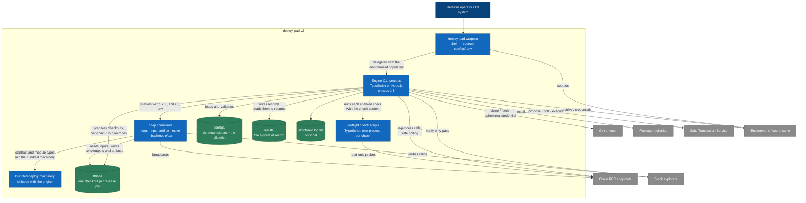

| Building block | Kind | Responsibility |
|---|---|---|
| **`deploy-pad` wrapper** | Shell script | Sources `workspace/configs/.env` into the environment, then delegates to the engine CLI. In CI the job exports the same variables and calls the engine directly — the only difference between the two environments. |
| **Engine CLI process** | TypeScript on Node.js | The whole run pipeline. Decomposed in [§5.2](#52-level-2--inside-the-engine-process). |
| **Preflight check scripts** | TypeScript, one process per check | Probe on-chain preconditions read-only. Exit code is the verdict; printed output is the message. Receive the curated check context, never a secret. |
| **Step commands** | Subprocess per step | Run one step in a prepared checkout, fulfilling the deployment interface. Either an author's script/recipe or the engine's bundled machinery. |
| **Bundled deploy machinery** | Shipped with the engine | Fulfils the deployment interface (and the multisig planning contract) for the contract and module action types, so authors configure nothing. |
| **Config mount** (`workspace/configs`) | Directory, read-only to the engine | The configuration set; mounting a trimmed directory is the sandboxing mechanism. |
| **Repository checkouts** (`workspace/repos`) | Directory | One working tree per release pin, each holding the per-chain `deployment-run/` directories with every engine-written working file. |
| **Results tree** (`workspace/results`) | Directory | The system of record — and, on resume, a normative input. |

Inside the engine process, the level-1 decomposition follows the **run lifecycle**, because that is the system's real internal structure: [run-lifecycle.md](run-lifecycle.md) defines each phase as a contract with a named input and output artifact, and each phase owns its own design doc.

| Phase | Building block | Consumes | Produces | Design doc |
|---|---|---|---|---|
| 1 | Invocation and run context | argv | run context | [phase-1-invocation.md](phase-1-invocation.md) |
| 2 | Config load and validation | run context | resolved plan (per chain, secrets tagged) | [phase-2-load-validation.md](phase-2-load-validation.md) |
| 3 | Workflow resolution and static planning | resolved plan | execution plan | [phase-3-static-planning.md](phase-3-static-planning.md) |
| 4 | Deployment resolution | execution plan | deployment decision (+ the launch record and the frozen parameters) | [phase-4-deployment-resolution.md](phase-4-deployment-resolution.md) |
| 5 | Dynamic preflight checks | deployment decision | preflight clearance | [phase-5-preflight.md](phase-5-preflight.md) |
| 6 | Repository prepare (eager) | preflight clearance | prepared checkouts | [phase-6-repo-prepare.md](phase-6-repo-prepare.md) |
| 7 | Per-chain execution | prepared checkouts | per-chain outcomes | [phase-7-per-chain-execution.md](phase-7-per-chain-execution.md) |
| 8 | Persistence and final report | per-chain outcomes | records and exit code | [phase-8-persistence-report.md](phase-8-persistence-report.md) |

The artifact chain is drawn in [run-lifecycle.md](run-lifecycle.md#how-phase-docs-are-written). Phases 1–6 are free of on-chain side effects; **phase 7 is the only phase that changes chain state**, which is the property the whole ordering exists to protect.

### 5.2 Level 2 — inside the engine process

C4 level 3 — the components of the engine process, arranged along the run pipeline. Each arrow between phases is a named artifact contract:

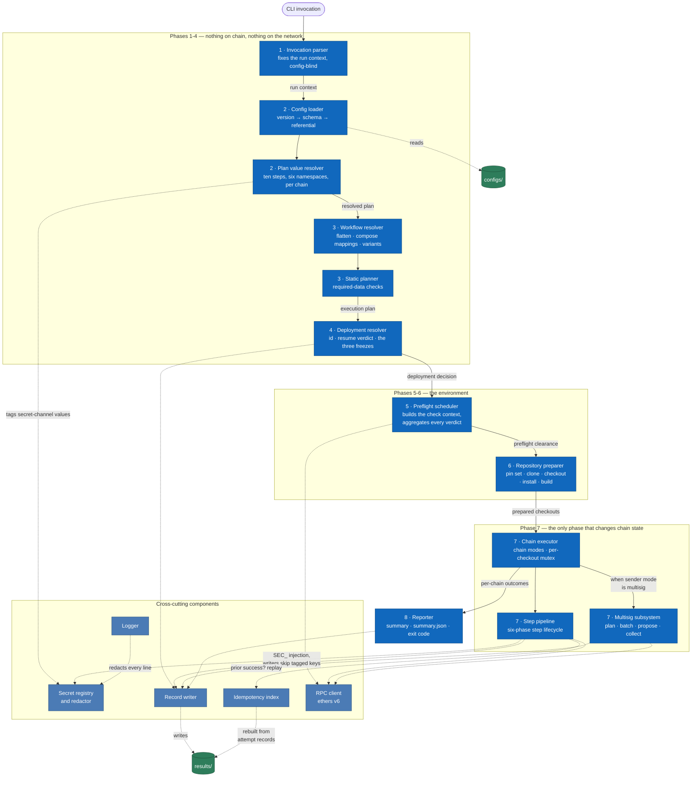

| Component | Phase | Responsibility | Interface it offers | Notes |
|---|---|---|---|---|
| **Invocation parser** | 1 | Fix everything that deliberately lives outside config files: plan, preset request, deployment identity, chain scope, chain mode, sender mode, escape hatches. | run context | Config-blind by design — it decides what *kind* of run this is, and rejects an unknown or misapplied flag before anything loads. |
| **Config loader** | 2 | Per file, in order: version gate, schema validation, referential validation of everything a schema cannot see. | parsed, cross-checked documents | `validate` is this component plus the value resolver, the workflow resolver and the static planner, run to completion and stopped. Collects all errors rather than stopping at the first. |
| **Plan value resolver** | 2 | The ten-step resolution pipeline: chain references, preset selection, deployment overrides, then `global` → `system` → secrets merge → `vault` → `random` → `env`, per chain. | resolved plan | Owns the strict-miss rule; hands every secret-channel value to the secret registry as it resolves. See [§8.3](#83-value-resolution). |
| **Secret registry and redactor** | cross-cutting | Tag secret-channel values at the load layer, carry tags through the pipeline, inject under `SEC_`, and substitute reference labels in all output and records. | tagged parameter map, redaction filter | Tagging precedes every enricher so that a derived value cannot escape untagged. See [§8.4](#84-secrets-and-redaction). |
| **Workflow resolver** | 3 | Flatten nested workflows to one ordered step list with dotted ids, compose parent mappings into nested steps, and apply method-variant overrides per chain. | flat step list with resolved strategy | Resolution is fully static: workflow id + chain determine method, factory flavor and key slot. |
| **Static planner** | 3 | Run the required-data checks — CREATE3 factory coverage, the salt ladder, resolvable key slots, multisig preconditions. | execution plan | The boundary `validate` and `--dry-run` stop at. |
| **Deployment resolver** | 4 | Resolve the concrete deployment id, decide resume or fresh, write the launch record and the frozen parameter set, and enforce the three freezes. | deployment decision | The id is fixed *before* value resolution consumes `${system.DEPLOYMENT_ID}` — see [phase 4 → the ordering subtlety](phase-4-deployment-resolution.md#the-ordering-subtlety-id-before-values). |
| **Preflight scheduler** | 5 | Build the curated, versioned check context; run run-scope checks then per-chain checks in declaration order; aggregate every verdict before aborting; report disabled checks visibly. | preflight clearance | Contains no check logic of its own — even the three shipped checks are ordinary scripts. |
| **Repository preparer** | 6 | Collect the pin set and, sequentially per pin, clone or fetch, checkout, install, build — recording the resolved HEAD. | prepared checkouts | Chain-independent by construction; injects repository credentials ephemerally, per git process. |
| **Chain executor** | 7 | Walk the resolved chain set under the selected chain mode; own the per-chain run directories and the per-checkout mutex; decide what a chain failure does to the other chains. | per-chain outcomes | A failing step always fails its chain; only the *other* chains' fate is mode-dependent. See [§8.10](#810-concurrency). |
| **Step pipeline** | 7 | The six-phase step lifecycle. Detailed in [§5.3](#53-level-3--the-step-pipeline-and-the-multisig-branch). | step outcome | |
| **Multisig subsystem** | 7 | Replace the execute phase with the planning contract; batch, propose, poll, execute, and run the post-execution pass. | batch statuses, proposal report | Detailed in [§5.3](#53-level-3--the-step-pipeline-and-the-multisig-branch). |
| **Idempotency index** | 7 | Answer "did this step already succeed for this deployment and chain?" | replay lookup | Rebuilt from the attempt records at startup; matches step ids exactly, so renaming a step invalidates prior results. |
| **RPC client** | cross-cutting | The engine's own chain access: in-process contract calls, receipt waiting, address prediction, identity and balance probes, Safe polling. | chain operations | ethers v6. |
| **Record writer** | 4, 7, 8 | Own every file under a deployment directory and the rules they obey: write-once launch record, continuous attempt records, derived aggregates, additive-only versions, redaction by tag. | the results tree | See [§8.11](#811-records-and-reporting). |
| **Reporter** | 8 | Turn per-chain outcomes into the printed summary, `summary.json` and the exit code; also serve `status` and `report`. | summary, exit code | Best-effort: a reporting failure never masks the run outcome. |
| **Logger** | cross-cutting | One ordered console level scale plus an always-debug structured log file. | log sinks | Every line passes the redactor; in parallel mode every line carries its chain. |

### 5.3 Level 3 — the step pipeline and the multisig branch

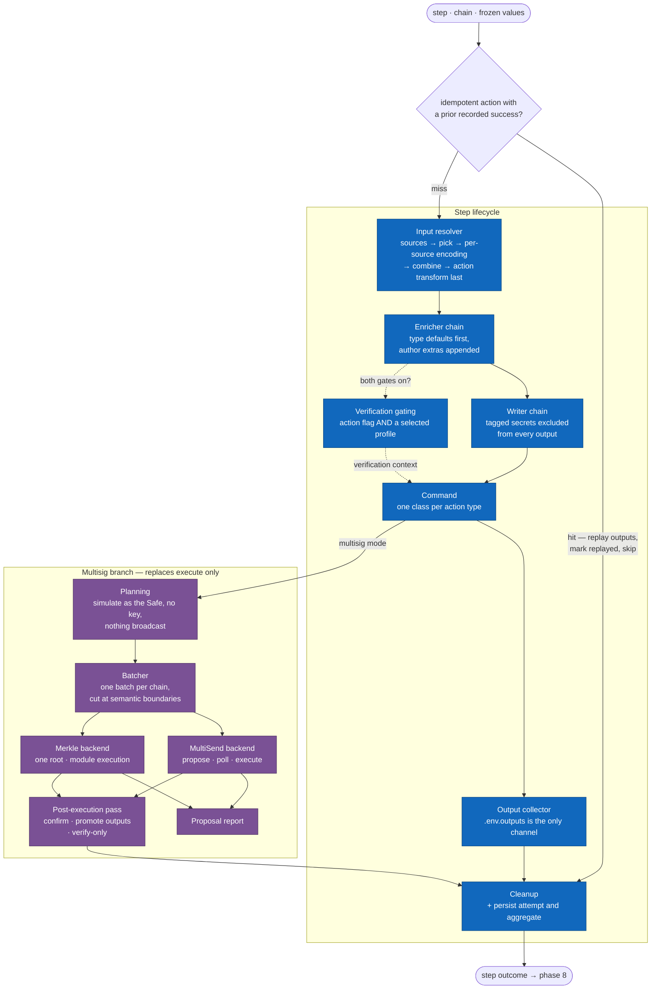

The step lifecycle is **idempotency lookup → enrich → write → execute → collect → cleanup**, owned field-by-field by [engine-internals.md → How the engine processes an action](../specs/engine-internals.md#how-the-engine-processes-an-action) (which carries the component-level sequence diagram).

| Component | Responsibility | Failure behavior |
|---|---|---|
| **Idempotency lookup** | For an action whose effective `idempotent` is `true`, replay a prior recorded success and skip the rest of the lifecycle, marked with a back-reference. | A miss simply executes the step. |
| **Input resolver** | Produce each declared input from its mapping in one fixed order: resolve sources → `pick` → per-source encoding → `combine` → the action's authoritative transform last. Built-in parameters resolve by the same ladder. | An unresolved consumed value, an out-of-range `pick`, or an arity mismatch fails the step (arity is caught earlier, at load). |
| **Enricher chain** | Add engine-managed values: system context, resolved deploy strategy, the signing key, built-in parameters, and the deployment-interface context. Type defaults first in fixed order, author extras appended. | Any enricher throwing is a step failure, and enrichment failures never write to the run directory. |
| **Writer chain** | Serialize the parameter map into the run directory in the formats the command class expects. **Tagged secrets are excluded from every writer's output.** | Same as enrichers. |
| **Command** | One class per action type: spawn the subprocess, or perform the operation in process for `contract-call`. | A non-zero exit is a step failure. |
| **Verification gating** | Two switches that must both be on — the action's `verify: true` and at least one selected verification profile. When on, the command verifies **inline**; the engine runs no verification command of its own in EOA mode. | An inline verification failure is a step failure (exit class 5). |
| **Output collector** | Read `.env.outputs` as the only output channel, match declared names, parse array outputs, and persist the artifacts directory to the results tree. | A declared output missing from `.env.outputs` fails the step. |
| **Cleanup** | Writers remove their temporary files; the attempt record and the aggregate are persisted. | — |

The multisig branch replaces only the execute phase; everything around it is unchanged.

| Component | Responsibility |
|---|---|
| **Planning** | Simulate each deploying step as the Safe — `SYS_MULTISIG=1`, `SYS_SENDER_ADDRESS=<safe>`, no key injected, nothing broadcast. Steps write the would-be transactions plus **predicted** outputs, so downstream wiring keeps flowing and a whole workflow usually plans in one pass. |
| **Batcher** | One batch per chain by default; cut only at a **semantic boundary**, where planning cannot continue until earlier transactions have executed. Never splits silently — an oversized MultiSend batch fails at planning time with the estimate, the limit and a recommendation. |
| **MultiSend backend** | Wrap a batch into one Safe transaction, propose it with the proposer delegate, poll for signatures, execute with the executor key at threshold. Offline export where no Transaction Service exists. |
| **Merkle backend** | One tree over every planned transaction of the run, one root signature per owner, then leaf-by-leaf execution through the Sphinx-based module, which enforces root, proof and ordering. |
| **Proposal report** | One human-readable entry per transaction plus the exact hash the owners' wallet will display. |
| **Post-execution pass** | Confirm the execution transaction and code at each predicted address, promote predicted outputs to confirmed, persist staged artifacts, then run the verify-only pass. |

Field-level ownership: [multisig.md](../specs/multisig.md) for the planning contract, batching, backends and statuses; [engine-internals.md](../specs/engine-internals.md) for enrichers, writers, command classes and the per-type wiring table.

---

## 6. Runtime view

### 6.1 Scenario 1 — an EOA run, happy path

> Phase semantics: [run-lifecycle.md](run-lifecycle.md).

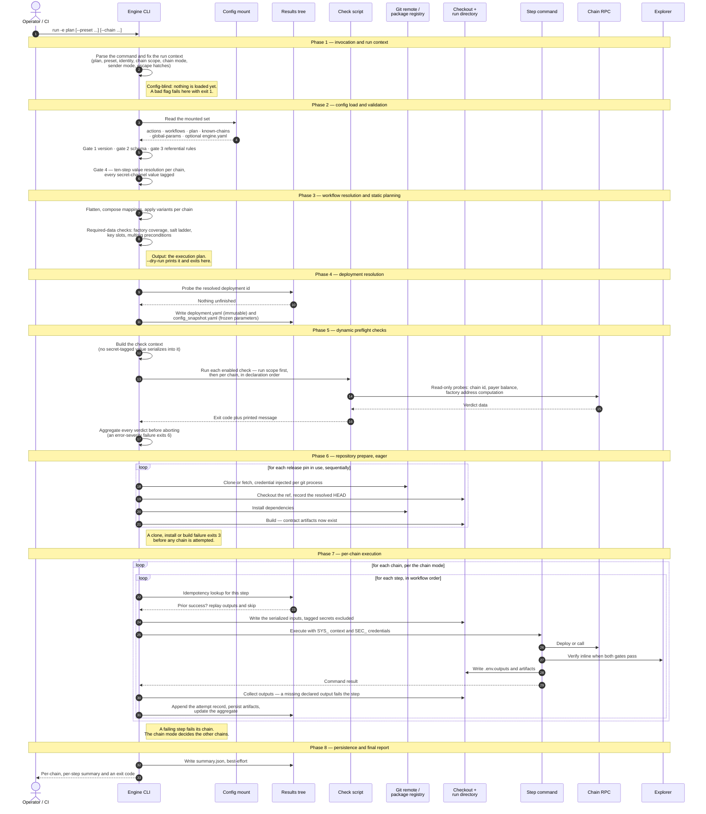

One invocation walks all eight phases. The load-bearing runtime facts, beyond the phase order itself:

- **Nothing is loaded in phase 1.** A bad flag fails before a single file is opened.
- **Phase 2 ends with values, not just shapes** — a per-chain resolved plan with every secret tagged.
- **Phase 4 writes before it executes.** A fresh deployment's launch record and frozen parameter set exist before phase 5 makes its first network call.
- **Phase 5 is the run's first network contact** — seconds of read-only probes, deliberately cheaper than the repository prepare it precedes.
- **Phase 6 prepares every pin, eagerly and sequentially**, so a broken build cannot surface on chain three of five.
- **Phase 7 persists continuously.** Each step's attempt lands as it completes, so a crash loses at most the in-flight step and phase 8 never persists an outcome for the first time.

### 6.2 Scenario 2 — a deploying step across the deployment interface

> Interface reference: [engine-internals.md → The deployment interface](../specs/engine-internals.md#the-deployment-interface).

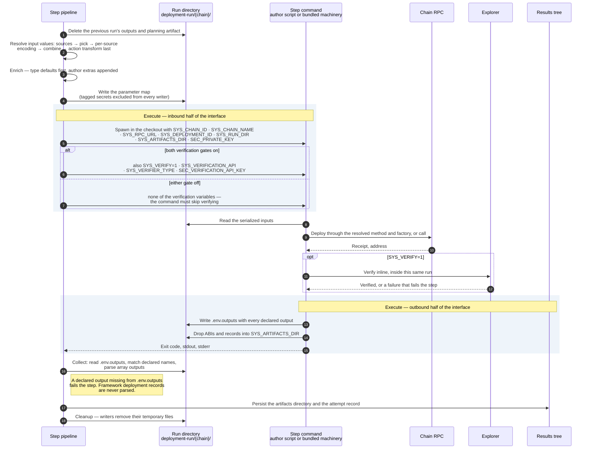

This is the architecture's most important boundary: the engine hands a command its context through the process environment and reads results back from two well-known places, and in between the command keeps full control of how it deploys and verifies.

- **Inbound**, per deploying step: the execution context (`SYS_CHAIN_ID`, `SYS_CHAIN_NAME`, `SYS_RPC_URL`, `SYS_DEPLOYMENT_ID`), the run directory (`SYS_RUN_DIR`), an empty per-step artifacts directory (`SYS_ARTIFACTS_DIR`), the signing key (`SEC_PRIVATE_KEY`, per the private-key rule) and — only when both verification gates pass — the verification context.
- **Outbound**: `.env.outputs` carrying **every** declared output, plus whatever the command chose to keep in the artifacts directory.
- **The hard rule**: a declared output missing from `.env.outputs` fails the step. Framework deployment records are never parsed, which is what keeps ten action types behind one collect path.

### 6.3 Scenario 3 — resuming an unfinished deployment

> Design: [phase-4-deployment-resolution.md](phase-4-deployment-resolution.md).

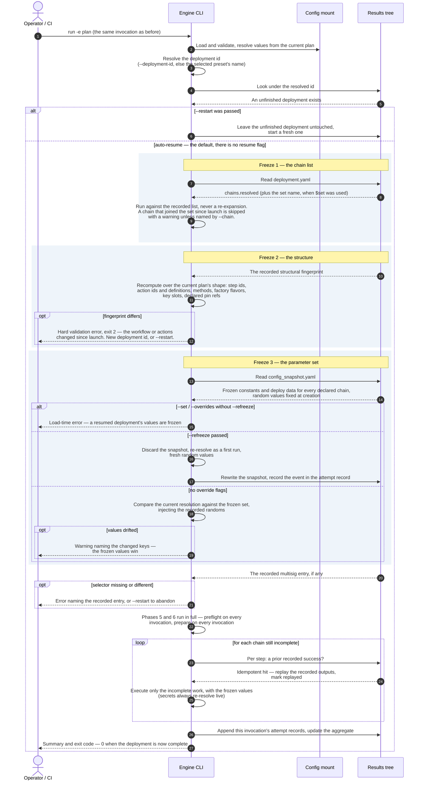

Re-running the same invocation is the resume mechanism — there is no resume flag. The invocation reconciles against three recorded facts, with deliberately different severities:

| Freeze | Recorded in | On divergence |
|---|---|---|
| **Chain list** | `deployment.yaml` | The recorded list wins; a chain that joined the plan's chain set since launch is skipped with a warning, includable only by naming it explicitly. |
| **Parameter set** | `config_snapshot.yaml` | **Warning** naming the changed keys; the frozen values win. `--set` / `--overrides` error unless `--refreeze` is passed. Secrets are exempt — they never persist and re-resolve live, so rotating a key mid-deployment is ordinary operations. |
| **Structure** | the fingerprint in `deployment.yaml` | **Hard error** (exit 2): recorded results are keyed by step ids whose meaning changed, so replaying them would fabricate history. Start a new deployment id, or `--restart`. |

The severity split is the point: value drift is representable and recoverable, so a 2 a.m. retry is not blocked because a colleague edited the plan for next week; structural drift invalidates resume's premise, so it refuses.

### 6.4 Scenario 4 — a multisig launch across invocations

> Semantics: [multisig.md → Lifecycle & resume](../specs/multisig.md#lifecycle--resume).

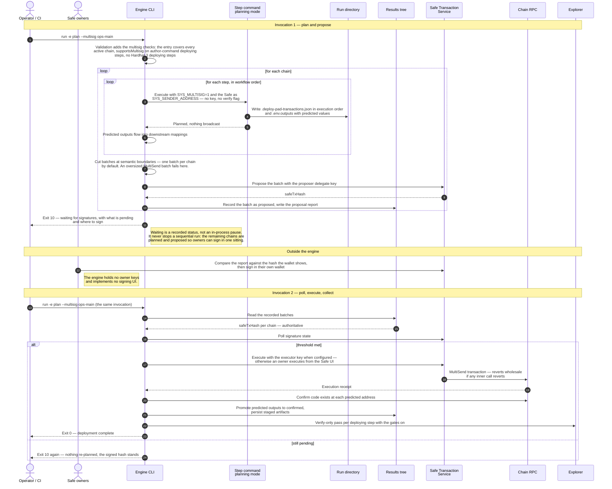

The run splits in half around a human process the engine refuses to block on:

1. **Invocation 1** plans every step as the Safe, cuts batches, proposes them, writes the proposal report, and exits with code `10` — the recorded *waiting* state. Waiting is not a failure and never stops a sequential run: the loop keeps planning and proposing the remaining chains so owners can sign everything in one sitting.
2. **Owners sign outside the engine**, comparing the report against the hash their wallet shows.
3. **Any later invocation** under the same deployment id polls, advances whatever became executable, confirms code at the predicted addresses, promotes predicted outputs to confirmed, and runs the verify-only pass. A `proposed` batch is **re-verified, never re-planned** — the signed hash is authoritative.

### 6.5 Failure scenarios

Each phase owns its error classes, and the exit code names the earliest phase that failed. The full table lives in [run-lifecycle.md → Failure model](run-lifecycle.md#failure-model); the mapping in brief:

| Phase | Failure class | Exit |
|---|---|---|
| 1 | Invocation error — unknown or misapplied flag, malformed `--set` | `1` |
| 2 | Configuration / validation — version mismatch, schema, references, unresolvable reference, unknown chain, profile or vault entry | `1` / `2` |
| 3 | Static planning — missing CREATE3 factory, no resolvable key, `supportsMultisig` missing, `create3` on Hardhat 3 | `2` |
| 4 | Deployment resolution — sender-mode mismatch, structural fingerprint mismatch, overrides on a resume without `--refreeze` | `2` |
| 5 | Preflight — unreachable RPC, chain identity mismatch, any failing `error`-severity check (all reported together) | `6` |
| 6 | Repository — clone, auth, checkout, install or build | `3` |
| 7 | Execution — command failure, missing declared output, reverted transaction, inline verification | `4` / `5` |
| — | Multisig waiting — a clean, non-failure exit distinct from success | `10` |

Warnings never stop a run in any phase: salt fallbacks, missing `version` keys, unpinned pins, verification-off-with-`verify: true`, and parameter drift on a resume are printed and recorded, and execution proceeds.

---

## 7. Deployment view

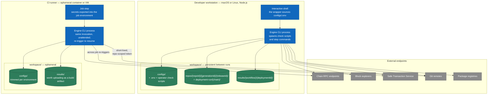

### 7.1 Infrastructure

The engine has **no environment awareness of its own**. A launch is always the same invocation of the same CLI against the same files; only the surrounding environment differs.

| Environment | What it provides | What differs |
|---|---|---|
| **Developer workstation** | Node.js, a persistent `workspace/`, and the wrapper sourcing `configs/.env`. | Credentials come from the local `.env`; checkouts and results survive between runs, so resume and `status` are immediate. |
| **CI runner** | An ephemeral container or VM (e.g. GitHub Actions) with secrets exported into the job environment. | Credentials come from the CI secret store; the workspace is ephemeral unless cached or uploaded — the results tree is the artifact worth persisting. Resume is a job re-trigger. |

CI operation requires **no engine extensions**: unattended execution, the exit-code contract (in particular code `10`, which lets a pipeline distinguish a pending multisig deployment from success), and flag-less resume are together sufficient to drive even a multi-day multisig launch.

### 7.2 The workspace on disk

```
workspace/
  configs/                                   # --configs-dir — the mount is the allowlist
    actions.yaml  workflows.yaml  known-chains.yaml  global-params.yaml
    multisig.yaml  engine.yaml                # both optional; a mounted engine.yaml replaces the default wholesale
    plans/<workflow>.yaml                     # one plan per workflow (or per variant)
    .env                                      # sourced by the wrapper; never committed
    <operator check scripts>.ts               # preflight scripts must live inside the mount
  repos/<repoId>/<generationId>/<releaseId>/  # --repos-dir — one working tree per release pin
    deployment-run/<chain>/                   # every engine-written working file, per chain
  results/<workflow>/<deploymentId>/          # --results-dir — the system of record
    deployment.yaml  config_snapshot.yaml  summary.json
    <chain>/ run-N.yaml  result.yaml  artifacts/<stepId>/
```

Four properties of this layout are load-bearing:

- **The mount is the sandbox.** The engine can use only what is mounted — which is how a CI environment is restricted to the multisig entries it is permitted to use. Preflight scripts ship with the config set for the same reason (and because no repository exists yet when they run).
- **One directory per release pin.** Generations and pins never share a working tree, build cache or dependency install — which is what makes a workflow that spans two generations of one repo safe.
- **All engine working files live in per-chain run directories** inside the checkout, reached through `SYS_RUN_DIR`. Chains cannot contaminate each other, a failed run leaves everything for that chain in one named place, `--cleanup` removes exactly one folder, and a single local-only ignore rule keeps checkouts out of `git status`.
- **Results are per-chain by construction**, so no chain mode changes *what* is recorded — only when and whether a chain is attempted in an invocation.

### 7.3 Sizing and operational notes

Install and build run **on every invocation, with no caching**, immutable pins included: an unchanged checkout does not make the tree trustworthy, and the staleness detection a safe skip would need is exactly where the subtle bugs live. Pins prepare **sequentially**, for readable logs and unambiguous failure attribution. Pins no longer used by any plan are left on disk; reclaiming them is an operator action, not part of a run.

---

## 8. Cross-cutting concepts

### 8.1 Domain model

The vocabulary is small and load-bearing; [§12](#12-glossary) defines each term, [naming.md](../specs/naming.md) maps them from v1. The shape:

- A **repo** contains **generations** (interface-stable eras), each owning its **actions** and its **releases** (immutable code pins).
- A **workflow** orders **steps**, each referencing an action or a nested workflow, and wires their inputs to prior steps' outputs. A **method variant** re-skins a workflow with different per-step deploy strategy — never different wiring.
- A **plan** points at one workflow (or, inline, one action) and supplies values through **presets**, exactly one of which is active per run.
- A **deployment** is one logical launch, keyed by a deployment id and made of one or more **invocations**, each recorded as an attempt.

### 8.2 Configuration and validation

Four ordered gates per file — **version check → schema → referential rules → value resolution** — with `validate` being exactly gates 1–4 plus static planning, run to completion and stopped. Two deliberate choices shape this: a **version mismatch is an error by default** (the safest response to a file written against a different format is to stop before deploying, with `--ignore-version` as the audited escape hatch), and **all errors are collected** rather than reported one at a time. Dynamic preconditions no file can prove are the preflight phase's job: one uniform mechanism, nothing engine-native, with three checks shipped and enabled by the default engine config. Owning docs: [phase-2-load-validation.md](phase-2-load-validation.md), [engine-internals.md → Config version check](../specs/engine-internals.md#config-version-check), [engine.md](../specs/engine.md).

### 8.3 Value resolution

Two mechanisms, deliberately non-overlapping in syntax:

- **`${...}` substitution** resolves *names into strings at plan load*, through six explicit namespaces, in a fixed ten-step order, per chain. A closed namespace set plus mandatory prefixes means a reader can always tell where a value comes from, and a typo can never resolve against the wrong source. Misses are hard errors by default; the transitional `strict: false` opt-out tolerates *unconsumed* placeholders only — an unresolved token never reaches a command in either mode. Scoping is a matrix: each configuration location accepts only its listed namespaces, so actions stay pure declarations and workflows stay pure wiring.
- **Transforms and combines** reshape *already-resolved values at step input resolution*, in the fixed order `actionTransform(combine(perSourceTransform(pick(source))))`. The action's declared transform is authoritative and always last; a workflow can only add adaptation before it.

Owning docs: [references.md](../specs/references.md), [plans.md](../specs/plans.md), [engine-internals.md → Transforms](../specs/engine-internals.md#transforms).

### 8.4 Secrets and redaction

Committed YAML carries only pointers; the real value exists in the environment at execute time; everything through the secret channel is tagged and redacted uniformly, however it was authored. Four layers, each with one job:

```
process.env → vault (role → env pointer) → plan secrets (slot → vault ref)
            → workflow mapping (per-step slot rename) → engine (${secret.X} → SEC_*)
```

One credential, end to end:

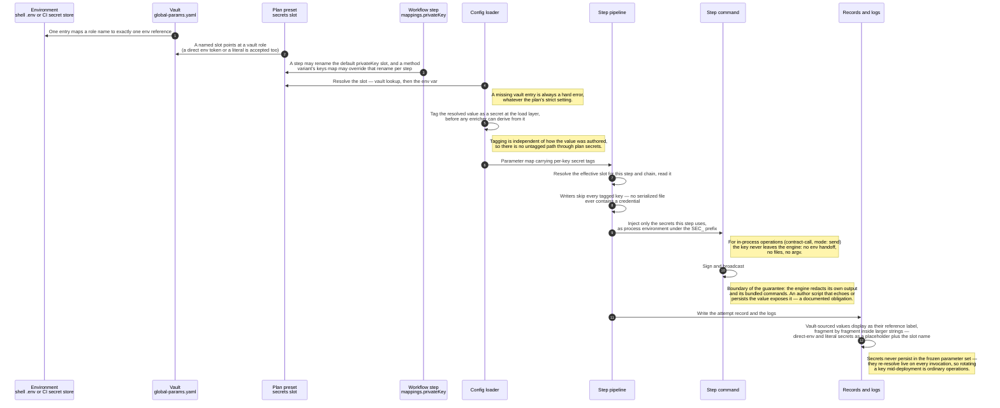

Three guarantees follow from the tag: **excluded from all writer output**, **delivered to subprocesses through the process environment only**, and **redacted in every log and record** — vault-sourced values as their reference label (fragment by fragment inside larger strings, so a URL stays readable), direct-env and literal secrets as a placeholder with the slot name preserved. Tagging happens at the **load layer**, before any enricher can derive from a secret and propagate the derivation untagged.

The honest boundary: the engine guarantees redaction for its own output and its bundled commands. An author-written command receives the real credential over `SEC_*` because it needs it to sign — from there the obligation is the script author's, and the docs say so rather than implying a guarantee the architecture cannot make. In-process operations (`contract-call` with `mode: send`) keep the key inside the engine entirely: no env handoff, no files, no argv.

Owning docs: [secrets.md](../specs/secrets.md), [engine-internals.md → Vault resolution and secret tagging](../specs/engine-internals.md#vault-resolution-and-secret-tagging).

### 8.5 Determinism and address derivation

The deployment **method** (`create` / `create2` / `create3`) and, for `create3`, the **factory flavor** (`oneInch` / `createx` / `solady`) determine a deployed contract's address identity, which is why both are structural and resolve entirely from the workflows file — statically, before the plan is consulted. The plan supplies only data: per-step salts and factory addresses. A salt always resolves, through a ladder that warns as it gets less reproducible (explicit → derived from `saltBase` → derived from a random base); a missing factory address for a flavor that needs one is a hard error, because there is no safe fallback (`createx` needs none — the canonical singleton is known to the engine). Derivation from `saltBase` is deterministic and chain-independent, so a derived CREATE3 address is identical across chains and distinct steps never collide.

Owning docs: [workflows.md](../specs/workflows.md), [engine-internals.md → Deploy method & salt resolution](../specs/engine-internals.md#deploy-method--salt-resolution).

### 8.6 Idempotency, resume and the state freeze

Resume is the default behavior of re-running an invocation, and it composes three mechanisms:

- **Per-step idempotency.** An action whose effective `idempotent` is `true` replays a prior recorded success instead of re-executing. The index is rebuilt from the attempt records, scoped to one deployment id and one chain, and matches step ids exactly. The engine does not verify that an author's `idempotent: true` assertion is safe — for contract types it is true by construction; for scripts it is the author's claim.
- **The three freezes** ([§6.3](#63-scenario-3--resuming-an-unfinished-deployment)): chain list, parameter set, structure.
- **Deployment identity.** The id derives from the selected preset's name unless given explicitly; an unfinished deployment under it resumes, a completed one causes a fresh, ordinal-suffixed deployment. Nothing is ever mutated: new work lands in new attempts or a new directory.

### 8.7 Extensibility

Three extension points, all following the same shape — **engine defaults first, author extras appended**:

| Extension point | What an author may do | What they may not do |
|---|---|---|
| Enrichers and writers | Append registered components per action, in declaration order. | Remove, reorder or replace the type's required defaults. Unknown names are validation errors. |
| Preflight checks | Add operator check scripts to the config mount; disable, re-order, re-scope or re-severity any check, shipped ones included. | Nothing is privileged: the shipped checks obey the same contract, and a mounted engine config replaces the default wholesale rather than merging. |
| Engine-native action types | — (engine code) | Type-declared **built-in parameters** (`builtin.<NAME>`) are the growth path for future native commands: no new reserved names, no new resolution paths. |

The reasoning is uniform: the `type` discriminant names a command class and the minimum wiring that keeps it correct, so letting authors *replace* defaults would let them ship structurally broken actions, while letting them *append* cannot break an invariant. Collect-side and verification components are agreed to follow the same model; their contracts are still to be designed ([§11](#11-risks-and-technical-debt)).

### 8.8 Error handling and exit codes

Errors are classified by the **phase that surfaces them**, and the exit code names that class — which is what lets CI branch without parsing logs ([§6.5](#65-failure-scenarios)). Three rules hold everywhere: **errors stop, warnings never do**; `validate` reports **all** collected errors; and the engine **prefers an explicit error over silent precedence** wherever two configuration surfaces could conflict (an `inputConstants` value versus a plan constant, a plan trying to change a method, a mapping naming an undeclared built-in). Nothing that changes what multisig owners sign is ever decided silently.

### 8.9 Logging and observability

One ordered console scale (`silent` · `error` · `warn` · `info` · `debug`), with an optional structured log file that always records full debug detail regardless of the console level — the console filters what a human watches, the file is the complete record. Secrets stay redacted at every level, including `debug`. The intended CI shape pairs `--log-level silent -l run.json` with the machine-readable outcome in `summary.json`. In parallel chain mode every console line is prefixed with its chain and the structured log carries the chain as a field.

### 8.10 Concurrency

Concurrency exists at exactly one place: the chain loop, selected per invocation by `--chain-mode` (`sequential` — the default, stopping the run on a chain failure; `continue` — recording the failure and moving on; `parallel` — all chains at once, isolated from each other's failures). In `continue` and `parallel` the exit code reflects the **worst** chain and the summary lists each chain individually.

Parallel mode shares the prepared checkouts but not the working files: per-chain run directories make engine files collision-free, so the only shared state left is the *framework's* own on-disk state, touched only while a command runs. The engine therefore holds a **per-checkout mutex around the execute span only** — commands sharing a checkout serialize; write, collect, cleanup, chains on different pins and all RPC waiting overlap freely. There is deliberately **no concurrency cap**: when an RPC degrades under load, the failures surface per chain and the operator chooses a different mode or profile.

### 8.11 Records and reporting

Six record kinds, three scopes, three rules — **immutability**, **redaction**, **self-sufficiency** — and an additive-only version on every record.

| Record | Scope | Written | Role |
|---|---|---|---|
| `deployment.yaml` | deployment | once, phase 4 | The immutable launch record: preset, overrides, multisig entry, resolved id, chain provenance, structural fingerprint. |
| `config_snapshot.yaml` | deployment | phase 4; rewritten only by `--refreeze` | The frozen parameter set — **normative on resume**. Secrets never persist here. |
| `run-N.yaml` | chain, per invocation | phase 7, as steps complete | The authoritative attempt record; the idempotency index and the aggregates are derived from these. |
| `result.yaml` | chain | after each step or batch | The repairable aggregate — derived, never authoritative. |
| `artifacts/<stepId>/` | chain | at collect | Whatever the step chose to keep. |
| `summary.json` | deployment | end of every invocation | The machine-readable summary of the latest invocation; best-effort, rewritten each time. |

### 8.12 Security

The security posture is a set of narrow boundaries rather than a perimeter:

- **No credential need ever be committed**: every credential surface accepts vault or env pointers, and the schema rejects literals everywhere except plan `secrets:`, where they are discouraged and still redacted.
- **Credentials reach subprocesses only through the process environment**, injected per step and per need — never files, never argv. Repository tokens are injected per git process and leave no trace in the checkout, its config or process listings.
- **The engine holds no Safe owner keys** and implements no signing UI; the proposer can only queue and the executor only pays gas.
- **Environments are constrained by mounting**, which is the allowlist for configs and, specifically, for multisig entries.
- **Preflight checks see no secrets**: the check context serializes untagged values only and carries the sender's *address*, never key material.

---

## 9. Architecture decisions

The design set keeps **one home for cross-cutting decisions**: [specs/design-decisions.md](../specs/design-decisions.md), which records what was decided, why, what was rejected and what follows. This section is therefore an **index into it** rather than a second copy, and the per-topic normative specs are linked from each entry there.

> **Deviation from the arc42-c4 skill, deliberately.** The skill asks for a `decisions/` file per ADR alongside the section-9 index. This doc set predates that guidance with a single decision record that the README names as the canonical home, and the entries there are richer than an ADR stub (each carries its rejected alternatives and consequences). Splitting them would create two places to update and invite drift — the exact failure the rule exists to prevent. If per-decision files are wanted later, the natural move is to split `design-decisions.md` wholesale and keep this index pointing at the new files.

| Decision | Status | Record |
|---|---|---|
| Terminology rename (action / workflow / plan) | decided | [→](../specs/design-decisions.md#terminology-rename) |
| Substitution model — six explicit namespaces | decided | [→](../specs/design-decisions.md#substitution-model) |
| Built-in command parameters (`builtin.<NAME>`) | decided | [→](../specs/design-decisions.md#built-in-command-parameters) |
| Deploy method placement — workflow, never plan | decided | [→](../specs/design-decisions.md#deploy-method-placement) |
| CREATE3 factory flavors as a per-step field | decided | [→](../specs/design-decisions.md#create3-factory-flavors-per-step-factory-field) |
| Plan value layer — presets only | decided | [→](../specs/design-decisions.md#plan-value-layer-presets-only) |
| Single-action plans (inline step in the plan) | decided | [→](../specs/design-decisions.md#single-action-plans) |
| Chain connection registry — one source of truth | decided | [→](../specs/design-decisions.md#chain-connection-registry) |
| Chain sets — selector-carrying groups | decided | [→](../specs/design-decisions.md#chain-sets-selector-carrying-groups-in-known-chains) |
| Resume freeze — frozen parameters, fingerprinted structure | decided | [→](../specs/design-decisions.md#resume-freeze-frozen-parameters-fingerprinted-structure) |
| Multisig backends — multisend first, merkle second | decided | [→](../specs/design-decisions.md#multisig-execution-backends-multisend-first-merkle-second) |
| Multisig deferrals — barriers, staleness, multi-Safe | deferred | [→](../specs/design-decisions.md#multisig-deferrals-batch-barriers-proposal-staleness-multi-safe) |
| Value transforms — three orthogonal axes | decided | [→](../specs/design-decisions.md#value-transforms) |
| Strict miss behavior — strict by default | decided (opt-out transitional) | [→](../specs/design-decisions.md#strict-miss-behavior) |
| `${random.N}` — test-only, no determinism | decided (narrowed by the freeze) | [→](../specs/design-decisions.md#randomn-test-only-no-determinism) |
| Config format versioning — every file | decided | [→](../specs/design-decisions.md#config-format-versioning-every-file) |
| Vault redaction — show the reference, never the secret | decided | [→](../specs/design-decisions.md#vault-redaction-show-the-reference-never-the-secret) |
| Pluggable step components — collectors and verifiers | direction decided, contracts pending | [→](../specs/design-decisions.md#pluggable-step-components-collectors-and-verifiers) |
| Format migration | deferred | [→](../specs/design-decisions.md#format-migration) |
| Removed: legacy output-name transform | decided | [→](../specs/design-decisions.md#removed-legacy-output-name-transform) |
| Rejected namespace candidates | decided | [→](../specs/design-decisions.md#rejected-namespace-candidates) |

Decisions whose home is a phase doc rather than the cross-cutting record: the **eager, uncached repository prepare** and **sequential pins** ([phase 6 → Decided](phase-6-repo-prepare.md#decided)); **per-chain run directories** and the **execute-span-only mutex** ([phase 7 → Decided](phase-7-per-chain-execution.md#decided)); **preflight checks as ordinary scripts** with a wholesale-replacement config ([phase 5](phase-5-preflight.md)); and the **chain execution modes** with the rejected concurrency cap ([run-lifecycle.md](run-lifecycle.md#chain-execution-modes)).

---

## 10. Quality requirements

### 10.1 Quality tree

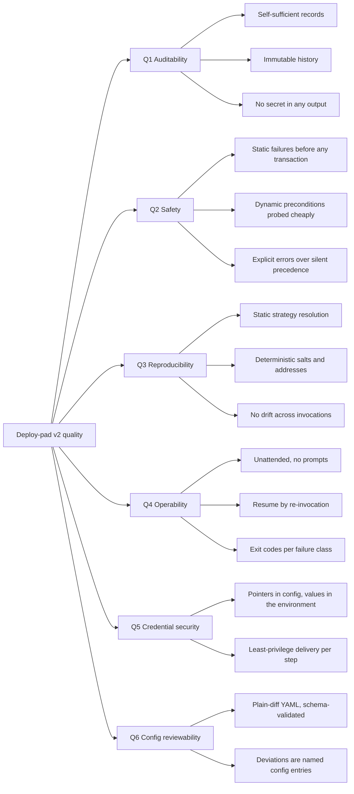

### 10.2 Quality scenarios

Each scenario is written so it can be tested. Requirement ids trace into [requirements.md § 9](../requirements.md#9-non-functional-requirements).

| # | Goal | Scenario (stimulus → expected response) | Traces to |
|---|---|---|---|
| QS-1 | Q1 | An auditor is handed only a deployment directory → they can state which code produced each address, which values were used, who the sender was, and which attempt did what — with no secret visible anywhere. | NFR-001, NFR-003 |
| QS-2 | Q1 | A run is re-launched under a completed id → the prior deployment's records are untouched and the new work lands in a fresh, ordinal-suffixed directory. | NFR-002, NFR-012 |
| QS-3 | Q2 | A plan references a `create3` step with no factory address for one chain → the run aborts in phase 3 with exit `2`, before any repository work and any transaction. | NFR-020 |
| QS-4 | Q2 | An RPC URL points at the wrong network → the shipped identity check fails in phase 5 with exit `6`, before repository prepare; every other check's verdict is reported in the same pass. | FR-RUN-005a |
| QS-5 | Q2 | A plan tries to set a step's deployment method → the schema rejects it; changing strategy requires a named method variant. | NFR-021, NFR-051 |
| QS-6 | Q3 | The same plan, preset and environment are launched twice under fresh ids with pinned code and explicit salts → identical addresses, and every non-reproducible input would have warned. | NFR-010, NFR-011 |
| QS-7 | Q3 | A plan value is edited while a deployment is unfinished, then the deployment is resumed → a warning names the changed keys and the frozen values are used; adopting the edit requires `--refreeze`. | FR-RUN-005b |
| QS-8 | Q3 | A workflow gains a step while a deployment is unfinished → the resume refuses with exit `2` and recommends a new deployment id. | FR-RUN-005c |
| QS-9 | Q4 | A CI job runs a multisig launch → it exits `10`, the pipeline treats it as pending, and a scheduled re-trigger of the same job polls, executes and completes without human interaction with the engine. | NFR-040, NFR-042, FR-CLI-041 |
| QS-10 | Q4 | A step fails on chain 3 of 5 in the default chain mode → the run stops, records the failure and the not-attempted chains, and the same invocation repeated resumes the failed and never-started chains only. | FR-RUN-007, FR-CLI-012 |
| QS-11 | Q5 | A deployer key is rotated mid-deployment → the next invocation picks up the new value with no record edit, because secrets never persist in the frozen set. | FR-RUN-005b, FR-SEC-010 |
| QS-12 | Q5 | A private repository is cloned in CI → the token reaches only the git child process, appears in no file, no remote URL and no process listing, and is redacted in logs. | FR-ACT-011, NFR-031 |
| QS-13 | Q6 | A reviewer reads one preset in a pull request → it fully determines the values a run with it uses, with no inheritance to mentally merge. | NFR-004, NFR-050 |

---

## 11. Risks and technical debt

### 11.1 Architectural risks

| Risk | Impact | Current mitigation | Tracked as |
|---|---|---|---|
| **The custom-command secret boundary.** Author-written commands receive real credentials over `SEC_*` and can echo or persist them. | A leak the engine cannot prevent or detect. | Documented author obligations; bundled machinery covers the common types so most actions never need a custom command; in-process operations never hand the key over at all. | [secrets.md](../specs/secrets.md) |
| **The balance heuristic can undershoot.** The shipped check estimates gas from step counts, not simulation. | A run passes preflight and still runs out of funds mid-chain. | Shipped as `warn` while it earns trust, with a per-chain floor as an override and an explicit promote-to-`error` path in the operator's engine config. | [engine.md → engine:balance params](../specs/engine.md#enginebalance-params) |
| **Parallel mode has no concurrency cap.** All chains run at once. | RPC rate limits or machine resources degrade a wide launch. | Failures surface per chain in the report and logs; the operator re-runs sequentially or selects a different RPC profile. Deliberately rejected rather than forgotten. | OI-7 |
| **The Merkle backend's module is trust-critical.** An enabled Safe module executes without per-transaction owner signatures. | A module bug is a Safe compromise. | Reuse of the audited, MIT-licensed Sphinx contracts instead of new Solidity; the backend is opt-in per registry entry, and multisend ships first. | [design-decisions.md](../specs/design-decisions.md#multisig-execution-backends-multisend-first-merkle-second) |
| **Plain `create` in multisig mode.** The predicted address depends on the Safe's nonce staying untouched. | A concurrent Safe transaction shifts every predicted address. | A validation warning plus guidance to prefer deterministic methods. | [multisig.md → Limitations](../specs/multisig.md#limitations--non-goals) |
| **Inline verification is not retryable.** Verification runs inside the step, so explorer flakiness fails the step. | A successful deployment reported as a failed step. | `--verify-only` re-runs verification against recorded addresses; deterministic methods make the step rerun effectively verify-only; commands are advised to deploy first, verify last. | [engine-internals.md → Verification](../specs/engine-internals.md#verification) |
| **Interface drift across a generation's pins** is an unverified author invariant. | Two pins of one generation build different interfaces; failures surface late, at step execution. | Per-generation isolation limits the blast radius; the check is a known candidate. | OI-9, FR-ACT-007 |
| **One supported config format version at a time.** | A mixed-version mount cannot be loaded without an escape hatch. | The version gate errors by default and names both versions; `--ignore-version` downgrades it for a confirmed-compatible file. | [engine-internals.md](../specs/engine-internals.md#config-version-check) |
| **URL-borne RPC credentials outside the vault.** An inline `${env.VAR}` in a URL is not secret-tagged. | A URL-embedded key can appear resolved in output. | Inline `${vault.X}` in RPC URLs is the recommended form and is redacted fragment-wise. | OI-13 |

### 11.2 Technical debt and known gaps in the design set

| Gap | Consequence | Where |
|---|---|---|
| **Phase 7's command execution pipeline section is unwritten.** The phase doc delegates to `engine-internals.md`. | The run-level view of enrichers, writers, per-type execution and collect has no phase-level home. | [phase-7-per-chain-execution.md](phase-7-per-chain-execution.md) status note, TODO item 12 |
| **Pluggable collectors and verifiers: direction decided, contracts undesigned.** | `engine-internals.md` still describes collect and verification as engine-fixed; the two descriptions must be reconciled when the contracts land. | [design-decisions.md → Pluggable step components](../specs/design-decisions.md#pluggable-step-components-collectors-and-verifiers) |
| **The plans and known-chains specs are not marked final.** | Requirements and this document's §5 and §8.3 may move with them. | OI-16, [TODO.md](../TODO.md) progress list |
| **The v1 → v2 migration is unplanned.** | Timing, mechanics and backward compatibility are open; the rename sweep touches code, workspace configs and v1 docs. | OI-1 |
| **No install/build caching.** | Every invocation pays full prepare cost, including resumes of immutable pins. | Accepted deliberately — [phase 6 → Decided](phase-6-repo-prepare.md#decided) |
| **Per-checkout mutex granularity.** A long command in one chain blocks another chain's command in the same checkout. | Reduced parallelism for chains sharing a pin. | OI-8 |

The full open-item register — sixteen items with the requirements each affects — is [requirements.md § 10](../requirements.md#10-open-items-and-assumptions); the raw-idea backlog is [TODO.md](../TODO.md).

---

## 12. Glossary

Terms as this document and the specs use them. The v1 → v2 mapping is in [naming.md](../specs/naming.md).

| Term | Definition |
|---|---|
| **Action** | One indivisible thing the engine can do — a contract deployment or a script/call invocation. Declares its interface: inputs, outputs, type, flags. Identified by `<repoId>.<generationId>.<actionId>` plus an optional short alias. |
| **Workflow** | An ordered composition of steps, each referencing an action or a nested workflow, with the wiring between their inputs and outputs. |
| **Method variant** | A workflow entry that re-skins another workflow with different per-step deploy strategy — methods, factory flavors, signing-key slots — and never different wiring. A first-class workflow id, one level deep. |
| **Plan** | The launch surface for one workflow (or, inline, one action): which chains, which values, which credentials, which code pins. One file per workflow. |
| **Preset** | A named, complete, self-contained parameter set inside a plan. Exactly one is active per run, and reading it alone determines the values a run uses. |
| **Repo / generation / release** | A git remote plus build defaults; an interface-stable era owning its actions and pins; one immutable code pin under a generation. |
| **Step** | One entry in a workflow's ordered list — an action invocation or a nested workflow. Identified by an id, dotted after flattening. |
| **Chain / chain set** | A network identified by a stable lowercase name in the chain registry; a named group of chains carrying the same profile selectors a plan chain entry would. |
| **RPC profile / verification profile** | Named connection settings per chain: an endpoint URL with optional headers; a verification API with its dialect and key. Plans select profiles by name and carry no connection values. |
| **Vault** | The registry mapping stable secret-role names to environment-variable pointers — the single audit surface for which variable feeds which role. |
| **Deployment** | One logical launch of a plan, keyed by a deployment id, potentially spanning several chains and several invocations. |
| **Invocation / run** | One engine execution attempt. A deployment accumulates one attempt record per invocation. |
| **Execution plan** | Phase 3's output: per chain, the flat ordered step list with resolved methods, factory flavors, key slots and salt/factory data. |
| **Frozen parameter set** | The resolved constants and deploy data recorded at deployment creation and normative on resume. Secrets are never part of it. |
| **Structural fingerprint** | A hash over the execution plan's shape, recorded at creation; a mismatch on resume refuses the resume. |
| **Deployment interface** | The explicit contract between the engine and a deploying command: context in through the environment, results out through `.env.outputs` and an artifacts directory. |
| **Run directory** | The per-chain folder inside a checkout holding every engine-written working file, handed to commands as `SYS_RUN_DIR`. |
| **Sender mode** | Who signs a run's transactions: `eoa` (default) or `multisig` (a Gnosis Safe). A run parameter, never a plan field. |
| **Multisig entry** | A named, self-contained record in the multisig registry: backend, per-chain Safe addresses, and the engine-held credentials. |
| **Planned transaction / batch / root** | A captured-but-not-broadcast transaction; the ordered planned transactions of one chain between semantic boundaries; the Merkle root over all planned transactions of a run. |
| **Proposer / executor** | The two engine-held multisig credentials: a Transaction Service delegate that can only queue, and a gas-paying key that executes. Neither is an owner key. |
| **Preflight check** | An out-of-process TypeScript script probing an on-chain precondition, configured in the engine config and reporting through its exit code. |
| **Tagged value** | A resolved secret-channel value carrying a secret tag: excluded from writer output, delivered only through the `SEC_` environment, and redacted in all output and records. |
| **Semantic boundary** | The point in multisig planning where planning cannot continue until earlier transactions have executed — the only reason a batch is cut. |

---

## Maintaining this document

Out-of-date architecture documentation is worse than none, so the triggers are explicit:

| Update | When |
|---|---|
| [§3](#3-context-and-scope) and the context diagram | The engine integrates a new external system, or an existing interface changes technology. |
| [§5](#5-building-block-view) and the container/component diagrams | A phase, a container or a component is added, removed, or has its contract changed. |
| [§6](#6-runtime-view) and the sequences | A phase's order changes, or a new runtime scenario becomes load-bearing (a new sender mode, a new resume rule). |
| [§7](#7-deployment-view) and the deployment diagram | The workspace layout, an environment, or the mount model changes. |
| [§8](#8-cross-cutting-concepts) | A cross-cutting mechanism is established or changed — a new namespace, a new redaction rule, a new concurrency mechanism. |
| [§9](#9-architecture-decisions) | A decision is accepted in [design-decisions.md](../specs/design-decisions.md) or a phase doc — add the row. |
| [§11](#11-risks-and-technical-debt) | A risk is identified or retired, an open item is resolved, or a documented gap is filled. |

Because this document is downstream of the specs, the honest failure mode is silent drift: when a spec changes and no section here does, that is the bug.
