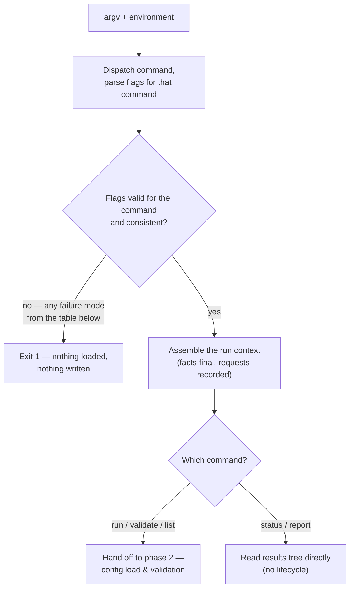

# Phase 1 — Invocation & run context

Conceptual design of the first phase of the [run lifecycle](run-lifecycle.md): parsing the command line and fixing the parameters that deliberately live outside every config file. Follows the [phase-doc template](run-lifecycle.md#how-phase-docs-are-written).

## Purpose

Every config file answers a *what* question: what can be deployed (actions), in what order (workflows), with which values (plans). Phase 1 answers the one question no file can: **what kind of run is this?** Which command, against which plan, on which chains, sending as whom, with which escape hatches. These parameters are per-invocation by design — putting them in a file would make "run the same plan on staging and production" or "retry just the failed chain" a config edit instead of a flag.

The phase turns the raw command line into a single, immutable artifact — the **run context** — that every later phase reads and none may change.

## Position in the lifecycle

| | |
|---|---|
| **Consumes** | The process arguments (argv) and the process environment. The root `deploy-pad` wrapper has already sourced `workspace/configs/.env`, so environment-provided values (`${env.VAR}` references, vault-pointed variables) are present — but phase 1 does not read them; it only carries the environment forward. |
| **Produces** | The **run context** — the fixed set of invocation parameters, handed to [phase 2](phase-2-load-validation.md). |

Nothing is loaded in this phase. No config file is opened, no directory is inspected, no chain is known. This boundary is deliberate — see [What this phase does not do](#what-this-phase-does-not-do).

## Responsibilities

Phase 1 makes one decision per group of flags. The full flag reference is [cli.md](../specs/cli.md); this section describes what each decision *means* for the run, and when its consequences take effect.

### Command selection

The command decides which slice of the lifecycle this invocation engages:

| Command | Lifecycle slice |
|---|---|
| `run` | All eight phases. The only command that can change on-chain state. |
| `validate` | Phases 2–3 to completion, then stop. Reports **all** errors, not just the first. |
| `--dry-run` (a `run` flag, but effectively a command mode) | Phases 2–3, print the execution plan, exit. |
| `status` / `report` | No lifecycle at all — they read the results tree and never load the full config set. |
| `list` | Loads configs enough to enumerate them; never plans, never executes. |

**Flags are validated per command.** Each command accepts only the flags that are meaningful for it: the results-reading commands share the common subset with `run` (`-e`, `--deployment-id`, chain filters, directory roots, logging), and nothing more — the full matrix is [cli.md → Flags by command](../specs/cli.md#flags-by-command). A run-only flag on another command — `--multisig` on `status`, `--restart` on `report` — is a phase-1 invocation error, not a silently ignored no-op. Silent ignoring is exactly the failure this rule guards against: an operator who typed `status --multisig ops-main` believed the flag did something.

### Plan selection

`-e, --plan` names the plan by short name (resolved into `plans/`) or by path. Phase 1 resolves the *reference* — which file the later load will open — per the rule in [cli.md → Plan argument resolution](../specs/cli.md#plan-argument-resolution). It does not open the file; a nonexistent plan surfaces in phase 2 as a load error.

### Value intent

`--preset <name>` requests a preset; `--set KEY=VALUE` and `--overrides <path>` supply one-off deployment overrides. Phase 1 only *collects* these: the preset name cannot be checked (the plan is not loaded), and overrides cannot be merged (there is nothing to merge into). Both are recorded in the run context and applied in phase 2's value-resolution pipeline ([plans.md → Load & resolution order](../specs/plans.md#load--resolution-order)). If `--preset` is omitted, the fallback ladder (plan's `default_preset`, then the plan's only preset) also runs in phase 2, when the plan is in hand.

For `--set`, the check split is decided: phase 1 validates the **shape** — the argument parses as `KEY=VALUE` and the key matches the [identifier rule](../specs/references.md#naming-convention-for-user-declared-inputs-and-constants) — while the **value** is checked in phase 2, at the merge into the selected preset. Checking values earlier would require the plan's schema, making phase 1 config-aware; the boundary stays where it is.

### Deployment identity intent

`--deployment-id <id>` fixes the deployment id explicitly; omitted, the id will derive from the selected preset's name. `--restart` opts out of auto-resume; `--refreeze` keeps the resume but re-resolves and re-freezes the deployment's [frozen parameter set](phase-4-deployment-resolution.md#the-parameter-freeze-on-resume). Phase 1 records the *intent*; the actual resolution — is there an unfinished deployment under this id? does the id need an ordinal suffix? — needs the preset name and a look at the results tree, and happens in [phase 4](run-lifecycle.md#phase-4--deployment-resolution-resume-or-fresh).

### Chain scope and chain mode

`-c, --chain` / `-xc, --exclude-chain` narrow the run to a subset of the plan's chains; they are mutually exclusive, and that exclusivity is checked *here*. Whether each requested name is actually in the plan's resolved chain set is checked in phase 2 — the resolved set depends on the plan and the active preset's chain filter, neither of which exists yet.

`--chain-mode` (`sequential` / `continue` / `parallel`) is different: it is a complete fact at parse time. An invalid mode value fails here; a valid one is final and never re-validated. Semantics: [run-lifecycle.md → Chain execution modes](run-lifecycle.md#chain-execution-modes).

### Sender mode

Omitted `--multisig` means eoa mode. `--multisig <name>` switches the run to multisig mode and names an entry in `multisig.yaml` — a *request*, validated in phase 2 (entry exists, covers every active chain) and re-checked against the deployment record in phase 4 (a resumed multisig deployment must repeat its selector). `--multisig-cancel` marks the invocation as a cancellation follow-up ([multisig.md](../specs/multisig.md)); it cancels the proposals of a *multisig* deployment, so it requires `--multisig <name>` — which every invocation of one has to repeat anyway.

### Verification stance

`--skip-verify` (deploy without verifying) and `--verify-only` (verify a prior deployment without deploying) are mutually exclusive — checked here. `--verify-only` additionally requires an existing deployment under the resolved id, but that is a phase-4 concern: phase 1 cannot see the results tree.

### Console output and logging

Two independent sinks, both fixed here as *facts*:

- **Console level** — `--log-level <silent|error|warn|info|debug>` (default `info`), one ordered scale. `-v` and `-q` are sugar for `debug` and `error`; at most one of the three may be given. `silent` is the bottom of the scale, not a separate mode: the invocation prints nothing at all, and the exit code, the log file, and the results tree carry everything.
- **Log file** — `-l, --log-file <path>` writes structured (JSON) logs at full `debug` detail regardless of the console level. The console level filters what a human watches; the file is the complete record. `--log-level silent -l run.json` is the intended unattended/CI shape.

Secrets stay redacted at every level in both sinks ([secrets.md](../specs/secrets.md)).

### Escape hatches and environment

`--ignore-version` (downgrade the config version mismatch to a warning), `--skip-preflight` (skip the [phase-5 checks](phase-5-preflight.md) for this invocation — recorded), `--dry-run`, and the directory roots (`--configs-dir`, `--results-dir`, `--repos-dir`) are all facts at parse time. The directory roots deserve a note: they are *where later phases will look*, and mounting a trimmed `--configs-dir` is the engine's sandboxing mechanism — but phase 1 records the paths without touching them; a missing directory is a phase-2 load error.

## The run context artifact

The run context is the phase's single output: one conceptual record grouping every decision above — command, plan reference, value intent, deployment identity intent, chain scope and mode, sender mode, verification stance, escape hatches, environment roots, logging settings.

Three properties define it:

1. **It is immutable after phase 1.** No later phase adds to it or rewrites it. When phase 4 resolves the concrete deployment id, or phase 2 settles the active preset, those results are *products of their phases*, derived from the run context — the context itself never changes. This is what makes "what was this invocation?" answerable from one place.
2. **Its fields split into requests and facts.** A *fact* is final at parse time and never re-validated: chain mode, console log level and log-file path, directory roots, `--ignore-version`, `--skip-verify`. A *request* names something in a file that is not loaded yet and is validated by the phase that loads it: the preset name and chain scope (phase 2), the multisig entry (phase 2, re-checked in phase 4), the deployment id intent (phase 4). The distinction tells you *where* a bad value will surface.
3. **It is what makes an invocation reproducible.** The launch-relevant parts of the run context — selected preset, overrides, multisig entry, resolved deployment id — are exactly what phase 4 writes into the immutable `deployment.yaml`. Recording the invocation is possible only because everything invocation-shaped was fixed here, in one artifact, before anything ran.

### The run context is the programmatic boundary

The phase has two halves, and only the first is about the command line: **parsing argv** into decisions, then **assembling the run context** from them. Phases 2–8 read the assembled artifact and never look at argv, which means the command line is a *producer* of the run context rather than a prerequisite of the run.

That distinction is what makes the engine embeddable. A caller that already knows what it wants to run — a service behind a UI, a test — can construct a run context directly and enter at phase 2, and every rule stated in this doc still applies to it: the [requests-versus-facts split](#the-run-context-artifact) decides where a bad value surfaces regardless of who produced the artifact, and the consistency rules (mutually exclusive options, values outside an enum) are properties of the context, not of the flags that expressed it. A programmatic producer therefore gets the same errors from the same phases; what it skips is argv parsing, never validation.

Two boundaries hold this in place:

- **The context is the entry point; later artifacts are not.** A caller supplies invocation parameters and lets the pipeline derive the resolved plan and the execution plan. Accepting a pre-built downstream artifact would bypass the gates that produce it.
- **The command line owns argv, output and the exit code — nothing else.** No run behavior may depend on having been invoked from a terminal, which is what keeps "run this deployment" callable without one.

The companion seam is the **config source** in [phase 2](phase-2-load-validation.md#the-config-source-is-a-seam-too): the run context says *what kind of run*, and the config source says *what to run*. Together they are the whole input to a run. The published shape of either — an SDK surface with its own semver — is deferred; see [design-decisions.md → The CLI is an adapter, not the engine](../specs/design-decisions.md#the-cli-is-an-adapter-not-the-engine).

## Decision flow

Per-command flag validation happens *before* the paths diverge: every command — including the results-reading ones — passes the same parse and consistency gate, so `status --multisig ops-main` fails here like any other invocation error.

## What this phase does not do

The boundary is as important as the responsibilities. Phase 1 performs **no file I/O beyond reading argv and the environment**:

- **No config loading.** The plan file, known-chains, global-params, multisig registry — all untouched. Phase 1 resolves the plan *reference*, never its contents.
- **No chain-set knowledge.** It cannot know whether `--chain base` names a real chain of this plan; it only records the request.
- **No deployment-id resolution.** The id may derive from a preset name (not loaded) and depends on the results tree (not inspected) — both belong to later phases.
- **No secret handling.** Secrets enter through the vault / env / plan chain from phase 2 onward; no flag ever carries a credential value ([secrets.md](../specs/secrets.md)).

The rationale is the fail-static principle applied to error *reporting*, not just error *timing*: phase 1 stays config-blind so that every config-dependent error lands in phase 2, where `validate` collects and reports **all of them together**. If phase 1 opened files to validate requests eagerly, a bad preset name would abort before the mapping typos and the missing factory were ever seen — one error per run instead of a complete report.

## Failure modes

The only errors possible in phase 1 are errors of the command line itself:

| Failure | Example |
|---|---|
| Unknown command or flag | `yarn deploy-pad deploy`, `--pln` |
| Flag not valid for the command | `status --multisig ops-main`, `report --restart` |
| Invalid enum value | `--chain-mode fastest` |
| Malformed flag argument | `--set OWNER` (no `=`), `--set 1bad-key=x` (key fails the identifier rule), `--chain ""` (names no chain), `-e ""` (names no plan) |
| Mutually exclusive flags together | `--chain` with `--exclude-chain`; `--skip-verify` with `--verify-only`; `-v` with `--log-level silent`; `-o` with `--stdout` |
| Missing required flag | `run` without `-e, --plan`; `--multisig-cancel` without `--multisig` |

All of them exit with code `1`, before anything is loaded and before anything is written — no `deployment.yaml`, no `run-N.yaml`, no results directory entry of any kind.

The table is **closed**, and the implementation depends on that: it carries one diagnostic code per row and nothing else, so a seventh kind of phase-1 error means a seventh row here first. A refusal reports every rule the invocation broke, not only the first — as far as it gets, since a flag the parser cannot read stops it before the rest are examined.

Errors that *look* invocation-shaped but require config knowledge are deliberately not this phase's job:

| Error | Surfaces in |
|---|---|
| Plan file does not exist | Phase 2 (load) |
| Unknown preset name | Phase 2 (preset selection) |
| `--chain` names a chain outside the resolved set | Phase 2 (chain-scope check) |
| Unknown `--multisig` entry, or entry not covering every active chain | Phase 2 (referential validation) |
| Multisig selector mismatch on resume; `--verify-only` with no prior deployment | Phase 4 (deployment resolution) |

## Relationships to specs

| Doc | What it owns |
|---|---|
| [cli.md](../specs/cli.md) | The authoritative flag reference: every command, flag, default, and exit code phase 1 parses. |
| [plans.md](../specs/plans.md) | The semantics behind the value-intent and identity-intent flags: preset selection, deployment overrides, deployment id & re-runs. |
| [multisig.md](../specs/multisig.md) | The semantics behind the sender-mode flags: the selector, the repeat-selector rule, cancellation. |
| [secrets.md](../specs/secrets.md) | Why no flag takes a credential value. |
| [run-lifecycle.md](run-lifecycle.md) | The map this doc plugs into; the chain execution modes `--chain-mode` selects among. |

## Decided

Questions this doc previously carried as open, now settled:

- **When are `--set` values checked?** Split by kind: the *shape* check (`KEY=VALUE`, key matching the identifier rule) happens at parse time; the *value* check happens in phase 2, at the merge into the selected preset. Phase 1 stays config-blind. See [Value intent](#value-intent).
- **Which flags do `status` / `report` accept?** Only the subset meaningful for them (`-e`, `--deployment-id`, chain filters, directory roots, logging). A run-only flag on a results-reading command is a phase-1 invocation error, never a silent no-op. See [Command selection](#command-selection) and the full matrix in [cli.md → Flags by command](../specs/cli.md#flags-by-command).
- **Console output levels.** One ordered scale — `--log-level <silent|error|warn|info|debug>` — instead of accumulating boolean flags; `-v` / `-q` survive as sugar for `debug` / `error`. `silent` is the bottom of the scale, not a separate flag, and the log file always records at full detail independent of the console level. See [Console output and logging](#console-output-and-logging).

## Open questions

None currently — earlier questions moved to [Decided](#decided) above.
