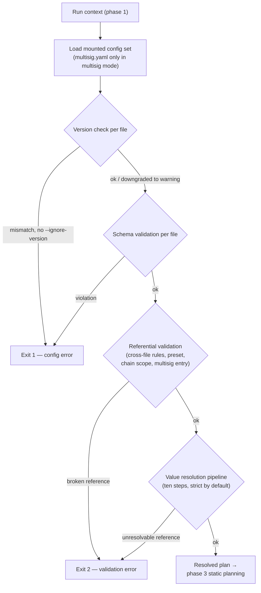

# Phase 2 — Config load & validation

Conceptual design of the second phase of the [run lifecycle](run-lifecycle.md): loading the mounted config set and turning it — through four ordered gates — into fully resolved, per-chain plan values. Follows the [phase-doc template](run-lifecycle.md#how-phase-docs-are-written).

## Purpose

Phase 1 fixed *what kind of run* this is without opening a single file. Phase 2 opens the files and answers everything that depends on their contents: does the config set parse, is it shaped correctly, do its cross-references hold, and what are the actual values — per chain, with every `${...}` reference resolved and every secret tagged. It is the run's main **error gate**: the fail-static principle concentrates every config-dependent failure here, where it can be reported completely, instead of letting it leak into later phases one error at a time.

This is also where most of phase 1's *requests* get their answers. The preset name, the chain scope, the `--set` values, the multisig entry — all recorded config-blind in the run context — are validated here, against the files they name.

## Position in the lifecycle

| | |
|---|---|
| **Consumes** | The **run context** from [phase 1](phase-1-invocation.md) — which plan to open, which preset to select, which overrides to merge, which chains to keep, which multisig entry to check. |
| **Produces** | The **resolved plan** — per-chain values with every reference resolved and every secret tagged — handed to [phase 3](phase-3-static-planning.md). |

The phase reads files only from the mounted roots the run context names (`--configs-dir`); it performs no network access, touches no repository, and reads nothing from the results tree.

## Responsibilities

### What gets loaded

The mounted config set: `actions.yaml`, `workflows.yaml`, the selected plan (per the reference phase 1 resolved), `known-chains.yaml`, `global-params.yaml` — and, only in multisig mode, `multisig.yaml`. The optional `engine.yaml` (spec: [engine.md](../specs/engine.md); design: [phase 5](phase-5-preflight.md)) joins this set — when absent, the engine's shipped default config applies instead; it passes the same gates, including field validation of the declared preflight checks and that every check's `script` reference resolves — an `engine:` name to a check shipped with the release, a path to a `.ts` file under the mount. The mount itself is a design lever: `--configs-dir` is an **allowlist** — the files you mount are the universe of what this run can reference, which is the engine's sandboxing mechanism (see [multisig.md → The multisig registry](../specs/multisig.md#the-multisig-registry-multisigyaml)). A missing plan file — the request phase 1 deliberately did not check — surfaces here as the first load error.

### Gate 1 — Config version check

Per file, before anything else: the file's reserved `version` key (every config file carries one) against the format version the engine supports. A mismatch is a load-time error by default — the engine knows the file was written against a different shape, and the safest default is to stop before misinterpreting fields — unless the run context carries `--ignore-version`, which downgrades it to a warning for **every** file. A missing `version` key is always a warning, never an error. Full semantics: [engine-internals.md → Config version check](../specs/engine-internals.md#config-version-check).

### Gate 2 — Schema validation

Per file: shape, required fields, enum values, per the file's `.schema.yaml`. A schema failure is precise and local — it names the file and the path within it. This gate exists so that every later gate can assume well-formed structure and report *semantic* problems, not shape problems.

### Gate 3 — Referential validation

Everything a per-file schema cannot see, because it spans files: the plan's `workflow` exists in `workflows.yaml`; step `action` / `workflow` references resolve; mappings point at prior steps and declared outputs; no cycles through nested workflows; chain names exist in known-chains and a `$set` reference names a declared chain set (the set's own integrity — members exist, selected profiles exist — was already checked when known-chains loaded); release pins are selectable (an in-use generation with several pins needs one flagged `latest` or a plan selection); the multisig entry exists and covers every active chain. Each config doc owns its rules in a *Validation rules & common errors* section — this phase is where all of them run.

This gate is also where three of phase 1's requests are answered: the **preset name** (exists, or the fallback ladder resolves — see [plans.md → Preset selection](../specs/plans.md#preset-selection)), the **chain scope** (every `--chain` name is in the resolved chain set — the plan's chains after the active preset's filter), and the **multisig entry** (declared, covering every active chain).

### Gate 4 — Value resolution

The ten-step pipeline that turns the raw plan into per-chain resolved values, owned step-by-step by [plans.md → Load & resolution order](../specs/plans.md#load--resolution-order): chain references against known-chains (a `$set` reference expands into its member entries first, explicit plan entries winning per chain name — see [plans.md → Chain sets](../specs/plans.md#chain-sets-set)), preset selection, deployment overrides (the `--set` / `--overrides` values from the run context merge here — the answer to phase 1's shape-only check), then `${global.X}` → `${system.X}` → secrets merge → `${vault.X}` → `${random.N}` → `${env.VAR}`.

The *order* is the design. Three properties fall out of it:

- **Selection before resolution.** The preset is chosen and overrides merged before any `${...}` resolves, so preset values may freely reference globals, system vars, vault entries — they pass through the same downstream steps as base values.
- **Vault between merge and env.** A vault entry is itself an `${env.VAR}` pointer; resolving `${vault.X}` first substitutes the pointer, and the env step then resolves it. The moment a value passes the vault (or lands under `secrets:` by any route), it is **tagged as a secret** — the tag travels with the value and drives redaction everywhere downstream ([engine-internals.md → Vault resolution and secret tagging](../specs/engine-internals.md#vault-resolution-and-secret-tagging)).
- **Strict by default.** Every resolution step hard-fails on a miss, naming the token and its location. Intentional emptiness must be explicit (`KEY: ""`); the plan's `strict: false` relaxes only what [references.md](../specs/references.md#overview) says it relaxes.

One pipeline step deserves a boundary note: `${system.DEPLOYMENT_ID}` resolves from the run context's identity intent — and the *concrete* id (preset-derived, possibly ordinal-suffixed) is a [phase 4](phase-4-deployment-resolution.md) product. Phase numbering here is **ownership, not wall-clock order**: phase 4 owns the id decision, and its id-resolution part executes before this pipeline's system-reference step consumes the result. What each command resolves against:

- **`run` and `--dry-run`** — the concrete id from phase 4's id-resolution part (for `--dry-run` it runs **read-only**: the results tree is inspected, nothing is written). A dry run therefore resolves id-derived values — `deploy_${system.DEPLOYMENT_ID}` salt bases and the addresses derived from them — to exactly what the real run would use.
- **`validate`** — the **preset-derived base id**, with no results-tree probe: `validate` stays a pure file read against the mounted config roots. The ordinal suffix a real run might add is irrelevant to validity, and `validate` takes no `--deployment-id` ([cli.md → Flags by command](../specs/cli.md#flags-by-command)).

See [phase-4-deployment-resolution.md → Decided](phase-4-deployment-resolution.md#decided).

### One phase, two reporting modes

The same gates run for `run` and for `validate` — but they *report* differently, and that difference is the point of having a separate command:

- **`run` stops at the failing file.** A run is heading toward on-chain state; the first hard failure aborts it. Speed of abort matters more than completeness of report.
- **`validate` collects everything.** It runs phases 2–3 to completion, accumulating every error across every gate and every chain, and reports **all of them** ([cli.md → validate](../specs/cli.md#validate)). This is why phase 1 stayed config-blind: had it validated requests eagerly, a bad preset name would have masked every other error in the set.

## The resolved plan artifact

The phase's single output: for each chain of the resolved chain set, the complete value picture — constants and secrets fully resolved (no `${...}` remains), connection profiles selected from known-chains, the deploy block merged, the active preset applied and overrides folded in. Plus the loaded, referentially-checked actions and workflows definitions the next phase will plan against.

Two properties define it:

1. **No unresolved references survive.** Downstream phases never see a `${...}` token; every lookup that could miss has already hit or already failed. This is what lets phases 3–7 treat values as plain data.
2. **Secrets are tagged, not stripped.** Secret values are present — steps will need them — but each carries its tag from the moment of resolution, so every sink downstream (console at any log level, log file, results records) redacts by mechanism rather than by convention.

## Decision flow

For `run`, the first failing gate exits; for `validate`, every branch to an error node instead records the error and continues, and the collected report is emitted at the end of phase 3.

## What this phase does not do

- **No step-level planning.** Which method each step resolves to, whether its salt and factory data exist, whether a private key is resolvable — all of that needs the *flattened* step list and the per-chain variant resolution, which is [phase 3](phase-3-static-planning.md)'s job. Phase 2 checks that the files hold together; phase 3 checks that the run is executable.
- **No results-tree access.** Whether a deployment exists under the resolved id, whether it is unfinished, whether the multisig selector matches the recorded one — [phase 4](phase-4-deployment-resolution.md) concerns, requiring the results tree this phase never opens. (The one exception is the id *value* consumed by the system-reference step on `run` and `--dry-run` — phase 4's read-only id-resolution part, see the boundary note above. `validate` has no exception: it resolves the base id and reads nothing outside the config mount.)
- **No network, no git, no subprocess.** The network is first touched by phase 5's preflight probes, repositories by phase 6, on-chain state by phase 7. This phase is pure file reads against the mounted roots — which is what makes `validate` safe to run anywhere, on anything, with no side effects.
- **No writing.** Nothing lands in the results tree; a run that dies in phase 2 leaves no trace beyond its exit code and logs.

## Failure modes

Two classes, matching the two exit codes ([cli.md → Exit codes](../specs/cli.md#exit-codes)):

| Class | Exit | Examples |
|---|---|---|
| **Load errors** — a file cannot be used at all | `1` | File missing (including the plan the run context references), YAML parse failure, config version mismatch without `--ignore-version` |
| **Validation errors** — files loaded but the rules fail | `2` | Schema violation, unknown `workflow` / `action` reference, mapping to a missing step or output, cycle through nested workflows, unknown chain, chain set, or RPC/verification profile, a chain set whose members or selectors don't resolve, no selectable preset, unknown preset name, `--chain` outside the resolved set, unknown or non-covering multisig entry, unresolvable `${global.X}` / `${vault.X}` / `${env.VAR}` |

Warnings never stop the phase: a missing `version` key, a downgraded version mismatch, verification off on a chain whose workflow has `verify: true` steps — printed, recorded, and the run proceeds.

Errors this phase deliberately leaves to later phases:

| Error | Surfaces in |
|---|---|
| Missing CREATE3 factory, unresolvable private key, `supportsMultisig` missing, create3 on a Hardhat 3 step | Phase 3 (static planning — needs flattening + per-chain method resolution) |
| Multisig selector mismatch on resume; `--verify-only` with no prior deployment; structural fingerprint mismatch on resume; `--set`/`--overrides` on a resume without `--refreeze` (plan-value drift on resume is a phase-4 *warning* — the frozen set wins) | Phase 4 (deployment resolution — needs the results tree) |
| Unreachable RPC, chain identity mismatch, failing preflight check | Phase 5 (preflight — needs the network) |
| Clone / checkout / install / build failures | Phase 6 (repo prepare — needs the network) |

## Relationships to specs

| Doc | What it owns |
|---|---|
| [plans.md](../specs/plans.md) | The value-resolution pipeline step by step; preset selection; deployment overrides; the plan-side validation rules. |
| [engine-internals.md](../specs/engine-internals.md) | The version-check mechanics; vault resolution and secret tagging; release-pin load-time validation. |
| [references.md](../specs/references.md) | Every `${...}` namespace, the strictness rules, and the scoping matrix the pipeline enforces. |
| [known-chains.md](../specs/known-chains.md) / [global-params.md](../specs/global-params.md) | The registries chain references and `${global.X}` / `${vault.X}` lookups resolve against. |
| [multisig.md](../specs/multisig.md) | The registry-shape and entry-coverage rules run in multisig mode. |
| [secrets.md](../specs/secrets.md) | The end-to-end secret model the tagging boundary implements. |
| [cli.md](../specs/cli.md) | The `validate` command; exit codes `1` and `2`. |

## Decided

- **`run` stops early, `validate` reports completely.** Same gates, two reporting modes — the design reason phase 1 stays config-blind. See [One phase, two reporting modes](#one-phase-two-reporting-modes).
- **Secret tagging happens at resolution, not at use.** The tag is attached the moment a value resolves through the vault or lands under `secrets:`, so redaction downstream is mechanical. See [Gate 4](#gate-4--value-resolution).
- **The deployment id crosses the phase boundary by ownership, not order.** Phase 4 owns the decision; its id-resolution part executes before this phase's system-reference step consumes it. See [phase-4-deployment-resolution.md → Decided](phase-4-deployment-resolution.md#decided).
- **`validate` resolves the base id; `--dry-run` resolves the real one.** `validate` substitutes the preset-derived base id for `${system.DEPLOYMENT_ID}` and never touches the results tree — validation must stay a pure file read, and the ordinal suffix has no bearing on validity. `--dry-run` runs phase 4's id-resolution part **read-only** (and, against an unfinished deployment, the same read-only inspection that feeds its frozen-vs-current diff), because a dry run's printed salts and predicted addresses must match what the real run would resolve. See [Gate 4](#gate-4--value-resolution).

## Open questions

None currently.
