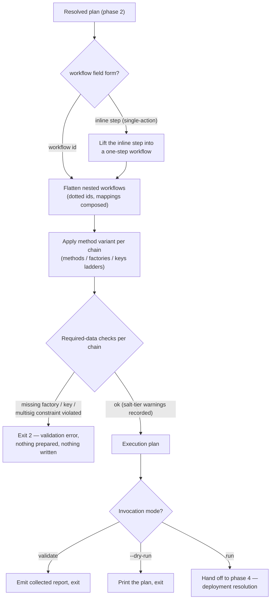

# Phase 3 — Workflow resolution & static planning

Conceptual design of the third phase of the [run lifecycle](run-lifecycle.md): turning the selected workflow into a concrete, per-chain execution plan — and proving, before anything runs, that the plan is executable. Follows the [phase-doc template](run-lifecycle.md#how-phase-docs-are-written).

## Purpose

Phase 2 proved the files hold together; phase 3 proves the **run** holds together. A workflow is a composition — nested workflows, mapping renames, method variants — and none of the interesting questions ("which steps actually run, in what order, deploying how, signed by which key, needing which salt?") can be answered file-by-file. This phase answers all of them, per chain, by pure computation on the resolved plan: no chain is contacted, no repository is touched, no value is guessed.

The phase's defining property is in its name: **everything it decides is static.** Given a workflow id and a chain, every step's method, factory flavor, and key slot follows deterministically from the workflow definitions and the variant — before any execution, independent of any runtime state. That is what makes the phase's checks trustworthy: what it validates is exactly what phase 7 will run.

## Position in the lifecycle

| | |
|---|---|
| **Consumes** | The **resolved plan** from [phase 2](phase-2-load-validation.md) — per-chain values with references resolved and secrets tagged, plus the loaded actions and workflows definitions. |
| **Produces** | The **execution plan** — per chain, the flat ordered step list with resolved methods, factory flavors, key slots, and salt/factory data — handed to [phase 4](phase-4-deployment-resolution.md). |

`--dry-run` and `validate` both end here: `validate` emits its collected report ([cli.md → validate](../specs/cli.md#validate)); `--dry-run` prints the execution plan (with predicted deterministic addresses where computable) and exits without writing anything ([cli.md → Safety and escape hatches](../specs/cli.md#safety-and-escape-hatches)). The deployment-id values behind those outputs differ by design: `validate` resolves `${system.DEPLOYMENT_ID}` against the preset-derived base id (no results-tree access at all), while `--dry-run` gets the concrete id — and, against an unfinished deployment, the frozen-vs-current diff — from phase 4's id-resolution and inspection parts run **read-only** before this point ([phase 2 → Gate 4](phase-2-load-validation.md#gate-4--value-resolution)).

## Responsibilities

### The inline-step form

A [single-action plan](../specs/plans.md#single-action-plans)'s `workflow` field holds an **inline step** instead of a workflow id — the phase lifts it into a one-step workflow as-is (the step already carries its `action`, `method`, and `factory`). From here on, both forms walk the same path; for the inline case, flattening and variant application are trivially empty, and the same required-data checks run against the one step.

### Flattening

Nested workflows unfold into a single flat, ordered step list. Two things happen at the fold:

- **Ids become hierarchical.** A nested step's id gets its dotted prefix (`outer.inner`), which is the id everything downstream keys on — variant override maps, `deploy.salts` / `deploy.factories` entries, results paths, output references.
- **Parent mappings compose into nested steps.** Mappings set on the nesting step fold into the nested steps by external name, renames collapsing through any depth of nesting into one final lookup per input, and step-output references re-pointing at the flattened ids. The composition rules are owned by [workflows.md → Value resolution](../specs/workflows.md#value-resolution); this phase is where they execute.

After flattening, nesting is gone: phase 7 sees only a flat sequence of action steps, each with one final mapping.

### Variant application

If the plan's `workflow` points at a [method variant](../specs/workflows.md#method-variants--variantof), the per-step `methods` / `factories` / `keys` overrides resolve now, per chain, through their fixed precedence ladders (chain-specific per-step → chain-specific wildcard → chain-agnostic per-step → chain-agnostic wildcard → base step declaration → default). The ladders are owned by [engine-internals.md → Deploy method & salt resolution](../specs/engine-internals.md#deploy-method--salt-resolution); the design point here is that resolution **never fails and never waits**: an absent method falls back to `create`, and there is no input to the ladder that phase 2 hasn't already fixed. A chain-aware variant is why the whole phase is per-chain — the same step can be `create3` on mainnet and clamped to `create` on a chain with no factory.

### Required-data checks

With every step's method, flavor, and key slot known per chain, the phase checks that the plan's data covers what the resolved strategy needs — the last static gate before anything irreversible:

- **CREATE3 factory** — a step resolving to `create3` with `factory: oneInch` / `solady` needs a `deploy.factories[stepId]` entry for the chain: **hard error** if missing, there is no fallback. A `factory: createx` step is exempt (canonical singleton).
- **Salt ladder** — a `create2` / `create3` step's salt always resolves, but the *tier* it resolves through grades the warning: explicit salt — silent; `saltBase`-derived — warning naming step and chain; random default — stronger warning that addresses will not reproduce across deployments. See [plans.md → Salt resolution and fallbacks](../specs/plans.md#salt-resolution-and-fallbacks).
- **Signing key** — every deploying step's resolved key slot must be resolvable in the chain's secrets (waived in multisig mode — planning signs nothing).
- **Multisig-mode constraints** — author-command deploying steps must declare `supportsMultisig: true`, and no Hardhat 3 deploying steps may be present ([multisig.md → Validation rules](../specs/multisig.md#validation-rules--common-errors)). Likewise mode-independent: `create3` resolving on a Hardhat 3 step is an error on any chain where it happens (Ignition has no create3 strategy).

The check philosophy mirrors the salt design: **data that can be derived, warns; data that cannot, errors.** A missing salt has a safe derivation; a missing factory address has no safe guess.

## The execution plan artifact

The phase's single output: per chain, the flat ordered list of steps, each carrying its resolved method, factory flavor, key slot, and salt/factory data, with all mappings composed to final form. Two properties define it:

1. **It is the complete answer to "what would run".** `--dry-run` prints it verbatim — the artifact and the dry-run output are the same thing by construction, which is what makes a dry run trustworthy as a preview rather than a simulation of one.
2. **It is per-chain but derived once.** The step structure is shared; only the per-chain resolutions (method, flavor, key, salt, factory) vary. Phase 7's outer loop iterates chains over this one artifact — nothing about the plan is recomputed inside the loop.

## Decision flow

For `validate`, the error branch collects instead of exiting, so the final report covers every chain and every step — see [phase 2 → One phase, two reporting modes](phase-2-load-validation.md#one-phase-two-reporting-modes).

## What this phase does not do

- **No value materialization.** The phase composes mappings and verifies that lookups *can* succeed; the actual per-step input assembly (constants read, secrets injected, transforms applied) happens in phase 7's step lifecycle, per step, per chain ([engine-internals.md → How the engine processes an action](../specs/engine-internals.md#how-the-engine-processes-an-action)).
- **No repository access.** Contract artifacts, working trees, build outputs — all phase 6. This phase's address predictions (for dry-run) are limited to what is computable from salts and factories alone.
- **No results-tree access.** Whether this invocation resumes or starts fresh has no bearing on what the plan *is* — deployment resolution is deliberately after planning, so that resume inspects a fully-validated plan ([phase 4](phase-4-deployment-resolution.md)). (The read-only peek a `--dry-run` needs — the concrete id, the frozen-vs-current diff — is phase 4's id-resolution/inspection part executed early, not an access of this phase; see [Position in the lifecycle](#position-in-the-lifecycle).)
- **No writing.** Like phase 2, this phase leaves no trace on failure beyond the exit code and logs — a `validate` or `--dry-run` invocation is side-effect-free by construction.

## Failure modes

All hard failures exit `2` (validation class — [cli.md → Exit codes](../specs/cli.md#exit-codes)):

| Failure | Example |
|---|---|
| Missing CREATE3 factory | A step resolves to `create3` / `factory: oneInch` on a chain with no `deploy.factories[stepId]` entry |
| No resolvable signing key | A deploying step's resolved key slot is absent from the chain's secrets (eoa mode) |
| `supportsMultisig` missing | Multisig mode, an author-command deploying step without the declaration |
| Unsupported method/type combination | `create3` resolving on a `hardhat3-contract` / `hardhat3-module` step (any mode); a Hardhat 3 deploying step present in multisig mode |

Warnings never stop the phase: `saltBase`-derived and random-default salts are recorded per step and chain, printed, and the run proceeds — see the tier design above.

Errors this phase deliberately leaves to later phases:

| Error | Surfaces in |
|---|---|
| Multisig selector mismatch on resume; `--verify-only` with no prior deployment | Phase 4 (needs the results tree) |
| Unreachable RPC, chain identity mismatch, failing preflight check | Phase 5 (preflight — needs the network) |
| Clone / checkout / install / build failures | Phase 6 (needs the network and the repos) |
| A constant missing for one specific step's input | Phase 7 (step input resolution — the value side of what this phase checked structurally) |

## Relationships to specs

| Doc | What it owns |
|---|---|
| [workflows.md](../specs/workflows.md) | Flattening, mapping composition, the aggregated interface, and the method-variant model. |
| [engine-internals.md](../specs/engine-internals.md) | The method / deployer / key precedence ladders; salt derivation; the required-data table. |
| [plans.md](../specs/plans.md) | The `deploy` block the checks read (salts, factories, saltBase); single-action plans; the salt fallback semantics. |
| [multisig.md](../specs/multisig.md) | The multisig-mode planning constraints checked here. |
| [cli.md](../specs/cli.md) | `--dry-run` and `validate` — the two invocation modes that end at this phase's boundary. |

## Decided

- **Planning precedes deployment resolution.** The execution plan is computed before the results tree is consulted, so a resume decision always operates on a plan that has passed every static gate — a plan edit that breaks validation is caught even when most steps would have replayed. See [What this phase does not do](#what-this-phase-does-not-do).
- **Derivable data warns, underivable data errors.** Salts have a safe derivation ladder and degrade to warnings; factory addresses have no safe guess and are hard errors. See [Required-data checks](#required-data-checks).

## Open questions

None currently.
