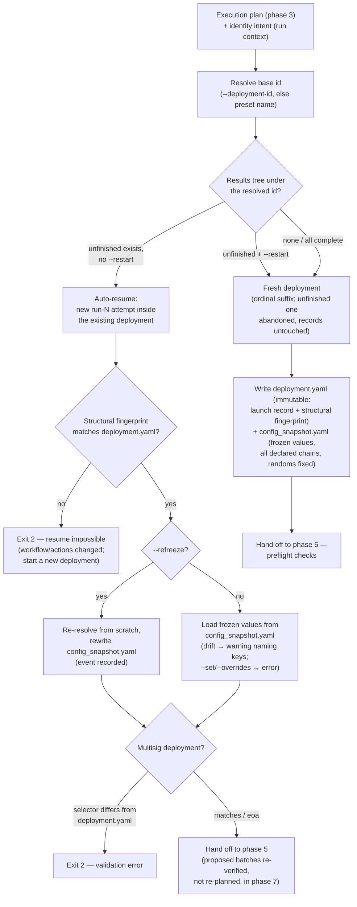

# Phase 4 — Deployment resolution: resume or fresh

Conceptual design of the fourth phase of the [run lifecycle](run-lifecycle.md): deciding what this invocation *is* — the continuation of an unfinished deployment, or the start of a new one — and fixing the concrete deployment id. Follows the [phase-doc template](run-lifecycle.md#how-phase-docs-are-written).

## Purpose

A **deployment** is one logical launch; an **invocation** is one CLI run — and they are deliberately decoupled ([cli.md → One deployment, many invocations](../specs/cli.md#one-deployment-many-invocations)). A deployment routinely spans several invocations: a failed step retried, a multisig run waiting days for signatures, a chain added after the fact (always deliberately, via an explicit `--chain` scope — see [the chain-list freeze](#the-chain-list-freeze-on-resume)). Phase 4 is the joint between the two concepts: it looks at the results tree and decides whether this invocation continues an existing deployment or opens a new one — and it makes that decision *without a flag*, because resuming is the default and forgetting a resume flag must never fork a half-finished launch into a duplicate.

This is also the run's first contact with persistent state: the first phase that **reads** the results tree, and — for a fresh deployment — the first that **writes** anything.

## Position in the lifecycle

| | |
|---|---|
| **Consumes** | The **execution plan** from [phase 3](phase-3-static-planning.md) and the **resolved values** from phase 2, plus the run context's identity intent (`--deployment-id`, `--restart`, `--refreeze`, the multisig selector, `--verify-only`) and the selected preset's name. |
| **Produces** | The **deployment decision** — the concrete deployment id, the resume-or-fresh verdict, and (for fresh) the written `deployment.yaml` and the frozen parameter snapshot (`config_snapshot.yaml`) — handed to [phase 5](phase-5-preflight.md). |

## Responsibilities

### Resolving the concrete id

The identity intent from phase 1 becomes a concrete id in two steps ([plans.md → Deployment id & re-runs](../specs/plans.md#deployment-id--re-runs)):

1. **Base id** — explicit `--deployment-id`, else the selected preset's name. The preset-name default is deliberate: a new launch is normally captured as a new preset, so the preset name already identifies the launch without anyone inventing an id.
2. **Ordinal suffix** — if completed deployments already occupy the base id, the fresh one gets `<id>-2`, `<id>-3`, …, so every deployment keeps its own immutable results directory. The suffix applies only to fresh starts; a resume targets the existing directory by definition.

### The resume-or-fresh verdict

Under the resolved id, the engine inspects `workspace/results/<workflow>/<deployment_id>/`:

- **An unfinished deployment exists** → **auto-resume.** This invocation becomes another `run-N.yaml` attempt inside the same deployment; [idempotent steps](../specs/engine-internals.md#idempotency-lookup) will replay their recorded outputs in phase 7, and only incomplete work executes. There is no resume flag — re-running the same invocation *is* the resume.
- **`--restart`** → **abandon and start fresh.** The unfinished deployment is left exactly as it is — its records stay immutable, nothing is deleted — and a fresh deployment starts under a suffixed id. Abandonment is a bookkeeping fact, not a cleanup operation.
- **Nothing unfinished** → **fresh deployment**, suffixed if the id is taken by completed ones.

### The chain-list freeze on resume

A resume runs against the **chain list recorded in `deployment.yaml`**, never against a re-expansion of the plan's chain scope. The distinction only matters when the plan references a [chain set](../specs/plans.md#chain-sets-set) (`$set`): if the set grew after the deployment started, the new chain is **skipped with a warning** — a chain added to a fleet must never silently join a half-finished launch under a deployment id that predates it. Bringing it in is a deliberate act: an explicit `--chain <name>` scope includes it (recorded as part of that invocation), or it simply participates from the next fresh deployment. This is the same records-win principle as the parameter freeze and the multisig `proposed`-batch rule below: what was fixed at deployment creation beats any later config edit.

### The parameter freeze on resume

A resume runs with the **resolved parameter set recorded at deployment creation**, never with a fresh resolution of the current plan. The hazard this closes: an operator edits the plan between invocations, and the chains resumed later silently run with different owners, salts, or addresses than the chains launched first — a franken-deployment that no record can explain. Half a launch deployed with one value set must never be completed with another one *by accident*.

**The frozen snapshot.** At deployment creation — immediately after phase 2's value resolution — the engine writes `config_snapshot.yaml`: the resolved constants, secrets slots (names only), and deploy data for **every chain the plan declares**, in scope for this invocation or not (so a declared chain added to the run later joins with values consistent with its siblings). `${random.N}` values are **generated once here and saved** — a random salt minted at launch stays stable for the life of the deployment. One deliberate exclusion: **secret-tagged values never persist** — the snapshot redacts them, and they re-resolve live on every invocation (keys rotate; the freeze covers untagged values only).

**On resume.** Phase 2 still loads, validates, and resolves the current plan — but on the resume branch that resolution serves *comparison*, not execution: the recorded snapshot supplies the values phase 7 will use. When the two differ (the comparison injects the recorded random values, so `${random.N}` never false-positives), the engine prints a **warning naming the changed keys** — "deployment continues with the parameter set recorded at creation; the plan has changed since (`OPS_FEE_TAKER`, `OPS_OWNER_ADDRESS`); use `--refreeze` to adopt the new values or `--restart` to relaunch" — and proceeds with the frozen set. Drift is a warning, not an error: the frozen values are correct by definition (they are what the deployment *is*), and the operator retrying a failed step at 2 a.m. should not be blocked because a colleague edited the plan for next week's launch.

**Chains joining late.** A chain **declared in the plan at launch** has frozen values in the snapshot; brought in later (explicit `--chain`, per the chain-list freeze above), it runs with them — consistent with its siblings. A chain **added to the plan file after launch** has none: it resolves fresh from the current plan on its first attempt, its resolution is appended to the snapshot (frozen from then on), and a prominent warning says so.

**Explicit overrides on resume.** `--set` / `--overrides` on a resumed deployment are a **load-time error** without `--refreeze`. The launch's overrides are already recorded in `deployment.yaml`; per-invocation value tweaks are exactly the silent divergence the freeze exists to prevent.

**The escape hatch: `--refreeze`.** The deliberate way to change a live deployment's values: discard the recorded set, resolve from scratch as if this were the first run — the current plan, this invocation's `--set` / `--overrides`, fresh `${random.N}` values — rewrite `config_snapshot.yaml`, and record the event in the attempt record. Everything else about the resume is untouched: completed steps stay completed, replays replay, only incomplete work executes — with the new values. (Note the random regeneration: a refrozen deployment's remaining `create2`/`create3` steps derive from *new* salts; already-deployed addresses of course keep the old ones.)

### The structural fingerprint: no resume across a changed shape

Value drift degrades gracefully — freeze plus warning. **Structural drift does not.** If the workflow or the actions changed since the deployment started, the premise of resuming collapses: recorded step results are keyed by step ids whose meaning may have changed, the idempotency lookup would replay outputs of a *different* plan's steps, and multisig predicted batches would no longer describe what the steps do. There is no safe partial answer.

So the engine refuses. At deployment creation, `deployment.yaml` records a **structural fingerprint** — a hash over a canonical serialization of the execution plan's *structure*, per chain: the ordered step ids, each step's fully-qualified action id and the action's definition (type, command surface, declared inputs and outputs), resolved methods and factory flavors, key slots, and the release pins' **declared refs**. On resume the engine recomputes and compares; a mismatch is a **hard error** (exit `2`): *the workflow or actions changed since this deployment started; resume is impossible — start a new deployment under a new `--deployment-id` (or `--restart` to abandon this one)*.

Deliberately excluded from the hash: all *values* (the parameter freeze owns those, with warning semantics), the chain list (the chain-list freeze owns it), and the **resolved HEAD** of `branch` pins — a mutable pin pulling new commits is declared, recorded behavior ([phase 6](phase-6-repo-prepare.md)), not a structural change; what the hash pins is the *ref*, so retargeting a pin to a different branch or tag does trip it.

### Multisig re-checks on resume

A resumed multisig deployment carries obligations a fresh one does not ([multisig.md → Lifecycle & resume](../specs/multisig.md#lifecycle--resume)):

- **The selector must repeat.** The entry name recorded in `deployment.yaml` is authoritative; an invocation with a different `--multisig` value — or none — errors, naming the recorded entry. Silently switching Safes mid-deployment is exactly the mistake this check exists to make impossible.
- **`proposed` batches are re-verified, never re-planned.** A batch that owners may already have signed is identified by its recorded `safeTxHash` / Merkle root; the resume path polls and advances it rather than recomputing it. Re-planning would produce a different hash than the one signed — the recorded artifact wins over any plan edit.

### `--verify-only` gate

A `--verify-only` invocation verifies *recorded* addresses — so it requires an existing deployment under the resolved id, and that existence check belongs here, the first phase that can see the results tree. No deployment → error; otherwise the invocation proceeds as a verification pass over the recorded outcomes.

### Writing `deployment.yaml`

For a fresh deployment, the phase writes the **immutable launch record**: selected preset, deployment overrides, multisig entry name, the resolved (possibly suffixed) id, the [structural fingerprint](#the-structural-fingerprint-no-resume-across-a-changed-shape), and the **chain provenance** — the resolved chain list at deployment creation, plus the referenced [chain-set](../specs/plans.md#chain-sets-set) name when `$set` was used:

```yaml
chains:
  set: evm-prod                        # omitted when no $set was used
  resolved: [mainnet, base, matic]     # membership at deployment creation; resume reads this
structure: "sha256:9f2c…"              # structural fingerprint; resume recomputes and compares
```

Written once, never overwritten — it is what makes every later invocation's re-checks possible (the multisig selector rule, the chain-list freeze, and the fingerprint check all read it) and what makes the launch reproducible (overrides are recorded here, which is why `--set` must never carry a credential). Alongside it, the phase writes the [frozen parameter snapshot](#the-parameter-freeze-on-resume) (`config_snapshot.yaml`) — rewritten later only by an explicit `--refreeze`, with the event recorded. A resumed deployment writes nothing to `deployment.yaml`; it already exists.

## The ordering subtlety: id before values

One part of this phase runs out of order, by design. The concrete id is what `${system.DEPLOYMENT_ID}` resolves to — and that reference is consumed by phase 2's value-resolution pipeline, two phases earlier. The resolution: **phase boundaries are ownership boundaries, not strict wall-clock order.** Phase 4 owns everything about deployment identity, but its id-resolution part (base id + suffix probe against the results tree) executes before phase 2's system-reference step; the rest of the phase — the verdict, the re-checks, the write — runs in sequence position, after planning.

The split is safe because the two halves need different inputs: the id needs only the preset name and a directory listing, while the verdict needs the validated execution plan (so that resume never operates on a plan that would fail validation — see [phase 3 → Decided](phase-3-static-planning.md#decided)). And it is *necessary* because a salt of the form `deploy_${system.DEPLOYMENT_ID}` must derive from the final, suffixed id — deriving from the base id would collide a repeat launch with the previous one's addresses ([plans.md → Deployment id & re-runs](../specs/plans.md#deployment-id--re-runs)).

The early part also serves the commands that never reach this phase in full:

- **`--dry-run`** runs the id-resolution part — and, against an unfinished deployment, the records inspection behind its frozen-vs-current diff — **read-only**: the results tree is inspected, nothing is written, no verdict is acted on. This is what makes a dry run's id-derived salts and predicted addresses match the real run's, and its drift diff trustworthy.
- **`validate`** runs none of it: it resolves `${system.DEPLOYMENT_ID}` against the preset-derived **base id** and never touches the results tree. Validity does not depend on the ordinal suffix, and validation stays a pure file read against the config mount.

## Decision flow



`--verify-only` follows the same inspection: it requires the resume branch (an existing deployment) and errors on the fresh one.

## What this phase does not do

- **No replay decisions.** The verdict says *this invocation resumes*; which individual steps replay their recorded outputs versus re-execute is decided per step, in phase 7, by the [idempotency lookup](../specs/engine-internals.md#idempotency-lookup). Phase 4 selects the deployment; it does not walk its steps.
- **No record mutation.** Existing `deployment.yaml`, `run-N.yaml`, and `result.yaml` files are read, never modified — this invocation's own `run-N.yaml` is opened by phase 7 as a *new* attempt file. `--restart` abandons; it never deletes.
- **No repository or chain contact.** The phase reads one directory subtree and (at most) writes one file into it.
- **No plan re-validation.** The execution plan arrived fully validated; what resume adds is not validation but **reconciliation against the records** — the chain-list freeze, the parameter freeze, the structural fingerprint, and the multisig re-checks, all of which compare this invocation to what `deployment.yaml` and `config_snapshot.yaml` recorded.

## Failure modes

All hard failures exit `2` ([cli.md → Exit codes](../specs/cli.md#exit-codes)):

| Failure | Example |
|---|---|
| Structural fingerprint mismatch on resume | The workflow or an action definition changed since the deployment started — resume is impossible; start a new deployment (new `--deployment-id`, or `--restart` to abandon) |
| Overrides on resume without `--refreeze` | `--set` / `--overrides` passed to a resuming invocation — per-invocation value tweaks against a frozen deployment require the explicit `--refreeze` |
| Multisig selector mismatch on resume | The deployment recorded `--multisig ops-main`; this invocation passed a different entry, or none |
| Mode mismatch on resume | An eoa invocation against an unfinished multisig deployment (a selector mismatch by another name) |
| `--verify-only` with no prior deployment | Nothing exists under the resolved id to verify |

Everything else in this phase is a decision, not a check — an empty results tree, a taken id, an unfinished deployment are all *inputs* that route to a branch, never errors. **Parameter drift on resume is deliberately a warning, not a failure** — the run proceeds with the frozen set (see [the parameter freeze](#the-parameter-freeze-on-resume)).

Errors this phase deliberately leaves to later phases:

| Error | Surfaces in |
|---|---|
| Unreachable RPC, chain identity mismatch, failing preflight check | Phase 5 (preflight) |
| Clone / checkout / install / build failures | Phase 6 (repo prepare) |
| A `proposed` batch that no longer verifies against the Transaction Service / chain | Phase 7 (the multisig poll-and-advance path) |

## Relationships to specs

| Doc | What it owns |
|---|---|
| [plans.md](../specs/plans.md) | The id derivation ladder, ordinal suffixing, and the resume semantics; the salt caveat for id-derived salt bases; the chain-set (`$set`) semantics behind the chain-list freeze. |
| [cli.md](../specs/cli.md) | The deployment-vs-invocation model; `--deployment-id`, `--restart`, `--refreeze`, `--verify-only`; the flag-less-resume rule; the `--set`/`--overrides`-on-resume error. |
| [multisig.md](../specs/multisig.md) | The repeat-selector rule; batch statuses and why `proposed` is re-verified, never re-planned. |
| [engine-internals.md](../specs/engine-internals.md) | The idempotency lookup that gives the resume verdict its per-step meaning in phase 7. |
| [run-lifecycle.md](run-lifecycle.md) | The map; the phase-8 record table `deployment.yaml` belongs to. |

## Decided

- **Resume is the default, `--restart` the only opt-out.** No resume flag exists; repeating the invocation continues the deployment. The failure this prevents — an operator forgetting a flag and forking a half-finished launch — is worse than the cost of an explicit `--restart` when a fresh start is truly wanted. See [The resume-or-fresh verdict](#the-resume-or-fresh-verdict).
- **Id resolution runs early, the verdict runs in place.** Phase 4 owns deployment identity, but its id-resolution half executes before phase 2's system-reference step consumes `${system.DEPLOYMENT_ID}` — ownership, not wall-clock order. See [The ordering subtlety](#the-ordering-subtlety-id-before-values).
- **`--dry-run` reuses the early part read-only; `validate` skips it.** A dry run resolves the concrete id (and inspects an unfinished deployment's records for its frozen-vs-current diff) through phase 4's early part with nothing written, so what it prints is what a run would use. `validate` resolves the preset-derived base id and never opens the results tree — validation stays offline. See [The ordering subtlety](#the-ordering-subtlety-id-before-values).
- **Records are immutable; abandonment is bookkeeping.** `--restart` leaves the unfinished deployment's directory untouched and starts a suffixed sibling — history is never rewritten, and "what produced this address" stays answerable for every deployment that ever ran. See [Writing `deployment.yaml`](#writing-deploymentyaml).
- **The chain list is frozen at deployment creation.** Resume runs against the list recorded in `deployment.yaml`; a chain set that grew mid-deployment never silently widens an unfinished launch — inclusion is explicit (`--chain`) or waits for the next fresh deployment. See [The chain-list freeze on resume](#the-chain-list-freeze-on-resume).
- **The parameter set is frozen at deployment creation.** Resume runs with the values recorded in `config_snapshot.yaml` (all declared chains, `${random.N}` fixed at launch, secrets excluded — they re-resolve live); plan edits since launch produce a warning naming the changed keys, never a silent adoption. `--refreeze` is the explicit way to re-resolve and re-freeze mid-deployment; `--set`/`--overrides` on resume error without it. See [The parameter freeze on resume](#the-parameter-freeze-on-resume).
- **Structural change refuses resume.** A fingerprint of the execution plan's structure (steps, actions, methods, flavors, key slots, pin refs — not values, not branch-pin HEAD drift) is recorded in `deployment.yaml` and re-checked on every resume; a mismatch is a hard error recommending a new deployment id. Values drift warns; structure drift stops. See [The structural fingerprint](#the-structural-fingerprint-no-resume-across-a-changed-shape).

## Open questions

None currently.
