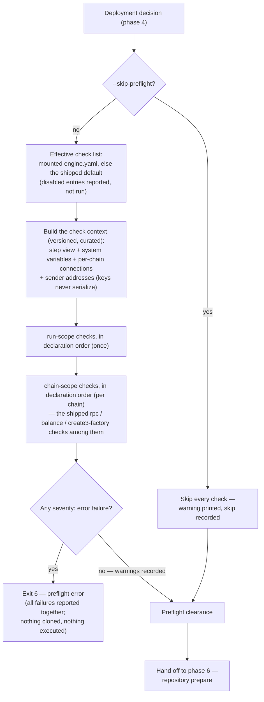

# Phase 5 — Dynamic preflight checks

Conceptual design of the fifth phase of the [run lifecycle](run-lifecycle.md): probing the **on-chain preconditions** the run depends on — is the RPC endpoint actually up and serving the chain the registry claims, can the payer pay for the run's gas, does the CREATE3 factory the plan names actually exist there, is everything else the operator declared as a precondition actually true — before the engine invests in repository preparation and long before anything irreversible. Follows the [phase-doc template](run-lifecycle.md#how-phase-docs-are-written).

## Purpose

Phases 1–4 fail **statically**: everything they check is provable from files and the results tree, offline. But some facts a launch depends on live in no file — they live **on chain, or in the network between here and the chain**: an RPC endpoint that was up yesterday is down today; a `known-chains.yaml` entry quietly points at the wrong network; the deployer wallet was drained since the last launch; the CREATE3 factory the plan's deploy data names was never deployed on this chain. None of that is checkable statically — and none of it should wait until phase 6 has spent minutes cloning, installing, and building, or until phase 7's first step dies mid-launch against a dead endpoint or an empty wallet.

Phase 5 is the run's **first network contact**, and it is deliberately cheap: a few seconds of read-only probes that answer *"are the on-chain preconditions of this run actually true?"* — connectivity is only the first of them; funds, factory contracts, and any operator-declared precondition are the same kind of fact. It extends the fail-static principle to dynamic facts — what cannot fail statically should still fail **before expensive work and before irreversible work**. This is the same rationale v1 documented for its RPC validation ("fail fast — don't waste repository setup on a misconfigured RPC"), broadened from the connection to the environment behind it.

The v2 shape of that idea is **one mechanism with no special cases**: a check is a TypeScript script the engine runs with the built plan and system variables in hand, and *every* check is one — the shipped checks included. The engine contains no check logic of its own; what it contributes is check **scripts shipped with the release** (`engine:rpc`, `engine:balance`, `engine:create3-factory`) and a **default config** that turns them on. Disabling, tuning, reordering, or replacing a shipped check is therefore an ordinary config edit, not a fight with engine code.

## Position in the lifecycle

| | |
|---|---|
| **Consumes** | The **deployment decision** from [phase 4](phase-4-deployment-resolution.md) — which chains this invocation will actually attempt — plus the [execution plan](phase-3-static-planning.md#the-execution-plan-artifact) from phase 3 and, from phase 2, the resolved plan's selected connection profiles and sender identity (the paying address derived per chain — never the key). Together these become the check context. |
| **Produces** | The **preflight clearance** — the verdict that every check passed (or was explicitly waived) — handed to [phase 6](phase-6-repo-prepare.md). |

The phase runs on `run` invocations only — every one of them: fresh starts and resumes alike (the environment can degrade between invocations, and checking is cheap), multisig poll re-invocations (they hit RPC and the Transaction Service), and `--verify-only` passes (verification machinery reads the chain). `validate` never reaches it — validation is offline by design — and `--dry-run` exits at phase 3.

## Responsibilities

### Scope: exactly what this invocation will touch

Preflight checks run against **the chains this invocation will attempt** — the resolved chain scope after CLI filters, the deployment record's frozen list on resume, minus chains already complete — never the whole registry. A registry with fifty chains costs nothing extra when the run targets two. Per-chain checks across chains run concurrently; they are independent by construction.

### The check mechanism — one kind, no special cases

A check is a named entry in the engine config's `preflight.checks` map, pointing at a **TypeScript script**. That is the whole taxonomy — there are no engine-native check types, no discriminants, no privileged code paths. The fields (normative reference: [specs/engine.md → Field reference](../specs/engine.md#field-reference)):

| Field | Default | Meaning |
|---|---|---|
| `script` | — (required) | The check script: `engine:<name>` for a [check shipped with the engine release](#the-shipped-checks), or a path to a `.ts` file resolved **relative to `--configs-dir`**. Checks run before any repository exists, so operator scripts cannot live in cloned repos — they ship with the config set, which also keeps them inside the mount allowlist. |
| `enabled` | `true` | The [disable-without-removal switch](#disabling-without-removing-enabled). |
| `severity` | `error` | `error` — a failure aborts the run; `warn` — a failure is printed and recorded, and the run proceeds. |
| `scope` | `chain` | `chain` — runs once per chain in scope; `run` — runs once per invocation. |
| `params` | `{}` | Free-form YAML object passed through to the script **verbatim** inside the context document (`context.params`). The engine never interprets it — each check documents its own params (see `engine:balance` below). One generic mechanism instead of per-check schema in engine code. |

There are deliberately **no `timeout` or `retries` fields**. Retrying is three lines inside a script that wants it (the shipped RPC check retries its own fetch); a per-check timeout is a tuning surface nobody has needed yet. What remains is a **fixed engine backstop** — a generous hard limit (5 minutes per check attempt, not configurable) whose only job is to keep one hung script from stalling the whole run forever. It is a safety property, not a knob; if a real need for per-check tuning shows up, the fields can return.

**The execution contract.** The engine runs the script with its TypeScript runtime (the same `tsx` toolchain `script` actions may use — [engine-internals.md](../specs/engine-internals.md)) as a subprocess: **exit code `0` is a pass, anything else is a fail**; stdout/stderr are captured, and the check's output *is* its report — whatever the script prints (conventionally to stderr, on failure) is surfaced verbatim as the check's message in the preflight report and the attempt record. There is no machine-readable result channel: a free-form third-party check produces free-form findings, so a structured contract would either be empty ceremony or a schema the engine cannot interpret anyway — one exit code plus one human-readable message covers what the report needs (`balance 0.03 ETH < required ~0.25 ETH for 4 deployments` is a printed line, not a data structure). Out-of-process for three reasons: the backstop limit is only enforceable across a process boundary (a hung in-process promise cannot be killed in Node), a crashing check cannot take the engine down with it, and — see below — the no-secrets rule becomes a property of serialization rather than of discipline.

**The check context.** What makes checks more than shell one-liners: the engine hands every check the **context document** — a JSON file whose path arrives in `SYS_CHECK_CONTEXT` — containing a **curated view** of what the engine itself knows at this point:

- the invocation's chain scope, and per chain: the registry identity (`chain_id`) and the **selected RPC profile's resolved connection** (URL, headers) from [known-chains.md](../specs/known-chains.md);
- the **sender identity**, per chain: `{ mode: eoa | multisig, address }` — the address that will pay for execution on this chain (the deployer address derived from the already-resolved private key in eoa mode; in multisig mode the Safe address, plus the executor address on the merkle backend). An address is public information — deriving it from the resolved key adds **no key material and no signing capability** to preflight; view calls (`eth_getBalance`, `eth_getCode`, `eth_call`) need no wallet, only an RPC connection;
- a curated **step view** of the built execution plan from phase 3 — per chain, the ordered step list with step id, fully-qualified action id, action type, resolved method and factory flavor, the resolved **deploy data** (factory address and resolved salt per create3 step — untagged plan values), and the `verify` flag;
- the run's system variables (deployment id, fresh-or-resume, …), mirroring the step-lifecycle `SYS_*` naming ([engine-internals.md](../specs/engine-internals.md#the-deployment-interface));
- the check's own entry: its name and its `params` object, verbatim.

A `chain`-scope check receives the context focused on its chain (plus the run-wide view); a `run`-scope check receives the run-wide view. The engine ships **type declarations** for the document (`PreflightCheckContext`), so a check imports a type, not a guess — which is also why checks are TypeScript-only: the contract is a typed structure, and a runtime that cannot consume it (bash) would only invite a parallel, poorer contract. One runtime, one context, one exit-code rule.

**The context is a public contract — curated and versioned.** The moment one operator writes a check against this document, its shape is an API of the engine: a field rename would break that check on engine upgrade, silently (a missing JSON field reads as `undefined`, it doesn't fail statically). Two rules keep that manageable. *Curated:* the document exposes the deliberate view above — never the engine's internal execution-plan representation — so internals stay free to change without breaking anyone (whatever is exposed, someone will depend on). *Versioned:* the document carries a `contextVersion` field (currently `1`); changes within a version are **additive only** — new fields may appear, existing fields never rename, move, or change meaning — and a breaking change bumps the version, which the typed loader surfaces to the script.

For quick access the flat conveniences remain in the environment: `SYS_CHAIN_ID` / `SYS_CHAIN_NAME` / `SYS_RPC_URL` (chain scope), `SYS_DEPLOYMENT_ID` (both), `SYS_CHAINS` (run scope — comma-separated chain names).

**No secrets.** The context document is built from the resolved plan's **untagged values only** — secret-tagged values ([secrets.md](../specs/secrets.md)) never serialize, and no `SEC_*` variable reaches the check environment. The sender block does not weaken this: it carries the derived *address*, never the key. This is enforced at the serialization boundary, not by author discipline: nothing a check can read, echo, or persist is sensitive. A check that needs a credential to do its job is not a preflight check; it is a step, with the full secret-tagging machinery around it. (Checks *should* also be read-only — an author obligation the engine cannot enforce, the same class of contract as `idempotent: true`.)

### The shipped checks

The engine release bundles check scripts under the reserved `engine:` scheme — today three: `engine:rpc`, `engine:balance`, and `engine:create3-factory`. Each is an ordinary check in every respect: same contract, same context, same config surface, no special code path in the engine. Together they cover the three on-chain preconditions every deploying run shares: the connection works, the payer can pay, the deterministic-deployment infrastructure exists and answers. The roster is deliberately **complete** — no further shipped checks are planned (see *Decided*); anything beyond these three is operator territory.

#### `engine:rpc` — reachability and identity

Abridged, the entire script is:

```typescript
// engine:rpc (abridged) — reads the context document from SYS_CHECK_CONTEXT
import { loadContext } from "@deploy-pad/preflight";   // typed loader, name provisional

const { chain } = await loadContext();                 // PreflightCheckContext
const res = await fetch(chain.rpc.url, {
  method: "POST",
  headers: { "content-type": "application/json", ...chain.rpc.headers },
  body: JSON.stringify({ jsonrpc: "2.0", id: 1, method: "eth_chainId", params: [] }),
});                                                    // network error → throw → non-zero exit
const served = parseInt((await res.json()).result, 16);
if (served !== chain.chainId) {
  console.error(`RPC serves chain ${served}, registry declares ${chain.chainId}`);
  process.exit(1);
}
```

One `eth_chainId` request per chain (the script retries its own fetch a couple of times — retrying is the script's business, not an engine field), two verdicts:

| Verdict | Passes when | Catches |
|---|---|---|
| **Reachability** | The endpoint answers with a valid JSON-RPC result | Dead endpoints, DNS failures, wrong ports, expired auth on the profile's headers |
| **Identity** | The served chain id equals the `chain_id` declared in known-chains | A URL that quietly points at the **wrong network** — deadlier than downtime, because every step would "work" against the wrong chain |

Two properties make the check trustworthy: it probes **the run's own connection** (the context hands it the same profile URL and headers the steps will use in phase 7 — a pass is evidence about *this run's* connection, not about the chain in general), and it is **read-only** (`eth_chainId` changes nothing anywhere).

#### `engine:balance` — can the payer pay?

A per-chain check that answers "does the sender hold enough native currency for the work this run will attempt here?" The core design decision: **there is no configured absolute threshold — the requirement is estimated on chain, in native units.** Configured thresholds would need a number per chain (0.1 ETH on mainnet is not 0.1 POL on matic) and would ignore run size (four deployments need more gas than one). The estimate needs neither, because both inputs are already in hand:

- the **context's step view** says how many gas-spending steps target this chain, and of which kind — **deployment steps** (contract creation, gas-heavy) versus **non-deployment transacting steps** (configuration calls, comparatively cheap);
- `eth_gasPrice` prices that gas **in the chain's own native token** — the mainnet/matic difference is not configuration, it *is* the gas price differential.

```
required = (deploySteps × gasPerDeployment + otherSteps × gasPerCall) × gasPrice × safetyFactor
pass     = eth_getBalance(sender.address) ≥ max(required, params.minimums[chain] ?? 0)
```

The step counts cover only the work **this invocation will actually attempt**: steps already completed in prior attempts (including steps that will replay from records) contribute nothing, so an invocation that transacts nothing — a `--verify-only` pass, or a resume whose remaining work spends no gas — estimates a requirement of ≈ 0 and passes trivially (a configured `params.minimums` floor still applies, per the formula).

This is a sanity probe ("the wallet is not empty relative to this launch"), not a gas quote — rough is the point. The knobs are heuristics, not chain data, and live in `params`:

| Param | Default | Meaning |
|---|---|---|
| `gasPerDeployment` | `1000000` | Assumed gas per **deployment** step (contract creation). |
| `gasPerCall` | `250000` | Assumed gas per **non-deployment** gas-spending step (transacting calls). |
| `safetyFactor` | `1.5` | Multiplier on the estimate. |
| `minimums` | `{}` | Optional per-chain floor in **native units** (e.g. `matic: "25"`) — the escape hatch for chains where the estimate is known to undershoot. An override, not the primary mechanism. |

The check is **sender-mode aware** (it reads the context's `sender` block): in eoa mode it checks the deployer address; in multisig mode with the **multisend** backend it passes trivially (proposing is an off-chain Transaction Service call — the Safe's owners pay for execution, outside this run's control); with the **merkle** backend it checks the **executor** address, which pays per-leaf execution gas. On failure it prints the numbers — `balance 0.03 ETH < required ~0.25 ETH (4 steps at current gas price)` — which the report surfaces verbatim.

#### `engine:create3-factory` — does the infrastructure exist, and is it the right kind?

A per-chain check for the precondition deterministic deployments silently assume: **the CREATE3 factory contract actually exists on this chain — and behaves like the factory the flavor claims.** The probe is *functional*, not structural: instead of checking that *some* code sits at the address (`eth_getCode`), the check asks the factory to do the one read-only thing every supported flavor can do — **compute the deployment address for a salt**.

It walks the context's step view, collects every step whose resolved method is `create3`, and for each one makes an `eth_call` to the address-computation view of that step's factory (the deploy-data factory address for `oneInch` / `solady`; the canonical singleton for `createx`) with the step's resolved salt — and, for the caller-namespaced flavors (`createx` / `solady`, where the address depends on the deployer — [workflows.md → CREATE3 factory flavors](../specs/workflows.md#create3-factory-flavors--factory)), the context's sender address. Each flavor names its own view (1inch `Create3Deployer.addressOf(salt)`; CreateX `computeCreate3Address(...)`; the solady factory's deployed-address getter) — the flavor is already resolved per step, so the check knows which ABI to speak.

One call settles both questions: an address decodes back → the factory exists *and* answers the expected interface; an empty response, a revert, or undecodable data → failure, naming the step, the flavor, and the factory address. This subsumes the code-presence check (no contract cannot answer) and additionally catches "there is *a* contract at that address, but not the factory you think" — without maintaining bytecode-hash tables.

The computed addresses are not discarded: the check **prints each step's predicted deployment address** in the report — a free preview, before anything is cloned, of exactly where every deterministic contract will land, per chain. An operator who expected an address parity across chains (or a mined vanity address) sees a mismatch here, in seconds, instead of after the deployment.

A chain whose steps resolve to no `create3` method passes trivially — the check is a no-op exactly where it is irrelevant. Like everything here it is read-only, and it catches in seconds what phase 7 would otherwise discover after minutes of repo preparation: a plan pointed at a chain where the factory was never deployed, a `${global.X}` factory address that resolved to the wrong chain's value, or a wrong contract sitting where the factory should be.

### The default engine config

The engine ships a **default engine config** — a real config document bundled with the release (and copied into new workspaces by scaffolding, so it is visible and editable, not folklore). Its `preflight.checks` enables the three shipped checks:

```yaml
# The engine's shipped default config (engine.yaml)
version: 2

preflight:
  checks:
    rpc:
      script: engine:rpc               # exact facts -> hard failures
      severity: error
    create3-factory:
      script: engine:create3-factory   # exact fact (the factory answers address
      severity: error                  #   computation or not) -> hard failure;
                                       #   trivially passes on runs with no create3 steps
    balance:
      script: engine:balance           # a heuristic estimate -> warn while it earns trust;
      severity: warn                   #   promote to error in your own engine.yaml when trusted
```

The two exact checks fail hard; the balance check ships as `warn` because its threshold is a heuristic — a false failure on a run that would have succeeded is exactly the annoyance that makes operators reach for `--skip-preflight`, which defeats the phase. Promoting it to `error` is a one-line edit once its estimates prove out in an environment.

The resolution rule is deliberately simple — the same **replacement, not merge** rule presets already established:

- **No `engine.yaml` in the mount** → the shipped default applies → the shipped checks run. Safe by default; a bare workspace still gets v1's fail-fast behavior and more.
- **A mounted `engine.yaml` replaces the default wholesale.** The file you mount is the complete truth about preflight: to keep a shipped check, keep its entry (still one line of `script: engine:<name>` — the script itself stays in the release); to drop it, omit it; to switch it off visibly, set `enabled: false`. There is no merge, no layering, no "the engine quietly adds its checks back" — which is exactly what makes the answer to *"what will preflight do?"* readable from one file.

### Disabling without removing: `enabled`

Any check can carry `enabled: false`: the entry stays in the file, the check does not run — and the skip is **visible**. The preflight report (and the run attempt record) lists the check as `disabled`, so a turned-off probe is an auditable fact in the log, not an absence someone has to notice. Removal, by contrast, is silent — discoverable only through git history. The recommendation follows: **disable when the intent is temporary or worth seeing; remove only what is permanently gone.**

Severity is the third dial: `severity: warn` keeps a check running and reporting without letting it block — useful while a new operator check earns trust, or to keep the RPC check informative on a chain whose endpoint is known-flaky without giving up launches to it.

### Ordering and the report-all rule

`run`-scope checks execute first, once per invocation; then, per chain, the `chain`-scope checks — each group in **declaration order**. Operator chain-scope checks usually assume a live endpoint, so the natural place for the RPC entry is first among the chain-scope checks — which is where the shipped default puts it, and where an operator authoring their own `engine.yaml` will usually keep it. Nothing enforces that: the config owner controls the order, including whether anything runs before the RPC check.

The phase **does not stop at the first failure**: every enabled check runs, failures aggregate, and the report names all of them — the same philosophy as `validate` ([phase 2 → One phase, two reporting modes](phase-2-load-validation.md#one-phase-two-reporting-modes)). An operator fixing RPC access at 2 a.m. should learn about *both* broken chains in one attempt, not one per attempt. Only after the full pass does any `severity: error` failure abort the run.

### The escape hatch: `--skip-preflight`

`--skip-preflight` skips the whole phase — every configured check, the shipped checks included — printing a warning and recording the skip in the invocation's attempt record. It exists for the emergency where a *check* is wrong, not the environment, and there is no time to edit config; it is not a routine flag. For anything longer-lived than one invocation, the config-side switches (`enabled: false`, `severity: warn`) are the right tool — they are reviewable and auditable where a habitual CLI flag is not. The flag follows the same shape as the other deliberate escape hatches (`--ignore-version`, `--skip-verify`): explicit, per-invocation, recorded.

## The engine config: `engine.yaml`

*(Field-level spec: [specs/engine.md](../specs/engine.md), with [engine.schema.yaml](../specs/schemas/engine.schema.yaml) and a worked [examples/engine.yml](../specs/examples/engine.yml). This section owns the design rationale.)*

Preflight checks need a home, and none of the existing files fits: plans are the **value layer** (per-launch data), known-chains is the **connection registry**, actions/workflows are **structure**. What has no home today is configuration of **the engine's own run behavior** — environment policy that is neither launch data nor connection data. `engine.yaml` is that home; `preflight` is its first tenant.

When mounted, the file is part of the config set: it loads and validates in phase 2 like every other file (reserved `version` key, schema, referential rules — including that every check's `script` resolves: an `engine:` name to a check shipped with the release, a path to a `.ts` file under `--configs-dir` — so a missing script fails *statically*, in phase 2, not here).

A worked operator config — replacing the shipped default wholesale:

```yaml
version: 2

preflight:
  checks:
    rpc:
      script: engine:rpc     # kept from the default — replacement is wholesale,
                             #   so keeping a shipped check means carrying its entry
    create3-factory:
      script: engine:create3-factory
    balance:
      script: engine:balance
      severity: error        # promoted from the default's warn — estimates proved out here
      params:                # free-form, passed to the script verbatim
        gasPerDeployment: 5000000
        minimums:
          matic: "25"        # per-chain floor in native units — the escape hatch
    release-backend-live:
      script: "preflight/check-backend.ts"   # operator check from the config mount
      scope: run             # chain (default) | run
      severity: warn         # informative while the check earns trust
    dns-sanity:
      script: "preflight/check-dns.ts"
      enabled: false         # disabled without removal — reported as `disabled`
```

## Decision flow



## What this phase does not do

- **No state changes.** The shipped RPC check is a read; every check is expected to be read-only. A run that dies in preflight has changed nothing on any chain and prepared nothing on disk — the cheapest possible failure.
- **No repository access.** Repositories do not exist yet — that is the point of running before phase 6. Operator check scripts come from the config mount, shipped checks from the engine release — never from checkouts.
- **No secrets.** The context serializes untagged values only; no `SEC_*` variable reaches a check. Credential-needing verification belongs in steps.
- **No engine-native checks.** The engine runs no check logic of its own — in this phase it is purely a scheduler: build the context, run the configured scripts, aggregate verdicts. Even the shipped checks (`engine:rpc`, `engine:balance`, `engine:create3-factory`) are scripts, distributed with the release and switched on by the default config. The engine contributes *defaults*, never invisible behavior.
- **No config validation.** Whether `engine.yaml` parses, whether check fields are well-formed, whether every `script` reference resolves, whether the selected RPC profile exists — all of that failed (or passed) statically in phase 2. Phase 5 checks the *world*, not the files.
- **No per-step decisions.** Preflight clears the environment as a whole; whether an individual step runs, replays, or fails belongs to phase 7's step lifecycle.

## Failure modes

Hard failures exit with the (new) code `6` — preflight error ([cli.md → Exit codes](../specs/cli.md#exit-codes)):

| Failure | Example |
|---|---|
| RPC unreachable (shipped `engine:rpc` check) | Connection refused / DNS failure / non-JSON-RPC response from the selected profile's URL |
| Chain identity mismatch (shipped `engine:rpc` check) | The endpoint serves chain id `137` but known-chains declares `chain_id: 1` — the profile URL points at the wrong network |
| Absent or wrong CREATE3 factory (shipped `engine:create3-factory` check) | The address-computation `eth_call` on a `create3` step's factory reverts or returns no decodable address — the factory was never deployed there, a `${global.X}` resolved to the wrong chain's address, or a different contract sits at the address |
| Insufficient deployer balance (shipped `engine:balance` check, when promoted to `severity: error`) | The sender's native balance is below the estimated gas requirement for this chain's steps (and below any configured per-chain floor) |
| Check failed | Any `severity: error` check exits non-zero, or hits the engine's fixed per-check backstop limit (a hung script) |

A `severity: warn` failure never stops the run — printed, recorded, proceed. A disabled check neither runs nor fails — it is reported as `disabled`. A preflight abort happens before any run attempt record exists (symmetric with a repo-prepare failure); when the run proceeds, the attempt record notes skipped preflight (`--skip-preflight`), disabled checks, and any warnings.

Errors this phase deliberately leaves to later phases:

| Error | Surfaces in |
|---|---|
| Clone / checkout / install / build failures | Phase 6 (repo prepare) |
| Step command failures, reverted transactions, verification failures | Phase 7 (per-chain execution) |

## Relationships to other docs

| Doc | What it owns |
|---|---|
| [known-chains.md](../specs/known-chains.md) | The RPC profiles (URL, headers) the context exposes and the `chain_id` the shipped RPC check compares against. |
| [phase-3-static-planning.md](phase-3-static-planning.md) | The execution plan behind the context's curated step view (methods, factory flavors, deploy data). |
| [multisig.md](../specs/multisig.md) | The sender modes and addresses the context's `sender` block reflects (Safe address; executor address on the merkle backend) — and why `engine:balance` passes trivially on multisend. |
| [cli.md](../specs/cli.md) | Exit code `6` and the `--skip-preflight` flag *(both introduced by this design)*. |
| [engine-internals.md](../specs/engine-internals.md) | The `SYS_*` naming convention the check environment mirrors; the TypeScript runtime that executes checks. |
| [secrets.md](../specs/secrets.md) | The secret tagging that determines what the context may serialize. |
| [run-lifecycle.md](run-lifecycle.md) | The map; the failure-model row this phase adds. |

## Decided

- **Preflight is its own phase, between deployment resolution and repo prepare.** It needs the network (so it cannot join the static phases) and it must precede the expensive work (so it cannot join repo prepare or execution). Seconds of checking before minutes of cloning is the v1 rationale, kept — and broadened: the phase probes **on-chain preconditions** (connectivity, funds, factory contracts), not just the connection.
- **Nothing is engine-native — one mechanism, no special cases.** Every check is a TypeScript script run by the same scheduler under the same contract; the engine's contribution is three scripts shipped with the release (`engine:rpc`, `engine:balance`, `engine:create3-factory`) plus a default config that enables them. One model, one report, one ordering rule, one disable switch — and replacing an engine check is as ordinary as adding one.
- **Checks see what the engine sees — through a curated, versioned window.** The context document carries a deliberate step view of the execution plan, the per-chain connections, the sender addresses, and the system variables — so checks can be *plan-aware* (verify preconditions of the steps that will actually run), not just environment sniffers. It never exposes the engine's internal representations, and it carries a `contextVersion` with an additive-only compatibility rule — the document is a public API from the first operator check written against it. Secrets are excluded at the serialization boundary.
- **The sender's address is in the context; its key is not.** The engine derives the paying address from the already-resolved key (eoa) or the multisig entry (Safe; executor on merkle) — an address is public data, and view calls need no wallet, so balance- and factory-probing checks work with no key material and no signing capability in preflight.
- **The balance requirement is estimated, never configured per chain.** `engine:balance` computes its threshold from the run itself — gas-spending step count from the context, `eth_gasPrice` from the chain — which prices the requirement in native units automatically (the mainnet/matic difference *is* the gas price differential) and scales it with run size. The count covers only this invocation's pending gas-spending work: completed and replayed steps contribute zero, so non-transacting invocations (`--verify-only`, a resume with nothing left to send) pass trivially. `params` carries heuristics (`gasPerDeployment: 1000000`, `gasPerCall: 250000`, `safetyFactor: 1.5`) and an optional per-chain floor as an escape hatch, not chain-by-chain thresholds as the mechanism.
- **The factory check is a functional probe that prints the predicted addresses.** `engine:create3-factory` calls each factory's address-computation view with the step's resolved salt (and the sender address for the caller-namespaced `createx` / `solady` flavors) instead of checking code presence: one `eth_call` proves both that the factory exists and that it answers the expected flavor's interface — no bytecode-hash tables — and its result, the predicted deployment address per step, is printed in the report as a pre-launch preview.
- **The shipped roster is complete.** Three checks and no more: verification-API and Safe Transaction Service probes were considered and rejected — explorer APIs are rate-limited and flaky, so shipping them enabled would produce false failures on runs that would have succeeded, which is exactly the annoyance that breeds `--skip-preflight` habits. Anything beyond connectivity, funds, and factory infrastructure is environment-specific and belongs to operator checks.
- **A check's report is its output.** Exit code decides pass/fail; whatever the script prints is surfaced verbatim in the preflight report and the attempt record. No structured result channel: third-party findings are free-form by nature, so a machine-readable schema would be one the engine couldn't interpret anyway — a printed line carries everything the report needs.
- **No per-check `timeout` / `retries` — one fixed backstop.** Retrying belongs inside scripts; per-check timeouts are a tuning surface without a demonstrated need. The engine keeps a single generous hard limit per check attempt (a safety property against hung scripts, not a knob), enforceable only because checks run out of process.
- **TypeScript only, out of process.** One runtime, because the contract is a typed structure (`PreflightCheckContext`) — a runtime that cannot consume it would invite a parallel, poorer contract. A subprocess, because the backstop limit is only enforceable across a process boundary, crashes stay isolated, and the no-secrets rule holds by construction.
- **The default config applies when nothing is mounted; a mounted `engine.yaml` replaces it wholesale.** Replacement, not merge — the same rule as presets — so the effective check list is always readable from a single document. Scaffolding copies the default file into new workspaces to keep it visible.
- **`enabled: false` disables without removal — visibly.** A disabled check is reported as `disabled` in the preflight report and the run record; opting out of a safety check is an auditable fact, not a silent absence. `severity: warn` is the softer dial: keep running, stop blocking — and it is how the heuristic balance check ships (exact checks fail hard; estimates earn trust first).
- **One probe, two verdicts.** The shipped RPC check proves reachability *and* chain identity from a single `eth_chainId` call; the identity check is the higher-value half (a wrong-network URL is worse than a dead one) and costs nothing extra.
- **Checks probe the run's own connection.** The context hands them the selected profile with its headers — never a substitute endpoint — so a pass is evidence about this run, not about the chain in general.
- **Checks are engine config, not plan config.** Checks are environment policy; plans are launch values. Same separation logic as the known-chains registry.
- **No secrets in checks.** A check that needs a credential is a step. Enforced by what the context serializer emits, not by author discipline.
- **Report all, then fail.** All enabled checks run for all chains before the abort — complete reports over fast aborts, matching the `validate` philosophy (within one phase).

## Open questions

None. The questions this design opened were resolved in review: the shipped roster is final at three checks (verification-API and Safe Transaction Service probes deliberately not shipped — flaky explorers breed false failures), the balance heuristics are set (`gasPerDeployment: 1000000`, `gasPerCall: 250000`, `safetyFactor: 1.5` — per-environment tuning stays an ordinary `params` edit, and promoting `engine:balance` from `warn` to `error` an ordinary severity edit), and factory verification is the functional address-computation probe rather than bytecode-hash comparison.
