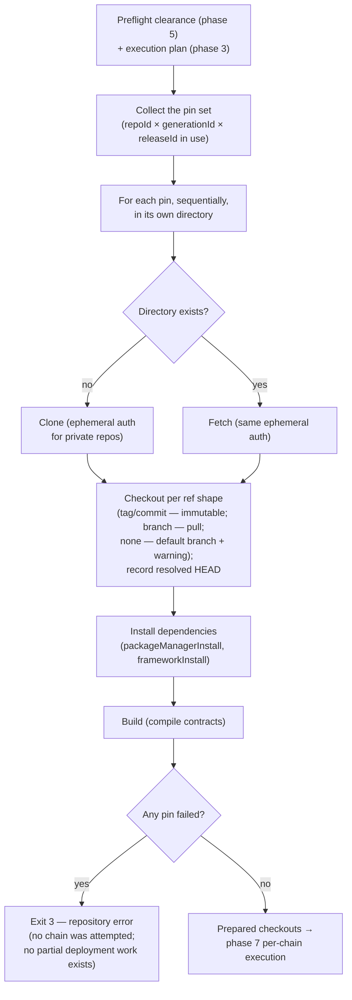

# Phase 6 — Repository prepare (eager)

Conceptual design of the sixth phase of the [run lifecycle](run-lifecycle.md): turning every release pin the execution plan uses into a ready working tree — cloned, checked out, installed, built — eagerly, all of them, before any chain executes. Follows the [phase-doc template](run-lifecycle.md#how-phase-docs-are-written).

## Purpose

Phase 7 will run commands inside repository checkouts; this phase makes sure those checkouts exist and are *complete* — the right code at the right ref, dependencies installed, contracts compiled. And it does so **eagerly**: every pin, up front, before the first step of the first chain. A broken clone, a missing dependency, or a failing build is a fact about the environment, not about any chain — so it should surface once, before any transaction, rather than mid-launch on chain three of five.

Eagerness buys a second property: **uniformity**. Prepare runs once per invocation, and every chain executes against the same prepared trees. There is no per-chain variation in what code is on disk — the only per-chain variation phase 7 sees is the values and resolutions the execution plan already carries.

## Position in the lifecycle

| | |
|---|---|
| **Consumes** | The **preflight clearance** from [phase 5](phase-5-preflight.md) and the **execution plan** from phase 3 — specifically, the set of release pins its steps run from. |
| **Produces** | The **prepared checkouts** — one ready working tree per pin in use — handed to [phase 7](phase-7-per-chain-execution.md). |

## Responsibilities

### Computing the pin set

The unit of preparation is the **release pin**: a `repoId × generationId × releaseId` combination. The set of pins in use follows from the execution plan — each step's action belongs to a generation, and the plan's [release selection](../specs/plans.md#release-selection) already resolved (in phase 2) which pin each in-use generation runs from (explicit `releases:` selection, else the pin flagged `latest`). This phase computes nothing new; it collects the pins the plan already named and prepares exactly those — never every pin the actions file declares.

### One directory per pin

Each pin gets its own directory — `workspace/repos/<repoId>/<generationId>/<releaseId>/` — so different generations, and different pins of one generation, never share a working tree ([engine-internals.md → Release pin checkout](../specs/engine-internals.md#release-pin-checkout)). The isolation is what makes two facts safe: a plan can run steps from two generations of the same repo in one workflow, and two plans pinned to different releases never contaminate each other's build outputs.

### The four steps, per pin

1. **Clone or fetch.** First use of a pin clones; later invocations fetch into the existing directory. Private repos get their credential injected **ephemerally, per git process** — one-shot environment-based git config, nothing in `.git/config`, nothing in argv, nothing persisted in the checkout ([engine-internals.md → Repository authentication](../specs/engine-internals.md#repository-authentication)).
2. **Checkout per the pin's ref.** `tag` / `commit` — immutable checkout; `branch` — checkout plus pull (mutable by declaration); no ref at all — the remote's default branch, with a reproducibility warning. Whatever the shape, the engine **records the resolved HEAD commit** in per-pin repo state, so results can answer "what code ran" even for mutable pins.
3. **Install dependencies.** The repo's (or generation's) `packageManagerInstall` and `frameworkInstall` commands ([actions.md → Repos](../specs/actions.md#repos--one-remote-shared-build-defaults)) — package-manager installs and framework-level installs (e.g. `forge install`) both belong here, not to any step.
4. **Build.** Compile per the framework, so contract artifacts exist before execution — phase 7 depends on them beyond just running commands (e.g. `ForgeEncodedArgsEnricher` reads constructor ABIs from `out/`; bundled deploy machinery reads compiled artifacts).

Two execution properties are deliberate. **Pins prepare sequentially** — one pin runs its four steps to completion before the next begins. Pins are independent and could overlap, but sequential prepare keeps the log readable (one pin's clone/install/build output at a time, a failure unambiguously attributed), avoids concurrent package-manager runs contending over shared caches, and costs little at realistic pin counts. And **all four steps run on every invocation** — immutable pins included. A `tag` / `commit` pin cannot change, so skipping install/build when outputs already exist looks like a free resume-latency win; it is rejected because the *checkout* being immutable does not make the *tree* trustworthy — a dirty working tree, a half-written `node_modules` from an interrupted run, or a toolchain upgrade since the last invocation all produce stale-artifact failures that a freshness heuristic must detect to be safe, and that detection logic is where the bugs live. Re-running install and build is idempotent, bounded (package managers and compilers do their own internal caching against unchanged inputs), and guarantees the artifact phase 7 receives was produced by this invocation's toolchain from this checkout's code.

Prepare is **chain-independent by construction** — none of the four steps takes a chain as input. Per-chain state (input files like `.env.automation`, outputs, artifacts) is written and cleaned per step by phase 7's step lifecycle, never here.

## The prepared-checkouts artifact

The phase's single output: for each pin in use, a working tree at the recorded commit with dependencies installed and build outputs present. Two properties define it:

1. **It is complete before anything executes.** Phase 7 never clones, installs, or builds — if a step fails, it fails for a reason that belongs to the step, not to missing preparation. This is what keeps the failure model's classes clean (exit `3` here, `4`/`5` there).
2. **It is shared, and sharing is managed.** All chains execute against the same trees, but the engine's working files stay separate — phase 7 writes them into per-chain run directories (`deployment-run/<chain>/` — [phase 7 → the deployment run directory](phase-7-per-chain-execution.md#the-deployment-run-directory-per-chain-working-files)); in parallel chain mode, a per-checkout mutex serializes the execute spans that touch the framework's shared state in the same checkout. The artifact is shared state, and phase 7 owns the discipline around it.

## Decision flow

## What this phase does not do

- **No chain contact.** Nothing here reads or writes any chain; the network use is git remotes and package registries only.
- **No pin selection.** Which pin a generation runs from was resolved and validated in phase 2 (release selection); this phase consumes the answer. An unselectable pin situation never survives to here.
- **No per-chain or per-step state.** Working files, outputs, artifacts — all owned by phase 7's step lifecycle. Prepare leaves the trees clean.
- **No results-tree writes.** The resolved HEAD commit lands in per-pin repo state (and later in run records via phase 7/8); prepare itself writes nothing under `workspace/results/`.
- **No cleanup of previous pins.** Pins no longer in use by any plan are left on disk; reclaiming them is an operator action, not part of any run.

## Failure modes

All hard failures exit `3` — repository error ([cli.md → Exit codes](../specs/cli.md#exit-codes)):

| Failure | Example |
|---|---|
| Clone / fetch failure | Unreachable remote, missing repository, authentication failure on a private repo |
| Checkout failure | The pin's `tag` / `commit` / `branch` does not exist on the remote |
| Install failure | `yarn install` / `forge install` exits non-zero |
| Build failure | Compilation errors in the pinned code |

Because prepare is eager and precedes all execution, an abort here is clean: no chain was attempted, and — apart from `deployment.yaml` if phase 4 opened a fresh deployment — no partial deployment work exists. Re-running the same invocation after fixing the cause resumes normally.

Warnings never stop the phase: the default-branch reproducibility warning (a pin with no ref) is printed and recorded, and preparation proceeds.

Errors this phase deliberately leaves to later phases:

| Error | Surfaces in |
|---|---|
| A step's command failing inside a prepared checkout | Phase 7 (step execution) |
| A constant missing for one specific step's input | Phase 7 (step input resolution) |

## Relationships to specs

| Doc | What it owns |
|---|---|
| [actions.md](../specs/actions.md) | Repos, generations, release pins, and the install/build command surface (`packageManagerInstall`, `frameworkInstall`). |
| [plans.md](../specs/plans.md) | The `releases:` selection that determines the pin set. |
| [engine-internals.md](../specs/engine-internals.md) | The checkout mechanics per ref shape, the resolved-HEAD recording, and the ephemeral repository-authentication mechanism. |
| [secrets.md](../specs/secrets.md) | The git-token model behind `repository.auth`. |
| [run-lifecycle.md](run-lifecycle.md) | The map; the per-checkout mutex that governs how phase 7 shares these trees. |

## Decided

- **Prepare is eager and precedes all execution.** Every pin, before any chain — environment failures surface once, up front, with exit code `3`, and never interleave with on-chain progress. (Carried from the reviewed map; restated here as this phase's defining property.)
- **One directory per pin, no sharing.** Isolation between generations and between releases of one generation is structural, not conventional.
- **Credentials are ephemeral, per git process.** Nothing persists in the checkout or its config; see [engine-internals.md → Repository authentication](../specs/engine-internals.md#repository-authentication).
- **Mutable pins are recorded, not forbidden.** A `branch` (or default-branch) pin pulls latest on every invocation — including a resume, which may therefore run different code than the original attempt. The recorded resolved HEAD per invocation is the answer to "what ran"; production guidance remains `tag` / `commit`.
- **No install/build caching — every invocation prepares fully, immutable pins included.** Skipping install/build when a `tag` / `commit` pin's outputs already exist would trade correctness for resume latency: the safety of the skip depends on staleness detection (dirty trees, interrupted installs, toolchain drift), which is exactly the logic that breeds subtle failures. Package managers and compilers already cache internally against unchanged inputs, so the honest re-run is cheap where caching would have been safe anyway.
- **Pins prepare sequentially.** No cross-pin parallelism: one pin's clone → checkout → install → build completes before the next starts. Readable logs, unambiguous failure attribution, no package-manager cache contention — at pin counts where overlap would buy little.

## Open questions

None. The two questions this design opened were resolved in review: install/build caching for immutable pins is rejected (prepare runs fully on every invocation — see *Decided*), and prepare stays sequential across pins.
