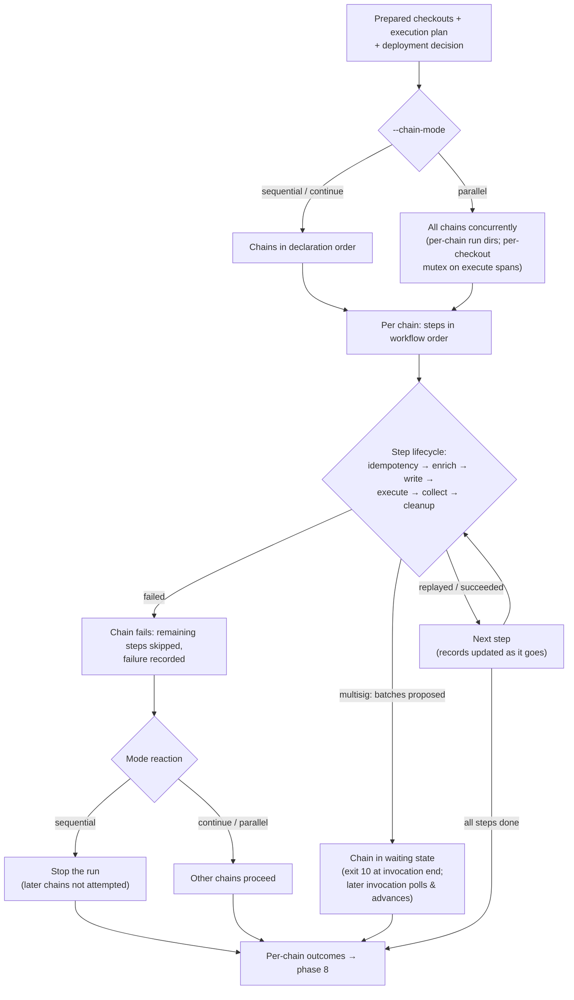

# Phase 7 — Per-chain execution

> **Review status: REVIEWED — with a known gap.** Everything this doc currently says passed review without comments. What it lacks is a description of the **command execution pipeline** — how a step's command actually runs: the enricher chain, the writers, action execution per type, collect — beyond delegating to [engine-internals.md](../specs/engine-internals.md). That section is still to be written (tracked in [TODO.md](../TODO.md)); until then, engine-internals is the authoritative source for the pipeline.

Conceptual design of the seventh phase of the [run lifecycle](run-lifecycle.md): the heart of the run — an outer loop over the resolved chain set, an inner loop over the execution plan's steps — and the only phase that changes on-chain state. Follows the [phase-doc template](run-lifecycle.md#how-phase-docs-are-written).

## Purpose

Everything before this phase existed to make this phase boring. The plan is validated, the steps and their methods are fixed per chain, the deployment identity is resolved, the environment is probed, the checkouts are built — so execution can be a straightforward walk: for each chain, for each step, run the step lifecycle and record what happened. All the interesting decisions were made statically; what remains here is the irreversible part, and the design goal is that nothing *surprising* is decided while it happens.

Two loops structure the phase. The **outer loop** iterates chains — its ordering, failure reaction, and concurrency are the operator's per-invocation choice (`--chain-mode`). The **inner loop** iterates the execution plan's steps in workflow order — its shape is fixed, and each iteration is the six-phase step lifecycle owned by [engine-internals.md](../specs/engine-internals.md#how-the-engine-processes-an-action).

## Position in the lifecycle

| | |
|---|---|
| **Consumes** | The **prepared checkouts** from [phase 6](phase-6-repo-prepare.md), the **execution plan** from phase 3, and the **deployment decision** from phase 4 (which chains, resume-or-fresh, sender mode). |
| **Produces** | The **per-chain outcomes** — per chain, the recorded result of every attempted step — handed to [phase 8](phase-8-persistence-report.md). |

## Responsibilities

### The inner loop: the step lifecycle

Each step runs **idempotency lookup → enrich → write → execute → collect → cleanup** ([engine-internals.md](../specs/engine-internals.md#how-the-engine-processes-an-action)). At the run level, the load-bearing facts:

- **Resume is per step.** On a resumed deployment, a previously-succeeded [idempotent step](../specs/engine-internals.md#idempotency-lookup) replays its recorded outputs and is marked `replayed`; only incomplete work executes. The phase-4 verdict said *this invocation resumes*; the per-step meaning is decided here, step by step.
- **Values materialize here, per step, per chain.** Constants become inputs, transforms and combines apply, secrets inject via the `SEC_` environment (never through writer files) — the value side of what phase 3 verified structurally. On a resumed deployment the constants come from the [frozen parameter set](phase-4-deployment-resolution.md#the-parameter-freeze-on-resume) recorded at creation, not from a fresh resolution of the current plan (secrets always resolve live). A constant missing for a consumed input is a step failure here, by design ([phase 3 → failure modes](phase-3-static-planning.md#failure-modes)).
- **Verification is inline.** When the two gates pass (`verify: true` on the action, a selected verification profile on the chain), the command verifies as part of its own run; a verification failure is a step failure ([engine-internals.md → Verification](../specs/engine-internals.md#verification)). `--verify-only` invocations run only this machinery, against recorded addresses.
- **Records are written as it goes.** Each step's attempt lands in `run-N.yaml` when it completes; artifacts persist at collect; `result.yaml` updates after each step. Persistence is continuous — a crash loses at most the in-flight step, and a resume finds everything the run knew. Phase 8 owns the record model; this phase feeds it.

### The deployment run directory: per-chain working files

Everything the engine creates or copies for a deployment lives in **one folder inside the pin's checkout, with one subfolder per chain**:

```
<checkout>/deployment-run/
  <chain>/                          # e.g. mainnet/, matic/ — one per chain in scope
    .env.automation                 # writer output — the step's serialized inputs
    .env.outputs                    # written by the step's command — declared outputs
    .deploy-pad-transactions.json   # multisig mode — the planning contract file
    artifacts/<stepId>/             # the step's SYS_ARTIFACTS_DIR staging area
    ...                             # any other engine-written or engine-copied
                                    #   configs and scripts for this deployment
```

The command still runs where it always did — the checkout root (or the action's `workingDir`) — and finds its run directory through **`SYS_RUN_DIR`** (absolute path, set for every step), the same hand-a-path-through-the-environment pattern as `SYS_ARTIFACTS_DIR`: read inputs from `$SYS_RUN_DIR/.env.automation`, write results to `$SYS_RUN_DIR/.env.outputs`. Steps within a chain run sequentially and share the chain's folder; the per-step write/clean discipline (delete before the run, read at collect) is unchanged — only relocated.

What the folder buys:

- **Chain separation.** Deployments to different chains stop sharing files: no stale `.env.outputs` from one chain read by another, no cross-chain contamination when things go wrong — and in parallel mode, no engine-file collisions between chains at all (see the mutex consequence below).
- **Inspectability.** After a failure, everything the run wrote for a chain sits in one named place, sorted by chain — instead of loose dotfiles scattered through the checkout root.
- **One-command cleanup.** `--cleanup` deletes the `deployment-run/` folder; nothing engine-owned hides anywhere else in the tree.
- **Clean checkouts.** The folder is the single engine footprint in the working tree. The engine keeps it out of `git status` with one local ignore rule in `.git/info/exclude` — local-only, never committed, in the spirit of the ephemeral-auth discipline (nothing engine-related persists in the repo's own files).

### The outer loop: chain execution modes

`--chain-mode` selects how the loop runs and reacts to a failing chain ([cli.md → Chain scope](../specs/cli.md#chain-scope)):

| Mode | Execution | On a chain failure |
|---|---|---|
| `sequential` (default) | Chains one after another, in the plan's declaration order. | **The whole run stops.** Later chains are recorded as not-attempted; resume picks up both the failed and the never-started chains. |
| `continue` | Same sequential order. | **The failed chain is recorded and the loop moves on.** The exit code reflects the worst outcome; resume re-attempts only the failed chains. |
| `parallel` | All chains concurrently. | **Chains are isolated** — each runs to its own completion or failure; the exit code reflects the worst outcome. |

**A failing step fails its chain** in every mode: the chain's remaining steps are skipped, the failure is recorded, and the mode decides only what happens to the *other* chains. Two mode-crossing rules:

- **Parallel mode shares the prepared checkouts — but not the working files.** The [per-chain run directories](#the-deployment-run-directory-per-chain-working-files) mean the engine's own files never collide across chains; what chains still share is the checkout itself, where the *framework* writes its own state during a command (Foundry `cache/` and `broadcast/`, Hardhat artifacts). The engine therefore enforces a **per-checkout mutex around the execute span only**: write, collect, and cleanup are chain-private and overlap freely; commands sharing a checkout serialize. Chains on different pins — and all RPC waiting — overlap freely.
- **Logs stay attributable.** In parallel mode every console line is prefixed with its chain name, and the structured log file carries the chain as a field.

### The multisig branch

In multisig mode the inner loop's **execute** phase is replaced by the planning contract ([multisig.md](../specs/multisig.md)): steps simulate as the Safe and capture transactions instead of broadcasting; batches are cut at semantic boundaries; proposals go to the backend (`multisend` / `merkle`); predicted outputs keep downstream mappings flowing. The invocation then exits in the **waiting** state (exit `10`) — waiting is a recorded deployment status, not an in-process pause, and it never triggers the `sequential` stop: the loop proceeds to plan and propose the remaining chains so owners can sign everything in one sitting. A **later invocation** polls, advances executed batches, and runs the post-execution collect + verify-only pass. From this page's perspective it is the same chain loop with a pause in the middle; everything inside the pause is owned by [multisig.md → Lifecycle & resume](../specs/multisig.md#lifecycle--resume).

## The per-chain-outcomes artifact

The phase's single output: per chain, the ordered record of what happened to every step — succeeded (with outputs), replayed (with the source run), failed (with the error), skipped (chain aborted), or, in multisig mode, the batch statuses (`planned` → `proposed` → `executed` → `collected`). Two properties define it:

1. **It is per-chain by construction.** Results live under `workspace/results/<workflow>/<deployment_id>/<chain>/`; no chain mode changes *what* is recorded — only when and whether a chain was attempted in this invocation.
2. **It is already durable.** By the time phase 8 runs, every outcome in the artifact is on disk; phase 8 aggregates and reports, it does not persist outcomes for the first time.

## Decision flow



## What this phase does not do

- **No planning.** Step order, methods, factory flavors, key slots, mappings — all fixed in phase 3. Nothing about the plan is recomputed inside the loop.
- **No preparation.** No clone, install, or build; a missing artifact in a checkout is a phase-6 bug surfacing late, not a step responsibility.
- **No record mutation.** Prior runs' records are read (idempotency index, multisig batch statuses), never modified; this invocation appends its own attempt records.
- **No summary or exit-code computation.** The phase produces outcomes; phase 8 turns them into the verdict.
- **No waiting for humans.** Signature collection happens outside the engine; a waiting multisig run exits rather than blocking ([cli.md → One deployment, many invocations](../specs/cli.md#one-deployment-many-invocations)).

## Failure modes

Step-class failures exit `4`, verification-class failures `5`; the multisig waiting state exits `10` and is not a failure ([cli.md → Exit codes](../specs/cli.md#exit-codes)):

| Failure | Example |
|---|---|
| Command failure | The step's subprocess exits non-zero; an enricher or writer throws |
| Missing declared output | `.env.outputs` lacks a declared output name after a "successful" command |
| Reverted transaction | A `contract-call` `mode: send` transaction reverts; a deploy broadcast fails |
| Inline verification failure | The explorer rejects or times out during the command's verify pass |
| Multisig post-execution mismatch | A `proposed` batch no longer verifies against the Transaction Service / chain state |

In `continue` and `parallel` modes the invocation's exit code reflects the **worst** chain outcome; the summary lists each chain individually.

Errors this phase deliberately leaves elsewhere: none downstream — this is the last phase that can fail the run. Everything it relies on failing earlier (config, planning, environment, repos) was owned by phases 2–6.

## Relationships to specs

| Doc | What it owns |
|---|---|
| [engine-internals.md](../specs/engine-internals.md) | The six-phase step lifecycle, enrichers/writers/commands, the deployment interface, verification gating, idempotency lookup. |
| [multisig.md](../specs/multisig.md) | The planning contract, batching, backends, the waiting state, and the post-execution collect/verify pass. |
| [workflows.md](../specs/workflows.md) | The step order and wiring the inner loop walks. |
| [cli.md](../specs/cli.md) | `--chain-mode`, `--verify-only`, exit codes `4` / `5` / `10`. |
| [run-lifecycle.md](run-lifecycle.md) | The map; the chain-execution-modes table this doc restates. |

## Decided

- **A failing step fails its chain; the mode decides the rest.** One failure semantics for the inner loop, three operator-selectable semantics for the outer loop. (Carried from the reviewed map.)
- **Waiting is not failure — and not an in-process pause.** Multisig waiting is a recorded status and a clean exit (`10`); only errors stop a sequential run. (Carried from the reviewed map.)
- **Persistence is continuous, aggregation is final.** Records land as steps complete; phase 8 never persists an outcome for the first time. The split keeps crashes cheap and the reporting phase side-effect-light.
- **All engine working files live in per-chain run directories.** One folder per checkout (`deployment-run/`), one subfolder per chain, path handed to commands via `SYS_RUN_DIR` — chain separation, one-place inspectability, one-command cleanup, and a single ignore rule keeping checkouts clean. The engine never scatters files through the checkout root.
- **The per-checkout mutex covers the execute span only.** Run directories eliminate cross-chain collisions on engine files; the remaining shared state is the framework's own (build caches, broadcast records), which only the running command touches — so only commands serialize per checkout.

## Open questions

None owned here currently — the open item adjacent to this phase (whether the execute-span serialization ever needs per-chain checkout copies) is tracked at the run level in [run-lifecycle.md → Open questions](run-lifecycle.md#open-questions); a `parallel` concurrency cap was considered and rejected there.
