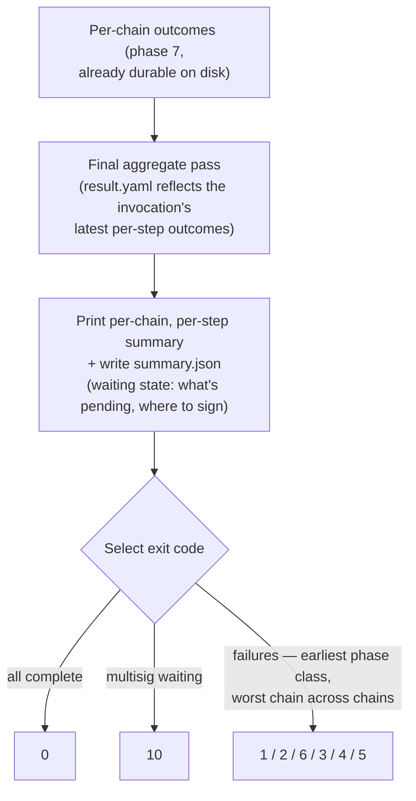

# Phase 8 — Persistence & final report

> **Review status: REVIEWED.** The review resolved both open questions: the record shapes now have an owning spec ([results.md](../specs/results.md)), and the machine-readable summary (`summary.json`) is decided in.

Conceptual design of the eighth and final phase of the [run lifecycle](run-lifecycle.md): closing the invocation — the record model the run leaves behind, the human-facing summary, and the exit code. Follows the [phase-doc template](run-lifecycle.md#how-phase-docs-are-written).

## Purpose

A run's value does not end when its last transaction confirms. Everything downstream — resuming a failed chain, replaying idempotent steps, auditing "what ran with what values, signed by whom", the `status` and `report` commands, a CI pipeline deciding whether to re-trigger — reads what this phase's model guarantees is on disk. Phase 8 owns two things: the **record model** (what is written, when, and with what immutability rules — even though most writes physically happen during phase 7) and the **closing act** (the final aggregate update, the per-chain per-step summary, and the exit code).

The ownership split matters: persistence is *continuous* by design — records land as steps complete, so a crash loses at most the in-flight step — but the *contract* of those records (files, shapes, immutability, redaction) belongs to one place, and that place is here.

## Position in the lifecycle

| | |
|---|---|
| **Consumes** | The **per-chain outcomes** from [phase 7](phase-7-per-chain-execution.md) — already durable on disk, per chain. |
| **Produces** | The **records and the exit code** — the finalized results tree, the printed summary, and the process exit status the invocation ends with. |

## Responsibilities

### The record model

Under `workspace/results/<workflow>/<deployment_id>/` — deployment-scoped records at the top, chain-scoped records in per-chain subdirectories. Field-level shapes, examples, and the layout are owned by [results.md](../specs/results.md); the model:

| Record | Written | Contents |
|---|---|---|
| `deployment.yaml` | Once, at deployment start (physically in phase 4) | Immutable launch record: preset, overrides, multisig entry, resolved deployment id, chain provenance (resolved chain list, plus the chain-set name when `$set` was used), and the structural fingerprint the resume check compares against. |
| `config_snapshot.yaml` | At deployment start (physically in phase 4); rewritten only by an explicit `--refreeze` (the event recorded in the attempt record) | The **frozen parameter set** — resolved values for every declared chain, `${random.N}` fixed at launch, secrets redacted. Normative on resume: it supplies the values phase 7 runs with. |
| `run-N.yaml` | One per invocation, updated as steps complete (phase 7) | Per-step attempt records: status, resolved constants, inputs, outputs, replay markers, multisig batch statuses — plus invocation-level facts (skipped preflight, warnings). |
| `result.yaml` | Updated after each step / batch completes (phase 7); final aggregate pass here | The aggregate: latest per-step outcome, confirmed addresses, constants. |
| `artifacts/<step_id>/` | At each step's collect phase (phase 7) | Whatever the step dropped into `SYS_ARTIFACTS_DIR` (ABIs, deployment records). |
| `summary.json` | At the end of every invocation (this phase); rewritten each time | The machine-readable summary of the latest invocation — see [The summary](#the-summary). |

Three rules govern every record:

- **Immutability.** `deployment.yaml` is written once and never overwritten; completed runs' `run-N.yaml` files are never mutated; `--restart` abandons a directory, it never rewrites one. History stays answerable. (`config_snapshot.yaml` is the one deliberate exception: an explicit `--refreeze` rewrites it — with the event recorded in the attempt record, so even that mutation leaves a trail.)
- **Redaction.** Secret-tagged values are redacted in every record, mechanically — the tag applied at resolution time ([phase 2 → Gate 4](phase-2-load-validation.md#gate-4--value-resolution)) drives it; no record-writing code decides case by case.
- **Self-sufficiency.** A deployment's directory answers "what ran" without the configs that produced it: the snapshot carries resolved values, the run records carry per-step inputs/outputs, the pin records carry resolved commits.

A fourth property is a consequence rather than a rule, and is worth naming because something downstream depends on it: the tree is **portable**. Paths inside it are relative to the results root and no record carries machine identity, so the same deployment resumes from a copy of the tree on another machine ([phase 4](phase-4-deployment-resolution.md#the-resume-or-fresh-verdict) reads records, not local state). That is what lets an unattended pipeline persist the tree between invocations — the operator's job, not the engine's, since the engine performs no git operations on the workspace repository ([ci.md](../specs/ci.md)).

### The summary

The invocation ends with a per-chain, per-step summary: what succeeded, what replayed, what failed and why, what was skipped. For a multisig deployment in the waiting state, the summary additionally shows what is pending and where to sign — the same information `status` will show later. At `--log-level silent` the summary is suppressed like everything else; the exit code, the log file, and the results tree carry the outcome.

The summary has a **machine-readable twin**: `summary.json`, written at deployment level at the end of every invocation ([results.md → `summary.json`](../specs/results.md#summaryjson--the-machine-readable-summary)). Same facts, structured — status, exit code, per-chain per-step outcomes, warnings, pending multisig batches — for pipelines that do more than branch on the exit code. It is rewritten each invocation (latest wins; history lives in the `run-N.yaml` records), derived (never authoritative — it introduces nothing that isn't already on disk), redacted like every record, and **best-effort** like the printed summary: a failed write never masks the run outcome. The intended CI pairing: `--log-level silent -l run.json` for the full structured log, `summary.json` for the outcome.

### The exit code

One number, chosen by two rules ([cli.md → Exit codes](../specs/cli.md#exit-codes)):

- **Earliest-phase failure class wins the classification.** `1` invocation/load, `2` validation, `6` preflight, `3` repository, `4` step execution, `5` verification, `10` multisig waiting, `0` success — the code says *which kind* of failure ended the run, which is what a CI pipeline branches on.
- **Worst chain wins across chains.** In `continue` and `parallel` modes with mixed outcomes, the exit code reflects the worst chain; the summary lists each chain's status individually. The waiting state (`10`) is not a failure — CI distinguishes "pending, re-trigger later" from both "done" and "broken".

### Best-effort reporting

A summary or report failure never masks the run outcome: if the run succeeded and the summary printer chokes, the exit code is still `0`; if the run failed, the recorded failure and its code survive any reporting problem. Reporting is the one part of the engine explicitly allowed to degrade.

## Decision flow

## What this phase does not do

- **No first-time persistence of outcomes.** Every step outcome was written when it happened (phase 7); this phase aggregates and closes. A crash before phase 8 loses the summary, never the record.
- **No record mutation.** The final aggregate pass updates `result.yaml` (its designed lifecycle); nothing else is touched, and nothing from prior invocations ever is.
- **No chain or network contact.** The phase reads what phase 7 recorded and writes the local aggregate — reporting works offline, which is also what makes `status` / `report` (which read the same tree) offline commands.
- **No cleanup of working directories.** `--cleanup` (deleting the per-chain `deployment-run/` directories from checkouts after success) is part of the step lifecycle's cleanup discipline, not of reporting.

## Failure modes

This phase is deliberately the least failure-prone in the run:

| Failure | Effect |
|---|---|
| Summary / report rendering failure | Logged; the run's recorded outcome and exit code are preserved unchanged (best-effort rule). |
| Final aggregate write failure | Logged and surfaced as a warning on the invocation; the per-step records in `run-N.yaml` remain the authoritative source, and the next invocation's aggregate pass repairs `result.yaml`. |

By contrast, a record-write failure **during** phase 7 (a `run-N.yaml` update that cannot land) is treated as a step failure there — the engine does not continue a launch it cannot record. That rule belongs to phase 7's execution discipline; it is stated here because the record model motivates it.

## Relationships to specs

| Doc | What it owns |
|---|---|
| [results.md](../specs/results.md) | The field-level spec of every record: directory layout, shapes, examples, `summary.json`. |
| [cli.md](../specs/cli.md) | The exit-code table; the `status` / `report` commands that consume the results tree. |
| [plans.md](../specs/plans.md) | Deployment id semantics — the key of the results tree. |
| [engine-internals.md](../specs/engine-internals.md) | The idempotency index (rebuilt from `run-N.yaml` files); artifact persistence at collect. |
| [multisig.md](../specs/multisig.md) | Batch statuses in the records; the waiting-state summary content. |
| [ci.md](../specs/ci.md) | Keeping the tree alive between invocations when the runner is ephemeral, and the exit-code contract an unattended pipeline branches on. |
| [secrets.md](../specs/secrets.md) | The redaction guarantee every record honors. |
| [run-lifecycle.md](run-lifecycle.md) | The map; the failure model whose classes the exit code encodes. |

## Decided

- **The record model is owned here, even though writes happen throughout.** One phase owns the contract (files, timing, immutability, redaction); other phases write *into* it. (The record table itself is carried from the reviewed map.)
- **Reporting is best-effort; records are not.** A reporting failure never masks the outcome; a mid-run record failure stops the run. The asymmetry is deliberate: auditability is a hard guarantee, pretty output is not.
- **`result.yaml` is a repairable aggregate.** The per-step attempt records are authoritative; the aggregate is derived and can be rebuilt, which is what makes its final write safe to degrade to a warning.
- **The record shapes have an owning spec.** [results.md](../specs/results.md) is the field-level reference — directory layout, per-file field tables, examples, and record versioning (`recordVersion` / `schemaVersion`, additive-only within a version) — ending the scatter of record descriptions across phase docs. See [The record model](#the-record-model).
- **The summary has a machine-readable twin.** `summary.json` at deployment level, rewritten at the end of every invocation: derived, redacted, best-effort — the human summary's facts in a stable shape for CI. See [The summary](#the-summary).

## Open questions

None currently — the review resolved both: the record shapes moved into an owning spec ([results.md](../specs/results.md)), and the machine-readable summary was decided in as `summary.json` (deployment-level, rewritten per invocation, best-effort).
