# Run lifecycle

The end-to-end sequence of one engine invocation — every phase from the CLI command to the final report, in execution order. Each phase is described at a high level with a link to the doc that owns its details: this page answers *"what happens when, and what can fail where"*; the owning docs answer *"how exactly"*.

> **Audience.** Like [engine-internals.md](../specs/engine-internals.md), this is the engineering-oriented view — but one level up: engine-internals covers the lifecycle of a *single step*; this page covers the lifecycle of a *whole run*. One level up again, [arc42.md](arc42.md) places this sequence in the whole architecture — context, building blocks, deployment, cross-cutting concepts — and treats each phase below as a building block.

## The phases at a glance

1. **[Invocation & run context](#phase-1--invocation--run-context)** — parse the CLI, fix the run parameters.
2. **[Config load & validation](#phase-2--config-load--validation)** — version check → schema → referential rules → plan value resolution.
3. **[Workflow resolution & static planning](#phase-3--workflow-resolution--static-planning)** — flatten, apply variants, required-data checks.
4. **[Deployment resolution](#phase-4--deployment-resolution-resume-or-fresh)** — resume an unfinished deployment or start fresh.
5. **[Dynamic preflight checks](#phase-5--dynamic-preflight-checks)** — run the configured check scripts probing the run's on-chain preconditions; the shipped RPC (reachability + chain identity), deployer-balance, and CREATE3-factory checks among them.
6. **[Repository prepare (eager)](#phase-6--repository-prepare-eager)** — clone/fetch, checkout pins, install, build.
7. **[Per-chain execution](#phase-7--per-chain-execution)** — the chain loop × the step lifecycle.
8. **[Persistence & final report](#phase-8--persistence--final-report)** — results tree, summary, exit code.

The guiding principle across phases 1–6: **everything that can fail before the first transaction fails before the first transaction** — statically where a file can prove it (phases 1–4), by cheap dynamic probes where it cannot (phase 5), and by eager preparation of everything execution needs (phase 6). A typo in a mapping, a missing CREATE3 factory, an unreachable RPC, a broken build — all of it surfaces before the first transaction of the first step. Phase 7 is the only phase that changes on-chain state.

## How phase docs are written

Each phase gets its own design doc in this folder, named `phase-N-<slug>.md`. This page stays the map — *what happens when, and what can fail where* — and each phase doc owns the conceptual design of its phase: *what the phase decides, how, and why the boundary sits where it does*. The phase docs follow a shared set of principles:

- **One file per phase.** A phase doc covers exactly one phase; anything that spans phases (the failure model, the chain execution modes) lives here on the map.
- **Every phase is a contract.** Each doc names what the phase *consumes* — the artifact the previous phase produced — and what it *produces* — a named conceptual artifact handed to the next phase. The chain of artifacts across the whole run:

```mermaid
flowchart LR
    argv["CLI invocation"] --> p1["1 Invocation"]
    p1 -->|"run context"| p2["2 Load & validation"]
    p2 -->|"resolved plan"| p3["3 Static planning"]
    p3 -->|"execution plan"| p4["4 Deployment resolution"]
    p4 -->|"deployment decision"| p5["5 Preflight checks"]
    p5 -->|"preflight clearance"| p6["6 Repo prepare"]
    p6 -->|"prepared checkouts"| p7["7 Per-chain execution"]
    p7 -->|"per-chain outcomes"| p8["8 Persistence & report"]
    p8 --> out["records & exit code"]
```

- **Conceptual level, greenfield.** Phase docs describe responsibilities, decisions, data flow, and failure modes — in prose and diagrams, without engine code, type definitions, or references to the v1 implementation. Field-level semantics stay in the specs (`cli.md`, `plans.md`, …); phase docs link to them instead of restating them.
- **A fixed template.** Every phase doc uses the same section skeleton: *Purpose* · *Position in the lifecycle* (consumes / produces) · *Responsibilities* · *Decision flow* (diagram) · *What this phase does not do* · *Failure modes* · *Relationships to specs* · *Open questions*.
- **The fail-static principle, restated per phase.** Each doc states explicitly which classes of error the phase is responsible for surfacing — and which it deliberately leaves to a later phase — so no error class slips through the boundaries unowned.

Phase docs written so far:

| Phase | Doc | Review status |
|---|---|---|
| 1 — Invocation & run context | [phase-1-invocation.md](phase-1-invocation.md) | reviewed |
| 2 — Config load & validation | [phase-2-load-validation.md](phase-2-load-validation.md) | reviewed |
| 3 — Workflow resolution & static planning | [phase-3-static-planning.md](phase-3-static-planning.md) | reviewed |
| 4 — Deployment resolution | [phase-4-deployment-resolution.md](phase-4-deployment-resolution.md) | reviewed |
| 5 — Dynamic preflight checks | [phase-5-preflight.md](phase-5-preflight.md) | reviewed (new phase; introduces `engine.yaml`, exit code `6`, `--skip-preflight`) |
| 6 — Repository prepare (eager) | [phase-6-repo-prepare.md](phase-6-repo-prepare.md) | reviewed |
| 7 — Per-chain execution | [phase-7-per-chain-execution.md](phase-7-per-chain-execution.md) | reviewed (known gap: the command execution pipeline section is still to be written — see the doc's status note) |
| 8 — Persistence & final report | [phase-8-persistence-report.md](phase-8-persistence-report.md) | reviewed |

## Phase 1 — Invocation & run context

> Design doc: [phase-1-invocation.md](phase-1-invocation.md)

The engine parses the command and flags ([cli.md](../specs/cli.md)) and fixes the parameters that deliberately do **not** live in any config file:

- **Which plan** — `-e, --plan` (name resolved into `plans/`, or a path).
- **Which preset** — `--preset`, falling back to the plan's `default_preset` (resolved in phase 2, when the plan is read).
- **Deployment identity** — `--deployment-id`, or derived from the selected preset's name; `--restart` opts out of auto-resume. See [plans.md → Deployment id & re-runs](../specs/plans.md#deployment-id--re-runs).
- **Chain scope** — `-c, --chain` / `-xc, --exclude-chain` filter the plan's resolved chain set.
- **Chain execution mode** — `--chain-mode` selects how the per-chain loop runs and reacts to a failing chain. Specified in [Chain execution modes](#chain-execution-modes) below.
- **Sender mode** — `--multisig <name>` switches the run to multisig mode ([multisig.md](../specs/multisig.md)); omitted = eoa.
- **Escape hatches** — `--ignore-version`, `--skip-verify`, `--skip-preflight`, `--dry-run`, overrides (`--set` / `--overrides`).

Nothing is loaded yet; this phase only decides *what kind of run* this is. The deployment id itself is resolved a little later — it needs the selected preset's name and a look at the results tree — but conceptually it belongs to the invocation, not to any file (see [Phase 4](#phase-4--deployment-resolution-resume-or-fresh)).

## Phase 2 — Config load & validation

> Design doc: [phase-2-load-validation.md](phase-2-load-validation.md)

The engine loads the mounted config set (`--configs-dir`, default `workspace/configs`): `actions.yaml`, `workflows.yaml`, the selected plan, `known-chains.yaml`, `global-params.yaml`, the optional `engine.yaml` (when absent, the shipped default engine config applies — [phase 5](phase-5-preflight.md#the-engine-config-engineyaml)), and — in multisig mode — `multisig.yaml`. Per file, in order:

1. **Config version check** — the reserved `version` key (every config file carries one) against the engine's supported format version; a mismatch is a load-time error unless `--ignore-version` downgrades it to a warning. See [engine-internals.md → Config version check](../specs/engine-internals.md#config-version-check).
2. **Schema validation** — shape, required fields, enum values, per the file's `.schema.yaml`.
3. **Referential validation** — everything a schema cannot see: the plan's `workflow` exists, step `action` / `workflow` references resolve, mappings point at prior steps and declared outputs, no cycles through nested workflows, chain names exist in known-chains, release pins are selectable, the multisig entry covers every active chain. Each config doc lists its rules in a *Validation rules & common errors* section.
4. **Plan value resolution** — the ten-step pipeline that turns the raw plan into per-chain resolved values: chain references against known-chains, preset selection, deployment overrides, then `${global.X}` → `${system.X}` → secrets merge → `${vault.X}` (with secret tagging) → `${random.N}` → `${env.VAR}`. Owned by [plans.md → Load & resolution order](../specs/plans.md#load--resolution-order); the secret-tagging mechanics by [engine-internals.md → Vault resolution and secret tagging](../specs/engine-internals.md#vault-resolution-and-secret-tagging).

The output of this phase is a fully resolved, per-chain plan with every secret tagged for redaction. `validate` ([cli.md → validate](../specs/cli.md#validate)) is exactly phases 2–3 run to completion and then stopped.

## Phase 3 — Workflow resolution & static planning

> Design doc: [phase-3-static-planning.md](phase-3-static-planning.md)

With all files loaded, the engine turns the selected workflow into a concrete execution plan:

- **Flattening** — nested workflows unfold into a flat, ordered step list; nested step ids get their dotted prefixes (`outer.inner`), and parent-level mappings are composed into the nested steps. See [workflows.md → Nesting and the aggregated interface](../specs/workflows.md#nesting-and-the-aggregated-interface) and [Value resolution](../specs/workflows.md#value-resolution).
- **Variant application** — if the plan points at a [method variant](../specs/workflows.md#method-variants--variantof), the per-step `methods` / `factories` / `keys` overrides are resolved per chain. Resolution is fully static: given a workflow id and a chain, every step's method, factory flavor, and key slot is known now.
- **Required-data checks** — for each chain, each step's resolved method is checked against the preset's `deploy` block: a `create3` step with `factory: oneInch` / `solady` needs a factory entry (hard error if missing), salts resolve with their fallback ladder (warnings for `saltBase` / random fallbacks). Deploying steps need a resolvable `secret.privateKey` (waived in multisig mode). In multisig mode, author-command deploying steps must declare `supportsMultisig: true` and no Hardhat 3 deploying steps may be present. See [plans.md → Validation rules](../specs/plans.md#validation-rules--common-errors) and [multisig.md → Validation rules](../specs/multisig.md#validation-rules--common-errors).

For a [single-action plan](../specs/plans.md#single-action-plans), the plan's `workflow` field holds an inline step instead of a workflow id; this phase treats it as a one-step workflow — flattening and variant application are trivially empty, and the same required-data checks run against the one step.

The output is the **execution plan**: per chain, the flat ordered step list with resolved methods, factory flavors, key slots, and salt/factory data. `--dry-run` prints this plan (plus predicted deterministic addresses where computable) and exits here.

## Phase 4 — Deployment resolution: resume or fresh

> Design doc: [phase-4-deployment-resolution.md](phase-4-deployment-resolution.md)

The engine inspects `workspace/results/<workflow>/<deployment_id>/` and decides what this invocation *is*:

- **An unfinished deployment exists** → **auto-resume**: this invocation becomes another `run-N.yaml` attempt inside the same deployment; [idempotent steps](../specs/engine-internals.md#idempotency-lookup) will replay their recorded outputs, and only incomplete work executes. A multisig deployment additionally re-checks its `proposed` batches instead of re-planning them.
- **`--restart`** → the unfinished deployment is left as-is (records stay immutable) and a **fresh deployment** starts.
- **Nothing unfinished** → a **fresh deployment** starts; if completed deployments already occupy the id, the new one gets an ordinal suffix (`<id>-2`, `<id>-3`, …).

For a fresh deployment the engine writes `deployment.yaml` — the immutable record of the launch (selected preset, overrides, multisig entry name, resolved id, the **structural fingerprint** of the execution plan, and the chain provenance: the resolved chain list plus the chain-set name when the plan used `$set`) — and `config_snapshot.yaml`, the **frozen parameter set** (resolved values for every declared chain, `${random.N}` fixed at launch, secrets excluded). A resume runs against these records, never against a re-resolution: the recorded chain list (not a re-expanded set), the frozen values (plan edits since launch warn, naming the changed keys — `--refreeze` adopts them explicitly), and the recorded structure (a changed workflow or action **refuses resume**, recommending a new deployment id). See [phase 4](phase-4-deployment-resolution.md#the-parameter-freeze-on-resume). The concrete (possibly suffixed) id is what `${system.DEPLOYMENT_ID}` resolves to, so this decision is made before the plan's system-reference resolution step consumes it. Full semantics: [plans.md → Deployment id & re-runs](../specs/plans.md#deployment-id--re-runs); the invocation-level view: [cli.md → One deployment, many invocations](../specs/cli.md#one-deployment-many-invocations).

## Phase 5 — Dynamic preflight checks

> Design doc: [phase-5-preflight.md](phase-5-preflight.md)

The run's first network contact, and deliberately its cheapest: a few seconds of read-only probes that verify the **on-chain preconditions** no file can prove — connectivity, funds, deployment infrastructure — before the engine invests in repository preparation and long before anything irreversible:

- **One mechanism, nothing engine-native** — every preflight check is a **TypeScript script** named in the engine's config (`engine.yaml`), run out of process under one contract (exit code `0` = pass, the script's output surfaced as its report message; `chain`/`run` scope, `error`/`warn` severity, a free-form `params` object; no per-check timeout/retry knobs — only a fixed engine backstop against hung scripts) with the **check context** in hand: a curated, versioned document carrying the step view of the built plan, the system variables, the per-chain sender **address** (never the key), and each chain's selected connection (URL + headers, [known-chains.md](../specs/known-chains.md)) — secret-tagged values never serialize into it. Three checks **ship with the engine release**: `engine:rpc` (one `eth_chainId` call per chain, two verdicts — **reachability** and **identity**: the served chain id must match the registry's `chain_id`; wrong-network URLs are deadlier than dead ones), `engine:balance` (the payer's native balance against a requirement **estimated from the run** — step count × gas heuristic × current gas price), and `engine:create3-factory` (a functional probe: each `create3` step's factory is asked to **compute the deployment address** for the step's resolved salt — proving the factory exists and answers its flavor's interface — and the predicted addresses are printed as a pre-launch preview).
- **Safe by default, editable by design** — the shipped checks are enabled in the engine's **default config** (`rpc` and `create3-factory` as `error`; `balance` as `warn` while its heuristic earns trust), which applies when no `engine.yaml` is mounted; a mounted file **replaces** the default wholesale (presets-style: replacement, not merge). Any check can be disabled without removal via `enabled: false` — reported as `disabled`, so opting out stays auditable.

All enabled checks run for all chains before any abort — failures are reported together, `validate`-style. A `severity: error` failure exits with the (new) code `6`; `--skip-preflight` is the recorded, per-invocation escape hatch. The phase runs on every `run` invocation — fresh and resume alike — and never on `validate` (offline by design) or `--dry-run` (exits at phase 3).

## Phase 6 — Repository prepare (eager)

> Design doc: [phase-6-repo-prepare.md](phase-6-repo-prepare.md)

Before any chain executes, the engine prepares **every release pin the execution plan uses** — eagerly, all of them, up front. A broken clone, a missing dependency, or a failing build surfaces here, before the first contract of the first chain deploys.

For each pin in use (the set of `repoId × generationId × releaseId` combinations the plan's [release selection](../specs/plans.md#release-selection) resolves), **sequentially** — one pin completes all four steps before the next begins:

1. **Clone or fetch** into the pin's own directory — `workspace/repos/<repoId>/<generationId>/<releaseId>/`. Private repos get the credential injected ephemerally per git process ([engine-internals.md → Repository authentication](../specs/engine-internals.md#repository-authentication)); nothing persists in the checkout.
2. **Checkout** per the pin's ref (`tag` / `commit` — immutable; `branch` — pull latest; none — remote default branch with a reproducibility warning). The resolved HEAD commit is recorded so results can answer "what code ran". See [engine-internals.md → Release pin checkout](../specs/engine-internals.md#release-pin-checkout).
3. **Install dependencies** — the repo's (or generation's) `packageManagerInstall` and `frameworkInstall` commands ([actions.md → Repos](../specs/actions.md#repos--one-remote-shared-build-defaults)).
4. **Build** — compile per the framework, so contract artifacts exist before execution.

Prepare runs **once per invocation, not per chain**: checkouts, dependencies, and build outputs are chain-independent, and every chain executes against the same prepared trees. Install and build run **on every invocation, with no caching** — immutable pins included (an unchanged checkout does not make the tree trustworthy; see [phase-6-repo-prepare.md](phase-6-repo-prepare.md)). Per-chain state (input files like `.env.automation`, outputs, artifacts) is written and cleaned per step by the step lifecycle, never by prepare.

## Phase 7 — Per-chain execution

> Design doc: [phase-7-per-chain-execution.md](phase-7-per-chain-execution.md)

The heart of the run: an outer loop over the resolved chain set, an inner loop over the execution plan's steps in workflow order.

### The step lifecycle (inner loop)

Each step runs the six-phase lifecycle owned by [engine-internals.md → How the engine processes an action](../specs/engine-internals.md#how-the-engine-processes-an-action): **idempotency lookup → enrich → write → execute → collect → cleanup**. In one sentence: a previously-succeeded idempotent step replays its recorded outputs; otherwise enrichers assemble the param map, writers serialize it into the checkout, the type's Command runs the subprocess (or in-process call), outputs come back through `.env.outputs`, artifacts persist to the results tree, and temp files are removed.

A **failing step fails its chain**: the remaining steps of that chain are skipped, the failure is recorded in `run-N.yaml`, and what happens to the *other* chains is decided by the [chain execution mode](#chain-execution-modes). A later invocation resumes the failed chain at the incomplete work.

### Chain execution modes

The `--chain-mode` flag ([cli.md → Chain scope](../specs/cli.md#chain-scope)) selects how the outer loop runs:

| Mode | Execution | On a chain failure |
|---|---|---|
| `sequential` (default) | Chains run one after another, in the plan's declaration order. | **The whole run stops.** Chains after the failed one are not started (recorded as not-attempted); the invocation exits with the step's error. Resume picks up both the failed chain and the never-started ones. |
| `continue` | Same sequential order. | **The failed chain is recorded and the loop moves on** to the next chain. The invocation's exit code reflects the worst outcome across chains; resume re-attempts only the failed chains. |
| `parallel` | All chains of the resolved set run concurrently. | **Chains are isolated**: a failure on one never interrupts the others — each chain runs to its own completion or failure, and the exit code reflects the worst outcome. |

Notes that apply across modes:

- **Waiting is not failure — and not an in-process pause.** In multisig mode the invocation broadcasts nothing: it plans each chain's steps, proposes the resulting batch(es), and moves on. A chain whose batch is proposed is in the *waiting for signatures* state — a recorded deployment status, not the engine blocking — so it does not trigger the `sequential` stop: the loop proceeds to plan and propose the remaining chains (so owners can sign everything in one sitting), and the invocation then exits with code `10`. A **later invocation** polls, advances executed batches, and runs the post-execution collect / verify pass ([multisig.md → Lifecycle & resume](../specs/multisig.md#lifecycle--resume)). Only errors stop a sequential run.
- **Parallel mode shares the prepared checkouts — but not the working files.** Engine working files (`.env.automation` and friends) live in **per-chain run directories** inside the checkout (`deployment-run/<chain>/`, path handed to commands via `SYS_RUN_DIR` — [phase-7-per-chain-execution.md](phase-7-per-chain-execution.md#the-deployment-run-directory-per-chain-working-files)), so they never collide across chains. What chains still share is the framework's own state in the checkout (build caches, broadcast records), touched only while a command runs — so the engine enforces a **per-checkout mutex around the execute span only**: commands sharing a checkout serialize; write, collect, cleanup, chains on different pins, and all RPC waiting overlap freely.
- **Logs in parallel mode are interleaved**; every line is prefixed with the chain name, and the structured log file (`-l, --log-file`) carries the chain as a field.
- **No concurrency cap on `parallel` — deliberately.** A `--max-parallel-chains` companion flag was considered and rejected: `parallel` means all chains at once, and when an RPC degrades under the load the failures surface per chain in the report and logs — the operator decides whether to re-run sequentially (`sequential` / `continue`) or select a different RPC profile in the plan. Throttling inside the engine returns to the table only if real workloads prove it is the right fix.
- **Results are per-chain by construction** (`workspace/results/<workflow>/<deployment_id>/<chain>/`), so no mode changes what is recorded — only when and whether a chain gets attempted in this invocation.

### Multisig branch

In multisig mode the inner loop's execute phase is replaced by the planning contract: steps simulate as the Safe and capture transactions instead of broadcasting, batches are cut at semantic boundaries, proposals go to the backend (`multisend` / `merkle`), and the run exits in the waiting state until signatures arrive; a later invocation polls, executes, and runs the collect + verify-only pass. All of it is owned by [multisig.md](../specs/multisig.md) — from this page's perspective it is the same chain loop with a pause in the middle.

## Phase 8 — Persistence & final report

> Design doc: [phase-8-persistence-report.md](phase-8-persistence-report.md)

What gets written, and when (field-level shapes: [results.md](../specs/results.md)):

| Record | Written | Contents |
|---|---|---|
| `deployment.yaml` | Once, at deployment start (phase 4) | Immutable launch record: preset, overrides, multisig entry, resolved deployment id, chain provenance (resolved chain list, plus the chain-set name when `$set` was used), and the structural fingerprint the resume check compares against. |
| `config_snapshot.yaml` | At deployment start (phase 4); rewritten only by an explicit `--refreeze` | The **frozen parameter set** — resolved values for every declared chain, `${random.N}` fixed at launch, secrets redacted. Normative on resume: it supplies the values phase 7 runs with. |
| `run-N.yaml` | One per invocation, updated as steps complete | Per-step attempt records: status, resolved constants, inputs, outputs, replay markers, multisig batch statuses. |
| `result.yaml` | Updated after each step / batch completes | The aggregate: latest per-step outcome, confirmed addresses, constants. |
| `artifacts/<step_id>/` | At each step's collect phase | Whatever the step dropped into `SYS_ARTIFACTS_DIR` (ABIs, deployment records). |
| `summary.json` | At the end of every invocation; rewritten each time | Machine-readable summary of the latest invocation: status, exit code, per-chain per-step outcomes, warnings, pending multisig batches. Derived and best-effort. |

The invocation ends with a per-chain, per-step summary (mirrored into `summary.json`) and an exit code per [cli.md → Exit codes](../specs/cli.md#exit-codes): `0` — everything this invocation set out to do completed; `10` — multisig waiting state; non-zero otherwise, reflecting the earliest-phase failure class (config / validation / preflight / repo / step / verification). In `continue` and `parallel` modes with mixed outcomes, the exit code reflects the **worst** chain, and the summary lists each chain's status individually.

## Failure model

Where each class of failure surfaces, and what it stops:

| Phase | Typical failures | Effect | Exit code |
|---|---|---|---|
| 1. Invocation | Unknown command or flag, invalid flag value, mutually exclusive flags, malformed `--set` | Run never starts | `1` |
| 2. Load & validation | Version mismatch, schema violation, broken references, unresolvable `${...}`, unknown chain / profile / vault entry, `--chain` naming a chain outside the resolved set | Aborts before anything runs; `validate` reports **all** errors, `run` stops at the failing file | `1` / `2` |
| 3. Static planning | Missing CREATE3 factory, no resolvable private key, `supportsMultisig` missing, create3 on Hardhat 3 | Aborts before anything runs | `2` |
| 4. Deployment resolution | Multisig selector mismatch on resume, structural fingerprint mismatch on resume, `--set`/`--overrides` on a resume without `--refreeze` | Aborts | `2` |
| 5. Preflight checks | RPC unreachable, chain identity mismatch, failing `severity: error` check | Aborts before any repo work; all check failures reported together | `6` |
| 6. Repo prepare | Clone/auth failure, checkout ref not found, install or build failure | Aborts before any chain executes (eager prepare — no partial deployment exists yet) | `3` |
| 7. Execution | Command failure, missing declared output, reverted transaction, inline verification failure | Fails the step → fails the chain; other chains per [chain mode](#chain-execution-modes). Resume re-attempts incomplete work | `4` / `5` |
| 8. Reporting | (Best-effort — a summary failure never masks the run outcome) | — | — |

Warnings never stop a run in any phase: salt fallbacks, missing `version` keys, unpinned release refs, verification-off-with-`verify:true` steps are printed and recorded, and execution proceeds.

## Relationships to other docs

| Doc | What it owns in this sequence |
|---|---|
| [cli.md](../specs/cli.md) | Every flag phase 1 parses; exit codes; the deployment-vs-invocation model. |
| [plans.md](../specs/plans.md) | The phase-2 value-resolution pipeline; preset selection; deployment id & re-run semantics (phase 4); the `deploy` block data phase 3 checks. |
| [workflows.md](../specs/workflows.md) | Flattening, mapping composition, and variant resolution (phase 3). |
| [actions.md](../specs/actions.md) | Repos / generations / release pins and their build settings (phase 6); action types and their author surface (phase 7). |
| [engine-internals.md](../specs/engine-internals.md) | The six-phase step lifecycle, enrichers/writers/commands, the deployment interface, verification gating, idempotency lookup, release pin checkout mechanics, repository authentication, secret tagging. |
| [multisig.md](../specs/multisig.md) | The planning contract, batches, backends, waiting state, and the post-execution collect/verify pass (phase 7's multisig branch). |
| [known-chains.md](../specs/known-chains.md) / [global-params.md](../specs/global-params.md) / [secrets.md](../specs/secrets.md) | The registries phase 2 resolves against, the connection profiles phase 5's preflight checks probe, and the secret model enforced from phase 2 onward. |

## Open questions

(Tracked here at the run level; cross-cutting questions live in [design-decisions.md](../specs/design-decisions.md).)

- **Per-checkout mutex granularity.** Per-chain run directories already keep engine files collision-free, so the mutex covers only the execute span — but a long-running command in one chain still blocks another chain's command in the same checkout, because the *framework's* on-disk state (build caches, broadcast records) is shared. Going finer would mean per-chain copies of the whole checkout; deferred until parallel mode sees real workloads. (A `parallel` concurrency cap was considered and **rejected** — see the [chain execution modes](#chain-execution-modes) notes.)
