# Phase artifact contracts

Every phase of the run is a contract: it consumes the previous phase's named artifact and produces one of its own ([run-lifecycle.md](../architecture/run-lifecycle.md#how-phase-docs-are-written)). The architecture docs name those artifacts and describe what they mean; this document gives them **fields**, so a phase can be implemented without inventing the shape its neighbour expects.

> **Status:** Draft, written before the first slice. **Normative until the code exists**: as each type lands in `packages/engine/src/contracts/`, the TypeScript becomes the contract and this document becomes its readable index. Where the two disagree after that point, the types win and this document needs correcting. Landed so far: `RunContext` from [§1](#1-runcontext), and `Diagnostic`, `DiagnosticCode` and `ExitCode` from [§8](#8-cross-cutting-types). §2 through §7 are still prose.
> **Audience:** engineers implementing a phase.
> **Why it lives here:** phase docs deliberately carry no type definitions (OC-4). This is the code-level counterpart, not a replacement — every field below traces back to a spec or a numbered requirement, and where a field and a spec disagree, **the spec wins**.

---

## The chain

```mermaid
flowchart LR
    argv["argv"] --> p1["1 Invocation"]
    p1 -->|"RunContext"| p2["2 Load and validation"]
    p2 -->|"ResolvedPlan"| p3["3 Static planning"]
    p3 -->|"ExecutionPlan"| p4["4 Deployment resolution"]
    p4 -->|"DeploymentDecision"| p5["5 Preflight"]
    p5 -->|"PreflightClearance"| p6["6 Repo prepare"]
    p6 -->|"PreparedCheckouts"| p7["7 Per-chain execution"]
    p7 -->|"ChainOutcomes"| p8["8 Persistence and report"]
    p8 --> out["records and exit code"]
```

## Conventions that apply to all seven

- **Deeply immutable.** Every artifact is frozen when its phase returns it. A later phase that needs a derived value produces its own artifact rather than mutating the one it was handed — the property [phase 1](../architecture/phase-1-invocation.md#the-run-context-artifact) states for the run context, generalised, because it is what makes "what was this invocation?" answerable from one place.
- **Absence is modelled, not implied.** A field that may be missing is a union with an explicit alternative (`null`, or a discriminated variant), never an optional that silently reads `undefined`. Combined with `noUncheckedIndexedAccess`, this is what keeps a missing key producing a named error.
- **Requests and facts are distinguishable.** A *fact* is final where it was parsed; a *request* names something in a file that has not been read yet and is validated by the phase that reads it. Wherever the distinction exists, the type says so — the field name carries `Request`, or the variant is wrapped. This tells a reader where a bad value will surface.
- **Secret-tagged values never appear as bare strings.** Any value that came through the secret channel is a `TaggedValue` ([§8](#8-cross-cutting-types)), so a writer or a log call cannot serialise one by accident.
- **Diagnostics travel with the artifact.** Warnings never stop a run (FR-RUN-009), so each artifact carries the diagnostics its phase produced instead of relying on a side channel; `validate` renders the accumulated set (NFR-022).

---

## 1. RunContext

Produced by [phase 1](../architecture/phase-1-invocation.md) from argv alone. No file is opened, no directory inspected, no environment variable read.

The shape mirrors [the flag matrix](../specs/cli.md#flags-by-command) exactly: a field exists on a command's payload **if and only if** that command's column has a mark. This makes FR-CLI-006 ("each command accepts only the flags meaningful for it") a property of the type rather than a runtime check that could be forgotten — `status` has no `--multisig` field to hold a value in.

Common to every command:

| Field | Shape | Meaning and source |
|---|---|---|
| `command` | `'run' \| 'validate' \| 'status' \| 'report' \| 'list'` | The discriminant; selects the payload below and the lifecycle slice (FR-CLI-001). |
| `console.level` | `'silent' \| 'error' \| 'warn' \| 'info' \| 'debug'` | Fact. One ordered scale; `-v` / `-q` already collapsed into it, their mutual exclusion already enforced (FR-CLI-004). |
| `logFile` | `string \| null` | Fact. Structured sink, always at full `debug` detail regardless of `console.level`. |
| `configsDir` | `string` | Fact. The mount, and therefore the allowlist (FR-CFG-015). Recorded, not touched — a missing directory is a phase-2 error. |
| `ignoreVersion` | `boolean` | Fact. Affects only the version gate, never any other check (FR-CFG-014). |

`command: 'run'`:

| Field | Shape | Meaning and source |
|---|---|---|
| `plan` | `{ input: string, path: string }` | Request. `input` as typed, `path` after the name-or-path rule (FR-CLI-002). The file is not opened here. |
| `presetRequest` | `string \| null` | Request. `null` leaves the fallback ladder to phase 2 (FR-PLN-015). |
| `overrides` | `{ sets: readonly { key: string, value: string }[], file: string \| null }` | Request. Shape of each `--set` is checked here (`KEY=VALUE`, key matching the identifier rule); the value is checked at the merge in phase 2. |
| `identity` | `{ deploymentIdRequest: string \| null, restart: boolean, refreeze: boolean }` | Request. The concrete id is a phase-4 product (FR-PLN-030/031). |
| `chainScope` | `{ kind: 'all' } \| { kind: 'include', chains: readonly string[] } \| { kind: 'exclude', chains: readonly string[] }` | Request. The union is how `--chain` / `--exclude-chain` exclusivity is enforced structurally; membership is checked in phase 2 (FR-CLI-011). |
| `chainMode` | `'sequential' \| 'continue' \| 'parallel'` | Fact. Complete at parse time, never re-validated (FR-RUN-010). |
| `sender` | `{ mode: 'eoa' } \| { mode: 'multisig', entry: string, cancel: boolean }` | Request for the entry name — validated in phase 2, re-checked against the record in phase 4 (FR-MSG-042). |
| `verification` | `'default' \| 'skip' \| 'only'` | Fact for the choice; `--verify-only` additionally needs a prior deployment, which phase 4 checks (FR-CLI-013). |
| `dryRun` | `boolean` | Fact. Stops the run after phase 3, with phase 4's id resolution run read-only (FR-RUN-030). |
| `skipPreflight` | `boolean` | Fact. Recorded in the attempt record when used (FR-RUN-005a). |
| `cleanup` | `boolean` | Fact. Removes the per-chain run directories after success. |
| `reposDir` | `string` | Fact. |
| `resultsDir` | `string` | Fact. |

`command: 'validate'`: `plan`, `presetRequest`, `chainScope`, and `multisigEntry: string \| null` (adds the multisig-mode checks — FR-CLI-020). No deployment identity, no results directory: validation never reaches phase 4.

`command: 'status'`: `plan: PlanRef \| null`, `deploymentIdRequest: string \| null`, `chainScope`, `resultsDir`.

`command: 'report'`: `plan: PlanRef`, `deploymentIdRequest: string \| null`, `chainScope`, `resultsDir`, and `output: { kind: 'default' } \| { kind: 'file', path: string } \| { kind: 'stdout' }` (FR-CLI-031). `default` is a variant of its own because the default output path is `report.md` *inside the deployment's results directory* — which needs the resolved deployment id, a phase-4 product. Phase 1 cannot name that path, and modelling its absence is what stops it being guessed here.

`command: 'list'`: `filters: { workflows: boolean, actions: boolean, plans: boolean }` — all three true when none is given (FR-CLI-032).

**Not in the artifact.** The process environment. Phase 1 carries it forward but does not read it, and copying a snapshot in would create a second source of truth for values that resolvers read at their own step (FR-REF-019). No field ever holds a credential (FR-SEC-031).

**Producer-agnostic by design.** "Produced from argv" describes the only producer that exists, not a constraint on the type: nothing below phase 1 reads argv, so a caller that constructs a `RunContext` directly enters the pipeline at phase 2 with the same guarantees (NFR-060, [phase 1 → The programmatic boundary](../architecture/phase-1-invocation.md#the-run-context-is-the-programmatic-boundary)). Two implications for the implementation: the consistency rules that phase 1 enforces belong to the *constructor* of the context rather than to the flag parser, so they cannot be bypassed by building one by hand; and the type stays free of commander-shaped residue — no raw option bags, no argv slices — which is what keeps it usable as an entry contract.

In code the split is `contracts/run-context.ts` for the types and `phases/phase-1/context.ts` for the constructors, one per command. Their **inputs are flag-shaped** — a comma-separated chain list, two booleans for the verification stance, a name plus a cancel flag for the sender — which is what leaves them something to enforce: turning `--chain` and `--exclude-chain` into one `ChainScope` is the step at which their exclusivity gets checked. A caller that handed over a finished `ChainScope` would be asserting the rule rather than passing it.

## 2. ResolvedPlan

Produced by [phase 2](../architecture/phase-2-load-validation.md) after four ordered gates: version check, schema, referential rules, value resolution. Fully resolved, per chain, every secret tagged.

| Field | Shape | Meaning and source |
|---|---|---|
| `workflow` | `{ kind: 'id', id: string } \| { kind: 'inline', action: string, method?, factory? }` | The plan's target; the inline variant is a single-action plan (FR-PLN-070). |
| `preset` | `{ name: string, type: string \| null }` | The selected preset and its free-form environment tag (FR-PLN-014/015). |
| `strict` | `boolean` | The miss-behaviour flag (FR-REF-020/021). Transitional — OI-3. |
| `chains` | `ReadonlyMap<ChainName, ResolvedChain>` | Post-filter, post-scope: the chains this invocation will actually consider (FR-PLN-013, FR-CLI-011). |
| `releases` | `ReadonlyMap<'repoId.generationId', ReleaseId>` | The pin selected per generation in use (FR-PLN-020/021). |
| `catalog` | `{ actions: ActionIndex, workflows: WorkflowIndex }` | The validated, indexed catalogs phase 3 flattens against. Indexed by FQ id and by alias (FR-CFG-002). |
| `multisig` | `ResolvedMultisigEntry \| null` | Present only in multisig mode; already checked to cover every active chain (FR-MSG-004). |
| `engineConfig` | `ResolvedEngineConfig` | The mounted `engine.yaml` or the shipped default — replacement, never a merge (FR-RUN-005a). |
| `provenance` | `{ presetName, chainSetName: string \| null, overridesApplied: boolean }` | What phase 4 writes into the immutable launch record (FR-CHN-033, FR-PLN-041). |
| `diagnostics` | `readonly Diagnostic[]` | Warnings collected across the four gates. |

`ResolvedChain`:

| Field | Shape | Meaning and source |
|---|---|---|
| `name` / `chainId` | `string` / `number` | Identity from the registry — a pure lookup, never a merge with plan data (FR-CHN-011). |
| `rpc` | `{ profile: string, url: TaggedValue, headers: ReadonlyMap<string, TaggedValue> }` | The selected profile, resolved. Header values are tagged wholesale; a URL carries fragment-level tags for inline `${vault.X}` (FR-CHN-020, OI-13). |
| `verification` | `readonly { profile, api, type, apiKey: TaggedValue \| null }[]` | Every selected profile; empty means verification is off for this chain (FR-CHN-013/014). |
| `constants` | `ReadonlyMap<string, string>` | Preset defaults already merged in and emptied at source (FR-REF-031). |
| `deploy` | `{ salts, factories: ReadonlyMap<StepId, string>, saltBase: string \| null }` | Launch data only — never a method (FR-PLN-060). |
| `secrets` | `ReadonlyMap<SlotName, TaggedValue>` | Slots resolved per chain, tagged at this layer so nothing downstream can derive an untagged copy (FR-SEC-012). |

**Invariants.** Resolution ran in the fixed ten-step order (FR-REF-030). Under `strict: true` no unresolved token survives; under `strict: false` a surviving token is permitted only until a step consumes it, which is a hard error at input resolution (FR-REF-021).

## 3. ExecutionPlan

Produced by [phase 3](../architecture/phase-3-static-planning.md). Per chain, a flat ordered step list with every strategy decision already made. This is the boundary `validate` and `--dry-run` stop at.

| Field | Shape | Meaning and source |
|---|---|---|
| `perChain` | `ReadonlyMap<ChainName, readonly ResolvedStep[]>` | Flattened, variant-applied, in workflow order (FR-RUN-004). |
| `fingerprint` | `{ canonical: string, hash: string }` | Hash over the structure: ordered step ids, FQ action ids and their definitions, resolved methods, flavors, key slots, declared pin refs. **Excludes** all values, the chain list, and resolved `branch` HEADs (FR-RUN-005c). |
| `senderMode` | `'eoa' \| 'multisig'` | Carried forward because it changes what phase 7 does with a step, not what the step is. |
| `diagnostics` | `readonly Diagnostic[]` | The salt-ladder warnings and their kin (FR-PLN-062). |

`ResolvedStep`:

| Field | Shape | Meaning and source |
|---|---|---|
| `stepId` | `string` | Dotted after flattening (`outer.inner`); unique per chain (FR-WFL-003/050). |
| `action` | `{ fqId, generation: 'repoId.generationId', type: ActionType, deploys: boolean, idempotent: boolean, verify: boolean, supportsMultisig: boolean }` | Effective flags, defaults already applied per type (FR-ACT-030/031/032). |
| `method` | `'create' \| 'create2' \| 'create3'` | Statically resolved through the variant precedence ladder (FR-WFL-023). |
| `factory` | `{ flavor: 'oneInch' \| 'createx' \| 'solady', address: string \| null } \| null` | Non-null only where the method is `create3`; `address` is null only for `createx` (FR-PLN-063). |
| `salt` | `{ value: string, provenance: 'explicit' \| 'saltBase' \| 'random' } \| null` | Provenance is what the warning ladder reports and what makes reproducibility auditable (FR-PLN-062). |
| `keySlot` | `string` | The plan `secrets:` slot this step signs with, after renames and variant `keys` (FR-SEC-003). |
| `inputs` | `readonly ResolvedInput[]` | Wiring, not values: source kind (prior step output, constant, built-in), `pick`, per-source transforms, `combine`, and the action's authoritative transform last (FR-WFL-040-044). |
| `outputs` | `readonly { name: string, array: boolean }[]` | Declared outputs; all of them must be produced or the step fails (FR-ACT-045). |
| `verifyGate` | `boolean` | Both switches resolved: the action's `verify` and at least one selected profile on the chain (FR-STP-020). |

**Invariant that earns the phase its name.** Given a workflow id and a chain, every method, flavor and key slot is known here — before any value, any chain contact, any checkout. That is what makes `validate`, `--dry-run` and the fingerprint possible.

## 4. DeploymentDecision

Produced by [phase 4](../architecture/phase-4-deployment-resolution.md). The only artifact whose production has a side effect on disk: a fresh deployment writes `deployment.yaml` and `config_snapshot.yaml` before anything executes.

| Field | Shape | Meaning and source |
|---|---|---|
| `verdict` | `'fresh' \| 'resume'` | Auto-resume is the default; `--restart` is the only opt-out (FR-PLN-031, FR-CLI-012). |
| `deploymentId` | `string` | The concrete id, ordinal suffix included, fixed **before** value resolution consumes it as `${system.DEPLOYMENT_ID}` (FR-PLN-032). |
| `resultsPath` | `string` | `<resultsDir>/<workflow or FQ action id>/<deploymentId>/` (FR-PLN-074). |
| `attempt` | `number` | The `N` of this invocation's `run-N.yaml`. |
| `launch` | `DeploymentRecord` | Written on fresh, read on resume. Immutable either way (NFR-002). |
| `parameters` | `FrozenParameterSet` | Normative on resume; secrets are never part of it and re-resolve live (FR-RUN-005b). |
| `fingerprintCheck` | `{ recorded: string, computed: string, match: boolean } \| null` | `null` on fresh. A mismatch is a hard error, exit `2` (FR-RUN-005c). |
| `multisigCheck` | `{ recordedEntry: string \| null, requestedEntry: string \| null, match: boolean } \| null` | Same selector on every invocation of a deployment (FR-MSG-042). |
| `refreezeApplied` | `boolean` | Recorded in the attempt record when true (FR-RUN-005b). |
| `drift` | `readonly { chain, key, recorded, current }[]` | Non-empty means a warning naming the changed keys; the frozen values still win. |

## 5. PreflightClearance

Produced by [phase 5](../architecture/phase-5-preflight.md). Every enabled check runs for every chain before any abort, so this artifact always holds the complete picture, never the first failure.

| Field | Shape | Meaning and source |
|---|---|---|
| `executed` | `boolean` | `false` when `--skip-preflight` was used — recorded, and reported as a warning. |
| `results` | `readonly CheckResult[]` | One entry per check per scope instance. |
| `verdict` | `'cleared' \| 'blocked'` | `blocked` when any `severity: error` check failed; exit `6`. |

`CheckResult`: `{ name, scope: 'run' | 'chain', chain: ChainName | null, severity: 'error' | 'warn', status: 'pass' | 'fail' | 'disabled', exitCode: number | null, output: string, durationMs: number }`. The check's captured output *is* its message, surfaced verbatim — there is no machine-readable result channel by design, and `disabled` is reported visibly so opting out stays auditable.

## 6. PreparedCheckouts

Produced by [phase 6](../architecture/phase-6-repo-prepare.md). Every pin the execution plan uses, prepared eagerly and sequentially, before any chain executes.

| Field | Shape | Meaning and source |
|---|---|---|
| `pins` | `ReadonlyMap<PinKey, PreparedPin>` | `PinKey` is `repoId/generationId/releaseId` — the same triple that keys the directory, so no two generations share a tree (FR-ACT-006). |

`PreparedPin`: `{ repoId, generationId, releaseId, path, requestedRef: { kind: 'branch' | 'tag' | 'commit', value } | null, resolvedCommit, installedAt, builtAt }`. `requestedRef: null` is the unpinned case that tracks the remote default branch and warns (FR-ACT-004); `resolvedCommit` is what makes "what code produced this address" answerable from the records (FR-PLN-022).

## 7. ChainOutcomes

Produced by [phase 7](../architecture/phase-7-per-chain-execution.md) and consumed by phase 8 to write the summary and choose the exit code.

| Field | Shape | Meaning and source |
|---|---|---|
| `perChain` | `ReadonlyMap<ChainName, ChainOutcome>` | Results are per chain by construction, so no chain mode changes what is recorded (FR-RUN-014). |

`ChainOutcome`: `{ chain, status: 'succeeded' | 'failed' | 'waiting' | 'not-attempted', steps: readonly StepOutcome[], batches: readonly BatchOutcome[], warnings: readonly Diagnostic[] }`.

- `waiting` is not a failure and never stops a sequential run; it produces exit `10` (FR-RUN-012, FR-MSG-041).
- `not-attempted` is what a sequential run records for the chains after a failure — distinct from `failed`, because resume treats them the same but a reader should not (FR-RUN-007).

`StepOutcome`: `{ stepId, status: 'succeeded' | 'failed' | 'replayed' | 'skipped' | 'planned' | 'proposed' | 'executed' | 'collected', outputs: ReadonlyMap<string, string | readonly string[]>, replaySource: { run: number } | null, failure: { class: FailureClass, message: string } | null, artifactsPath: string | null }`. The multisig statuses are the batch progression a planned step moves through (FR-MSG-040); `planned` and `proposed` do not count as complete for idempotency (FR-MSG-042).

Phase 8 maps the **worst** outcome across chains to the exit code (FR-RUN-011), which is why `FailureClass` and not just a message is carried here.

## 8. Cross-cutting types

Three types every phase touches. They live in `src/contracts/` alongside the artifacts because they appear in artifact fields.

**`TaggedValue`** — a resolved secret-channel value: `{ value: string, label: string, source: 'vault' | 'env' | 'literal', fragments?: readonly { start, end, label }[] }`. The tag is applied at the load layer, before any enricher can derive from it, and is independent of how the value was authored (FR-SEC-010/012). Three guarantees follow from carrying the tag in the type rather than in a side table: writers skip tagged keys, delivery is `SEC_`-environment only, and every render goes through the redactor — `label` for vault-sourced values, a placeholder plus slot name otherwise. `fragments` covers a larger string with embedded references, so an RPC URL stays readable while its key does not appear.

**`Diagnostic`** — `{ code: DiagnosticCode, severity: 'error' | 'warning', phase: 1..8, location: { file, pointer, chain, stepId }, message: string, requirement: string | null }`. `pointer` is a JSON Pointer into the parsed document, so an error can name the exact node rather than a line guess. Each `location` field is `string | null` and always present, per the absence convention above — a factory supplies the nulls so a call site names only what it knows. `requirement` carries the FR id where one applies, which is what lets a message link to the rule it enforces and what the traceability check in [test-strategy.md](test-strategy.md) keys on. `validate` renders every collected diagnostic rather than stopping at the first (NFR-022).

**`ExitCode`** — the closed set from [cli.md](../specs/cli.md#exit-codes): `0` success, `1` configuration, `2` validation, `3` repository, `4` step execution, `5` verification, `6` preflight, `10` multisig waiting. A named closed set rather than numbers at call sites, because the contract with CI is that these never shift (FR-CLI-005) — realised as a frozen `const` object plus its value type rather than a TypeScript `enum`, which `erasableSyntaxOnly` forbids ([stack.md §2](stack.md#2-typescript-configuration)). Each member also carries the label its row in the spec's table uses, so a rendered outcome and the documentation are compared by a test rather than kept in step by hand.

There is no exit code for an unexpected internal failure, deliberately — the set is closed. A crash surfaces as `1`, reported through the logger rather than as an uncaught stack trace, because an uncaught trace bypasses the redactor (NFR-003).

`DiagnosticCode` is an enumerated union rather than free-form strings: the known warnings are a finite list — salt derived from `saltBase` or from a random base, missing `version` key, unpinned release ref, `verify: true` with verification off, parameter drift on resume, a chain added to a set after launch, preflight skipped — and enumerating them is what makes "warnings never block" testable per code. Error codes are not enumerated up front: each arrives with the phase gate that raises it, so the union grows a slice at a time while the warning list stays closed.

## 9. What is deliberately not here

- **Raw config types** (`ActionsFile`, `PlanFile`, …) are generated from the JSON Schemas and shipped by `@deploy-pad/schemas` ([stack.md §6](stack.md#6-the-schemas-package)). The boundary: generated types describe *a parsed file*, the types here describe *the state of a run*. Nothing hand-written should duplicate a schema.
- **Record shapes** (`deployment.yaml`, `config_snapshot.yaml`, `run-N.yaml`, `result.yaml`, `summary.json`) are owned field-by-field by [results.md](../specs/results.md); their machine-readable schemas land in the schemas package in S5. `DeploymentRecord` and `FrozenParameterSet` above are references to those shapes, not redefinitions.
- **`PreflightCheckContext`** — the curated, versioned document handed to check scripts — is a *published* type, part of the engine's public surface, and is owned by [phase 5](../architecture/phase-5-preflight.md). It appears here only as an input to phase 5's own work.
- **Enricher, writer and command interfaces** are step-level, below the phase boundary, and belong with [engine-internals.md](../specs/engine-internals.md).

## 10. Open items

- **Where the flattened wiring is evaluated.** `ResolvedInput` describes the wiring statically; the actual value production happens per step at execution (FR-STP-002). Whether the evaluated result deserves its own named artifact inside phase 7 is a question for the slice that implements the step pipeline.
- **Collector and verifier contracts** are decided in direction but undesigned ([design-decisions.md](../specs/design-decisions.md#pluggable-step-components-collectors-and-verifiers)); when they land, `ResolvedStep` gains the component lists the way it already carries enrichers and writers implicitly through the type.
