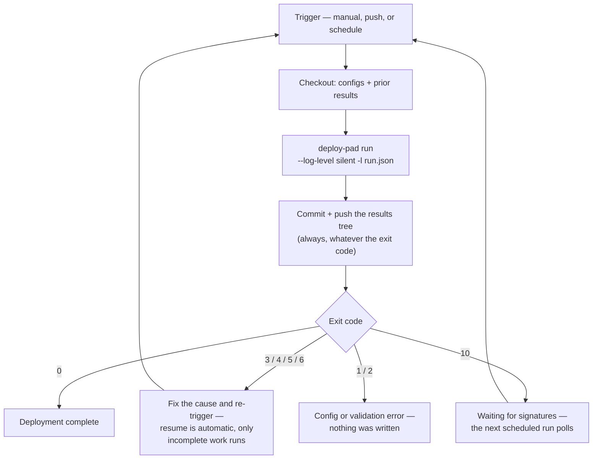

# Running in CI

How the engine is operated **unattended** — the invocation shape, where inputs come from, and the one thing a CI runner does not give you for free: a results tree that survives to the next invocation. The examples are GitHub Actions, which is the supported target; nothing here is Actions-specific except the YAML.

> **Position.** This doc owns the *operational* pattern. The CLI surface it uses is [cli.md](cli.md), the records it persists are [results.md](results.md), the credentials it exports are [secrets.md](secrets.md) (with the repository-token guidance in [engine-internals.md → GitHub Actions](engine-internals.md#github-actions)). Nothing here asks anything new of the engine: CI is the same invocation with a different source of environment.

## The premise: same config, different environment

A CI run is not a special mode. The engine has no CI flag, no CI-only behavior, and no interactive path to suppress — it never prompts, never waits for a human, and always ends in a meaningful exit code. So the whole of "running in CI" is three practical questions:

| Question | Answer |
|---|---|
| Where do the **configs** come from? | A directory in the repository the workflow checks out, passed as `--configs-dir` (default `workspace/configs`). The mount is the allowlist — what the job checks out is what that run can use. |
| Where do the **credentials** come from? | The job environment. Locally the `deploy-pad` wrapper sources `workspace/configs/.env`; in CI the workflow exports the same variable names from Actions secrets, and `${env.VAR}` / vault pointers resolve identically. |
| Where do the **results** go? | `--results-dir` (default `workspace/results`) — and on an ephemeral runner that directory disappears when the job ends, which is the one problem this doc exists to solve. |

## The unattended invocation shape

```bash
deploy-pad run -e my-plan --log-level silent -l run.json
```

Two sinks, two audiences ([cli.md → Common flags](cli.md#common-flags)): `--log-level silent` prints nothing at all, and `-l run.json` records the complete run at full `debug` detail. Nobody is watching the console, so the console is switched off and the file keeps everything. The outcome comes from two places:

- **The exit code**, for branching: `0` success, `10` multisig waiting, and one code per failure class ([cli.md → Exit codes](cli.md#exit-codes)).
- **[`summary.json`](results.md#summaryjson--the-machine-readable-summary)**, for pipelines that do more than branch: per-chain, per-step outcomes, warnings, and the pending multisig batches, in a stable shape.

Secrets stay redacted in both sinks at every level, so a log file is safe to upload as a build artifact.

## The problem: ephemeral runners forget

The engine's resume model is entirely file-based, and deliberately so ([phase 4](../architecture/phase-4-deployment-resolution.md)): re-running the same invocation continues an unfinished deployment, because `deployment.yaml`, `config_snapshot.yaml` and the `run-N.yaml` attempt records tell it what already happened. Three routine situations depend on those files still being there:

- A step failed (exit `4`), the cause was fixed, and the re-run should **retry only the incomplete work** rather than redeploy what succeeded.
- A multisig run exited **waiting** (exit `10`) and a later invocation must poll the same recorded proposals — `safeTxHash` / Merkle root are authoritative, and re-planning a batch owners may have already signed is exactly what must not happen ([multisig.md → Lifecycle & resume](multisig.md#lifecycle--resume)).
- An idempotent step should **replay its recorded outputs** instead of re-executing ([engine-internals.md → Idempotency lookup](engine-internals.md#idempotency-lookup)).

A hosted runner starts from a clean disk, so with nothing persisted every invocation looks like a first one: completed steps are executed again, and a Safe proposal from the previous job is orphaned while owners are still signing it. Partial persistence is its own trap — persist only successful runs and the *completed* deployments are what a later invocation sees, so it declines to reuse the id and starts `<id>-2` instead of resuming the unfinished launch ([phase 4](../architecture/phase-4-deployment-resolution.md#resolving-the-concrete-id)). Neither case produces an error message. **Persisting the results tree is therefore not an optimization — it is what makes unattended operation correct.**

## The pattern: commit the results tree back

Commit the results tree into the same repository that carries the configs, after every invocation, whatever its exit code. The repository then always holds the current state of every deployment, and the next job — scheduled, manual, or triggered — starts from it.

Three properties of the record model make this sound rather than merely convenient:

- **Records carry no secrets.** Redaction is mechanical, driven by the tag applied at resolution ([results.md → The three rules](results.md#the-three-rules)), and the guarantee is enforced by test, not by intent. Committing the tree publishes nothing that redaction did not already allow into a log.
- **Records are append-mostly and immutable.** A new `run-N.yaml` per invocation, `deployment.yaml` written once, `--restart` abandoning a directory rather than rewriting it. Merge conflicts are structurally rare, and a diff reads as what happened: a new attempt record, a confirmed address, a batch that moved to `executed`.
- **Records are relocatable.** The tree is keyed by workflow and deployment id, and holds no absolute paths or machine identity, so resuming from a fresh checkout on a different runner is the same operation as resuming on the machine that started it ([results.md → Designed for version control](results.md#designed-for-version-control)).

What you get beyond survival is the reason to prefer this over any external store: **git history becomes deployment history**, reviewable in the same diffs, in the same repository, next to the configs that produced it — the reviewability principle the config format already follows, extended to the engine's output.

### A worked workflow

```yaml
name: deploy
on:
  workflow_dispatch:
    inputs:
      plan:
        description: The plan to run
        required: true
  schedule:
    - cron: "*/30 * * * *"    # poll deployments waiting on signatures

# One invocation of one deployment at a time. Two concurrent runs would race on
# chain state, not just on git.
concurrency:
  group: deploy-pad-${{ inputs.plan || 'scheduled' }}
  cancel-in-progress: false

jobs:
  run:
    runs-on: ubuntu-latest
    permissions:
      contents: write          # to push the results tree back
    steps:
      - uses: actions/checkout@v5          # configs *and* prior results
      - uses: actions/setup-node@v5
        with:
          node-version: 24

      # A short-lived, repo-scoped token for cloning the deploy repos.
      - uses: actions/create-github-app-token@v2
        id: deploy-token
        with:
          app-id: ${{ vars.DEPLOY_PAD_APP_ID }}
          private-key: ${{ secrets.DEPLOY_PAD_APP_KEY }}
          owner: ${{ github.repository_owner }}

      - name: Run deploy-pad
        id: engine
        env:
          GH_DEPLOY_TOKEN: ${{ steps.deploy-token.outputs.token }}
          PK_REGULAR_DEPLOYER: ${{ secrets.PK_DEPLOYER }}
        run: |
          set +e
          npx --package=@deploy-pad/engine@2 deploy-pad run \
            -e "${{ inputs.plan }}" --log-level silent -l run.json
          echo "exit_code=$?" >> "$GITHUB_OUTPUT"

      # Always: a failed run and a waiting run both wrote records the next
      # invocation needs.
      - name: Persist the results tree
        if: always()
        run: |
          git config user.name  "deploy-pad[bot]"
          git config user.email "deploy-pad[bot]@users.noreply.github.com"
          git add workspace/results
          git diff --cached --quiet && exit 0
          git commit -m "deploy-pad: ${{ inputs.plan }} invocation [skip ci]"
          for attempt in 1 2 3; do
            git push && exit 0
            git pull --rebase
          done
          exit 1

      - name: Surface the outcome
        run: |
          code="${{ steps.engine.outputs.exit_code }}"
          if [ "$code" = "10" ]; then
            echo "Waiting for signatures — the next scheduled run will poll."
            exit 0
          fi
          exit "$code"

      - uses: actions/upload-artifact@v5
        if: always()
        with:
          name: run-log
          path: run.json
```

Six details in there are load-bearing, and each is a way people get this wrong:

- **`if: always()` on the commit.** The invocations whose records matter most are the ones that did not succeed. Committing only on success loses exactly the state a retry or a signature poll needs.
- **The engine major is pinned.** `@2` pins the config format the engine speaks, and the format gate is exact ([engine-internals.md → Config version check](engine-internals.md#config-version-check)) — an unpinned engine could start refusing a config set that a previous invocation of the same deployment accepted. (The `--package=` form is needed because the binary is `deploy-pad` while the package is `@deploy-pad/engine`; a workspace repository that declares the engine as a dev dependency simply runs `npx deploy-pad` instead, which pins through its lockfile.)
- **The engine's exit code is captured, not propagated immediately.** `set +e` plus a recorded exit code lets the commit step run before the job fails. Propagation happens at the end, in one place.
- **A `concurrency:` group.** Two invocations of one deployment overlapping is a chain-state hazard well before it is a git conflict; the group serializes them, and `cancel-in-progress: false` keeps a launch in flight from being killed by a scheduled poll.
- **`permissions: contents: write`.** This is about pushing to the workflow's *own* repository, which the automatic `GITHUB_TOKEN` can do. It is unrelated to cloning the deploy repos — that needs a different, broader-scoped credential, which is what the App token above is for ([engine-internals.md → GitHub Actions](engine-internals.md#github-actions)).
- **`[skip ci]` and the rebase-retry push.** The results commit must not retrigger the workflow that produced it, and it has to survive a human pushing a config change while a deployment was running. Path filters on the trigger are an equally good alternative to the marker.

Exit code `10` mapped to a green job is a deliberate choice, not laziness: waiting for signatures is the expected state of a multisig launch for hours or days, and a pipeline that alerts on it teaches its operators to ignore it. The scheduled trigger is what advances the deployment; `status` shows what is pending in the meantime.

### The loop this produces



### What to commit, and what never to

| Path | In git? | Why |
|---|---|---|
| `workspace/configs/` | yes | The launch inputs — reviewed like any other config. |
| `workspace/results/` | yes | The point of the pattern. Redacted by construction. |
| `workspace/configs/.env` | **never** | Real credentials. In CI the job environment replaces it entirely; locally it stays untracked. |
| `workspace/repos/` | **never** | Clones and build output — disposable, large, and re-created by every invocation ([phase 6](../architecture/phase-6-repo-prepare.md)). |
| `run.json` | no | Upload it as a build artifact. It is a per-invocation debugging record, not a durable deployment fact; `run-N.yaml` is the durable one. |

### Variants worth knowing

- **A dedicated results branch** (or a separate results repository), when a clean config branch matters more than one-checkout simplicity. Same pattern, plus a second checkout of the results branch into `--results-dir`. Consider it when config review noise from results commits becomes a real complaint — not before.
- **Caching `--repos-dir`.** Clones and builds are pure speed state: `actions/cache` is a good fit, and a cache miss costs time rather than correctness. Note that phase 6 re-installs and re-builds on every invocation by design, so the win is the clone and the package-manager cache, not the build.

## Alternatives, and why commit-back wins

| Option | Verdict |
|---|---|
| **Commit back to the repository** | **Recommended.** Durable, reviewable, no extra infrastructure, and the audit trail improves. |
| Build artifacts (`upload-artifact` / `download-artifact`) | Rejected for the results tree. Retention is capped (90 days by default) while a multisig deployment can legitimately wait longer, artifacts are scoped to a workflow run, and "fetch the latest results across runs" needs API work. Right for the `run.json` log. |
| `actions/cache` | Rejected for the results tree — a cache is best-effort and evictable, and silently losing deployment state is the one failure this must not have. Right for `--repos-dir`. |
| External object storage (S3 and friends) | Works, and is the honest answer at organization scale with many workspace repositories. Costs infrastructure and one more credential, and the records leave the reviewable-git world. |
| Self-hosted runner with a persistent workspace | Works with no changes at all, and is how a long-lived deployment host would be run. The trade is that deployment state now lives on one machine, which is an operational commitment rather than a design. |

## What the engine deliberately does not do

- **No git operations on the workspace repository.** The engine clones the *deploy* repositories it was told about ([phase 6](../architecture/phase-6-repo-prepare.md)); it never commits, pushes, or inspects the repository its configs came from. Persistence is workflow mechanics, so there is no `--commit-results` flag and no credential handed to the engine for that purpose.
- **No CI detection.** Nothing changes behavior when `CI=true`. The invocation shape above is the whole adaptation, and it is equally usable on a laptop.
- **No waiting for humans.** Signature collection happens outside the engine; a waiting run exits and any later invocation advances it ([multisig.md](multisig.md)).

## Common mistakes

- **Running in CI without persisting the results tree.** The first symptom is not an error — it is a re-run that redeploys instead of resuming, or a multisig deployment that proposes a second batch while the first still awaits signatures.
- **Committing only on success.** A failed or waiting invocation's records are precisely what the next one reads.
- **Treating exit `10` as a failure.** It is the waiting state; schedule a re-run instead of alerting ([cli.md → Common mistakes](cli.md#common-mistakes)).
- **Letting two invocations of one deployment overlap.** Use a `concurrency:` group; the hazard is chain state, not git.
- **Reaching for `${{ secrets.GITHUB_TOKEN }}` to clone the deploy repos.** It only reaches the workflow's own repository — enough to push results, not to clone anything else ([engine-internals.md → GitHub Actions](engine-internals.md#github-actions)).
- **Committing `workspace/repos/`** — disposable clones and build output, re-created every invocation.
- **Passing a credential on the command line.** No flag takes a credential value; credentials arrive through the environment ([secrets.md](secrets.md)).

## Relationships to other docs

| Doc | What it owns |
|---|---|
| [cli.md](cli.md) | The invocation itself: commands, flags, the exit-code table CI branches on, and the one-deployment-many-invocations model. |
| [results.md](results.md) | The records this doc persists — layout, shapes, the three rules, and why the tree is version-control-friendly. |
| [engine-internals.md](engine-internals.md#github-actions) | Repository authentication and the token choice for cloning private deploy repos. |
| [secrets.md](secrets.md) | How credentials enter (vault / env / plan) and why none of them ever appears in a record or a log. |
| [multisig.md](multisig.md) | The waiting state, the poll-and-advance resume, and why a proposed batch is never re-planned. |
| [phase-4-deployment-resolution.md](../architecture/phase-4-deployment-resolution.md) | The resume verdict that reads the persisted tree, and the freezes it enforces. |
| [phase-6-repo-prepare.md](../architecture/phase-6-repo-prepare.md) | What lands in `--repos-dir`, and why it is re-prepared every invocation. |
