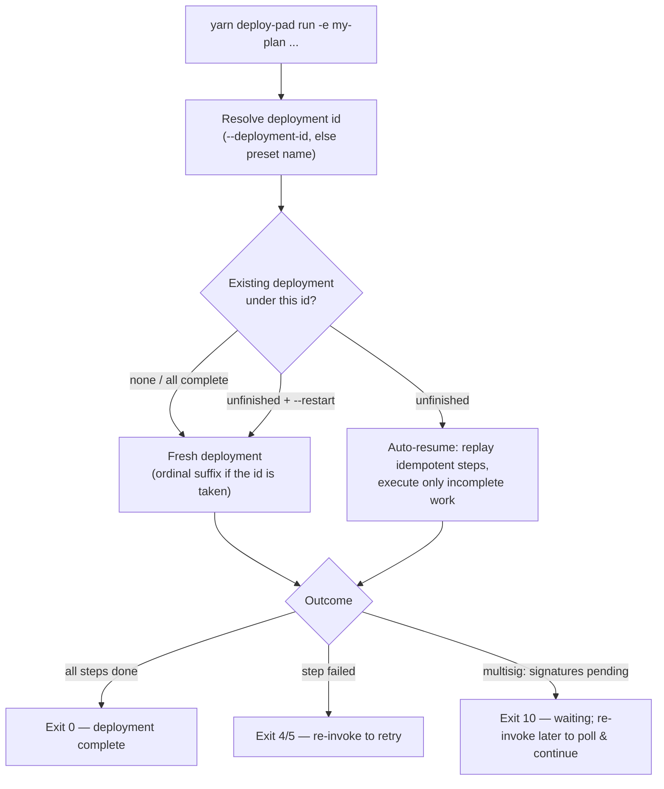

# CLI reference

The command-line surface of the deploy-pad engine — every command and every flag in one place. Other docs define the *semantics* behind individual flags (preset selection, deployment identity, sender mode, config versioning); this file is the consolidated reference and links back to each owning doc.

> **Naming.** The `-e` flag keeps its letter from v1, but its long name follows the v2 rename: `--plan` (v1: `--execution-config`). The v1 `-r, --run-id` flag is renamed `--deployment-id`. The full flag map is in [naming.md → CLI flags](naming.md#cli-flags).

## Invocation

```bash
yarn deploy-pad <command> [flags]
```

The root `deploy-pad` script is a wrapper: it sources `workspace/configs/.env` into the environment (so `${env.VAR}` references and vault-pointed env vars resolve) and then delegates to the engine CLI. Running the engine from CI works the same way — export the env vars in the workflow step instead, and keep the results tree alive between invocations (see [ci.md](ci.md)).

### Commands at a glance

| Command | What it does |
|---|---|
| [`run`](#run) | Execute a deployment: load the plan, validate everything, run the workflow's steps per chain. The only command that changes on-chain state. |
| [`validate`](#validate) | Load and validate all configs for a plan **without executing** — every validation rule the config docs list, plus cross-file checks. |
| [`status`](#status) | Inspect existing deployments under `workspace/results/` — per-deployment, per-chain step status, including the multisig *waiting* state. |
| [`report`](#report) | Generate a human-readable Markdown report for a deployment, aggregated across all its runs. |
| [`list`](#list) | List the workflows, actions, and plans the mounted configs declare. |

### Plan argument resolution

Every command that takes `-e, --plan <nameOrPath>` resolves it the same way:

- **Short name** (no `/`) — resolves to `workspace/configs/plans/<name>.yaml` (a trailing `.yaml` / `.yml` on the name is tolerated).
- **Path** (contains `/`) — used as-is, relative to the project root.

```bash
yarn deploy-pad run -e my-plan                          # workspace/configs/plans/my-plan.yaml
yarn deploy-pad run -e experiments/one-off-plan.yaml    # explicit path
```

### Exit codes

| Code | Meaning |
|---|---|
| `0` | Success — the invocation completed everything it set out to do. |
| `1` | Configuration error — a file failed to load or parse (including a [config version mismatch](engine-internals.md#config-version-check) without `--ignore-version`). |
| `2` | Validation error — configs loaded but failed a validation rule (see the *Validation rules* section of each config doc). |
| `3` | Repository error — clone, fetch, checkout, or dependency installation failed. |
| `4` | Step execution error — a step's command failed, or a declared output was missing. |
| `5` | Verification error — a contract verification failure surfaced as the run's outcome. |
| `6` | Preflight error — a `severity: error` preflight check failed before repository preparation: RPC endpoint unreachable or chain identity mismatch (the shipped `engine:rpc` check's two verdicts), an absent or wrong CREATE3 factory (`engine:create3-factory` — the factory fails to answer address computation), an insufficient payer balance (`engine:balance`, when promoted to `error`), or a failing operator check. *(Introduced by the [phase-5 preflight design](../architecture/phase-5-preflight.md).)* |
| `10` | Waiting — multisig mode only: the run exited cleanly in the *waiting for signatures* state ([multisig.md → Lifecycle & resume](multisig.md#lifecycle--resume)). Not a failure; re-run the same invocation later to poll and continue. Distinct from `0` so CI can tell "pending" from "done". |

### Common flags

Accepted by every command, except where the [flag matrix](#flags-by-command) narrows it (`--results-dir` applies only to the commands that touch the results tree). Flags are validated **per command**: each command accepts only the flags listed in its section plus the common set below, and any other flag is an invocation error (exit `1`) — never a silently ignored no-op. Passing `--multisig` to `status` or `--restart` to `report` errors immediately, before anything is loaded.

| Flag | Default | Description |
|---|---|---|
| `--log-level <level>` | `info` | Console output threshold — one ordered scale: `silent` · `error` · `warn` · `info` · `debug`. `debug` adds resolved values and per-phase detail; `error` prints errors only; `silent` prints **nothing at all** — the exit code, the log file, and the results tree carry everything. Secrets stay redacted at every level. |
| `-v, --verbose` | off | Sugar for `--log-level debug`. |
| `-q, --quiet` | off | Sugar for `--log-level error`. |
| `-l, --log-file <path>` | — | Additionally write structured (JSON) logs to a file — always at full `debug` detail, regardless of the console level. The console level filters what a human watches; the file is the complete record. `--log-level silent -l run.json` is the intended CI shape — paired with the machine-readable outcome in `summary.json` ([results.md](results.md#summaryjson--the-machine-readable-summary)) and the persistence pattern in [ci.md](ci.md). |
| `--configs-dir <path>` | `workspace/configs` | Root of the mounted config set — the directory containing `actions.yaml`, `workflows.yaml`, `plans/`, `known-chains.yaml`, `global-params.yaml`, `multisig.yaml`, and the optional `engine.yaml` ([engine.md](engine.md)). Mounting a trimmed directory is the sandboxing mechanism: the files you mount are the allowlist (see [multisig.md → The multisig registry](multisig.md#the-multisig-registry-multisigyaml)). |
| `--results-dir <path>` | `workspace/results` | Where deployment records are read and written. The tree is the cross-invocation contract — resume, replay and multisig polling all read it — so on an ephemeral CI runner it has to be persisted between invocations ([ci.md](ci.md)). |
| `--ignore-version` | off | Downgrade a [config format version](actions.md#top-level-fields) mismatch from a load-time error to a warning and proceed. The deliberate escape hatch for a file you've confirmed still validates against a different engine version — see [engine-internals.md → Config version check](engine-internals.md#config-version-check). |

At most one of `-v` / `-q` / `--log-level` may be given — they set the same value.

### Flags by command

The consolidated matrix of which flag each command accepts. Anything outside a command's column is an invocation error (exit `1`), never a silent no-op — see the per-command validation rule above.

| Flag | `run` | `validate` | `status` | `report` | `list` |
|---|---|---|---|---|---|
| `-e, --plan` | required | required | optional | required | — |
| `--preset` | ✓ | ✓ | — | — | — |
| `--set` / `--overrides` | ✓ | — | — | — | — |
| `--deployment-id` | ✓ | — | ✓ | ✓ | — |
| `--restart` | ✓ | — | — | — | — |
| `--refreeze` | ✓ | — | — | — | — |
| `-c, --chain` / `-xc, --exclude-chain` | ✓ | ✓ | ✓ | ✓ | — |
| `--chain-mode` | ✓ | — | — | — | — |
| `--multisig` | ✓ | ✓ | — | — | — |
| `--multisig-cancel` | ✓ | — | — | — | — |
| `--skip-verify` / `--verify-only` | ✓ | — | — | — | — |
| `--dry-run` | ✓ | — | — | — | — |
| `--skip-preflight` | ✓ | — | — | — | — |
| `--repos-dir` / `--cleanup` | ✓ | — | — | — | — |
| `-o, --output` / `--stdout` | — | — | — | ✓ | — |
| `--workflows` / `--actions` / `--plans` | — | — | — | — | ✓ |
| `--log-level` (and `-v, --verbose` / `-q, --quiet`) / `-l, --log-file` | ✓ | ✓ | ✓ | ✓ | ✓ |
| `--configs-dir` / `--ignore-version` | ✓ | ✓ | ✓ | ✓ | ✓ |
| `--results-dir` | ✓ | — | ✓ | ✓ | — |

Reading the boundaries: `validate` takes no `--deployment-id` or `--restart` because deployment identity is a phase-4 concern it never reaches; `status` and `report` take `--configs-dir` / `--ignore-version` because resolving `-e` still opens the plan file; `--results-dir` follows the commands that touch the results tree (`run`, `status`, `report`).

## `run`

Execute a deployment. Everything a run needs beyond the plan file itself — which preset, which deployment id, which chains, which sender — is decided here, at invocation time.

```bash
yarn deploy-pad run -e my-plan
yarn deploy-pad run -e my-plan --preset prod --chain mainnet,base
yarn deploy-pad run -e my-plan --multisig ops-main
```

### Plan and values

| Flag | Description |
|---|---|
| `-e, --plan <nameOrPath>` | **Required.** The plan to run — see [Plan argument resolution](#plan-argument-resolution). |
| `--preset <name>` | Select the active preset. Falls back to the plan's `default_preset`, then to the plan's only preset; with several presets and no selection the load errors. See [plans.md → Preset selection](plans.md#preset-selection). |
| `--set <KEY=VALUE>` | One-off constant override, repeatable. Merged into the selected preset's `defaults.constants` as a [deployment override](plans.md#deployment-overrides) — merge, not replace — and recorded in `deployment.yaml` so the launch stays reproducible. **Launch-time only**: on a resumed deployment it errors unless combined with `--refreeze` (the deployment's values are frozen at creation). |
| `--overrides <path>` | A YAML file with a full `Preset`-shaped overrides object (constants, secrets, deploy data, per-chain blocks) merged on top of the selected preset. The structured form of `--set`, for overrides that go beyond flat constants — same launch-time-only rule. See [plans.md → Deployment overrides](plans.md#deployment-overrides). |

### Deployment identity

| Flag | Description |
|---|---|
| `--deployment-id <id>` | Explicit deployment id (v1: `-r, --run-id`). Omitted, the id derives from the selected preset's name. Keys the results tree and `${system.DEPLOYMENT_ID}`. See [plans.md → Deployment id & re-runs](plans.md#deployment-id--re-runs). |
| `--restart` | Opt out of auto-resume: leave the unfinished deployment as-is (its records stay immutable) and start a **fresh deployment** from scratch — the way to relaunch with changed plan values or a changed workflow. Without it, an unfinished deployment under the resolved id resumes automatically. |
| `--refreeze` | On a resumed deployment: discard the [frozen parameter set](plans.md#deployment-id--re-runs), re-resolve from scratch as if this were the first run (the current plan, this invocation's `--set`/`--overrides`, fresh `${random.N}` values), and freeze the new resolution for subsequent invocations. Everything else about the resume is untouched — completed steps stay completed; only incomplete work runs, with the new values. The event is recorded in the attempt record. Without it, plan edits produce a warning and the recorded values win; `--set`/`--overrides` on a resume error. See [phase 4 → The parameter freeze](../architecture/phase-4-deployment-resolution.md#the-parameter-freeze-on-resume). |

There is no "resume" flag — resuming is the default. Re-running the same invocation continues an unfinished deployment; see [One deployment, many invocations](#one-deployment-many-invocations) below.

### Chain scope

| Flag | Description |
|---|---|
| `-c, --chain <names>` | Run only these chains (comma-separated). Every requested name must be in the **resolved** chain set — the plan's chains (a `$set` reference expanded) after the active preset's chain filter — otherwise the run errors (see [plans.md → Validation rules](plans.md#plan-identity-and-chains)). On a **resume**, this is also the deliberate way to include a chain that joined the plan's [chain set](plans.md#chain-sets-set) after the deployment started — the recorded chain list otherwise wins. |
| `-xc, --exclude-chain <names>` | The complement: run the resolved chain set minus these (comma-separated). Mutually exclusive with `--chain`. Excluding every chain is an error. |
| `--chain-mode <mode>` | How the per-chain loop runs and reacts to a failing chain. `sequential` (default) — chains run one after another in the plan's declaration order, and a chain failure **stops the whole run** (later chains are not started). `continue` — same sequential order, but a failed chain is recorded and the loop **moves on** to the next chain. `parallel` — all chains run concurrently, isolated from each other's failures. In `continue` / `parallel` the exit code reflects the worst chain. The multisig *waiting* state never stops a sequential run — only errors do. Full semantics: [run-lifecycle.md → Chain execution modes](../architecture/run-lifecycle.md#chain-execution-modes). |

### Sender mode

| Flag | Description |
|---|---|
| `--multisig <name>` | Deploy through a Gnosis Safe: selects a named entry from `multisig.yaml` and switches the run to multisig mode. Omitted = eoa mode. The entry name is recorded in `deployment.yaml`; **every later invocation of the same deployment must pass the same selector** (or `--restart`). See [multisig.md](multisig.md). |
| `--multisig-cancel` | Follow-up invocation that cancels the deployment's pending proposals: on the merkle backend, proposes a cancellation root for the pending root; on multisend, withdraws pending proposals from the Transaction Service queue. Recorded as another attempt. See [multisig.md → Backend: `merkle`](multisig.md#backend-merkle). |

### Verification

| Flag | Description |
|---|---|
| `--skip-verify` | Deploy without verifying. In eoa mode this clears the inline verification gate (`SYS_VERIFY` stays unset — [engine-internals.md → Verification](engine-internals.md#verification)); in multisig mode it skips the post-execution verify-only pass. |
| `--verify-only` | Verify contracts from a prior deployment without deploying anything: for every deploying step with a recorded address, run the verification machinery of the step's type against it. Useful when a verification failed inside an earlier run (explorer flakiness) or was skipped with `--skip-verify`. Requires an existing deployment under the resolved id. |

The two flags are mutually exclusive. Which verification profiles (and keys) a chain uses is not a CLI concern — the plan's `verifiers:` selector picks profiles from [known-chains.md](known-chains.md).

### Safety and escape hatches

| Flag | Description |
|---|---|
| `--dry-run` | Load, validate, resolve — then print what *would* execute (chains, step order, resolved methods, predicted deterministic addresses where computable) and exit without touching any chain or writing any results. The deployment id is resolved exactly as a real run would resolve it (the [phase-4 id-resolution part](../architecture/phase-4-deployment-resolution.md#the-ordering-subtlety-id-before-values) runs **read-only**), so id-derived salt bases — and the addresses derived from them — print truthfully. When the plan references a [chain set](plans.md#chain-sets-set), the chain list is printed **expanded**, alongside the set name — a set-referencing plan targets chains its file never names, so this is where the operator confirms the blast radius. (The run header of a real `run` prints the same expanded list.) Against an *unfinished* deployment, the dry run also prints the **frozen-vs-current parameter diff** — what a resume would warn about, inspectable before running. Distinct from multisig *planning*, which simulates steps and produces signable artifacts; a dry run only reports. |
| `--skip-preflight` | Skip the [phase-5 preflight checks](../architecture/phase-5-preflight.md) — every check in the effective engine config, the shipped checks included — for this invocation. A warning is printed and the skip is recorded in the run attempt. The emergency hatch for a *check* being wrong rather than the environment; not a routine flag — to turn off a single check persistently, disable it in [`engine.yaml`](engine.md) (`enabled: false`) instead. |
| `--ignore-version` | See [Common flags](#common-flags). |

### Environment and housekeeping

| Flag | Default | Description |
|---|---|---|
| `--repos-dir <path>` | `workspace/repos` | Where repositories are cloned and updated. |
| `--cleanup` | off | Delete the per-chain deployment run directories (`deployment-run/<chain>/` — all engine-written working files, `.env.automation` and friends) from the checkouts after a successful completion. |

## `validate`

Everything `run` checks before executing, without executing: config loading (including the [version check](engine-internals.md#config-version-check)), per-file validation rules, and the cross-file rules — plan → workflow → action references, chain names against known-chains, release-pin selection, salt/factory coverage for each step's resolved method, multisig entry coverage.

`validate` is fully offline: it reads only the config mount. In particular, `${system.DEPLOYMENT_ID}` resolves to the **preset-derived base id** with no results-tree probe — the ordinal suffix a real run might add has no bearing on validity ([phase 4 → The ordering subtlety](../architecture/phase-4-deployment-resolution.md#the-ordering-subtlety-id-before-values)).

```bash
yarn deploy-pad validate -e my-plan
yarn deploy-pad validate -e my-plan --preset prod --multisig ops-main
```

| Flag | Description |
|---|---|
| `-e, --plan <nameOrPath>` | **Required.** The plan to validate against. |
| `--preset <name>` | Validate with this preset active — preset choice changes what is validated (chain filter, constants, deploy data). Same fallback rules as `run`. |
| `-c, --chain <names>` / `-xc, --exclude-chain <names>` | Restrict the validated chain scope, same semantics as `run`. |
| `--multisig <name>` | Additionally run the multisig-mode checks for this entry: chain coverage, `supportsMultisig` on author-command deploying steps, no Hardhat 3 deploying steps. See [multisig.md → Validation rules](multisig.md#validation-rules--common-errors). |

Exit code `0` means the plan would load and pass validation; `2` reports the collected validation errors (all of them, not just the first). Warnings — salt fallbacks, missing `version` keys, verification off with `verify: true` steps — are printed but do not fail validation.

## `status`

Inspect what exists under the results directory: deployments per workflow, their chains, and per-step statuses.

```bash
yarn deploy-pad status                          # everything under workspace/results/
yarn deploy-pad status -e my-plan               # deployments of this plan's workflow
yarn deploy-pad status -e my-plan --deployment-id prod-2
```

| Flag | Description |
|---|---|
| `-e, --plan <nameOrPath>` | Filter to the workflow this plan points at. |
| `--deployment-id <id>` | Show one deployment in detail: per-chain, per-step status, timestamps, run attempts. |
| `-c, --chain <name>` / `-xc, --exclude-chain <names>` | Filter the chains shown. |

For a multisig deployment, `status` shows the batch progression (`planned` → `proposed` → `executed` → `collected`) and, for a deployment in the waiting state, what is pending and where to sign — the same summary the waiting `run` printed on exit. See [multisig.md → Lifecycle & resume](multisig.md#lifecycle--resume).

## `report`

Generate a Markdown deployment report — deployed addresses, per-step outcomes, constants used — aggregated across all run attempts of a deployment. The report reads only the results directory; it never touches a chain.

```bash
yarn deploy-pad report -e my-plan
yarn deploy-pad report -e my-plan --deployment-id prod --stdout
```

| Flag | Description |
|---|---|
| `-e, --plan <nameOrPath>` | **Required.** The plan whose workflow's deployment is reported. |
| `--deployment-id <id>` | Which deployment to report. Omitted, the id derives from the plan's selected preset, same as `run`. |
| `-c, --chain <names>` / `-xc, --exclude-chain <names>` | Chains to include (default: all chains of the deployment). |
| `-o, --output <path>` | Output file (default: `report.md` inside the deployment's results directory). |
| `--stdout` | Print to stdout instead of writing a file. |

## `list`

List what the mounted configs declare — the discovery command.

```bash
yarn deploy-pad list                # workflows, actions, and plans
yarn deploy-pad list --workflows    # workflows only
yarn deploy-pad list --actions      # actions only (FQ ids and aliases, grouped by repo/generation)
```

| Flag | Description |
|---|---|
| `--workflows` | Show only workflow ids (including method variants, marked as such). |
| `--actions` | Show only actions — fully-qualified ids (`<repoId>.<generationId>.<actionId>`), aliases, and types. |
| `--plans` | Show only plan files under `plans/`, each with its workflow — or, for a [single-action plan](plans.md#single-action-plans), its inline action — and preset names. |

## One deployment, many invocations

A **deployment** is one logical launch; an **invocation** is one CLI run. They are deliberately decoupled ([plans.md → Deployment id & re-runs](plans.md#deployment-id--re-runs)): a deployment routinely spans several invocations — a failed step retried, a multisig run waiting days for signatures — and each invocation is recorded as another `run-N.yaml` attempt inside the same deployment.



Rules worth internalizing:

- **Resume is automatic and flag-less.** The same invocation, repeated, continues an unfinished deployment. `--restart` is the only opt-out.
- **Idempotent steps replay** their recorded outputs on resume instead of re-executing ([engine-internals.md → Idempotency lookup](engine-internals.md#idempotency-lookup)); only incomplete work runs.
- **A completed id gets a suffix.** Re-running after completion starts `<id>-2`, `<id>-3`, … — every deployment keeps its own immutable results directory.
- **Multisig deployments must repeat their selector.** Every invocation of one multisig deployment passes the same `--multisig <name>`; a mismatch is an error naming the recorded entry ([multisig.md → Turning it on](multisig.md#turning-it-on--the---multisig-selector)).
- **The engine never waits for humans.** Signature collection happens outside the engine; a waiting run exits (code `10`) and any later invocation polls and advances. CI can simply re-trigger the same job — provided the results tree survived it ([ci.md](ci.md)).

## Relationships to other docs

| Doc | What it owns that the CLI exposes |
|---|---|
| [plans.md](plans.md) | Preset selection (`--preset` / `default_preset`), deployment identity (`--deployment-id`, `--restart`, ordinal suffixes), the parameter freeze and `--refreeze`, deployment overrides (`--set` / `--overrides`), the chain-scope validation rule for `--chain`. |
| [run-lifecycle.md](../architecture/run-lifecycle.md) | The end-to-end phase sequence a `run` invocation passes through, the chain execution modes behind `--chain-mode`, and the failure model mapping each phase to its exit-code class. |
| [multisig.md](multisig.md) | Sender mode (`--multisig`, `--multisig-cancel`), the waiting state, the resume rule, batch statuses shown by `status`. |
| [actions.md](actions.md) / [engine-internals.md](engine-internals.md) | The config `version` key and the `--ignore-version` escape hatch; the verification model behind `--skip-verify` / `--verify-only`; the idempotency replay behind flag-less resume. |
| [known-chains.md](known-chains.md) | Everything connection-related. Chain names passed to `--chain` are known-chains names; RPC and verification profiles — and [chain sets](known-chains.md#chain-sets) — are selected in the plan, never on the CLI. |
| [secrets.md](secrets.md) | Why no flag ever takes a credential value: secrets enter through the vault / env / plan chain and are tagged and redacted; the CLI only selects *names* (`--multisig`, `--preset`). |
| [ci.md](ci.md) | Running the same invocation unattended: the silent-console/log-file shape, credentials from the job environment, and keeping the results tree alive across invocations. |
| [naming.md](naming.md) | The v1 → v2 flag renames. |

## Common mistakes

- Passing a workflow id to `-e`. The flag takes a **plan** (name or path); the plan's `workflow:` field points at the workflow (or holds an inline single-action step — see [plans.md → Single-action plans](plans.md#single-action-plans)).
- Passing a run-only flag to a results-reading command (`status --multisig ops-main`, `report --restart`). Flags are validated per command — the invocation errors instead of ignoring the flag, so a flag you typed always either works or tells you it doesn't apply.
- Expecting `--preset` to *merge* presets. Presets are self-contained — selection replaces, never merges ([plans.md → Presets](plans.md#presets)). One-off tweaks on top of the selected preset are `--set` / `--overrides`.
- Using `--set` for a credential. Overrides merge into constants and are recorded (unredacted) in `deployment.yaml`; credentials belong in the preset's `secrets:` as `${vault.X}` refs.
- Passing `--chain mainnet` when the active preset's chain filter dropped `mainnet` — the requested chain must be in the **resolved** chain set, and the error is telling you the preset filtered it out.
- Expecting a resumed deployment to pick up a chain that joined the plan's chain set (`$set`) after the deployment started. Resume runs against the chain list recorded in `deployment.yaml`; the new chain is skipped with a warning unless you include it explicitly with `--chain`.
- Looking for a resume flag after a failure. There isn't one — re-run the same invocation; resume is the default and `--restart` is the opt-out.
- Editing the plan between invocations and expecting the resume to use the new values. The deployment's parameters froze at creation — the engine warns and continues with the recorded set; pass `--refreeze` to adopt the edit (or `--restart` to relaunch). Changed *structure* (workflow, actions) refuses resume outright — start a new deployment.
- Re-running an unfinished multisig deployment without `--multisig` (or with a different entry). The run errors, naming the recorded entry; pass the recorded selector, or `--restart` to abandon.
- Treating exit code `10` as a failure in CI. It is the multisig waiting state — schedule a re-run instead of alerting.
- Running unattended without persisting the results tree. On an ephemeral runner a lost `--results-dir` makes the next invocation blind: it starts a fresh deployment instead of resuming the unfinished one, and a pending multisig proposal is orphaned. See [ci.md](ci.md).
- Reaching for `--ignore-version` as a routine fix. It exists for a confirmed-compatible file during a migration window; a version mismatch normally means the file needs updating.
- Expecting `--verify-only` to work without a prior deployment. It verifies recorded addresses — there must be a deployment under the resolved id.
- Expecting `--dry-run` to produce signable multisig artifacts. It only prints; multisig planning (which simulates and captures transactions) is part of a real `run --multisig` invocation.
