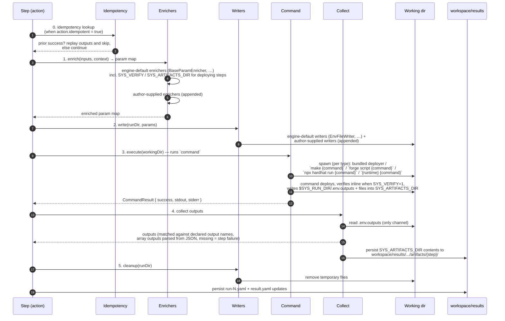

# Engine internals

Concepts that authors mostly cannot configure from YAML in v2 — the small set of authorable extension points is called out where it matters. This page documents the per-step lifecycle, the built-in components that participate in each phase, and the per-`type` × `deploys` wiring the engine selects automatically.

> **Scope.** This page zooms into a *single step*. The run-level sequence — from CLI invocation through config loading, repo prepare, and the per-chain execution loop to the final report — lives in [run-lifecycle.md](../architecture/run-lifecycle.md).

> **What is and isn't authorable.** Each action `type` selects a minimal required set of enrichers, writers, and a command class — wired automatically by the engine, not from YAML. Authors can **append** extra enrichers / writers on a specific action via the optional `enrichers` / `writers` fields ([actions.md → Authoring custom enrichers / writers](actions.md#authoring-custom-enrichers--writers)); the type defaults always run first. Custom command classes still require an engine code change.

## How the engine processes an action

Every step — action or virtual (after workflow flattening) — runs through the same phases. The `command` field is uniform across every command-driven `type` in v2 (`make`, `forge-script`, `hardhat2-script`, `hardhat3-script`, `script`); contract and module types use engine-owned machinery (bundled scripts, or a bundled Ignition wrapper on Hardhat 3) in place of the author's `command` field but otherwise follow the same shape, and `contract-call` runs no command at all — the engine performs the call in-process. Deploying steps additionally exchange data with their command through the [deployment interface](#the-deployment-interface): the engine passes `SYS_VERIFY` / `SEC_VERIFICATION_API_KEY` / `SYS_ARTIFACTS_DIR` in, and the command writes `.env.outputs` and artifact files out.



Phase-by-phase:

0. **Idempotency lookup** (only when `action.idempotent = true`). Before any other phase, the engine consults the prior-run index for `(workflow, deployment_id, chain, stepId)`. If the most recent recorded result is a success, the engine replays the recorded outputs and the step is marked replayed in the new run; the rest of the lifecycle is skipped. See [Idempotency lookup](#idempotency-lookup).
1. **Enrich.** A chain of `ParamEnricher`s builds the final param map. Before the enrichers run, each declared input's value is produced from its `mappings` entry — resolving sources, then applying the [transform / combine pipeline](#transforms) — so enrichers and writers see already-shaped values. Engine defaults run first in the order shown for each `type`; any entries from the action's `enrichers` array are appended in declaration order. For deploying steps this is also where the deployment-interface context is added: `SYS_ARTIFACTS_DIR` (the engine creates an empty per-step directory) and, when the [verification gates](#verification) pass, `SYS_VERIFY=1` + `SEC_VERIFICATION_API_KEY`.
2. **Write.** A list of `InputWriter`s serializes the param map to disk in whatever format(s) the command expects. Same engine-defaults-then-author-extras ordering as enrichers. Multiple writers can run for one type (e.g. `make` writes both `.env.automation` and `config/constants.json`). **Secret-tagged values (every `secrets:`-sourced value, whatever its form) are excluded from every writer's output** — they reach the subprocess via process env only. See [Vault resolution and secret tagging](#vault-resolution-and-secret-tagging).
3. **Execute (`command`).** A single `Command` instance runs the actual subprocess (or in-process action). The Command class is what `type` selects; the value of the action's `command` field is the script/recipe path passed to it. For deploying steps, the command does everything the deployment interface asks of it inside this phase: deploy, verify inline when `SYS_VERIFY=1`, write `.env.outputs`, drop artifacts into `SYS_ARTIFACTS_DIR`.
4. **Collect.** The engine reads `.env.outputs` — the only output channel for command-driven steps; framework deploy records (Foundry `broadcast/`, Hardhat `deployments/`) are never parsed. (`contract-call` steps are the one exception: the engine performs the call in-process and records decoded return values directly, no file involved.) Output keys get matched against the action's declared output names; an `array: true` output's value is parsed as a JSON array (malformed JSON fails the step). **A declared output missing from `.env.outputs` fails the step**. For deploying steps, the engine then persists the contents of `SYS_ARTIFACTS_DIR` to `workspace/results/.../artifacts/<step_id>/` (nothing is persisted when the directory is empty).
5. **Cleanup.** Writers remove their temp files; the engine persists `run-N.yaml` and updates `result.yaml`.

## The deployment interface

The engine does not parse framework deployment records (Foundry `broadcast/`, Hardhat `deployments/`) and does not run separate verification commands. Instead, a deploying action (`deploys: true` — [actions.md → The `deploys` flag](actions.md#the-deploys-flag)) and the engine communicate through a small explicit interface: the engine passes context **in** through environment variables, and the action's command writes its results **out** to two well-known places. The command keeps full control of how it deploys, verifies, and collects — it only has to comply with the interface.

**What the engine provides** (process environment, on top of the action's declared inputs):


| Variable                                                             | When                                                                                            | Meaning                                                                                     |
| -------------------------------------------------------------------- | ----------------------------------------------------------------------------------------------- | ------------------------------------------------------------------------------------------- |
| `SYS_CHAIN_ID`, `SYS_CHAIN_NAME`, `SYS_RPC_URL`, `SYS_DEPLOYMENT_ID` | Every step                                                                                      | Execution context.                                                                          |
| `SYS_RUN_DIR`                                                        | Every step                                                                                      | Absolute path to the chain's **deployment run directory** (`<checkout>/deployment-run/<chain>/` — [phase 7 → the deployment run directory](../architecture/phase-7-per-chain-execution.md#the-deployment-run-directory-per-chain-working-files)), where all engine-written files live: read inputs from `$SYS_RUN_DIR/.env.automation`, write results to `$SYS_RUN_DIR/.env.outputs`. |
| `SEC_PRIVATE_KEY`                                                    | Per the [private key rule](actions.md#the-deploys-flag)                                         | The signing key. Secret — injected under the `SEC_` prefix, redacted in all engine output.  |
| `SYS_VERIFY`                                                         | Set to `1` only when the action has `verify: true` **and** the plan's chain reference selects at least one verification profile (see [Verification](#verification)) | "Verify what you deploy in this run." Unset otherwise — the command must skip verification. |
| `SYS_VERIFICATION_API`, `SYS_VERIFIER_TYPE`                          | Alongside `SYS_VERIFY`                                                                          | The selected verification profile's API base URL and dialect (`etherscan` / `blockscout` / `sourcify`), from [known-chains.md](known-chains.md). |
| `SEC_VERIFICATION_API_KEY`                                           | Alongside `SYS_VERIFY` (omitted for keyless profiles)                                           | The selected verification profile's API key. Secret — injected under the `SEC_` prefix.     |
| `SYS_ARTIFACTS_DIR`                                                  | Every deploying step                                                                            | An empty, engine-created, per-step directory for artifacts (`$SYS_RUN_DIR/artifacts/<stepId>/`). |
| `SYS_MULTISIG`                                                       | Multisig planning mode only ([multisig.md → Planning phase](multisig.md#planning-phase))        | Set to `1`: "plan, don't broadcast." `SEC_PRIVATE_KEY` and `SYS_VERIFY` are **not** set in this mode. |
| `SYS_SENDER_ADDRESS`                                                 | Multisig planning mode only                                                                     | The Safe's address on this chain — who the command must simulate as (matters for anything `msg.sender`-dependent, e.g. caller-namespaced CREATE3 salts). |


**What the action must produce:**


| Output                       | Requirement                                                                                                                                                                                                                                                          |
| ---------------------------- | ---------------------------------------------------------------------------------------------------------------------------------------------------------------------------------------------------------------------------------------------------------------------- |
| `.env.outputs`               | A `KEY=value` file in the step's run directory (`$SYS_RUN_DIR/.env.outputs`) containing **every declared output** (typically the deployed addresses). Hard rule: a declared output missing from `.env.outputs` fails the step. Written by the action's `command`.     |
| Files in `SYS_ARTIFACTS_DIR` | ABI JSONs, deployment records — whatever is worth keeping. After the step succeeds, the engine persists the directory contents to `workspace/results/<workflow>/<deployment_id>/<chain>/artifacts/<step_id>/`. An empty directory is allowed (nothing is persisted). |
| `.deploy-pad-transactions.json` | **Multisig planning mode only** (`SYS_MULTISIG=1`): the planned-transactions file (`$SYS_RUN_DIR/.deploy-pad-transactions.json`) — the would-be transactions in execution order, with `.env.outputs` carrying *predicted* values. Deleted before the run, read at collect — the same discipline as `.env.outputs`. Format and semantics: [multisig.md → The planned-transactions artifact](multisig.md#the-planned-transactions-artifact). |


**Verification is inline.** When `SYS_VERIFY=1`, the command verifies as part of its own run — a Foundry script passes `--verify`, a make recipe invokes its verification target, a Hardhat wrapper calls `hardhat verify`. There is no separate engine-run verification phase; a verification failure is a step failure. Gating mechanics live in [Verification](#verification) below.

A minimal complying bash script (`type: script`, `deploys: true`):

```bash
#!/usr/bin/env bash
set -euo pipefail

VERIFY_FLAGS=""
if [ "${SYS_VERIFY:-}" = "1" ]; then
  VERIFY_FLAGS="--verify --etherscan-api-key $SEC_VERIFICATION_API_KEY"
fi

forge script scripts/Deploy.s.sol:Deploy --rpc-url "$SYS_RPC_URL" --broadcast $VERIFY_FLAGS

# Report results through the interface
ADDRESS=$(jq -r '.transactions[0].contractAddress' \
  "broadcast/Deploy.s.sol/$SYS_CHAIN_ID/run-latest.json")
echo "ESCROW_FACTORY_ADDRESS=$ADDRESS" > "$SYS_RUN_DIR/.env.outputs"
cp out/EscrowFactory.sol/EscrowFactory.json "$SYS_ARTIFACTS_DIR/EscrowFactory.abi.json"
```

**Who complies:**

- **Author-written commands** (`make`, `forge-script`, `hardhat2-script`, `hardhat3-script`, `script` with `deploys: true`) — the author's script or recipe fulfills the interface. There is no secondary collect command: the single `command` is responsible for `.env.outputs`. When an existing recipe or script can't be modified, wrap it (a new make target that runs the old one and then collects, or a `script`-type wrapper that chains deploy + collect).
- **Bundled contract and module types** (`forge-contract`, `hardhat2-contract`, `hardhat3-contract`, `hardhat3-module`) — the engine's own bundled machinery (deploy scripts; the Ignition wrapper on Hardhat 3) fulfills the same interface internally: it writes `.env.outputs`, drops the contract ABIs into the artifacts directory, and verifies inline when `SYS_VERIFY=1`. Authors configure nothing.
- **Non-deploying actions** use the same `.env.outputs` channel for their outputs — the deployment interface just adds the verification and artifacts surface on top of it.

## Verification

Whether a deploying step gets verified is decided by two switches that must **both** be on:

1. **The action's `verify` flag** ([actions.md → Deployment fields](actions.md#deployment-fields--when-deploys-true)). `verify` exists only on deploying actions and defaults to `false`. Setting `verify: true` on the action is the **only** opt-in — nothing in the plan or on the CLI can switch verification *on*.
2. **The chain has at least one selected verification profile.** The plan's chain reference selects profiles from [known-chains.md](known-chains.md) via its `verifiers:` selector (omitted = the chain's `default` profile, if declared; `verifiers: false` = explicit disable; a chain with no verification profiles has verification off). See [plans.md → ChainConfig fields](plans.md#chainconfig-fields).

Switching verification *off* has two more levers: `verifiers: false` on the plan's chain reference (per chain, persistent) and the CLI `--skip-verify` flag (whole invocation, one-off — [cli.md → Verification](cli.md#verification)).

When both gates pass, the engine does not run any verification command itself. It sets the verification context from the selected profile on the step's subprocess — that is the entire engine-side mechanism:


| Gates             | Env passed to the command                                                                                              | Expected command behavior                                          |
| ----------------- | ----------------------------------------------------------------------------------------------------------------------- | ------------------------------------------------------------------- |
| Both on           | `SYS_VERIFY=1`, `SYS_VERIFICATION_API=<profile api>`, `SYS_VERIFIER_TYPE=<etherscan\|blockscout\|sourcify>`, `SEC_VERIFICATION_API_KEY=<profile api_key>` (omitted for keyless profiles) | Verify inline as part of the run (e.g. `forge script --verify`)    |
| Either off        | None of these variables is set                                                                                          | Skip verification entirely                                          |

**Several selected profiles.** When the plan selects a list (`verifiers: [default, blockscout]`), the **bundled** contract/module machinery verifies against **each** selected profile in order — one verification pass per profile, each with that profile's `type`, `api`, and `api_key`; a failure of any pass fails the step. Author-written commands receive the **first** selected profile's context with the run (the command runs once and cannot be re-invoked per profile); verifying against the remaining profiles from a custom command is a known limitation of the interface today.


Verification happens **inline, inside the execute phase** ([deployment interface](#the-deployment-interface)): a Foundry script passes `--verify`, a make recipe invokes its verification target from within the deploy recipe, a Hardhat wrapper calls `hardhat verify`. The bundled contract and module types (`forge-contract`, `hardhat2-contract`, `hardhat3-contract`, `hardhat3-module`) implement the same contract in their bundled machinery (on Hardhat 3, via Ignition's `--verify` support); no author involvement.

**Trade-off to be aware of.** Because verification runs inside the step, a verification failure is a step failure — there is no separate retryable verify phase. Explorer verification can be flaky (rate limits, indexing lag), and re-verifying means re-running the step. Note that idempotency replay does not help here (it only replays prior *successes*), so a deploying command should be written to make the rerun safe: use a deterministic deployment method (CREATE2/CREATE3 land on the same address; the rerun is effectively verify-only), structure the command to deploy first and verify last, or handle transient verification errors with a retry inside the command itself.

## Built-in enrichers

Enrichers transform the partially-resolved param map by adding engine-managed values. Each `type` requires a minimal set, shown below in run order. **Author-supplied entries from the action's `enrichers` array are appended after the type defaults**, in declaration order ([actions.md → Authoring custom enrichers / writers](actions.md#authoring-custom-enrichers--writers)).

| Enricher | What it adds | When it runs |
|---|---|---|
| `BaseParamEnricher` | Engine context (`SYS_CHAIN_ID`, `SYS_CHAIN_NAME`, `SYS_RPC_URL`, `SYS_DEPLOYMENT_ID`, …), secrets (`SEC_PRIVATE_KEY` from `${secret.privateKey}`), the resolved deploy strategy for contract/module steps (`OPS_DEPLOYMENT_METHOD` / `OPS_CREATE2_SALT` / `OPS_CREATE3_FACTORY` / `OPS_CREATE3_SALT` — see [Deploy method & salt resolution](#deploy-method--salt-resolution)), and the type's **built-in parameters** resolved per the [built-in parameter resolution](#built-in-parameter-resolution) ladder (e.g. `OPS_CALL_ADDRESS` from `builtin.CALL_ADDRESS` for `contract-call` steps; PK injected only when the action sets `mode: send`). For deploying steps, adds the [deployment interface](#the-deployment-interface) context: `SYS_ARTIFACTS_DIR` (creating the empty per-step directory), and `SYS_VERIFY=1` + `SYS_VERIFICATION_API` + `SYS_VERIFIER_TYPE` + `SEC_VERIFICATION_API_KEY` (from the selected verification profile in known-chains) only when the [verification gates](#verification) pass — none is set otherwise. Secrets are injected under the `SEC_` prefix (distinct from the `SYS_` system-context prefix and the `OPS_` prefix used for the remaining params) and tagged for redaction. Resolves the per-step **rename** of `mappings.privateKey: <slot>` by reading `chains.<c>.secrets.<slot>` instead of the default `secrets.privateKey`. Carries forward each value's secret tag — entries sourced from `${vault.X}` arrive already tagged from the load phase and stay tagged here. | Every step. |
| `NativeContractEnricher` | Hardhat/Forge contract metadata: `OPS_CONTRACT_NAME`, `OPS_CONTRACT_PATH` (forge). | `forge-contract`, `hardhat2-contract`, `hardhat3-contract`. |
| `ForgeEncodedArgsEnricher` | ABI-encoded constructor args (`OPS_ENCODED_ARGS`). Reads the contract's ABI from `out/<basename>.sol/<Contract>.json` and encodes the user inputs in declared order. Array-valued inputs (`array: true`) are passed to the encoder as lists; a scalar `bytes` input produced by an `abiEncode*` [combine](#transforms) is encoded as that ABI type's value. | `forge-contract`. |
| `InputConstantsEnricher` | Substitutes literal values from the action's `inputConstants` map into the param map. Detects collisions with plan constants and workflow mappings (errors). | Every step that defines `inputConstants`. |

Author extension contract: a custom enricher is a class registered in `engine/pipeline/components/enrichers/` and exposed by name from the registry. It receives the (post-defaults) param map and may add or modify entries; it must not remove entries added by engine defaults.

> **Note on names.** The prefixed shapes that enrichers inject are an *engine-internal* convention for passing values into subprocess environment variables, split by role: `SYS_*` for system context, `SEC_*` for secrets, and `OPS_*` for the remaining engine-managed params (deploy strategy, contract metadata, `OPS_CALL_ADDRESS`) alongside author-declared inputs. From the YAML side, none of the engine-managed names are author-declared inputs — they're filled in here. Authors reach the system and secret values via `${system.*}` and `${secret.*}`.

## Built-in writers

Writers serialize the enriched param map to disk in the form the Command class needs. Each `type` requires a minimal set. **Author-supplied entries from the action's `writers` array are appended after the type defaults**, in declaration order.

| Writer | Output | Consumer |
|---|---|---|
| `EnvFileWriter` | `.env.automation` (KEY=value, shell-escaped). Used by every command type as the universal source for env vars. Array-valued inputs serialize as a single JSON-array string (e.g. `ORACLES=["0x..","0x.."]`); a scalar `bytes` value from an `abiEncode*` [combine](#transforms) writes as its `0x`-hex string. | All commands. |
| `ConstantsJsonWriter` | `config/constants-<chainId>.json` (camelCase keys, e.g. `LOP_ADDRESS` → `lop`; legacy `OPS_LOP_ADDRESS` also → `lop`). Chain-id keyed for `make` actions that load runtime constants from JSON. | `make` (some recipes). |
| `ConstructorArgsJsonWriter` | `config/constructor-args.json` (ordered array of typed values). Used by the bundled Hardhat 2 deploy script when ABI-encoding constructor args. Array-valued inputs are emitted as real JSON arrays (parsed from the input value); a `bytes` value from an `abiEncode*` [combine](#transforms) is emitted as its `0x`-hex string. | `hardhat2-contract`. |
| `IgnitionParamsJsonWriter` | `.deploy-pad-ignition-params.json` (named parameter map). For `hardhat3-contract`, keys follow the generated module's parameter names (one per input, in constructor order); for `hardhat3-module`, keys are the declared input names — Ignition modules read them via `m.getParameter(name)`. Array-valued inputs are emitted as real JSON arrays. Consumed by the bundled Ignition wrapper. | `hardhat3-contract`, `hardhat3-module`. |
Writers also implement `clean()` to remove their files in the cleanup phase. Author-supplied writers should follow the same `write` / `clean` contract.

## Built-in commands

A `Command` is a class implementing `prepare → execute → collect → cleanup`. One Command per `type`. Outputs come from `.env.outputs` for every type — the engine never parses framework deploy records.

| Command class | `type` | What it does | Output sources |
|---|---|---|---|
| `MakeCommand` | `make` | Runs `make <command>`. The recipe fulfills the deployment interface itself when `deploys: true` (writes `.env.outputs`, drops artifacts, respects `SYS_VERIFY`). | `.env.outputs` (written by the recipe). |
| `ForgeContractCommand` | `forge-contract` | Runs `forge script <bundled DeployPadCreate*.s.sol>` with chain RPC and broadcaster key. The engine selects the bundled script based on the resolved deployment method (see [Deploy method & salt resolution](#deploy-method--salt-resolution)). The bundled script is interface-compliant: it writes the address to `.env.outputs`, drops the ABI (from `out/<basename>.sol/<Contract>.json`) into `SYS_ARTIFACTS_DIR`, and verifies inline when `SYS_VERIFY=1`. | `.env.outputs` (written by the bundled script). |
| `Hardhat2ContractCommand` | `hardhat2-contract` | Runs `npx hardhat run <bundled __deploy-pad-create*.js>` with the user's network configuration. The engine selects the bundled script based on the resolved deployment method. The bundled script is interface-compliant: it writes the address to `.env.outputs`, drops the ABI (from `artifacts/contracts/.../<Contract>.json`) into `SYS_ARTIFACTS_DIR`, and verifies inline when `SYS_VERIFY=1`. | `.env.outputs` (written by the bundled script). |
| `Hardhat3ContractCommand` | `hardhat3-contract` | Generates a minimal single-contract Ignition module from the action's `contract` + ordered `inputs`, then runs the bundled Ignition wrapper, which deploys it via `hre.ignition.deploy` with the strategy mapped from the resolved method (`create` → basic, `create2` → create2 + resolved salt; `create3` is rejected earlier, at pre-run validation). The wrapper is interface-compliant: address to `.env.outputs`, ABI to `SYS_ARTIFACTS_DIR`, inline verification when `SYS_VERIFY=1`. | `.env.outputs` (written by the bundled wrapper). |
| `Hardhat3ModuleCommand` | `hardhat3-module` | Runs the bundled Ignition wrapper against the authored module named in `module`: loads it, passes `inputs` **by name** as module parameters (from `.deploy-pad-ignition-params.json`), and calls `hre.ignition.deploy(module, ...)` — results come from the deploy call's return value, never from Ignition journal files. Strategy mapped from the resolved method as for `hardhat3-contract`. The wrapper writes one `.env.outputs` entry per returned contract (named by return-object key), drops each returned contract's ABI into `SYS_ARTIFACTS_DIR`, and verifies inline when `SYS_VERIFY=1`. | `.env.outputs` (written by the bundled wrapper; one entry per returned contract). |
| `ForgeScriptCommand` | `forge-script` | Runs `forge script <command>` with the configured `function` (default `run()`). When `deploys: true`, the author's script fulfills the deployment interface. | `.env.outputs` (written by the script). |
| `Hardhat2ScriptCommand` | `hardhat2-script` | Runs `npx hardhat run <command>` with the Hardhat 2 toolchain. To invoke a Hardhat task, the `command` script wraps `hre.run("<task>", ...)`. When `deploys: true`, the author's wrapper fulfills the deployment interface. | `.env.outputs` (written by the wrapper). |
| `Hardhat3ScriptCommand` | `hardhat3-script` | Runs `npx hardhat run <command>` with the Hardhat 3 toolchain (the wrapper uses `network.connect()` for network access instead of Hardhat 2's preconfigured global `hre`). When `deploys: true`, the author's wrapper fulfills the deployment interface. | `.env.outputs` (written by the wrapper). |
| `ScriptCommand` | `script` | Runs `<runtime> <command>` (`runtime` defaults to `bash`; one of `bash` / `node` / `tsx` / `ts-node`). When `deploys: true`, the author's script fulfills the deployment interface. | `.env.outputs` (written by the script). |
| `ContractCallCommand` | `contract-call` | Performs the call **in-process** — no subprocess, no bundled script, no repo toolchain involvement. Parses the action's cast-style `signature` into an ethers interface, encodes the ordered args (from `inputs`), and issues the call against the resolved `builtin.CALL_ADDRESS` built-in parameter (see [Built-in parameter resolution](#built-in-parameter-resolution)) over the chain's RPC URL: a static `eth_call` when `mode: call` (default), or a signed transaction when `mode: send` (signer built from `${secret.privateKey}`; awaits the receipt — a reverted tx fails the step). The key never leaves the engine process: no env handoff, no writer files, no argv. | `mode: call`: decoded return values recorded directly by the command, mapped positionally to declared outputs (no `.env.outputs` round-trip). `mode: send`: none (tx hash and receipt status are logged only). |

## Per-`type` × `deploys` wiring table

The minimal required wiring the engine applies per `type`. Order in the enrichers / writers columns is the order they run. **Author-supplied entries from the action's `enrichers` / `writers` arrays are appended after these type defaults** for any action.

| `type` | `deploys` | Default enrichers | Default writers | Command |
|---|---|---|---|---|
| `forge-contract` | `true` (fixed) | `BaseParamEnricher`, `NativeContractEnricher`, `ForgeEncodedArgsEnricher` | `EnvFileWriter` | `ForgeContractCommand` |
| `hardhat2-contract` | `true` (fixed) | `BaseParamEnricher`, `NativeContractEnricher` | `EnvFileWriter`, `ConstructorArgsJsonWriter` | `Hardhat2ContractCommand` |
| `hardhat3-contract` | `true` (fixed) | `BaseParamEnricher`, `NativeContractEnricher` | `EnvFileWriter`, `IgnitionParamsJsonWriter` | `Hardhat3ContractCommand` |
| `hardhat3-module` | `true` (fixed) | `BaseParamEnricher` | `EnvFileWriter`, `IgnitionParamsJsonWriter` | `Hardhat3ModuleCommand` |
| `make` | `true` | `BaseParamEnricher` | `EnvFileWriter`, `ConstantsJsonWriter` | `MakeCommand` |
| `make` | `false` | `BaseParamEnricher` | `EnvFileWriter`, `ConstantsJsonWriter` | `MakeCommand` |
| `forge-script` | `true` | `BaseParamEnricher` | `EnvFileWriter` | `ForgeScriptCommand` |
| `forge-script` | `false` | `BaseParamEnricher` | `EnvFileWriter` | `ForgeScriptCommand` |
| `hardhat2-script` | `true` | `BaseParamEnricher` | `EnvFileWriter` | `Hardhat2ScriptCommand` |
| `hardhat2-script` | `false` | `BaseParamEnricher` | `EnvFileWriter` | `Hardhat2ScriptCommand` |
| `hardhat3-script` | `true` | `BaseParamEnricher` | `EnvFileWriter` | `Hardhat3ScriptCommand` |
| `hardhat3-script` | `false` | `BaseParamEnricher` | `EnvFileWriter` | `Hardhat3ScriptCommand` |
| `script` | `true` | `BaseParamEnricher` | `EnvFileWriter` | `ScriptCommand` |
| `script` | `false` | `BaseParamEnricher` | `EnvFileWriter` | `ScriptCommand` |
| `contract-call` | `false` (fixed) | `BaseParamEnricher` | — (in-process; no files written) | `ContractCallCommand` |

`InputConstantsEnricher` (when present) runs once per step that has any `inputConstants`, after the type defaults shown above and before any author-supplied entries; it is omitted when the action declares no `inputConstants`.

The `deploys` flag does not change the enricher/writer set in v2 — it changes which interface contract the command must fulfill: deploying steps receive the [deployment interface](#the-deployment-interface) env context (`SYS_VERIFY`, `SEC_VERIFICATION_API_KEY`, `SYS_ARTIFACTS_DIR`) from `BaseParamEnricher` and must report every declared output via `.env.outputs`; and the `verify` field is only valid on them. The `requiresPrivateKey` opt-in (non-deploying actions only) tells `BaseParamEnricher` whether to provide `SEC_PRIVATE_KEY` to non-deploying commands; on `contract-call` the action's `mode` field plays that role instead (`send` injects PK, `call` does not).

## Authoring enrichers and writers

Each action `type` defines the **minimal required** enrichers and writers for that type (see [Per-`type` × `deploys` wiring table](#per-type--deploys-wiring-table)). Authors append extras per action via the `enrichers` / `writers` YAML fields — they cannot remove, reorder, or replace the type defaults.

> **Decided, design pending.** The same registered-component model extends to the **collect side** (artifact/ABI collection) and to **verification** — per-type engine defaults first, author extras appended ([design-decisions.md → Pluggable step components](design-decisions.md#pluggable-step-components-collectors-and-verifiers)). The component contracts land with the step-lifecycle architectural design; until then, this page describes collect and verification as engine-fixed behavior.

Author extension is the only way to add engine-side per-step computation in v2 short of editing the engine's built-in wiring. The contract:

- **Where they live.** Each component is a TypeScript class in `engine/pipeline/components/enrichers/` or `engine/pipeline/components/writers/`. Each is registered by string name (the same name authors put in `enrichers: [...]` / `writers: [...]`).
- **Discovery.** The registry maps name → constructor; an author entry that does not match a registered name is a validation error at config load.
- **Order.** The type's required enrichers / writers always run first, in the table-defined order. Author entries run after, in declaration order. There is no way to reorder or remove the type defaults from YAML.
- **Failure.** Any enricher or writer can throw; the engine treats this as a step failure, the same as a failed command. Failures during enrichment never write to the run directory.
- **Idempotency.** Custom enrichers and writers should be deterministic given the same inputs (the engine may invoke them again on retry / replay if the action is `idempotent: true` and a prior success record is missing).
- **Secret tags must be respected.** The param map carries per-key secret tags ([Vault resolution and secret tagging](#vault-resolution-and-secret-tagging)). Custom enrichers may **read** tagged values to compute derived data, but any value they add to the param map that is itself sensitive must be marked tagged via the `ParamMap.setTagged(key, value)` helper — otherwise it leaks to writers and logs. Custom writers must check the tag map and **skip tagged keys**; the base writer interface exposes a helper for this. The engine does not enforce these contracts at runtime — they are author obligations, the same way `idempotent: true` is.

## Transforms

Each declared input's value is produced from its `mappings` entry during input resolution (`engine/pipeline/input-resolver.ts`), **before** the [enrichers](#built-in-enrichers) run — so every enricher and writer sees the final, shaped value. Three orthogonal transform axes apply. Author surfaces: [actions.md → Input shape](actions.md#input-shape-arity-and-encoding-transforms) and [workflows.md → Production pipeline](workflows.md#production-pipeline-transforms-combine-and-split); design rationale: [design-decisions.md → Value transforms](design-decisions.md#value-transforms).

### Three registries

- **Extraction (`pick`, array→scalar)** — split one element out of an array-valued resolved source. The mapping's index sugar `stepId.OUTPUT[i]` desugars to `{ from: stepId.OUTPUT, pick: i }`. No registry of ops — `pick` takes a non-negative integer literal. The source must resolve to an internal list (an `array: true` step output, or a JSON-array plan constant parsed by `engine/utils/array-values.ts`); out-of-range indexes fail at resolution time with an error naming the step, output, index, and actual length.

- **Encoding transforms (1→1)** — coerce a single value's form. Bounded registry:

  | Name | Output | Implementation |
  |---|---|---|
  | `salt` | `bytes32` (`0x` + 64 hex) | `0x` + exactly 64 hex chars → verbatim; malformed `0x` → error; any other string → `keccak256(utf8Bytes(string))`. (Same rule as the deploy salt, applied here at the engine layer.) |
  | `keccak256` | `bytes32` | `keccak256(utf8Bytes(string))`, always. |

- **Structural transforms (N→1, `combine`)** — assemble multiple resolved sources into one input value. All implemented via `ethers` (v6):

  | `combine` | Output | Engine call |
  |---|---|---|
  | `array` | list | The sources collected into a list (no `ethers` call). Serialized per writer (JSON-array string in `.env`, real array in JSON writers). |
  | `abiEncode("t1,t2,...")` | `bytes` | `AbiCoder.defaultAbiCoder().encode(types, values)`. |
  | `abiEncodePacked("t1,t2,...")` | `bytes` | `ethers.solidityPacked(types, values)`. |
  | `abiEncodeWithSignature("fn(t1,t2)")` | `bytes` | `iface = new ethers.Interface(["function " + sig]); iface.encodeFunctionData(fnName, values)` — the 4-byte selector (`keccak256(sig)[:4]`) followed by the ABI-encoded args. |

### Combine argument parser

The `combine` string is parsed into an op name and a parenthesized argument:

- `array` — no argument.
- `abiEncode` / `abiEncodePacked` — the argument is a **comma-separated type list** (`"address,uint256,bytes32"`), split into an array of Solidity type strings passed positionally with the resolved source values.
- `abiEncodeWithSignature` — the argument is a **full function signature** (`"initialize(address,bytes32)"`). The function name and parameter types are taken from the signature; the types drive `abi.encode` and the name + types drive the **selector**. The values are untyped strings — `ethers` coerces each to its declared type.

The encode variants need the explicit argument because deploy-pad values flow as untyped strings and the destination `bytes` input is opaque (no ABI type is recoverable from either side).

### Application order

For an input `K` whose mapping is a pipeline, the value is composed as `final = actionTransform( combine( perSourceTransform( pick(source_i) ) ) )`:

1. **Resolve each source** in `from` (step output ref or constant/secret rename).
2. **Per-source pick** — if the source carries a `pick` (or `[i]` sugar), extract that element from the resolved list. The result is a scalar.
3. **Per-source encoding** — apply each source's `transform` chain (left to right). Adaptation only.
4. **Combine** — apply the mapping's `combine` (only when `from` is a list). Produces a list (`array`) or a `0x`-`bytes` string (`abiEncode*`).
5. **Action transform last** — if the consuming input declares a `transform`, apply it to the single produced scalar value. This composes even after a `bytes`-producing combine (e.g. `keccak256(abiEncode(...))`).

**No override.** The action's declared `transform` is authoritative and always applied last; workflow per-source transforms can only *add* coercions before it. There is no mechanism to disable or replace the action transform from a workflow.

### Validation

Enforced in `shared/src/validation.ts` (workflow load) and at input resolution:

- **Action `transform` is scalar-only** — rejected on an `array: true` input (per-element encoding belongs to the workflow per-source).
- **`combine` output type vs. input arity** — `array` (and the bare list form) requires `array: true`; `abiEncode*` require a scalar `bytes` input (`array: false`).
- **Source count vs. argument count** — the number of sources must match the type list / signature parameter count.
- **A scalar `from` into an `array: true` input with no `combine`, or a list `from` into a scalar input with no `combine`**, is an error.
- **`pick` / `[i]` on a non-array source** is an error; an array-valued source into a scalar input without a `pick` is an error; the index must be a non-negative integer literal (out-of-range fails at resolution time).
- **A source's `transform` is encoding-only** — a `combine` cannot nest inside a single source.

### Serialization handoff

- **Arrays** — held internally as a list and serialized per writer: a single JSON-array string for `EnvFileWriter` (`ORACLES=["0x..","0x.."]`), a real JSON array for `ConstructorArgsJsonWriter` / `IgnitionParamsJsonWriter`. A plan constant supplied as a JSON-array string is parsed into the same internal list when its consuming input is `array: true` (`engine/utils/array-values.ts`). The same convention runs in the **output** direction: a command reports an `array: true` output as a JSON-array string in `.env.outputs`, and the collect phase parses it back into an internal list (available downstream whole, or per element via a mapping `pick`).
- **`bytes` from a combine** — a `0x`-hex string that flows like any other scalar: for `forge-contract` it reaches `ForgeEncodedArgsEnricher`, which ABI-encodes it as the constructor's `bytes` argument; for the Hardhat types it is written as the value of the corresponding parameter and consumed by the bundled deploy/Ignition machinery.

## Deploy method & salt resolution

Contract- and module-type steps (`forge-contract`, `hardhat2-contract`, `hardhat3-contract`, `hardhat3-module`) resolve a deployment **method** and, for `create2` / `create3`, a **salt** (and, for `create3`, a **factory**). The method is resolved entirely from the workflows file (step `method` plus any [method variant](workflows.md#method-variants--variantof) overrides); the salt/factory data comes from the plan's per-chain `deploy` block (`salts` / `factories` / `saltBase`, all keyed per step id). `BaseParamEnricher` combines the two.

### Method precedence

For a step on chain `c`, the method is resolved in this order (the step id is the resolved, possibly dotted, id used everywhere else):

1. **Variant `chains.<c>.methods.<stepId>`** — chain-specific per-step override (when the plan's `workflow` is a variant).
2. **Variant `chains.<c>.methods."*"`** — chain-specific wildcard (every contract/module step).
3. **Variant `methods.<stepId>`** — chain-agnostic per-step override.
4. **Variant `methods."*"`** — chain-agnostic wildcard.
5. **Step `method`** — the base workflow's declared method for this contract.
6. **`create`** — the default when none of the above resolves (plain CREATE needs no salt or factory).

For a plain (non-variant) workflow only the last two apply. Resolution is fully static — given a workflow id and a chain, every step's method is known at load time, before the plan is consulted — and it never fails: an *absent* method falls back to `create`, and there are no cross-layer conflicts to warn about (a variant's override *is* the method, by construction). The only method-related failures are load-time validation of the variant itself ([workflows.md → Method variants](workflows.md#method-variants) validation) and missing strategy data for a resolved `create2` / `create3` (see below).

A variant can also override which **secret slot** signs a step (its `keys` map — e.g. a method flip to plain CREATE demanding a same-nonce wallet). The effective slot resolves analogously (no wildcard): variant `chains.<c>.keys.<stepId>` → variant `keys.<stepId>` → the base step's `mappings.privateKey` rename → the default `privateKey` slot. `BaseParamEnricher` then reads `chains.<c>.secrets.<slot>` for `SEC_PRIVATE_KEY` exactly as it would for a workflow-level rename; a missing slot is the standard "secret X not found" step-input-resolution error.

### Salt resolution

For a `create2` / `create3` step, the salt is resolved per step id in this order:

1. **Explicit** — `chains.<c>.deploy.salts[stepId]` is set. The value is **normalized**: if it starts with `0x` it is used as the salt bytes verbatim (a brute-forced vanity salt lands the same address everywhere); any other string is `keccak256(string)`. No warning.
2. **`saltBase` fallback** — no explicit salt but `chains.<c>.deploy.saltBase` is set. The engine uses `derive(saltBase, stepId)` and emits a validation **warning** naming the step + chain (the address is derived from `saltBase`, not a brute-forced vanity address).
3. **Random default** — neither is set. The engine uses a default `saltBase` of `keccak256(${random.32})`, `derive`s from it, and emits a stronger validation **warning** that the salt is **random and changes from deployment to deployment** (addresses are not reproducible across runs).

`derive` is deterministic and **chain-independent** (it combines `saltBase` with the step id; if the combined value is not already `0x`-hex, it is keccak256'd), so a derived CREATE3 address is the same across chains and distinct steps never collide. A salt therefore always resolves; only a missing `create3` factory is a hard error (`create` needs no salt). Because a chain-aware variant can resolve different methods on different chains, which steps need a salt/factory is decided **per chain after** [method resolution](#method-precedence).

### Required-data check (validation before run)

Also enforced in [plans.md → validation](plans.md#validation-rules--common-errors):

| Resolved method | Also required | Notes |
|---|---|---|
| `create` | (none) | Plain CREATE; no salt/factory. On Hardhat 3 types maps to Ignition's basic strategy. |
| `create2` | a salt — always resolves (explicit `salts[stepId]`, else `saltBase`-derived + warning, else random-default + warning) | On Hardhat 3 types maps to Ignition's create2 strategy. |
| `create3` | `chains.<c>.deploy.factories[stepId]` + a salt (resolved as for `create2`) | Missing factory → error (no factory fallback). **Not supported on `hardhat3-contract` / `hardhat3-module`** — Ignition has no create3 strategy; `create3` resolving on a Hardhat 3 step fails this pre-run validation with an error naming the step and chain. |

The engine injects the resolved values into the param map under the engine-internal names `OPS_DEPLOYMENT_METHOD`, `OPS_CREATE2_SALT`, `OPS_CREATE3_FACTORY`, `OPS_CREATE3_SALT` (filled per resolved method) and selects the appropriate bundled deployer script in `ForgeContractCommand` / `Hardhat2ContractCommand` (on the Hardhat 3 commands, the Ignition strategy instead).

## Built-in parameter resolution

Each action type's provider declares its **built-in parameters** in engine code — a list of `{ name, required, default? }` entries (the v2 analog of v1's `AtomicTargetFactory.getBuiltInInputs`). Authors never declare them; the engine merges them into the step's effective input set, keyed as `builtin.<NAME>` ([references.md → built-in command parameters](references.md#built-in-command-parameters-builtin-names)). Today `contract-call` declares the only one: `builtin.CALL_ADDRESS` (required), consumed in-process by `ContractCallCommand` as the call's target address. Future engine-native types declare theirs the same way — the resolution machinery below is type-agnostic.

For every built-in the type declares, `BaseParamEnricher` resolves the value with the same ladder as an ordinary input:

1. **Per-step `mappings`.** A `mappings: { builtin.<NAME>: <stepId.OUTPUT> }` step output ref (the typical wiring), a bare-name rename into plan `constants`, or a production-pipeline value (`transform` / `combine` / `pick`).
2. **The per-chain resolved constant under the literal `builtin.<NAME>` key** when no mapping is set (a shared fallback across all unmapped steps of the type).
3. **The type-declared `default`**, for optional built-ins.
4. **Otherwise** → for a `required` built-in, a step-input-resolution error naming the parameter, the step, the type, and the chain.

Workflow validation independently rejects (load-time error) any `builtin.` mapping key that the step's action type does not declare — the engine knows each type's set, so an undeclared name is always an authoring mistake.

## Config version check

**Every config file** carries a reserved top-level `version` key — the **config format version** the file is written against (current: `2`): `actions.yaml`, `workflows.yaml`, the plan, `known-chains.yaml`, `global-params.yaml`, `multisig.yaml`, and `engine.yaml` when mounted. In the map-shaped files the key is excluded from the name space (a chain cannot be named `version` in known-chains, a repo or workflow id cannot be `version` in actions/workflows — the same reservation mechanism as known-chains' `sets`). The engine itself declares which format version it supports, and the loader compares each file's `version` against it as its very first step on that file, before schema validation. The same rules apply per file:

- **Match** — silent; loading continues.
- **Mismatch** — by default a **load-time error** that aborts the run, naming the file and both versions, e.g. `actions.yaml declares config version 1 but this engine supports version 2 — re-run with --ignore-version to proceed anyway`. With `--ignore-version`, the same condition is **downgraded to a warning** and loading continues (`… proceeding because --ignore-version was passed; validation errors below may be caused by the format gap`).
- **Missing `version`** — always a warning recommending the key be added, regardless of `--ignore-version`. The engine has no declared version to compare, so it cannot conclude a mismatch; loading continues.

`--ignore-version` is a single run-level flag — it downgrades the mismatch gate on **every** config file the engine loads, not one file at a time.

Why a mismatch is an error by default (a change from the v1 warning-only behavior):

- The format version is about the **shape of the file**. When the engine knows the file was written against a different format, the safest default is to **stop before deploying** rather than risk silently misinterpreting fields that moved or changed meaning between versions.
- The `--ignore-version` flag is the deliberate escape hatch: a file that was written for a newer engine but happens to still validate, or an old file you've confirmed is still compatible, runs with `--ignore-version` and emits the warning instead. When the shape is genuinely incompatible, schema validation still fails immediately after with precise errors — the warning makes those explainable ("old file, new engine") rather than mysterious.

The version comparison is exact (`!==`), not a range check — the format version is a single integer bumped on breaking format changes, and the engine supports exactly one at a time. `--ignore-version` only affects the version-mismatch gate; it does not relax schema validation or any other load-time check.

## Release pin checkout

How the engine resolves a **release pin** (the git ref on the release the plan selected for a generation) at **repo-prepare** time. Each pin is cloned or fetched into its own directory, `workspace/repos/<repoId>/<generationId>/<releaseId>/`, so different generations — and different pins of one generation — never share a working tree. See [actions.md → Generations](actions.md#generations--the-stable-interface), [actions.md → Release pins](actions.md#release-pins), and [plans.md → Release selection](plans.md#release-selection).

### Pin selection (load time)

The plan's `releases:` map selects, per `<repoId>.<generationId>`, which release id to run. A generation not listed there falls back to the pin flagged `latest`. If a generation in use has multiple pins and none is flagged `latest` (and the plan selects none), the engine errors at load time.

### Validation (load time)

- **All of `branch`/`tag`/`commit` omitted** on a pin → allowed. Default-branch behavior at prepare time (warns).
- **A pin** must set **at most one** of `branch`, `tag`, `commit`. Two or more keys → validation error.

### Checkout (prepare time)

| Pin shape | Engine behavior |
| ----------- | --------------- |
| *(none of branch/tag/commit)* | Resolve the remote's **default branch** from `origin/HEAD` (not hardcoded `main`), check it out, `git pull origin <that-branch>`, emit a **warning**. |
| `{ tag: "v1.0.0" }` | `git checkout tags/v1.0.0` — immutable. |
| `{ commit: "<sha>" }` | `git checkout <sha>` — immutable. |
| `{ branch: "main" }` | `git checkout main`; `git pull origin main` — mutable (explicit branch). |

**Default-branch warning** (warn, don't fail — unlike a config-version mismatch, which errors by default):

> Release pin `<repoId>.<generationId>.<releaseId>` sets no branch/tag/commit — using remote default branch `<name>`. This pin is not reproducibly pinned; prefer `tag` or `commit` for production.

**Resolved commit.** After checkout, the engine records the actual HEAD commit SHA in per-pin repo state so run results and logs can answer "what code ran" even when the pin tracked a default or mutable branch. Run results also record **which pin** was selected for each generation (the `releaseId`), so the launch is reproducible from the result alone.

**Production guidance:** `tag` or `commit` for anything that must replay identically. Omit the ref or use an explicit `branch` for local dev / track-HEAD workflows only.

## Vault resolution and secret tagging

> Author-facing guide to the whole secret model: [secrets.md](secrets.md). This section is the engine-side mechanics.

The vault layer ([global-params.md → Vault](global-params.md#vault), [references.md → `${vault.NAME}`](references.md#vaultname--vault-registry)) provides indirection for plan `secrets:` values and for the known-chains connection fields (verification profile `api_key`; RPC profile `url` and `headers` values — see [secrets.md → Connection credentials](secrets.md#connection-credentials-known-chains)). The **secret tagging** that makes those values behave differently from regular constants is applied to **every** `secrets.<key>` and connection-credential value, regardless of how it was authored. In connection strings (`url`, header values), refs are inline: the engine tracks each resolved ref **fragment** with its provenance and displays it as its reference label (`[vault.<name>]` / `[env.<VAR>]`) in every output — which is what permits inline refs there without leaking ([design-decisions.md → Vault redaction](design-decisions.md#vault-redaction-show-the-reference-never-the-secret)).

### Load-time resolution

1. **Lookup (vault refs only).** When the loader encounters a `${vault.<name>}` ref inside a plan `secrets:` value, it reads the entry from `global-params.yaml`'s `vault:` block. The entry is itself an `${env.VAR}` ref. Missing vault entries are a hard error: `vault entry "<name>" not found in global-params.yaml`.
2. **Substitution.** The vault entry's `${env.VAR}` ref replaces the `${vault.X}` ref. The env var itself is resolved later, in the env-resolution phase. A `secrets:` value written as `${env.VAR}` directly (or as a literal) skips this lookup but is otherwise resolved the same way.
3. **Tagging (all secret values).** The engine's param model marks **every** `secrets.<key>` as **tagged**, whether its value came from a `${vault.X}` ref, a direct `${env.X}` ref, or a literal. The source affects only the indirection (rotation/audit), never the protection. The display form in output follows the source: vault-sourced values show as `[vault.<name>]` (the vault entry name); direct-env and literal values show as `********` / `[redacted: <slotName>]`.

### Run-time consequences of the tag

A tagged value receives three protections that a regular constant does not:

| Concern | Tagged secret | Regular constant |
|---|---|---|
| Writer output (`.env.automation`, `config/constants.json`, `config/constructor-args.json`, etc.) | **Excluded.** Writers skip tagged keys entirely. | Serialized normally. |
| Subprocess delivery | Injected as a process env var under the `SEC_` prefix on the child command (engine appends to its `env` map at execute time). | Injected under the `OPS_` prefix, typically reaching the subprocess via writer files. |
| Logs and run records (`run-N.yaml`, `result.yaml`, `config_snapshot.yaml`, `deployment.yaml`, the structured logger) | Never shown: vault-sourced values display as their reference label — `[vault.create3Deployer]`, fragments of larger strings included (`https://.../v2/[vault.alchemyKey]`, also wherever the string surfaces via `${system.RPC_URL}` / `SYS_RPC_URL`); direct-env and literal secrets display as `********` / `[redacted: <slot>]`. The label is preserved for debugging; the value is not. | Appears normally. |

Because tagging is independent of source, there is **no untagged-secret leak path** through plan `secrets:` — a credential written as a literal or a direct `${env.X}` is protected in engine output exactly like a vault-backed one. (A literal still sits in plaintext in the committed YAML file itself, which the engine cannot scrub — hence the discouragement.)

**The boundary is the custom command.** The engine redacts its own output and the output of native, engine-owned commands (bundled scripts, the Ignition wrapper, in-process `contract-call`s). When an action runs an author-written `command`, the engine must hand it the real credential via the `SEC_*` environment, and from there it cannot police what the script does. A custom script that echoes, encodes, or persists the value will expose it. See [secrets.md → Redaction guarantee](secrets.md#redaction-guarantee).

### Why this lives at the load layer, not the enricher layer

Secret tagging has to be set before the param map enters any enricher — otherwise an author-defined enricher could (intentionally or by mistake) read a secret value, derive something from it, and propagate the derived value untagged. By tagging at load time and propagating the tag through every enricher and writer, the engine keeps the surface authors can affect orthogonal to the secret-handling guarantee.

### Source code pointers

The vault resolver lives alongside the env resolver in `engine/config/loader.ts`. The tagged-param-map shape is in `engine/pipeline/params/`. Each writer's `serialize()` consults the tag map and skips tagged keys; the subprocess spawn helper in `engine/pipeline/exec/` reads tagged keys from the param map and adds them to the child's `env` block under the `SEC_` prefix.

## Repository authentication

How the engine turns a `repository.auth` pointer ([actions.md → Private repos and authentication](actions.md#private-repos-and-authentication)) into an authenticated `git` invocation — without the credential ever touching disk.

### Resolution

At repo-prepare time (before any clone or fetch), the engine resolves the pointer the same way as a plan secret:

1. `${vault.<name>}` is looked up against `global-params.yaml`'s `vault:` block (hard error on miss), yielding an `${env.VAR}` ref; `${env.X}` written directly skips this step.
2. The env var is read from `process.env` (hard error if unset). The env var holds the **raw token** exactly as copied from the provider (e.g. a GitHub access token) — the engine does all encoding below; authors never compose headers or base64 themselves.
3. The resolved token is **tagged as a secret** — displayed as its label in logs (`[vault.gitHubToken]`, or `[redacted: <name>]` for a direct env pointer), never serialized — whether it came from `${vault.X}` or a direct `${env.X}` pointer. The vault form is preferred for its rotation/audit indirection, not for extra protection ([Vault resolution and secret tagging](#vault-resolution-and-secret-tagging)).

When `auth` is omitted, the engine runs plain `git` and inherits ambient credentials (SSH agent, credential helper) — the v1 behavior.

### Ephemeral injection

The token is passed to git via one-shot, environment-based git config — set only on the env of the single child `git` process:

```bash
GIT_CONFIG_COUNT=1
GIT_CONFIG_KEY_0="http.https://github.com/.extraheader"
GIT_CONFIG_VALUE_0="Authorization: basic <base64(x-access-token:<token>)>"
```

Properties that make this the right mechanism:

- **Nothing persisted.** The credential never enters `.git/config`, the remote URL, or any file in the checkout. After the git process exits, no trace remains.
- **Nothing in argv.** Unlike `git -c key=value` or a token-in-URL clone, the credential is not visible in process listings (`ps`).
- **Applies to clone and fetch alike.** The same injection wraps the initial `git clone` and every subsequent `git fetch` / checkout update of an existing pin directory — updates of a private checkout need auth just as much as the first clone.

GitHub conventions are hardcoded today: the header key is derived from the repo URI's host (`http.https://github.com/.extraheader`) and the basic-auth username is `x-access-token`. Because the key is host-derived, supporting other providers (GitLab, Bitbucket) later is an additive change — different host, different username convention — with no schema impact.

### GitHub Actions

In CI the same YAML runs unchanged — the only difference is where the env var comes from. The workflow exports the token from Actions secrets and runs the CLI:

```yaml
- name: Run deploy-pad
  env:
    GH_DEPLOY_TOKEN: ${{ secrets.DEPLOY_PAD_GH_TOKEN }}
    PK_REGULAR_DEPLOYER: ${{ secrets.PK_DEPLOYER }}
  run: yarn deploy-pad run -e my-plan
```

With `vault.gitHubToken: "${env.GH_DEPLOY_TOKEN}"` in global-params, every repo whose `auth` points at that entry clones with the CI token; locally the same entry reads the developer's own token from their shell.

Token choice matters:

- **`${{ secrets.GITHUB_TOKEN }}`** (the automatic workflow token) can only read the workflow's *own* repository — almost never sufficient, since deploy-pad's whole model is cloning *other* repos.
- **Fine-grained PAT** scoped to Contents: read on the specific deploy repos works, but is bound to a person and expires.
- **GitHub App installation token** is the recommended org-level setup: short-lived, repo-scoped, not tied to an individual. A pre-step mints it (e.g. `actions/create-github-app-token`) and exports it as the env var.

## Idempotency lookup

Activated when the action's `idempotent` value resolves to `true` ([actions.md → Idempotency and re-runs](actions.md#idempotency-and-re-runs)). Implementation outline:

- **Index.** The engine maintains a per-`(workflow, deployment_id, chain, stepId)` lookup over the `workspace/results/<workflow>/<deployment_id>/<chain>/run-N.yaml` files. The index is rebuilt from disk on engine startup; there is no separate persistent cache file.
- **Lookup.** Before the enrich phase, the engine asks the index whether the most recent attempt for the step is a success. The check matches by `stepId` exactly (so renaming a step invalidates prior results).
- **Hit.** On a hit, the engine reads the recorded `outputs` from the prior `run-N.yaml`, replays them into downstream mappings, marks the step `replayed: true` in the new `run-N.yaml` (with a back-reference to the source run), and skips phases 1–4 entirely. Cleanup still runs, but on an empty working state (nothing was written).
- **Miss.** On a miss (no prior attempt, all prior attempts failed at this step, or `deployment_id` changed), the engine executes the step normally.
- **Scope.** The lookup is scoped to one `deployment_id` and one chain. A fresh deployment id — a new preset, `--restart`, or the ordinal suffix a repeat launch gets after completion (see [plans.md → Deployment id & re-runs](plans.md#deployment-id--re-runs)) — or a fresh chain forces a full execution.
- **Author responsibility.** The engine does not validate that an `idempotent: true` action is actually safe to skip on rerun — the author asserts this by setting the flag. For contract types the assertion is true by construction (deterministic deployment); for script types it is on the script.

## Inline `inputConstants` resolution

The `inputConstants` field on the action ([actions.md → Inline `inputConstants`](actions.md#inline-inputconstants)) is processed by `InputConstantsEnricher`:

1. **Substitution.** For every key in `inputConstants`, the engine writes the literal value into the param map under that key (`paramMap[key] = inputConstants[key]`). No `${...}` resolution is performed — values are inserted verbatim.
2. **Conflict detection (constants).** Before writing, the engine checks whether the same key was supplied by plan constants (per-chain or via workflow mappings). If yes, the engine raises a step-input-resolution error: `input "<key>" on action "<repoId>.<generationId>.<actionId>" is fixed by inputConstants and cannot be overridden by plan constants`.
3. **Conflict detection (mappings).** Validation of workflows rejects any `mappings` entry whose key is also present in the consuming action's `inputConstants`. This catches the override attempt earlier (at config load) than the per-chain check.
4. **Order.** `InputConstantsEnricher` runs after the type-default enrichers (so engine-managed values are visible to other enrichers first) and before author-supplied enrichers (so `inputConstants` are visible to user code).
5. **Built-in parameters & deploy strategy.** Built-in parameter keys (`builtin.<NAME>`) can never appear in `inputConstants`: keys must also appear in `inputs`, and the input regex rejects the dot — so the exclusion is structural. Deployment method and factory/salt are likewise not `inputs` — to "lock" a method per step, set the step's `method` in the workflow; to pin factory/salt, set them in the plan `deploy` block.

## Why most of this is engine-internal in v2

The v2 design is **engine-defaults-first / author-extras-appended**: defaults live in code and always run; authors can extend, never replace.

- **Type implies safe wiring.** The `type` discriminant names a Command class and the minimum set of enrichers/writers required to keep that class correct (e.g. `forge-contract` requires `ForgeEncodedArgsEnricher` to ABI-encode constructor args; without it, deployments would broadcast with empty calldata). Letting authors *replace* the default set would let them produce broken actions. Letting authors *append* to it is safe — extras can compute additional values or write extra files but cannot break the invariants.
- **Minimal authorable extension surface.** v1 exposed `enrichers` and `writers` as full overrides on `make` targets and nobody used them. v2 keeps the same field names but redefines them as **append lists**: an action can ship a custom `SaltDerivationEnricher` for a `script` action, but the engine's `BaseParamEnricher` always runs first. This covers the real-world need (custom flows for bespoke scripts) without the original footgun.
- **Merge rule, in one line.** Effective `enrichers` for a step = `engineDefaultsFor(action.type)` ++ `action.enrichers`. Same shape for `writers`. Defaults always first, in their fixed order; author entries appended in declaration order; no removal, no reordering, no per-action turning-off-of-defaults.
- **One source of truth.** The default mapping in the per-`type` × `deploys` table above is the canonical answer to "what runs by default for type X." Author extras visible in YAML are the answer to "what additionally runs for this action." Together they describe everything the engine does for a step.

## Where this connects to authorable config

| Author concern | Authorable surface | Engine-internal effect |
|---|---|---|
| "I want a different signing key for this step" | `mappings.privateKey: <secretSlot>` on the workflow step (rename — [workflows.md](workflows.md#mappings--the-wiring-layer)), or a method variant's `keys.<stepId>: <secretSlot>` override ([Method variants](workflows.md#method-variants--variantof)); the slot's value lives in plan `chains.<c>.secrets.<secretSlot>`, typically as a `${vault.<name>}` ref. | `BaseParamEnricher` reads `chains.<c>.secrets.<secretSlot>` (already vault-resolved at load time and tagged as a secret) instead of the default `secrets.privateKey`. |
| "Add a new physical key for one role" | One line in `vault:` ([global-params.md → Vault](global-params.md#vault)) pointing at a new env var; reference it as `${vault.<name>}` from plan `secrets:`. | Vault resolution looks the entry up at load time, tags the resolved value, and injects via env at execute time. |
| "This repo is private" | `repository.auth: "${vault.<name>}"` on the repo entry ([actions.md → Private repos and authentication](actions.md#private-repos-and-authentication)). | The engine resolves the pointer at repo-prepare time and injects the token ephemerally into `git clone` / `git fetch`. See [Repository authentication](#repository-authentication). |
| "Don't verify this action ever" | `verify: false` (or omit) on the action ([actions.md → Deployment fields](actions.md#deployment-fields--when-deploys-true)). | `SYS_VERIFY` is never passed to the command, so verification never happens on any chain. See [Verification](#verification). |
| "Keep the ABI / deployment record of this step" | The deploying command copies the files into `SYS_ARTIFACTS_DIR` ([The deployment interface](#the-deployment-interface)). | The collect phase persists the directory contents to `workspace/results/.../artifacts/<step_id>/`. |
| "Run my own bash script as a deployment" | `type: script` + `deploys: true` on the action (default `runtime: bash`); the script fulfills the deployment interface. | The engine wires `BaseParamEnricher` + `EnvFileWriter` + `ScriptCommand`, passes the interface env vars, and reads outputs from `.env.outputs`. |

## Source code pointers

The mapping table above is implemented in `engine/pipeline/components/registry.ts` (`resolveDeploymentRunner`). Each enricher / writer / command class is a single file under `engine/pipeline/components/{enrichers,writers,commands}/`. Adding a new built-in is two changes: a new file in the appropriate folder, and a new branch in `resolveDeploymentRunner`.
