# Plans

Per-workflow runtime parameters — which workflow to run, on which chains, with which constants and which credentials. One plan = one launch surface for one workflow — or, for a one-off, for a **single action** declared inline (see [Single-action plans](#single-action-plans)). Lives at `workspace/configs/plans/<workflow>.yaml` (one file per workflow).

> **Naming.** *Plan* is the v2 name for what v1 called an *execution config*. The full v1 → v2 terminology map lives in [naming.md](naming.md).

## Purpose

Actions and workflows describe **what** the engine deploys. They contain no chain context, no concrete addresses, no credentials. The plan is where all of that comes from:

- **Which workflow** — points at exactly one workflow by id. Or, for a launch that is genuinely one step (transfer ownership, mint, one standalone contract), the `workflow:` field takes an **inline step object** naming a single action directly — no workflow authored at all. See [Single-action plans](#single-action-plans).
- **Which chains** — declares the chain scope as **name references** into [known-chains.md](known-chains.md), each with optional profile **selectors**: `rpc:` picks a named RPC profile, `verifiers:` picks verification profile(s) or disables verification. Instead of (or alongside) listing chains one by one, the plan can reference a named **[chain set](#chain-sets-set)** via `$set` — a selector-carrying chain group declared in known-chains. The plan carries **no connection values** — no chain id, no RPC URL, no verification endpoint or key. Those live in known-chains; changing connectivity never touches a plan.
- **Which preset** — presets are the plan's **only value layer**. Each preset is a complete, self-contained parameter set: constants, credentials, and deploy data (salts / factories), chain-agnostic and per-chain. Exactly one preset is active per run — selected by CLI `--preset`, falling back to the plan's `default_preset`.
- **Which credentials** — per-chain `secrets:` blocks inside each preset carry private keys (verification API keys live with their verification profiles in [known-chains.md](known-chains.md), not here). Values are typically `${vault.X}` refs that point at the [vault registry](global-params.md#vault) in `global-params.yaml` (which itself only holds `${env.VAR}` pointers, never literal credentials). Engine-managed: actions consume the resolved secrets implicitly, never as literal `${secret.X}` references in action bodies.
- **Which release pins** — the optional `releases:` selector picks, per generation, which release pin (git ref) the steps run from. Unlisted generations use the pin flagged `latest`. See [Release selection](#release-selection).

One thing the plan does **not** carry is a deployment id. Deployment identity belongs to the invocation, not the file — it is passed via CLI or derived from the selected preset's name. See [Deployment id & re-runs](#deployment-id--re-runs). (All CLI flags mentioned in this doc — `--preset`, `--deployment-id`, `--restart`, `--chain`, and the rest — are specified in [cli.md](cli.md).)

A typical flow: a new launch means new parameter values (a version bump, fresh salts), so you add a new preset to the plan, point `default_preset` at it, and run the engine. The preset captures intent and stays in the file as the historical record of the launch; the substitution system fills in the values; the deployment id derives from the preset name.

## Structure & fields

### Top-level shape

```yaml
version: 2                      # config format version — engine errors on mismatch (override with --ignore-version)

workflow: <workflowId>          # a workflow id — or an inline step object:
# workflow:                     #   single-action plan — see Single-action plans
#   action: <repoId>.<generationId>.<actionId>
#   method: create3             #   contract/module actions only
#   factory: oneInch            #   method: create3 only
default_preset: <presetName>    # preset used when the CLI passes no --preset
strict: true                    # optional — ${...} miss behavior (default true; see references.md)
releases:                       # optional — per-generation release-pin selector
  <repoId>.<generationId>: <releaseId>
chains:                         # name references into known-chains + profile selectors
  $set: <setName>               # optional — chain-set reference (see Chain sets)
  <chainName>:
    rpc: <profileName>          # optional — RPC profile selector (default: "default")
    verifiers: <selector>       # optional — name | [names] | false (default: "default")
presets:                        # the value layer — at least one preset
  <presetName>:
    type: <string>
    defaults:
      constants: {...}
      deploy: {...}             # deployment-strategy data (salts / factories / saltBase)
      secrets: {...}
    chains:
      <chainName>:
        constants: {...}
        deploy: {...}
        secrets: {...}
```

There is no base value layer: every constant, secret, and deploy entry lives inside a preset. The v1 plan-level `defaults`, `type`, `deployment_id` / `run_id`, and `active_preset` fields are gone — see [naming.md](naming.md) for the mapping and [design-decisions.md → Plan value layer](design-decisions.md#plan-value-layer-presets-only) for the rationale.

The field-by-field tables for every level — `Plan`, `ChainConfig`, `Preset`, `PresetDefaults`, `Secrets`, and the `deploy` block — live in [Field reference](#field-reference). The conceptual sections below cover chain sets, single-action plans, secrets, presets, release selection, deployment identity, deployment overrides, and the deploy block.

### Chain sets (`$set`)

Listing chains one by one keeps the plan fully explicit — but it also means that growing the fleet is one edit **per plan**. For plans that should track a shared fleet, the `chains` block can instead reference a **named chain set** declared under the reserved `sets:` key in [known-chains.md → Chain sets](known-chains.md#chain-sets). A set is a named, pre-authored `chains:` block — each member carries the same optional `rpc:` / `verifiers:` selectors a plan chain entry does, so fleet-wide policy ("prod uses the private RPC and verifies on both explorers") lives with the fleet definition, not in every plan.

The `chains` block then takes three forms:

```yaml
# 1. Explicit chains — the fully explicit form
chains:
  mainnet: { rpc: private }
  sepolia: {}

# 2. Pure set reference — a fleet-tracking plan
chains:
  $set: evm-prod

# 3. Set + member override + addition
chains:
  $set: evm-prod                       # mainnet (private RPC, dual verification), base, matic
  matic: { verifiers: false }          # member override — explicit entry wins by chain name
  zksync: {}                           # addition — a chain beyond the set
```

The rules:

- **`$set` names a set declared in known-chains** — an unknown set name is a hard error, exactly like an unknown chain name. At most one `$set` per plan. The `$` prefix is what keeps the reference collision-proof inside a map of chain names (`set` itself would be a legal chain name).
- **Expansion happens at the chain-resolution step** ([Load & resolution order](#load--resolution-order) step 2), before preset selection. The set expands into its member entries — each with the set's selectors — and explicit plan entries **merge over** them by chain name: the plan's entry replaces the set's entry for that chain (plan wins), and entries naming chains outside the set are additions. The result is an ordinary resolved chain map; nothing downstream knows a set was involved.
- **Preset chain filters apply after expansion, unchanged.** A preset's `chains:` block filters the expanded set exactly as it filters explicit entries — and a preset that lists chains explicitly thereby opts out of tracking the set's growth, which is often what a pinned production preset wants.
- **The expansion is recorded, and resume uses the record.** For a fresh deployment, `deployment.yaml` records the set name and the resolved chain list at that moment. A **resumed** deployment runs against the recorded list — never a re-expansion — so a chain added to the set mid-deployment is skipped with a warning rather than silently joining a half-finished launch. To bring it in deliberately, pass `--chain <name>` explicitly; otherwise it participates from the next fresh deployment. See [Deployment id & re-runs](#deployment-id--re-runs).
- **Pre-run visibility:** since a set-referencing plan targets chains its file never names, the run header and `--dry-run` print the expanded chain list alongside the set name ([cli.md → Safety and escape hatches](cli.md#safety-and-escape-hatches)) — the operator confirms the blast radius before anything signs.

Set integrity (members exist, selected profiles exist) is validated at **registry load**, inside known-chains itself — a broken set fails once, there, not separately in every plan. See [known-chains.md → Chain sets](known-chains.md#chain-sets).

### Single-action plans

Some launches are genuinely one step: transfer ownership of a contract, mint an NFT, deploy one standalone contract — once, on one, several, or all chains. Authoring a one-step workflow in `workflows.yaml` for each of those is ceremony without benefit. A **single-action plan** skips it: the `workflow:` field takes an **inline step object** instead of a workflow id — the plan's workflow *is* that one step, written in the exact grammar of a `workflows.yaml` step. Everything else (presets, chain scope, deploy data, records, multisig) works exactly as for a workflow plan.

```yaml
# yaml-language-server: $schema=../schemas/plans.schema.yaml
workflow:                       # inline step object instead of a workflow id
  action: evm-helpers.cronos-2026.transfer-fee-collector-ownership
chains:
  mainnet: {}
  matic: {}
presets:
  handover-2026:
    defaults:
      constants:
        NEW_OWNER_ADDRESS: "${global.DEFAULT_OWNER}"
      secrets:
        privateKey: "${vault.privateKey}"
    chains:
      mainnet:
        constants:
          builtin.CALL_ADDRESS: "0x7f3B...E2"   # per-chain built-in for a contract-call action
      matic:
        constants:
          builtin.CALL_ADDRESS: "0xA1c4...9D"
```

A fully annotated (and slightly extended) version of this plan is [examples/plan-single-action.yml](examples/plan-single-action.yml).

The rules, one by one:

- **One field, two forms.** A string `workflow:` value is a workflow id resolved in `workflows.yaml`; an object value is an **inline step** — the same shape as a step in a workflow's `steps` array, restricted to `action` (required), `method`, and `factory`. The inline object's `action` is resolved like any step's: a fully-qualified id (`<repoId>.<generationId>.<actionId>`) or the action's `alias` (a dotted value is an FQ id, a bare value an alias — see [actions.md → Common fields](actions.md#common-fields--every-action)).
- **The inline step is the whole workflow.** The engine treats it as a one-step workflow; the step's id is the action's default step id — the last FQ-id segment, or the alias itself (the same derivation as [workflows.md → Step id derivation](workflows.md#step-id-derivation)). That id keys `deploy.salts.<stepId>` / `deploy.factories.<stepId>` and the per-step results paths (`run-N.yaml` step records, `artifacts/<step_id>/`) as usual.
- **Results are keyed by the fully-qualified action id** in place of the workflow id: `workspace/results/<repoId>.<generationId>.<actionId>/<deployment_id>/<chain>/`. An aliased `action` reference resolves to the same FQ id first, so the results key never depends on which reference form the plan used.
- **`method` / `factory` ride along on the inline step** exactly as they would on a workflow step: for a contract/module action (`forge-contract`, `hardhat2-contract`, `hardhat3-contract`, `hardhat3-module`), `method:` defaults to `create`, and `factory:` (the CREATE3 factory flavor, default `oneInch`) is valid only with `method: create3`. Validation is the workflow-step rules verbatim: `method` on a non-contract/module action is an error, `factory` without `method: create3` is an error, `create3` on a Hardhat 3 type is an error. The method-placement invariant is untouched — the method still lives on a *step* (this one just happens to be written in the plan file), and presets still cannot change it. The preset's `deploy` block supplies the salt/factory-address **data** exactly as it would for a workflow step, keyed by the implicit step id.
- **The inline step carries no other step fields.** `workflow:` inside the object is rejected (nesting a workflow inline is pointless — use the string form), `mappings:` is rejected (no prior step exists to wire from, and there is nothing to rename), and `id:` is rejected (the derived step id is canonical). Inputs come from preset constants only: every input the action declares resolves from a constant of the same name; a required built-in parameter of the action's type resolves from its `builtin.<NAME>` constant (as in the example above — the shared-fallback caveat is moot with one step); the signing key resolves from `secrets.privateKey`. Multi-PK renames don't apply — with one step there is only one key to supply.
- **Everything else carries over untouched**: preset selection and isolation, deployment overrides, chain scope and `--chain-mode`, the salt resolution ladder, idempotency and flag-less resume, `--dry-run`, verification gating, and the records set (`deployment.yaml`, `run-N.yaml`, `result.yaml`, `config_snapshot.yaml`, artifacts). Release selection too: the `releases:` map picks the pin for the action's generation exactly as for workflow steps.
- **Multisig mode works unchanged** — and is a primary use case: a Safe-executed ownership transfer is exactly `run -e transfer-ownership --multisig ops-main`. The planning contract, `supportsMultisig` requirement for author-command deploying actions, batching (trivially one batch), the waiting state, and the post-execution pass all apply as for any one-step run. See [multisig.md](multisig.md).

**When to promote to a workflow:** the moment a one-off grows a second step — "transfer ownership *and* verify the new owner accepted" — declare a real workflow in `workflows.yaml` and point the plan's `workflow:` at it by id. The promotion is literally cut-and-paste: the inline object *is* a step, so it moves into the new workflow's `steps:` list unchanged. The presets carry over as-is (constants keep their names; deploy data may need re-keying to the new step ids). Single-action plans are deliberately minimal: no wiring, no step-to-step flow, no multi-key setups — those are what workflows are for.

### Secrets

The `secrets:` block carries the credentials a launch supplies — deployer private keys and any author-named key slots — and is consumed by the engine via the `${secret.NAME}` namespace ([references.md → secrets](references.md#secretname--credentials-registry)). Secrets blocks live inside presets (in the preset's `defaults` and per-chain blocks). Verification API keys are **not** plan secrets in v2 — they live with their verification profiles in [known-chains.md](known-chains.md); the plan only selects profiles via the chain's `verifiers:` selector. For the end-to-end secret model (vault → plan secrets → workflow rename, secret tagging, security rules), see [secrets.md](secrets.md); this section covers only the plan-side `secrets:` field.

**Value forms,** in order of preference:

1. **`${vault.<name>}`** (preferred) — points at an entry in the [vault registry](global-params.md#vault). The engine tags the resolved value as a secret: passed to subprocesses via process env only (under the `SEC_` prefix, never written to `.env.automation` or any other file), redacted in logs and reports. See [engine-internals.md → Vault resolution and secret tagging](engine-internals.md#vault-resolution-and-secret-tagging). Preferred for its rotation/audit indirection.
2. **`${env.<VAR>}`** (allowed) — reads `process.env` directly, skipping the vault indirection. Still tagged and redacted like any other secret; you only lose the vault's rotation/audit benefits.
3. **Literal string** (discouraged) — accepted by the schema, but the value will sit in plaintext in YAML. The whole `secrets:` block is redacted in `config_snapshot.yaml`, but the YAML itself is not.

`secrets` values must be strings. The redaction pass that produces `config_snapshot.yaml` redacts the entire `secrets:` block as a unit, regardless of key name. The per-key reference (`privateKey`, author-named slots) is in [Field reference → Secrets keys](#secrets-keys).

### Presets

Presets are the plan's **only value layer**. The base plan carries structure — which workflow, which chains, their endpoints; a preset carries a complete parameter set for one launch. There is no base `defaults` block and no cross-preset inheritance: everything a run uses is declared inside the one preset it selects.

- A preset is **complete and isolated**: nothing is inherited from another preset or from the base plan (the base chain references and their profile selectors aside). Reading one preset tells you exactly what a run with it will use — no mental merging, and no way for a value from a different environment (say, a prod deployer key) to leak in silently because an override was forgotten.
- **Within** a preset, `defaults` is the chain-agnostic baseline: at load time it merges into each of the preset's chains (chain wins per key; `deploy` deep-merges, with `salts` / `factories` merged by step-id key — see [Deploy parameters](#deploy-parameters-deploy-block)).
- A preset can **filter chains**. If a preset's `chains` block lists `mainnet` and `base`, the resolved plan only has those two chains — any other chain in the base `chains` block is removed. If the preset has no `chains` block, all base chains are kept and get only the `defaults` values.
- A preset cannot add a chain that isn't in the base `chains` block — the base block is the plan's declared chain set. Chain entries in a preset must match a chain in the base plan.
- **A new launch is usually a new preset.** Parameters that vary per deployment — version constants, CREATE2/CREATE3 salts — live in the preset, and adding a preset (rather than editing one in place) keeps the historical record of what each launch used. The deployment id defaults to the preset name — see [Deployment id & re-runs](#deployment-id--re-runs).

The per-field reference for a preset is in [Field reference → Preset fields](#preset-fields).

### Preset selection

Exactly one preset is active per run, resolved in this order:

1. **CLI `--preset`** — always wins.
2. **`default_preset`** — the plan's fallback when the CLI passes nothing.
3. **The only preset** — if the plan declares exactly one preset, it is used implicitly.

If the plan has several presets, no `default_preset`, and no `--preset` is passed, the engine errors at load time — there is no base value set to fall back to.

### Release selection

A generation (in [actions.md](actions.md)) can carry several **release pins** — interchangeable git refs behind the same action interface, one optionally flagged `latest`. The plan's optional `releases:` map picks which pin each generation runs from for this launch:

```yaml
releases:
  cross-chain-swap.v2: v2.0.0        # run the v2.0.0 pin for this generation
  evm-helpers.cronos-2026: jan-hotfix
```

Rules:

- **Keys are canonical `<repoId>.<generationId>`** — never an action alias, never a `releaseId` on its own. The selector targets a generation, and every step that references an action under that generation runs from the selected pin.
- **Values are a `releaseId`** declared under that generation's `releases` block in `actions.yaml`.
- **Unlisted generations default to the pin flagged `latest`.** If a generation in use has more than one pin and none is flagged `latest`, the plan must select one explicitly — otherwise the engine errors at load time (validation error).
- The selected pin is recorded in the launch's results alongside the resolved commit, so "what code produced this address" stays recoverable. The pin is **not** part of the fully-qualified action id (`<repoId>.<generationId>.<actionId>`); only the plan carries it.

This is the mechanism that lets you bump a tag or commit without editing any workflow: add a release pin under the generation in `actions.yaml`, then point the plan's `releases:` entry at it (or flag it `latest`).

### Deployment id & re-runs

A **deployment** is one logical launch of a plan — potentially spanning several chains and several engine invocations (retries). Its identifier keys the results tree (`workspace/results/<workflow>/<deployment_id>/<chain>/`) and surfaces as `${system.DEPLOYMENT_ID}`. It is **not a plan field**: the plan is a static, reusable declaration; deployment identity belongs to the invocation.

The id is resolved at run time:

1. **Explicit** — CLI `--deployment-id <id>`.
2. **Derived** — otherwise, the id is the **selected preset's name**. This works because a new launch is normally captured as a new preset (see [Presets](#presets)), so the preset name already identifies the launch.

The read-only commands resolve `${system.DEPLOYMENT_ID}` differently: `validate` uses the preset-derived base id without probing the results tree (validation stays offline), while `--dry-run` resolves the concrete, possibly suffixed id exactly as a run would — read-only — so its printed id-derived salts and addresses are truthful. See [cli.md → validate](cli.md#validate) and [cli.md → Safety and escape hatches](cli.md#safety-and-escape-hatches).

**Re-run behavior.** Under the resolved id, the engine inspects the existing deployments for this workflow:

- **An unfinished deployment exists** (some chains or steps have not completed successfully) → the engine **resumes it automatically**: the invocation is recorded as another `run-N.yaml` attempt inside the same deployment, [idempotent steps](engine-internals.md#idempotency-lookup) replay their recorded outputs, and only the incomplete work executes. The resumed run targets the **chain list recorded in `deployment.yaml`** — for a plan using a [chain set](#chain-sets-set), a chain added to the set after the deployment started is skipped with a warning, never silently included (explicit `--chain <name>` opts it in).
- **`--restart`** — opts out of resuming: the unfinished deployment is left as-is (its records stay immutable) and a **fresh deployment** starts from scratch.
- **All deployments under the id are complete** (or none exist) → a **fresh deployment** starts.

A fresh deployment under an id that already has completed ones gets an ordinal suffix (`<id>`, `<id>-2`, `<id>-3`, …), so every deployment keeps its own immutable results directory. `${system.DEPLOYMENT_ID}` resolves to the concrete (possibly suffixed) id, and the resolved id is recorded in `deployment.yaml` — "what produced this address" stays recoverable.

**The parameter freeze.** A resumed deployment runs with the **resolved values recorded at its creation** (`config_snapshot.yaml` — covering every chain the plan declared, with `${random.N}` generated once and fixed; secret slots excluded — they re-resolve live on every invocation), never with a fresh resolution of the current plan. Editing the plan mid-deployment produces a **warning naming the changed keys**, and the run proceeds with the recorded set; adopting new values is explicit — `--refreeze` (re-resolve from scratch, including this invocation's `--set`/`--overrides` and fresh randoms, and freeze the new resolution) or `--restart` (relaunch). A chain added to the plan *file* after launch has no frozen values: it resolves fresh on its first attempt, is frozen from then on, and warns. Full mechanics: [phase 4 → The parameter freeze on resume](../architecture/phase-4-deployment-resolution.md#the-parameter-freeze-on-resume).

**The structural fingerprint.** Values drift warns; **structure drift refuses**. A hash of the execution plan's structure (steps, actions, methods, factory flavors, key slots, pin refs) is recorded in `deployment.yaml` at creation; if the workflow or actions changed since, resume errors and recommends starting a new deployment under a new id — recorded results keyed by steps whose meaning changed cannot be safely continued. See [phase 4 → The structural fingerprint](../architecture/phase-4-deployment-resolution.md#the-structural-fingerprint-no-resume-across-a-changed-shape).

> **Salt caveat.** A `deploy.saltBase` that embeds `${system.DEPLOYMENT_ID}` derives addresses that change whenever the id does — including the automatic ordinal suffix on a repeat launch. That is usually what you want (a repeat launch must not collide with the previous addresses), but when you need a *specific* address, pin the salt explicitly in `deploy.salts` instead of relying on id-derived bases. See [Salt resolution](#salt-resolution-and-fallbacks).

### Deployment overrides

A separate one-off mechanism. The CLI / orchestrator can pass an `overrides` object (same shape as a `Preset`) which is **merged on top** of the selected preset — on the CLI, via `--set KEY=VALUE` for flat constants or `--overrides <path>` for a full object (see [cli.md → Plan and values](cli.md#plan-and-values)). Overrides are intended for last-mile tweaks: "use this fee taker address for this one launch."

Override semantics:

- **Merge, not replace.** `overrides.defaults.constants` is merged into the preset's `defaults.constants`; per-chain constants are merged similarly. Same for `secrets` and `deploy`.
- Overrides are recorded into `deployment.yaml` so the launch is reproducible.
- **Launch-time only.** On a *resumed* deployment, `--set` / `--overrides` are an error (surfaced at deployment resolution — [phase 4](../architecture/phase-4-deployment-resolution.md#the-parameter-freeze-on-resume)) unless combined with `--refreeze` — the deployment's values are frozen at creation, and per-invocation tweaks against a frozen set are exactly the silent divergence the [parameter freeze](#deployment-id--re-runs) prevents.

### Multisig mode is a run parameter, not a plan field

Like the deployment id, the **sender mode** — deploy with an EOA or through a Gnosis Safe — belongs to the invocation, not the file. There is no plan surface for it: the CLI `--multisig <name>` flag selects a named entry from the [multisig registry](multisig.md) (`multisig.yaml`), which carries the backend, the per-chain Safe addresses, and the credentials. The same plan runs with an EOA on staging and through a Safe on production without any edit. In multisig mode, the `secrets.privateKey` requirement for deploying steps is waived — planning signs nothing. See [multisig.md](multisig.md).

### Multi-PK via named secrets

Many workflows need different deployer keys for different steps — e.g. two escrow-factory deployments that must use distinct keys, or a regular deployer plus a same-nonce deployer that must keep its nonce stable. This is handled by a **three-layer chain** — vault → plan `secrets:` slots → per-step workflow rename — so the same workflow runs unchanged against many plans that each wire a different physical key per step.

The plan's job in that chain is to declare the named secret slots (e.g. `privateKey1`, `privateKey2`) in the preset's `secrets:` blocks and point each at a vault entry. The full walkthrough — vault entries, plan slots, and the workflow `mappings.privateKey: <slot>` rename — is in [secrets.md → Multi-PK via named secrets](secrets.md#multi-pk-via-named-secrets). Note that a [method variant](workflows.md#method-variants--variantof) can override a step's slot via its `keys` map (a method flip may demand a different wallet) — the variant's plan must define whatever slots the variant names.

### Built-in command parameters

Some engine-native action types declare **built-in parameters** — parameters of the type itself, never listed in any action's `inputs` array (e.g. the target address of a `contract-call`). The plan can supply them directly as constants under their literal `builtin.<NAME>` keys, in the same `constants` blocks as ordinary user constants (substitutions and per-chain overrides apply normally). Authoritative list, key grammar, and resolution ladder: [references.md → built-in command parameters](references.md#built-in-command-parameters-builtin-names).


| Constant key           | Declared by              | Required                                     | Default | Allowed values    | Notes                                                                                                                                                                             |
| ---------------------- | ------------------------ | -------------------------------------------- | ------- | ----------------- | --------------------------------------------------------------------------------------------------------------------------------------------------------------------------------- |
| `builtin.CALL_ADDRESS` | `contract-call` actions. | Always required for `contract-call` actions. | —       | Address (string). | The contract whose method the step calls. Usually wired per step in the workflow from a prior deployment's output (`mappings: { builtin.CALL_ADDRESS: <stepId.OUTPUT> }`) rather than set here. |


```yaml
constants:
  builtin.CALL_ADDRESS: "0x7f3B...E2"   # direct supply — used by contract-call steps with no mapping
```

Two things to keep in mind:

- **The constant key is a shared fallback.** Every step of the type that has no workflow mapping for the built-in reads the same key — per-step differentiation (two calls targeting different contracts) is done in the workflow via mapping renames or step output refs, never in the plan. See [workflows.md → Mappings](workflows.md#mappings--the-wiring-layer).
- **Required built-ins are validated.** A required built-in with no workflow mapping and no `builtin.<NAME>` constant fails step input resolution with an error naming the parameter, the step, and the type. Optional built-ins fall back to their type-declared default.

> Deployment strategy (`create` / `create2` / `create3`) is **not** a built-in parameter — and not a plan-constants concern at all. The method is declared in the workflow (per-step `method`, overridable only by a [method variant](workflows.md#method-variants--variantof)); the plan supplies only the salt/factory data in the preset's `deploy` block — per-step data with derived fallbacks, which the shared-constant model cannot express. See [Deploy parameters](#deploy-parameters-deploy-block) below.

### Array-valued inputs

An input the action declares as `array: true` (e.g. a Solidity `address[]`; see [actions.md → Input shape](actions.md#input-shape-arity-and-encoding-transforms)) gets its value one of two ways:

- **Assembled in the workflow** from several sources via a `combine: array` mapping — the usual case when elements come from prior step outputs or several named constants, or need per-element transforms. See [workflows.md → Production pipeline](workflows.md#production-pipeline-transforms-combine-and-split).
- **A single fixed-list constant** — when the whole list is a static plan value, give it as a **JSON-array string**:

```yaml
constants:
  CONNECTORS: '["0xC02aaA39b223FE8D0A0e5C4F27eAD9083C756Cc2", "0xA0b86991c6218b36c1d19D4a2e9Eb0cE3606eB48"]'
```

The engine parses a JSON-array-string constant into a list when the consuming input is `array: true`. Elements are strings (addresses, numbers as quoted strings, `0x` bytes). For a list that mixes constants with step outputs, or that needs per-element transforms, use a workflow `combine` instead — a plan constant is a single value with no wiring or transform capability of its own.

### Deploy parameters (`deploy` block)

Contract- and module-deployment steps (`forge-contract`, `hardhat2-contract`, `hardhat3-contract`, `hardhat3-module`) need a deployment **method** and, depending on the method, some **data** (a CREATE3 factory address, a salt). v2 splits these by their nature:

- **Method is a structural choice — it is decided entirely in the workflows file** and the plan cannot change it. Each step declares its `method` (defaults to `create`); when the same step set must run with different methods (a plain-CREATE staging run, a chain without a CREATE3 factory), the plan points at a **method variant** of the workflow instead. See [workflows.md → Per-step `method`](workflows.md#per-step-method) and [workflows.md → Method variants](workflows.md#method-variants--variantof).
- **The data is launch data — it lives in the preset**, under a `deploy` block (in the preset's `defaults` and per-chain blocks). Salts are per-launch by nature: the same salt + factory + deployer yields the same address, so a repeat deployment needs fresh salts, and a brute-forced vanity salt is tied to the one address it was mined for. Keeping the `deploy` block in the preset keeps each launch's address identity next to the parameter set that produced it.

```yaml
deploy:
  salts:                                         # per-step salt; keyed by step id
    aqua: "0x7f3a...e21c"                         #   0x-prefixed -> used as bytes verbatim (brute-forced vanity)
    swapvm: "1inch SwapVM v1.0.0"                 #   any other string -> keccak256(string)
  factories:                                     # per-step CREATE3 factory; keyed by step id
    aqua: "${global.FACTORY_A}"                   #   needed for factory: oneInch / solady steps
    swapvm: "${global.FACTORY_B}"                 #   different factory for a different step, same workflow
                                                  #   (factory: createx steps need no entry — canonical address)
  saltBase: "deploy_${system.DEPLOYMENT_ID}"     # optional fallback for steps without an explicit salt
```

The per-field reference for the `deploy` block (`salts`, `factories`, `saltBase`) is in [Field reference → Deploy block fields](#deploy-block-fields).

Which salt/factory entries a step needs follows from the method **and CREATE3 factory flavor** the **workflow** (or its variant, per chain) resolves for it: a `create3` step with `factory: oneInch` or `factory: solady` needs a factory address (and uses a salt); a `create3` step with `factory: createx` uses a salt but **needs no factory entry** — the CreateX singleton is canonical (same address on every supported chain) and known to the engine; a `create2` step uses a salt; a `create` step needs neither. See [workflows.md → CREATE3 factory flavors](workflows.md#create3-factory-flavors--factory). Entries for steps whose resolved method or flavor doesn't use them are harmless — a chain-aware variant can clamp one chain to `create` while the preset's `defaults.deploy` still carries the salts and factories the other chains use.

#### Salt resolution and fallbacks

> **Deploy salt vs. the `salt` input transform.** The `deploy.salts` here is the **deploy salt** — engine plumbing for CREATE2/CREATE3 address derivation, keyed by step id, never a declared input. It is unrelated to the `salt` **encoding transform** an action can put on an ordinary `bytes32` input ([actions.md → Input shape](actions.md#input-shape-arity-and-encoding-transforms)). The two are distinct concepts that share one normalization rule (below).

For a step whose method (as resolved by the workflow or its variant for this chain) is `create2` or `create3`, the salt is resolved in this order:

1. **Explicit** — `deploy.salts[stepId]` is set: normalize it — a value of `0x` followed by **exactly 64 hex chars** is used as the salt bytes **verbatim** (a brute-forced vanity salt); a malformed `0x` value (wrong length / non-hex) is an **error**; any other string is `keccak256(string)`. No warning. Normalization is performed **script-side** by the bundled deploy scripts (the engine passes the raw salt string through to the command), so the CREATE2/CREATE3 address the engine reports matches exactly what the script computed.
2. **saltBase fallback** — no explicit salt but `deploy.saltBase` is set: the engine uses `derive(saltBase, stepId)` and emits a validation **warning** naming the step and chain (the address is derived from `saltBase`, not a brute-forced vanity address). This is what makes "flip a step to `create2`/`create3` via a [method variant](workflows.md#method-variants--variantof) for a quick staging run" work with zero salt authoring.
3. **Random default** — neither is set: the engine uses a default `saltBase` of `keccak256(${random.32})`, derives from it, and emits a stronger validation **warning** that the salt is **random and changes from deployment to deployment** (the resulting addresses are not reproducible).

A salt therefore always resolves. The only hard error in the salt/factory path is a **missing `create3` factory address**: a step resolving to `create3` with `factory: oneInch` or `factory: solady` and no `deploy.factories[stepId]` entry fails validation (there is no factory fallback). A `factory: createx` step is exempt — its factory is the canonical singleton, never authored in the plan.

**Merge:** all merging happens **within the active preset**: the preset's `defaults.deploy` deep-merges into each of the preset's chains' `deploy` (chain wins per field; `salts` and `factories` merged by step-id key), and deployment overrides merge on top the same way. There is no cross-preset or base-plan layer to merge with. `salts` typically live in the preset's `defaults.deploy` (chain-independent, so CREATE3 addresses stay identical across chains); `factories` in `defaults.deploy` with per-chain overrides only where a factory address differs.

## Load & resolution order

The full resolution sequence applied at load time:

```mermaid
flowchart TD
    raw["1. Load raw YAML"] --> chains["2. Resolve chain references against known-chains<br/>($set expanded first — plan entries win per chain name;<br/>then pure lookup + profile selection: rpc / verifiers —<br/>hard error on unknown set, chain, or profile names)"]
    chains --> preset["3. Select preset (CLI --preset, else default_preset,<br/>else the plan's only preset — otherwise error)<br/>the preset's values become the plan's values; chains filtered"]
    preset --> overrides["4. Apply deployment overrides (merge on top)"]
    overrides --> globals["5. Resolve ${global.X} per-chain<br/>the preset's defaults.constants merged into each chain's constants first,<br/>then emptied; error on miss (strict default)"]
    globals --> system["6. Resolve ${system.X} per-chain<br/>(CHAIN_ID, CHAIN_NAME, NETWORK, RPC_URL, DEPLOYMENT_ID —<br/>the id comes from the run context, see Deployment id & re-runs);<br/>error on unknown name (strict default)"]
    system --> secretsMerge["7. Merge the preset's defaults.secrets into each chain's secrets,<br/>then emptied"]
    secretsMerge --> vault["8. Resolve ${vault.X} per-chain<br/>plan secrets + known-chains api_key / rpc headers;<br/>lookup against global-params vault: block;<br/>tag resulting values as secrets;<br/>error on miss"]
    vault --> random["9. Resolve ${random.N}<br/>(fresh value each load)"]
    random --> env["10. Resolve ${env.VAR} env refs<br/>(constants, the selected rpc profile's url/headers,<br/>and the env-ref values that vault entries point at);<br/>error on unset var (strict default)"]
    env --> done["Loaded Plan (per-chain)"]
```




Key consequences of this order:

- **Chain resolution is a pure lookup, not a merge.** A `$set` reference expands first (its member entries merged under explicit plan entries, plan wins per chain name — a merge of *selector entries*, never of connection data); then each chain name resolves to its known-chains entry, and the `rpc:` / `verifiers:` selectors pick the profiles. There is no plan-side connection data to merge; an unknown set, chain, or profile name is a hard error.
- **Preset values can reference globals/system/vault/random/env.** Preset selection happens first, so any `${...}` in the preset's constants or secrets is resolved by the same downstream steps.
- **The preset's `defaults.constants` and `defaults.secrets` are emptied after their merge step.** These are the preset-internal baselines (there is no plan-level `defaults` in v2); they are intentionally cleared once merged into every per-chain block. Per-chain `constants` / `secrets` is the canonical source post-load.
- **`${system.DEPLOYMENT_ID}` resolves from the run context**, not from any plan field — the deployment id (explicit or preset-derived, with any ordinal suffix) is fixed before the plan loads. See [Deployment id & re-runs](#deployment-id--re-runs).
- **Vault refs (`${vault.X}`) are resolved between secrets merge and env resolution.** The vault entry is itself an `${env.VAR}` ref; step 7 substitutes that ref into the per-chain secret value, and step 9 then resolves the env var. Every value under `secrets:` is tagged as a secret in the engine's param model regardless of whether it came through the vault, a direct `${env.X}`, or a literal.
- **`${random.N}` is non-deterministic across deployments — by design.** A fresh deployment regenerates random values (within one deployment they freeze and are reused on resume). It is a test-only convenience for throwaway uniqueness; production values that must be reproducible use fixed plan values. See [references.md](references.md#randomn--random-alphanumeric-strings).
- **Every resolution step hard-fails on miss — by default.** A `${...}` lookup that fails — global, system, vault, or env — aborts the load at that step with an error naming the token and its location. The plan's top-level `strict: false` relaxes global/system/env misses in plan values to leave-in-place plus one aggregated warning pass (a step consuming an unresolved token still errors; vault lookups and connection fields are always strict). Intentional empties must be explicit (`KEY: ""`), and a `defaults.constants` ref must resolve on every active chain (defaults merge into each chain before resolution). See [references.md → Overview](references.md#overview).
- **Per-step input resolution happens later** — at step execution time, in the engine. The plan provides `constants` and `secrets`; the engine combines them with step `mappings` to materialize each step's input set.

## Relationships to other configs


| Other config                               | Relationship                                                                                                                                                                                                                                                                      |
| ------------------------------------------ | -------------------------------------------------------------------------------------------------------------------------------------------------------------------------------------------------------------------------------------------------------------------------------- |
| [workflows.md](workflows.md)               | The `workflow` field must be a workflow id from that file (a plain workflow or a [method variant](workflows.md#method-variants--variantof)). The workflow's leaf-level inputs (after flattening + applying mappings) are what the active preset must supply via `constants`. Deploy methods are resolved entirely there; the plan supplies only the salt/factory data. Per-step `mappings` can rename secret-targeted inputs to author-named entries under `secrets:`. |
| [actions.md](actions.md)                   | A [single-action plan](#single-action-plans)'s inline step must reference an action FQ id or alias declared there; the inline `method` / `factory` fields are valid only for its contract/module types. Release pins under the action's generation are what the `releases:` selector picks.                                                                       |
| [known-chains.md](known-chains.md)         | Keys of `chains.<name>` (in the base plan and in presets) must be names declared there — hard error otherwise — and a `$set` reference must name a [chain set](known-chains.md#chain-sets) declared under its `sets:` key. All connection data (chain id, RPC profiles, verification profiles and their keys) lives there; the plan's per-chain `rpc:` and `verifiers:` selectors pick profiles by name.  |
| [global-params.md](global-params.md)       | `${global.NAME}` references in `constants` and `${vault.NAME}` references in `secrets` values resolve against this file at load time.                                                                                                                                             |
| [references.md](references.md)             | All `${...}` substitution semantics, the scoping matrix, the user-identifier naming rule, and the built-in command parameters (`builtin.<NAME>`, e.g. `builtin.CALL_ADDRESS`). Deployment strategy lives in the workflow (step `method` / variants); the preset's `deploy` block carries only salts and factories.    |
| [engine-internals.md](engine-internals.md) | How `secrets:` values are tagged and treated by the engine (env-only injection under `SEC_`, log redaction). See [Vault resolution and secret tagging](engine-internals.md#vault-resolution-and-secret-tagging).                                                                |
| [multisig.md](multisig.md)                 | Nothing multisig-related lives in a plan — the sender mode is the run parameter `--multisig <name>` selecting an entry of `multisig.yaml` (see [Multisig mode is a run parameter](#multisig-mode-is-a-run-parameter-not-a-plan-field)). In multisig mode the deploying-step `secret.privateKey` requirement is waived. |


## Validation rules & common errors

Enforced by the plan loader at config load (except where a later stage is named), grouped by where they apply.

### Plan identity and chains

- **`workflow` (string form) not found** in `workflows.yaml` — error.
- **Inline step (object form) with no `action`**, or carrying `id`, `mappings`, or a nested `workflow` — error (schema). The inline step is `{ action, method?, factory? }` only.
- **The inline step's `action` does not resolve** to an action FQ id or a declared alias in `actions.yaml` — error.
- **Inline `method` on a non-contract/module action** — error. Same for `factory` without `method: create3`, and `create3` on a `hardhat3-contract` / `hardhat3-module` action — the workflow-step method rules apply unchanged ([workflows.md → Validation rules](workflows.md#validation-rules--common-errors)).
- **No presets defined** — error. Presets are the only value layer; a plan without one has no values to run with.
- **No chains defined** — error.
- **Requested chain not in the resolved chain set** (when CLI `--chain` is used) — error.
- **Chain name not declared in known-chains** — error. There is no plan-local connection data to fall back on.
- **`$set` names a set not declared under `sets:` in known-chains** — error. (The set's own integrity — members exist, selected profiles exist — is validated earlier, at registry load; see [known-chains.md → Chain sets](known-chains.md#chain-sets).)
- **A `chains` block with only a `$set` reference to a set whose expansion is then fully removed by the preset's chain filter** — error (empty resolved chain set), same as any other filter combination that leaves no chains.
- **`rpc:` selector names an unknown RPC profile**, or the selector is omitted and the chain has no `default` RPC profile — error.
- **`verifiers:` selector names an unknown verification profile** — error. An omitted selector on a chain with no verification profiles is not an error — verification is simply off (a warning if the workflow contains `verify: true` steps; `verifiers: false` silences it deliberately).

### Presets and releases

- **No preset selectable** — multiple presets, no `default_preset`, and no CLI `--preset` — error at load.
- **`default_preset` (or CLI `--preset`) references an unknown preset** — error.
- **Constant key violates the naming rule** (`^[a-zA-Z][a-zA-Z0-9_]*$`) — error. Applies in preset `defaults.constants` and preset `chains.<c>.constants`.
- **`releases` selector references an unknown `<repoId>.<generationId>` or an unknown `releaseId`** under that generation — error at plan load.
- **A generation in use has multiple release pins, none flagged `latest`, and the plan's `releases` selector names none** — error at plan load (no default pin to fall back to).
- **Preset constants and secrets must be strings** — error if any value is not a string (including in chain overrides).

### Secrets and vault

- **`${vault.<name>}` references a vault entry not declared in `global-params.yaml`** — error at plan load.
- **`${vault.X}` used outside a `secrets.*` value** (e.g. inside a constant) — error. In a plan, the vault namespace is only valid in the secrets blocks (preset defaults / preset per-chain).
- **`${vault.X}` used as part of an inline string** (e.g. `"prefix-${vault.X}-suffix"`) — error. The whole secret value must be a single `${vault.X}` token to keep the secret-tagging guarantee.
- **Workflow contains a deploying step but no `secret.privateKey` is resolvable for the chain** — validation error, checked statically at planning time ([phase 3 → Required-data checks](../architecture/phase-3-static-planning.md#required-data-checks)). Waived in [multisig mode](multisig.md) — planning signs nothing.

### Deploy salts and factories

The method itself is resolved entirely in the workflows file (step `method`, possibly overridden by a [method variant](workflows.md#method-variants--variantof), per chain when the variant is chain-aware) — the plan carries no method fields and there is nothing to validate about the method here. What the preset must supply is the strategy data for each step's resolved method on each chain:

- **Resolved `create2`** requires a salt — which always resolves (explicit per-chain `deploy.salts[stepId]`, else `saltBase`-derived with a warning, else a random default with a warning); see [Salt resolution](#salt-resolution-and-fallbacks).
- **Resolved `create3` with `factory: oneInch` / `solady`** requires a per-chain `deploy.factories[stepId]` entry (a missing factory address is a hard error — no fallback) plus a salt (resolved as for `create2`).
- **Resolved `create3` with `factory: createx`** requires only a salt — the factory is the canonical CreateX singleton, known to the engine; a stray `factories[stepId]` entry is harmless and unused.
- **Resolved `create`** requires neither. `deploy` entries for steps that don't use them are harmless (e.g. shared `defaults.deploy` salts on a chain a variant clamps to `create`).
- **Constant key collides with the consuming action's `inputConstants`** — error at step input resolution time. The plan (or a workflow mapping) cannot override a value the action has declared as a hard constant. See [actions.md → Inline `inputConstants`](actions.md#inline-inputconstants).

### Common authoring mistakes

- Selecting a preset that filters chains, then being surprised that `--chain mainnet` errors because `mainnet` is no longer in the resolved chain set.
- Adding a chain to a set referenced via `$set` and expecting an *unfinished* deployment to pick it up on resume. Resume runs against the chain list frozen in `deployment.yaml`; the new chain is skipped with a warning until the next fresh deployment (or an explicit `--chain <name>`).
- Editing plan values mid-deployment and expecting a resume to pick them up. Resume runs with the parameter set frozen in `config_snapshot.yaml` at creation — the engine warns, naming the changed keys, and continues with the recorded values. Adopting the edit is explicit: `--refreeze` or `--restart` (see [Deployment id & re-runs](#deployment-id--re-runs)).
- Editing the workflow or an action mid-deployment and expecting a resume. The structural fingerprint check refuses — recorded results keyed by changed steps can't be continued safely; start a new deployment under a new id.
- Expecting a preset whose `chains:` block lists chains explicitly to track the set's growth. The filter keeps only its listed chains — that pinning is a feature for production presets, but it means fleet changes don't reach filtered presets.
- Putting connection data in the plan — `chain_id`, `rpc_url`, `verification_api`, or a verification key under a chain entry. Those fields are gone in v2: all connection data lives in [known-chains.md](known-chains.md), and the plan only selects profiles (`rpc:` / `verifiers:`). To change an endpoint, edit known-chains (or add a profile there and select it); for a one-off, use CLI / deployment overrides.
- Putting constants, secrets, or deploy data at the base plan level — a top-level `defaults:` block or value blocks under `chains.<c>`. Those surfaces are gone in v2: the base plan is structural, and every value lives inside a preset.
- Expecting a preset to inherit values from another preset (or from some base). Presets are isolated by design — copy the previous preset and edit it. The duplication is deliberate: it's what makes each launch auditable in isolation.
- Editing an existing preset in place for a new launch instead of adding a new one. You lose the historical record of the previous launch, and with unchanged salts the new deployment can collide with the previous addresses.
- Expecting a `deployment_id` field in the plan YAML. It's not a plan field — pass `--deployment-id`, or let it derive from the selected preset's name (see [Deployment id & re-runs](#deployment-id--re-runs)).
- Putting a literal value where a `${vault.X}` (or `${env.VAR}`) ref should be (e.g. literal private key under `secrets.privateKey`). Don't — it would end up in plaintext YAML. Use `${vault.X}` for any credential.
- Writing a **literal** credential under `secrets:` and assuming it's safe because the engine redacts it. Engine output is redacted, but the literal still sits in plaintext in the committed YAML file. Use `${vault.X}` (preferred) or `${env.X}`.
- Putting a private key (or any other secret) in `constants` instead of `secrets`. Credentials live exclusively in `secrets` (where they are tagged and redacted); the `constants` block carries non-sensitive parameter values only and is never tagged.
- Defining a constant under a preset for a chain that isn't in the base `chains` block. The preset can't add chains; the entry is silently ignored.
- Relying on the preset's `defaults.constants` or `defaults.secrets` after load. They're emptied once merged; read per-chain values instead.
- Using `${system.CHAIN_NAME}` in the preset's `defaults.constants` and expecting it to resolve at load — it does (per chain after merge), but to be explicit, prefer placing chain-specific system refs in the per-chain block.
- Putting a `verificationApiKey` under `secrets:`. That v1-era slot is gone — verification keys live with their verification profiles in [known-chains.md](known-chains.md). To disable verification on a chain, set `verifiers: false` on the chain reference; to use a different key, select a different profile.
- Trying to set a contract action's deployment strategy on the action itself. There is no `method` field on contract actions in v2 — the method is the workflow step's `method` (overridable only by a [method variant](workflows.md#method-variants--variantof)).
- Trying to override a step's method from the plan (a `deploy.methods` or `force_method` field). Those fields don't exist — the plan never changes the method. To run the same steps with different methods (per environment or per chain), declare a **method variant** in `workflows.yaml` and point the plan's `workflow` field at it.
- Putting `deployMethod` / `create2Salt` / `create3Factory` / `create3Salt` in `constants`. Those flat constants are gone in v2 — method is the workflow step's `method`; per-step salts and factories live in the preset's `deploy` block (`deploy.salts.<stepId>` / `deploy.factories.<stepId>`).
- Setting a constant whose key matches an action's `inputConstants` entry, expecting it to override. It will not — the engine raises an error rather than silently shadowing the hard constant.
- Putting a vault ref name in a workflow mapping (e.g. `mappings: { privateKey: "${vault.create3Deployer}" }`). Mapping values are bare names — they rename the consuming step's input to a different `secrets.<name>` key in the plan; they never contain a vault ref or any other `${...}` syntax.
- Adding `mappings:` to a [single-action plan](#single-action-plans)'s inline step. There is no wiring surface — no prior step exists to wire from. Every input resolves from a constant of the same name (built-ins from `builtin.<NAME>` constants), and the signing key from `secrets.privateKey`.
- Expecting multi-PK renames in a single-action plan. Renames live on workflow steps in `workflows.yaml`; the inline step rejects `mappings`, so there is only `secrets.privateKey`. If a one-off needs several keys, it isn't a one-off — declare a workflow.
- Putting the inline step's `method:` / `factory:` inside a preset. They are step fields on the inline step — presets carry only data (constants, `deploy` salts/factory addresses, secrets), and cannot change the method here any more than they can for a workflow step.

## Field reference

The field-by-field tables for every level of the plan. The conceptual narrative lives in the body sections above — [Structure & fields](#structure--fields), [Secrets](#secrets), [Presets](#presets), and [Deploy parameters](#deploy-parameters-deploy-block).

### `Plan` fields


| Field            | Type                     | Required | Default | Description                                                                                                                                                                                                                                                    |
| ---------------- | ------------------------ | -------- | ------- | --------------------------------------------------------------------------------------------------------------------------------------------------------------------------------------------------------------------------------------------------------------- |
| `version`        | integer                  | no (warns if missing) | — | Config format version this file is written against (current: `2`). Same rules as every config file — see [engine-internals.md → Config version check](engine-internals.md#config-version-check). |
| `workflow`       | string \| InlineStep     | yes      | —       | **String form:** a workflow id (key in [workflows.md](workflows.md)) — a plain workflow or a [method variant](workflows.md#method-variants--variantof). **Object form:** an inline step for a [single-action plan](#single-action-plans) — `{ action, method?, factory? }`, the same grammar as a workflow step, with `id` / `mappings` / nested `workflow` rejected. |
| `default_preset` | string                   | no       | —       | Preset applied when the CLI passes no `--preset`. If absent and the plan has exactly one preset, that preset is used; with several presets and no selection, the engine errors at load. See [Preset selection](#preset-selection).                             |
| `releases`       | map<string, string>      | no       | `{}`    | Per-generation release-pin selector. Keys are `<repoId>.<generationId>`; values are a `releaseId` defined under that generation in [actions.md](actions.md). Generations not listed use the pin flagged `latest`. See [Release selection](#release-selection). |
| `strict`         | boolean                  | no       | `true`  | Miss behavior for `${...}` references. `true` (default): every namespace throws on miss at its resolution step. `false`: global/system/env misses in plan values are left in place and reported as one warning pass; a step consuming an unresolved token still errors. Vault lookups and known-chains connection fields are always strict. See [references.md → Overview](references.md#overview).      |
| `presets`        | map<string, Preset>      | yes      | —       | The value layer — named, self-contained parameter sets. At least one must be present. See [Presets](#presets).                                                                                                                                                 |
| `chains`         | map<string, ChainConfig> | yes      | —       | The chain scope — **name references** into [known-chains.md](known-chains.md) with optional profile selectors (no connection values), and/or a **[chain-set](#chain-sets-set) reference** via the reserved `$set` key (explicit entries win per chain name and may add chains beyond the set). At least one entry must be present.                              |

> Removed v1-era fields at this level: `deployment_id` / `run_id` (deployment identity is resolved at run time — see [Deployment id & re-runs](#deployment-id--re-runs)), `type` (lives on the preset only), `defaults` (presets are the only value layer), `active_preset` (renamed `default_preset`).

### `ChainConfig` fields


| Field       | Type                              | Required | Default     | Description                                                                                                                                                                                                                                                                                             |
| ----------- | --------------------------------- | -------- | ----------- | --------------------------------------------------------------------------------------------------------------------------------------------------------------------------------------------------------------------------------------------------------------------------------------------------------- |
| `rpc`       | string                            | no       | `"default"` | Name of an RPC profile declared on the chain in [known-chains.md](known-chains.md). Omitted, the chain's `default` profile is used (a chain without one then fails validation).                                                                                                                          |
| `verifiers` | string \| list<string> \| `false` | no       | `"default"` | Verification profile selection: one profile name, a list of names (the engine verifies against **each**), or `false` (explicit disable). Omitted, the chain's `default` verification profile is used if declared; a chain without any simply has verification off (warning when `verify: true` steps exist). |

A chain entry carries **no connection values** — no `chain_id`, `rpc_url`, or `verification_api` (removed v1-era fields; they live in [known-chains.md](known-chains.md)). A name-only reference is written as `<chainName>: {}`. The reserved `$set` key of the `chains` block is not a chain entry — it is a [chain-set reference](#chain-sets-set) (a set member carries this same `ChainConfig` shape, declared in known-chains). Per-chain `constants`, `deploy`, and `secrets` live in the presets' `chains` blocks — see [Preset fields](#preset-fields).

### `PresetDefaults` fields

The chain-agnostic baseline inside a preset, merged into each of the preset's chains at load time (chain wins per key):


| Field       | Type                | Required | Default | Description                                                                                                                                                                                                                                                                                                                                                        |
| ----------- | ------------------- | -------- | ------- | -------------------------------------------------------------------------------------------------------------------------------------------------------------------------------------------------------------------------------------------------------------------------------------------------------------------------------------------------------------------- |
| `constants` | map<string, string> | no       | `{}`    | Chain-agnostic constant baseline. Strings only. Keys must match `^[a-zA-Z][a-zA-Z0-9_]*$` (legacy `OPS_`* names included); see [references.md → naming convention](references.md#naming-convention-for-user-declared-inputs-and-constants). May contain `${global.X}`, `${system.X}`, `${random.N}`, `${env.VAR}` references — see [references.md](references.md). |
| `deploy`    | `DeployConfig`      | no       | `{}`    | Chain-agnostic deployment-strategy data baseline (per-step salts, per-step CREATE3 factories, optional salt base). Deep-merged into each chain's `deploy`. See [Deploy parameters](#deploy-parameters-deploy-block).                                                                                                                                               |
| `secrets`   | `Secrets`           | no       | `{}`    | Chain-agnostic credential baseline. See [Secrets](#secrets).                                                                                                                                                                                                                                                                                                       |

### Secrets keys

Keys of the `secrets:` block (see [Secrets](#secrets) for the value-form rules and redaction behavior):


| Key                  | Type   | Consumed by                                                                                                                                                                                                                                                                                                                                        | Notes                                                                                                                                       |
| -------------------- | ------ | --------------------------------------------------------------------------------------------------------------------------------------------------------------------------------------------------------------------------------------------------------------------------------------------------------------------------------------------------- | ------------------------------------------------------------------------------------------------------------------------------------------- |
| `privateKey`         | string | Every deploying action. The engine sources `${secret.privateKey}` from this entry per chain.                                                                                                                                                                                                                                                       | Required on every chain (or in the preset's `defaults.secrets`) when the workflow contains any deploying steps. Preferred form is `${vault.<name>}`. |
| `<authorName>`       | string | A renamed-secret slot. A workflow step with `mappings.<secretInputName>: <authorName>` — or a method variant's `keys.<stepId>: <authorName>` override — reads this entry instead of the default. The plan carries the **value**; the workflow/variant carries only the **name to read**. Add an entry per author-chosen name your workflows need (`privateKey1`, `privateKey2`, `sameNonceDeployer`, …). | Arbitrary names matching `^[a-z][a-zA-Z0-9]*$`; same value-form rules as `privateKey`. See [Multi-PK example](#multi-pk-via-named-secrets). |

> The v1-era `verificationApiKey` slot (with its `""` tri-state) is gone: verification API keys live with their verification profiles in [known-chains.md](known-chains.md), and the chain reference's `verifiers:` selector (including `verifiers: false` for explicit disable) replaces the tri-state.


### `Preset` fields


| Field      | Type                                                          | Required | Default | Description                                                                                                                                                                                                                            |
| ---------- | ------------------------------------------------------------- | -------- | ------- | ---------------------------------------------------------------------------------------------------------------------------------------------------------------------------------------------------------------------------------------|
| `type`     | string                                                        | no       | —       | Free-form environment tag for this preset (e.g. `staging`, `production`, `testing`). Becomes the resolved plan's environment tag when this preset is selected.                                                                        |
| `defaults` | `PresetDefaults`                                              | no       | `{}`    | Chain-agnostic baseline (`constants` + `deploy` + `secrets`), merged into each of the preset's chains at load time. See [PresetDefaults fields](#presetdefaults-fields).                                                              |
| `chains`   | map<string, { constants?: ..., deploy?: ..., secrets?: ... }> | no       | —       | Per-chain values for this preset. **If present, only chains listed here are kept** in the resolved plan (acts as a chain filter). If absent, all base chains are kept and get only the `defaults` values. Keys must match base chains. |


### Deploy block fields

The `deploy` block fields (see [Deploy parameters](#deploy-parameters-deploy-block) for behavior and merge semantics). The deployment **method** is not here — it is resolved entirely in the workflows file ([workflows.md → Method variants](workflows.md#method-variants--variantof)):


| Field          | Type                 | Notes                                                                                                                                                                                                                                                                                                                                                                                                                                                                                                                                                                           |
| -------------- | -------------------- | -------------------------------------------------------------------------------------------------------------------------------------------------------------------------------------------------------------------------------------------------------------------------------------------------------------------------------------------------------------------------------------------------------------------------------------------------------------------------------------------------------------------------------------------------------------------------------- |
| `salts`        | map<stepId, salt>    | Per-step salt for `create2` / `create3` steps. Keys are step ids (dotted for nested workflow steps, e.g. `outer.inner`). **Value normalization (script-side):** a value of `0x` + exactly 64 hex chars is used as the salt bytes verbatim (a brute-forced vanity salt); a malformed `0x` value (wrong length / non-hex) is an error; any other string is `keccak256(string)`. The engine passes the raw string through; the bundled deploy script performs the normalization. Distinct from the `salt` input transform ([actions.md → Input shape](actions.md#input-shape-arity-and-encoding-transforms)), which shares the same rule. Chain-independent — belongs in the preset's `defaults.deploy` so CREATE3 addresses stay identical across chains. May contain `${...}` refs. Optional: a step without an entry falls back to `saltBase` (see [Salt resolution](#salt-resolution-and-fallbacks)). |
| `factories`    | map<stepId, address> | Per-step CREATE3 factory address. Keys are step ids. **Required** for every step that resolves to `create3` with `factory: oneInch` or `factory: solady` (no derivation or default — a missing entry is a validation error); **unused** for `factory: createx` steps (canonical singleton, address known to the engine — see [workflows.md → CREATE3 factory flavors](workflows.md#create3-factory-flavors--factory)). Lets one workflow use several factories. May be a `${global.X}` / `${system.X}` / `${env.X}` ref. Lives per chain (or in the preset's `defaults.deploy` when the factory address is identical everywhere).                                                                                                                                                                                       |
| `saltBase`     | string               | Optional base from which the engine derives each step's salt as `derive(saltBase, step.id)`, used **only** for `create2` / `create3` steps that have no explicit `salts[stepId]` entry. Falling back to it emits a validation warning (see [Salt resolution](#salt-resolution-and-fallbacks)). Chain-independent. May contain `${...}` refs — but note that embedding `${system.DEPLOYMENT_ID}` ties the derived addresses to the run-time deployment id (see [Deployment id & re-runs](#deployment-id--re-runs)).                                                              |


The machine-readable schema is [schemas/plans.schema.yaml](schemas/plans.schema.yaml).

## Full example

A plan with two presets (`staging` and `prod`), demonstrating a chain-set reference (`$set`) with a member override and additions, profile selectors (`rpc:` / `verifiers:`), global refs, vault-backed secrets, and preset-driven chain filtering — see [examples/plan.yml](examples/plan.yml). The `${vault.X}` entries there are looked up against the `vault:` block in [global-params.yaml](global-params.md#vault). A worked [single-action plan](#single-action-plans) (a multi-chain ownership transfer with no workflow authored) is [examples/plan-single-action.yml](examples/plan-single-action.yml).

What you'll observe at load time when the `prod` preset is selected (via `--preset prod`, or by the file's `default_preset: prod`):

- The plan's `workflow` points at `resolver-zk-safe` — a **method variant** of `cross-chain-resolver-pure` (declared in `workflows.yaml`) that clamps every contract step to plain CREATE on zksync and keeps the base methods everywhere else. The plan itself carries no method fields.
- The `chains` block is pure references: `$set: evm-prod` expands to `mainnet` / `base` / `matic` with the set's selectors — so `mainnet` gets the `private` RPC profile and dual verification (`default` Etherscan + `blockscout`) from the **set**, not from the plan. The explicit `matic` entry **overrides** its set entry (verification disabled), and `sepolia` / `zksync` are **additions** beyond the set. Unknown set, chain, or profile names are hard errors; no chain id, URL, endpoint, or key appears in the plan.
- With no `--deployment-id`, the deployment id is `prod` (the preset name). A repeat launch after `prod` completes would run as `prod-2`; an interrupted launch would resume under `prod` — against the chain list recorded in `deployment.yaml`, so growth of `evm-prod` mid-deployment never widens the resumed run (see [Deployment id & re-runs](#deployment-id--re-runs)).
- The `prod` preset's `chains` filter keeps only `mainnet` and `zksync` — `sepolia`, `base`, and `matic` are dropped from the resolved chain set. The filter applies **after** set expansion, and by listing chains explicitly, the `prod` preset has pinned its chain scope: future growth of `evm-prod` won't reach it.
- `mainnet.constants` ends up with the preset's `defaults.constants` (with `${global.WETH}` resolved to the mainnet WETH from [global-params.md](global-params.md)); `mainnet.deploy` inherits `salts` + `factories` from the preset's `defaults.deploy`, so each step deploys with the method the workflow declares, using its explicit per-step salt and factory.
- `zksync.deploy` inherits `salts` + `factories` from the preset's `defaults.deploy` and overrides only `factories.resolver-impl`. Because `factories` merges by step-id key, the resolved zksync `factories` is `{ resolver-impl: ${global.FACTORY_A_ZKSYNC}, resolver-proxy: ${global.FACTORY_A} }`. Since the `resolver-zk-safe` variant resolves every zksync step to `create`, these entries are unused on zksync — harmlessly so; they'd take effect only for a variant that runs `create3` there.
- `mainnet.secrets` and `zksync.secrets` carry `privateKey` from the preset's `defaults.secrets` (vault-resolved to `${env.PK_SAMENONCE}`). Verification keys are not in the plan at all — the engine reads them from the selected verification profiles in known-chains (`api_key` per profile, itself a `${vault.X}` ref).
- `${vault.sameNonceDeployer}` is looked up against the `vault:` block in [global-params.yaml](global-params.md#vault); the resulting `${env.X}` ref is then resolved against `process.env`. Missing vault entries error at vault-resolution time; missing env vars error at env-resolution time. The resolved values are tagged as secrets in the engine's param model.
- `${global.LOP_V4}` resolves to the chain-specific value (zksync overrides this in [global-params.md](global-params.md)); on chains without an override, the default value is used.
