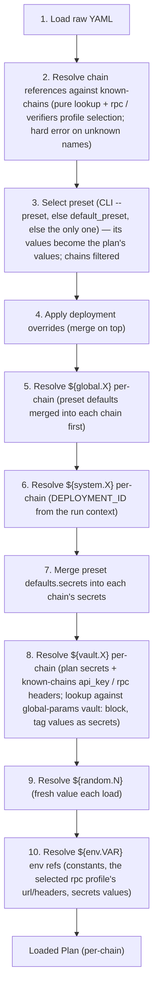

# References & substitutions

Single, canonical specification for every `${...}` substitution form supported by deploy-pad configs. Every other doc links here when mentioning substitutions.

## Table of contents

- [Overview](#overview)
- [Definition sites — where each value lives](#definition-sites--where-each-value-lives)
- [Namespace summary](#namespace-summary)
- [`${global.NAME}` — globals registry](#globalname--globals-registry)
- [`${system.NAME}` — engine system variables](#systemname--engine-system-variables)
- [`${secret.NAME}` — credentials registry](#secretname--credentials-registry)
- [`${vault.NAME}` — vault registry](#vaultname--vault-registry)
- [`${random.N}` — random alphanumeric strings](#randomn--random-alphanumeric-strings)
- [`${env.VAR}` — environment variables](#envvar--environment-variables)
- [Scoping](#scoping)
- [Transforms vs. `${...}` substitution](#transforms-vs--substitution)
- [Naming convention for user-declared inputs and constants](#naming-convention-for-user-declared-inputs-and-constants)
- [Built-in command parameters (`builtin.` names)](#built-in-command-parameters-builtin-names)
- [Resolution order](#resolution-order)
- [Open questions / candidates for v2 redesign](#open-questions--candidates-for-v2-redesign)

## Overview

A reference is any `${...}` token inside a string value in a YAML config. References are resolved at **load time** (mostly) by the engine; the exact step depends on the namespace (see [Resolution order](#resolution-order)).

**Two forms exist for every namespace:**

- **Exact**: the entire string value is a single reference. `WETH_ADDRESS: "${global.WETH}"`.
- **Inline**: the reference is embedded inside a larger string. `SALT: "kyc_${random.16}_${system.CHAIN_ID}"`.

Both forms are supported uniformly. The difference matters only for one tooling subtlety: an exact reference could preserve a non-string value type — and since deploy-pad values are always strings, that is a non-issue today.

**v2 requires explicit namespacing.** Every `${...}` token must start with one of the six namespace prefixes (`global.`, `system.`, `secret.`, `vault.`, `random.`, `env.`). Bare `${VAR}` (without a namespace) is rejected by the v2 schema; use `${env.VAR}` instead.

**Unresolved references are hard errors — by default.** Miss behavior is governed by the plan's top-level **`strict` flag** (boolean, **default `true`**; see [plans.md → `Plan` fields](plans.md#plan-fields)):

- **`strict: true` (the default):** every namespace throws on miss, at its own resolution step (see [Resolution order](#resolution-order)) — a `${...}` token whose lookup fails aborts the plan load with an error naming the token and its location. Nothing is left in place and nothing silently resolves to an empty string.
- **`strict: false`:** load-time misses of `${global.X}`, `${system.X}`, and `${env.VAR}` inside **plan values** (the selected preset's `constants`, `deploy` values, and `secrets` values — including env refs substituted in from vault entries) leave the token in place, and one post-resolution pass reports every unresolved token as a **warning**. A step that actually **consumes** an input still containing an unresolved token is a hard error at step input resolution — non-strict tolerates *unused* placeholders; it never lets an unresolved token reach a command.

**Always strict, regardless of the flag:** `${vault.X}` lookups (a name missing from the vault registry is always a config bug), known-chains connection fields (`rpc.<p>.url` / `headers`, `verification.<p>.api_key`) and actions `repository.auth` (connection infrastructure must resolve to be usable), and `${secret.X}` at step input resolution.

Three authoring rules that hold in either mode:

- **Intentional empties are explicit.** To leave a key deliberately valueless, write `KEY: ""` — never a dangling reference.
- **Placeholders live in non-selected presets.** Only the selected preset is resolved, so a template preset may hold not-yet-resolvable refs as long as it isn't the active one. (`strict: false` additionally tolerates them in the active preset, as long as no step consumes them.)
- **Defaults must resolve on every chain.** A preset's `defaults.constants` is merged into *every* active chain before resolution, so a `${global.X}` there must resolve (per-chain override or a global default) on each of them. Chain-asymmetric globals belong in per-chain `constants` blocks, only on the chains that define them.

## Definition sites — where each value lives

The [Scoping](#scoping) section (below, after the namespace specs) says *where a `${...}` reference is allowed*. This section says the opposite: *where each value is defined*, and which namespace (if any) that definition site backs.

Legend:

- `──► ${ns.NAME}` — this YAML key **is** the registry entry for that namespace.
- `looked up by <KEY>` — plan-local value, resolved by name via a workflow mapping, not via `${...}`.
- `engine, at run time` — not authored; the engine reads resolved plan state.
- `values may embed: ${...}` — the definition site itself accepts references to other namespaces.

```
process.env
└── <VAR>                              ──►  ${env.VAR}
        actual runtime values                 (resolved last; hard fail if unset)


global-params.yaml
│
├── defaults.constants.<NAME>          ──►  ${global.NAME}
│       plain strings only                    chain fallback
│
├── chains.<chain>.constants.<NAME>    ──►  ${global.NAME}
│       plain strings only                    per-chain override (wins over defaults)
│
└── vault.<roleName>                   ──►  ${vault.roleName}
        "${env.VAR}" only                     pointer only — never the credential itself


known-chains.yaml                        the connection registry — single source of truth
│                                        for all chain connection settings; plans hold
│                                        name references + profile selectors only
└── <chainName>
    ├── chain_id                         ──►  ${system.CHAIN_ID} (via the plan's reference)
    ├── rpc.<profileName>                selected by plan chains.<name>.rpc
    │   ├── url                          ──►  ${system.RPC_URL} after resolve
    │   │                                     may embed ${vault.X} / ${env.VAR} inline —
    │   │                                     ref fragments display as [vault.X] / [env.VAR]
    │   └── headers.<header>             may embed ${vault.X} / ${env.VAR} inline —
    │                                        ref fragments display as [vault.X] / [env.VAR]
    └── verification.<profileName>       selected by plan chains.<name>.verifiers
        ├── type / api                   plain values (dialect + endpoint)
        └── api_key                      ──►  ${secret.verificationApiKey} per verify pass
                                             single ${vault.X} or ${env.X} token only


plan.yaml  (plans/<workflow>.yaml)
│
├── workflow, releases, default_preset
│       identifiers / selectors — not parameter values
│       (deployment id is NOT here: CLI --deployment-id or derived
│        from the selected preset's name — see plans.md)
│
├── chains.<name>                        chain references — selectors only, no values
│   ├── rpc: <profileName>               selects known-chains rpc.<profileName>
│   │                                       (omitted -> "default")
│   └── verifiers: name | [names] | false  selects known-chains verification profile(s)
│                                           or disables verification
│
└── presets.<presetName>                 the value layer — exactly one preset
    │                                    is active per run (self-contained;
    │                                    no inheritance from base or other presets)
    │
    ├── defaults
    │   │
    │   ├── constants.<KEY>              ──►  workflow mappings look up by <KEY>
    │   │       launch baseline                 values may embed:
    │   │                                       ${global.*} → global-params
    │   │                                       ${random.N} → generated at load
    │   │                                       ${env.VAR}  → process.env
    │   │                                     (merged into each chain; then emptied)
    │   │
    │   ├── deploy.{salts,factories,saltBase}
    │   │       per-step deployment-strategy    values may embed:
    │   │       data, keyed by step id          ${global.*} ${system.*} ${random.N} ${env.VAR}
    │   │       (method itself: workflows.yaml) (deep-merged into the preset's
    │   │                                        chains.<c>.deploy by step-id key)
    │   │
    │   └── secrets.<slotName>           ──►  ${secret.<slotName>}  (engine, at run time)
    │           credential slots                slot values may be:
    │           e.g. privateKey,                ${vault.*} → global-params vault:
    │                privateKey1,               ${env.VAR} → process.env
    │                sameNonceDeployer, …       literal    → discouraged
    │                                     (all tagged as secrets regardless of form;
    │                                      merged into chains.<c>.secrets; then emptied)
    │
    └── chains.<name>.{constants,deploy,secrets}
            per-chain values for this preset (chain wins over the preset's
            defaults; if the block is present it also filters the chain set);
            does NOT redefine the chain reference or its rpc / verifiers selectors


actions.yaml
│
├── <repo>.repository.auth             ──►  git clone/fetch credential
│       single token only:                  ${vault.*} or ${env.VAR}
│
└── <repo>.<generation>.actions.<id>
    ├── inputs[*]                       declared names only — no values
    ├── command / contract / …          no value definitions
    ├── inputConstants.<KEY>            ──►  hard constant for this action
    │                                       (plan/mappings cannot override)
    └── outputs[*]                      declared names only — no values, no templates


workflows.yaml
├── <workflow>.steps[]
│   ├── action / workflow / method / factory    structure only
│   └── mappings.<inputKey>: <value>    wiring only — no value definitions
│           <value> = bare name         ──►  plan constants.<value>
│                     or                or  plan secrets.<value>  (if key is privateKey)
│                     stepId.OUTPUT     ──►  prior step output
│                     or list / object  ──►  production pipeline (pick + transform + combine);
│                                            leaf sources are still bare names / stepId.OUTPUT
│                                            (array outputs allow an index: stepId.OUTPUT[i])
│                                            (transforms are NOT ${...} — see Transforms below)
│
└── <variant>.{variantOf,methods,factories,keys,  method variant — same steps/wiring,
               chains.<c>.{methods,factories,keys}}  per-step method + factory-flavor
                                           + key-slot overrides only (names, never values)


─── engine-generated (defined nowhere in YAML) ───

${system.*}                            ──►  injected from resolved plan + run context
        CHAIN_ID, CHAIN_NAME, NETWORK,       (available in plan constants/deploy after
        RPC_URL, DEPLOYMENT_ID                 per-chain merge; also in output templates)

${random.N}                            ──►  fresh string generated at plan load

${secret.<slotName>}                   ──►  read from resolved plan secrets.<slotName>
                                           per chain; per-step slot via mappings.privateKey
                                           (authors never write ${secret.*} in YAML)
```

### Three registry types

```
REGISTRY (name → value, shared or reusable)
  global-params.defaults.constants.*     →  ${global.NAME}
  global-params.vault.*                  →  ${vault.roleName}
  known-chains.<chain>.rpc.*             →  selected by plan chains.<c>.rpc (not ${...})
  known-chains.<chain>.verification.*    →  selected by plan chains.<c>.verifiers (not ${...})

LAUNCH VALUES (key → value, per launch — all inside the active preset)
  preset.defaults.constants.*            →  looked up by workflow mapping key
  preset.chains.<c>.constants.*          →  same, per chain
  preset.*.secrets.*                     →  ${secret.<slotName>}
  preset.*.deploy.*                      →  engine deploy data (salts/factories/saltBase)

WIRING ONLY (no values)
  workflows.mappings.*                   →  renames / step output refs
  actions.inputs[*]                      →  declared names only
```

### Credential path (end to end)

```
global-params.vault.create3Deployer: "${env.PK_CREATE3}"
        │
        ▼
plan preset secrets.privateKey1: "${vault.create3Deployer}"
        │
        ▼
workflow mappings.privateKey: privateKey1
        │
        ▼
engine ${secret.privateKey}  →  SEC_PRIVATE_KEY  →  subprocess
```

## Namespace summary

| Namespace | Syntax | Where it's valid (see [Scoping](#scoping)) | Resolved (see [Resolution order](#resolution-order)) |
|---|---|---|---|
| globals | `${global.NAME}` | preset constants (preset defaults + per-chain) | at plan load, per chain (step 5) |
| system  | `${system.NAME}` | preset constants (per-chain), preset `deploy` values | at plan load, per chain, from the run context (step 6) |
| secret  | `${secret.NAME}` | engine-injected only — never authored as the value of a config field. Authors place secret values *into* the preset's `secrets:` blocks (typically as `${vault.X}` refs); deployment commands consume them implicitly via `${secret.privateKey}` (built-in). Per-step mappings can rename to a different named secret. | by the engine at step input resolution (per chain, with preset `defaults` fallback) |
| vault   | `${vault.NAME}` | preset `secrets.*` values (preset defaults + per-chain); known-chains `verification.<p>.api_key` (single token) and `rpc.<p>.url` / `rpc.<p>.headers` values (inline allowed); actions.yaml `repository.auth`. Looked up against [global-params.yaml](global-params.md) `vault:` block. Resolved values are tagged as secrets by the engine and display as `[vault.<name>]` in all engine output. | at plan load — lookup plus secret tagging (step 8) |
| random  | `${random.N}` | preset constants | at plan load — fresh per deployment, frozen on resume (step 9) |
| env     | `${env.VAR}` | global-params `vault.*` (only form accepted there); preset `secrets.*` and preset constants; known-chains `rpc.<p>.url` / `rpc.<p>.headers` values (inline ok) and `verification.<p>.api_key` (single token); actions.yaml `repository.auth` (single token only) | last, against the process environment (step 10) |

Namespace tokens are reserved and required: every `${foo.bar}` must use one of the six prefixes above. Anything else is a v2 schema error (no fallback to env vars).

## `${global.NAME}` — globals registry

Reads from [global-params.yaml](global-params.md). Resolution is **chain-aware**: a chain-specific override wins, falling back to `defaults.constants[NAME]`. The chain comes from the surrounding `chains.<chainName>.constants` block in the plan.

**Syntax:**

```yaml
WETH_ADDRESS: "${global.WETH}"
NOTE: "weth-on-${system.CHAIN_NAME}-is-${global.WETH}"
```

**Behavior on miss:** **hard error at plan load** (default) — a name with no per-chain override and no default (e.g. a typo like `${global.WETHX}`, or a chain-asymmetric global resolved on a chain that doesn't define it) aborts the load, naming the token, the constant key, and the chain. With plan `strict: false`, the token is instead left in place and reported as a warning; a step consuming it is still a hard error (see the [Overview](#overview) miss rule). To keep a key intentionally valueless, write `KEY: ""` instead of a dangling ref; to use a global that exists only on some chains, reference it from those chains' per-chain `constants` blocks rather than from `defaults` (which merges into every chain).

**Inline form:** supported.

## `${system.NAME}` — engine system variables

Engine-injected execution-context values. They surface through up to two channels: as `${system.X}` **references** in per-chain config (where the value is single-valued), and as `SYS_*` **environment variables** that the engine injects into the command (see the *Command env* column below — `NETWORK` is reference-only, and `SYS_VERIFY` is set only when the verification gates pass). The per-chain values are *additionally* available as `${system.X}` references at the time per-chain constants are resolved; the per-step ones (`VERIFY`, `ARTIFACTS_DIR`) exist only as command env vars.

**Available names:**

| Name | Value | `${system.X}` reference | Command env |
|---|---|:---:|---|
| `CHAIN_ID` | numeric chain id of the current chain (as string), e.g. `"1"` | yes (per-chain) | `SYS_CHAIN_ID` |
| `CHAIN_NAME` | chain name as it appears in `chains.<name>`, e.g. `"mainnet"` | yes (per-chain) | `SYS_CHAIN_NAME` |
| `NETWORK` | alias for `CHAIN_NAME` (legacy) | yes (per-chain) | — |
| `RPC_URL` | resolved URL of the chain's **selected RPC profile** (the plan's `rpc:` selector, defaulting to the `default` profile — see [known-chains.md](known-chains.md)) | yes (per-chain) | `SYS_RPC_URL` |
| `DEPLOYMENT_ID` | the deployment id resolved at run time (CLI `--deployment-id`, else derived from the selected preset's name, with any ordinal suffix — see [plans.md → Deployment id & re-runs](plans.md#deployment-id--re-runs)), e.g. `"prod-v1.2"` | yes (per-chain) | `SYS_DEPLOYMENT_ID` |
| `VERIFY` | `"1"` when the [verification gates](engine-internals.md#verification) pass for the step; unset otherwise | no — per-step | `SYS_VERIFY` |
| `ARTIFACTS_DIR` | engine-created, per-step directory for the command's artifacts | no — per-step | `SYS_ARTIFACTS_DIR` |

> **Reference form vs command env.** The first five are single-valued **per chain**, so they can be written as `${system.X}` in per-chain constants, `deploy.*`, and output templates. `VERIFY` and `ARTIFACTS_DIR` are **per-step** (they vary by action/step within the same chain), so they have **no `${system.X}` reference form** — the engine materializes them per step in the enrich phase and passes them only as the `SYS_VERIFY` / `SYS_ARTIFACTS_DIR` env vars to the deploying command. See [engine-internals.md → The deployment interface](engine-internals.md#the-deployment-interface). (The secret-namespace analog of command-env-only values is `SEC_PRIVATE_KEY` / `SEC_VERIFICATION_API_KEY`.)

**Syntax:**

```yaml
DEPLOYMENT_TAG: "${system.DEPLOYMENT_ID}"
LABEL: "deploy-${system.CHAIN_NAME}-${system.CHAIN_ID}"
```

**Where it's valid (see [Scoping](#scoping)):**

- Preset per-chain constants (`presets.<p>.chains.<c>.constants`).
- Preset `deploy.{salts,factories,saltBase}` values (per chain) — e.g. `saltBase: "deploy_${system.DEPLOYMENT_ID}"`, `factories.aqua: "${global.FACTORY_A}"`.
- *(`VERIFY` / `ARTIFACTS_DIR` are excluded from all of the above — they have no reference form and reach the command only as `SYS_*` env vars.)*

**Behavior on miss:** **hard error at plan load** (default) — unknown names abort the load, including `${system.VERIFY}` and `${system.ARTIFACTS_DIR}`, which are real system-namespace members but have **no reference form** (they are per-step; see the table above), so writing them as `${system.X}` is a miss like any other. With plan `strict: false`, the token is left in place and reported as a warning; a step consuming it is still a hard error.

**Inline form:** supported.

> **`${chain}` is gone in v2.** v1 had a one-off bare `${chain}` substitution recognized only inside the v1 `captureAbiPath` field, processed by an ad-hoc string replace. v2 removes that field entirely — a deploying command builds chain-aware paths itself from the `SYS_CHAIN_NAME` env var when copying files into `SYS_ARTIFACTS_DIR` (see [engine-internals.md → The deployment interface](engine-internals.md#the-deployment-interface)).

## `${secret.NAME}` — credentials registry

> Conceptual end-to-end guide: [secrets.md](secrets.md). This section is the namespace spec.

Resolves credentials (private keys, verification API keys, anything sensitive) sourced from the plan `secrets:` block. Engine-managed: authors do **not** place `${secret.X}` as a value in their YAML — they place actual secret values (typically as `${vault.X}` refs; `${env.VAR}` and literals are also accepted) under `secrets:` in the plan. Every value in this namespace is tagged and redacted regardless of source. The engine injects credentials into a step's command as `SEC_*` environment variables, but **only the secrets that step actually uses** — not the whole `secrets:` block: the step's resolved private key as `SEC_PRIVATE_KEY` (the slot chosen by `mappings.privateKey`, defaulting to `privateKey`; injected per the [private key rule](actions.md#the-deploys-flag)) and, when the [verification gates](engine-internals.md#verification) pass, `SEC_VERIFICATION_API_KEY`. Other declared slots (`privateKey1`, etc.) are never injected for a step that doesn't reference them. This contrasts with `${system.*}`, whose context values are not per-step-selected — every step gets the same system context (subject only to the per-variable conditions in [the table above](#systemname--engine-system-variables)).

### Built-in secret names

These are always-available names that the engine consumes for known purposes:

| Name | Consumer | When required |
|---|---|---|
| `${secret.privateKey}` | Every deployment command (deploying action). | Always required for deploying actions. |
| `${secret.verificationApiKey}` | Verification flow on deploying actions with `verify: true`. | **Not a plan slot in v2** — the engine sources it from the **selected verification profile's `api_key`** in [known-chains.md](known-chains.md) (per the plan chain reference's `verifiers:` selector; `verifiers: false` disables). With several selected profiles, the engine runs one verification pass per profile, injecting each key in turn; a keyless profile injects nothing. |

### Author-defined secret names — and the rename mechanism

Authors may add arbitrary named entries under `secrets:` (inside a preset) for cases like multi-PK setups (different deployers per step):

```yaml
presets:
  prod:
    chains:
      mainnet:
        secrets:
          privateKey: "${vault.privateKey}"          # default for any deployment step
          privateKey1: "${vault.create3Deployer}"
          privateKey2: "${vault.sameNonceDeployer}"
```

The two configs split responsibilities cleanly:

- **Plan** (above) — declares the **values**. Each entry's value is a `${vault.X}` ref that the engine resolves to an env-var ref, then to the actual env value at execute time.
- **Workflow** (per-step `mappings`) — declares the **name to read**. A mapping like `mappings.privateKey: privateKey1` is a **rename**: it tells the engine to read `secrets.privateKey1` for this step instead of the default `secrets.privateKey`.

```yaml
- action: cross-chain-swap.v1.escrow-factory
  id: escrow-factory-1
  mappings:
    privateKey: privateKey1        # rename: this step reads chains.<c>.secrets.privateKey1
- action: cross-chain-swap.v1.escrow-factory
  id: escrow-factory-2
  mappings:
    privateKey: privateKey2        # rename: this step reads chains.<c>.secrets.privateKey2
```

Mapping values for secret-targeted inputs are **bare names** that match a key under `secrets:` — not `${secret.X}` syntax, not `${vault.X}` syntax, not `${env.X}` syntax, not literal credentials. The mapping is purely a rename; the credential itself lives only in the plan (which itself usually points at the vault). The workflow is reusable across many plans that wire different physical keys per step.

### Resolution

- **Per-chain with preset-defaults fallback.** The preset's `chains.<c>.secrets.<name>` wins; if absent, falls back to the preset's `defaults.secrets.<name>`.
- **Resolved before env refs are processed**, so `${env.VAR}` inside a secret value resolves last and ends up as the literal credential.
- **Behavior on miss:** hard error — "secret `<name>` not found for chain `<c>`." For a **deploying step**, the resolved key slot is checked statically, at [static planning](../architecture/phase-3-static-planning.md#required-data-checks) (waived in multisig mode); for other key consumers (`requiresPrivateKey` steps, `mode: send` calls) the error surfaces at step input resolution, once the step's `mappings.privateKey` rename is applied. Not relaxed by plan `strict: false` — a consumed-but-missing secret can never proceed.

### Security

- Secret values should always be `${vault.X}` (preferred) or `${env.VAR}` references in committed YAML — never literal credentials.
- **Every value under `secrets:` is tagged as a secret** regardless of source — `${vault.X}`, direct `${env.X}`, or a literal. Tagged values are injected to commands under the `SEC_` prefix, excluded from writer output, and never shown in engine logs and reports (`run-N.yaml`, `result.yaml`, `config_snapshot.yaml`, `deployment.yaml`): vault-sourced values display as their reference label (`[vault.<name>]`), direct-env and literal values as `********` / `[redacted: <slot>]`.
- The vault form is preferred for its indirection (rotation, audit, future secret sources), **not** for extra protection — all forms are redacted equally. A literal is still discouraged because it sits in plaintext in the committed YAML, which the engine cannot scrub. The only remaining leak path is a custom command that exposes the value itself. See [secrets.md](secrets.md).

## `${vault.NAME}` — vault registry

> Conceptual end-to-end guide: [secrets.md](secrets.md). This section is the namespace spec.

Resolves a stable secret name to its environment-variable reference, sourced from the `vault:` block of [global-params.yaml](global-params.md#vault). Valid **only** as the value of a plan `secrets:` entry, a known-chains connection field (`rpc.<p>.url`, `rpc.<p>.headers`, `verification.<p>.api_key`), or `repository.auth` in actions.yaml.

**Syntax:**

```yaml
# in a plan — secrets: blocks live inside presets
presets:
  prod:
    chains:
      mainnet:
        secrets:
          privateKey: "${vault.privateKey}"
          create3Deployer: "${vault.create3Deployer}"

# in known-chains.yaml — connection fields
mainnet:
  chain_id: 1
  rpc:
    alchemy:
      url: "https://eth-mainnet.g.alchemy.com/v2/${vault.alchemyKey}"   # inline allowed in connection strings
    private:
      url: "https://web3.1inch.io/1/"
      headers:
        Authorization: "Bearer ${vault.rpcAuthToken}"   # inline allowed in connection strings
  verification:
    default:
      api: "https://api.etherscan.io/v2/api"
      api_key: "${vault.etherscanKey}"                  # single token

# in actions.yaml — git token for a private repo
my-private-repo:
  repository:
    uri: "https://github.com/my-org/private-contracts.git"
    auth: "${vault.gitHubToken}"
```

**Where it's valid (see [Scoping](#scoping)):** the preset's `defaults.secrets.*` and `chains.<c>.secrets.*` values; known-chains `verification.<p>.api_key` (single token) and `rpc.<p>.url` / `rpc.<p>.headers` values (inline allowed); and actions.yaml `repository.auth` ([actions.md → Private repos and authentication](actions.md#private-repos-and-authentication)). Nowhere else.

**Resolution:**

1. The engine reads the named entry from `global-params.yaml`'s `vault:` block (e.g. `vault.create3Deployer` → `"${env.PK_CREATE3}"`).
2. The resulting `${env.VAR}` ref is then resolved against `process.env`.
3. The fully resolved value is **tagged as a secret** in the engine's param model — see [engine-internals.md → Vault resolution and secret tagging](engine-internals.md#vault-resolution-and-secret-tagging) for the runtime consequences (injection under the `SEC_` prefix, log redaction, no serialization to disk). Note that secret values authored as direct `${env.X}` or as literals are tagged the same way; the vault form is preferred for its indirection, not for the tagging.

**Behavior on miss:** hard error at config load — `vault entry "<name>" not found in global-params.yaml`. **Always strict**: the plan `strict: false` flag does not relax vault lookups (a name missing from the registry is always a config bug, and un-tagged secret flow must never happen).

**Inline form:** allowed only in known-chains **connection strings** — `rpc.<p>.url` and `rpc.<p>.headers` values (`"https://.../v2/${vault.alchemyKey}"`, `"Bearer ${vault.rpcAuthToken}"`). There, redaction is **per fragment**: every vault-resolved fragment is displayed as its reference label `[vault.<name>]` in all engine output (inline `${env.VAR}` fragments display as `[env.<VAR>]` likewise), so the secret bytes never surface while the rest of the string stays readable; commands and the network receive the real resolved string. Everywhere else the whole value must be a single `${vault.X}` token (or a single `${env.X}` token; plan secret entries also accept a literal, the others do not) — those values *are* the credential, and they display as the same label. See [secrets.md → Connection credentials](secrets.md#connection-credentials-known-chains) and [design-decisions.md → Vault redaction](design-decisions.md#vault-redaction-show-the-reference-never-the-secret).

**Author-defined names** are arbitrary camelCase identifiers (e.g. `privateKey`, `create3Deployer`, `sameNonceDeployer`, `etherscanKey`). The set of valid names is whatever `vault:` declares. The plan does not invent names — it picks them from the vault.

## `${random.N}` — random alphanumeric strings

Generates a fresh random alphanumeric string of length `N` on each load. Charset: `a-z`, `A-Z`, `0-9` (62 characters).

**Syntax:**

```yaml
KYC_TOKEN_SUFFIX: "${random.10}"
SALT: "deploy_${random.16}_v1"
```

`N` must be a positive integer. There is no upper bound enforced.

**Resolution timing:** each `${random.N}` token produces a **new** random string per fresh deployment. Mechanically it resolves at plan load — but the value generated at deployment creation is frozen in `config_snapshot.yaml` with the rest of the resolved parameter set and **reused on resume** (the [parameter freeze](../architecture/phase-4-deployment-resolution.md#the-parameter-freeze-on-resume); an explicit `--refreeze` regenerates). `${random.N}` remains a **test-only convenience** for throwaway uniqueness (test salts, scratch identifiers, collision-free names in staging/testing presets). There is no seeded form — that non-goal is settled (see [the resolved-questions callout](#open-questions--candidates-for-v2-redesign)).

**Behavior on miss:** not applicable — there is no lookup to miss. (Malformed forms like `${random.0}` or `${random.abc}` are schema errors, not misses.)

**Inline form:** supported.

**Caveat:** because the value changes per deployment, `${random.N}` must not be used for anything that needs determinism across deployments — production CREATE2/CREATE3 salts, addresses you intend to reproduce, identifiers recorded for audit. Use a fixed value in the plan for those. Keep `${random.N}` out of production-typed presets. (Within one deployment the value is stable — the parameter freeze reuses it across resumed invocations.)

## `${env.VAR}` — environment variables

Explicitly-namespaced reference to a `process.env` variable. **The only form accepted in v2** — bare `${VAR}` is no longer recognized.

**Syntax:**

```yaml
# in known-chains.yaml — an RPC profile url (inline ok; for URL-embedded
# credentials prefer ${vault.X}, whose fragments display as labels)
url: "https://eth-mainnet.g.alchemy.com/v2/${env.ALCHEMY_KEY}"

# Inside the global-params vault: block, ${env.VAR} is the only accepted value form.
vault:
  privateKey: "${env.PK_REGULAR_DEPLOYER}"
  etherscanKey: "${env.MAINNET_ETHERSCAN_KEY}"
```

**Variable name rules:** anything matching `[A-Za-z_][A-Za-z0-9_]*` after the `env.` prefix.

**Behavior on miss:** hard error — `Environment variable VAR not set` (default). Env is the last namespace to resolve, so an env miss is reported only after everything else has resolved successfully. With plan `strict: false`, misses in **plan values** (constants, `deploy`, `secrets` values — including env refs substituted in from vault entries) are left in place and warned about, erroring only if a step consumes them; env refs in known-chains connection fields (`url`, `headers`, `api_key`) and `repository.auth` remain **always strict**.

**Inline form:** supported (e.g. `"Bearer ${env.MY_API_TOKEN}"`). Not allowed inside a `vault:` value or in actions.yaml `repository.auth` (in both, the whole value must be a single `${env.VAR}` token).

**Security note:** secrets (private keys, API keys) MUST come from env vars, never inlined as literal values in the YAML. The recommended path is `vault: { <name>: "${env.VAR}" }` in `global-params.yaml`, then `secrets: { <key>: "${vault.<name>}" }` in the plan. Every value under `secrets:` is tagged and redacted by the engine regardless of source (vault ref, direct `${env.X}`, or literal); the vault is preferred for rotation/audit indirection, not for the tagging. The redaction pass that produces `config_snapshot.yaml` redacts the entire `secrets:` block as a unit regardless.

## Scoping

Now that each namespace is defined, here is where each one is allowed. Each entry is a YAML field/location and lists only the namespaces it accepts; everything else is rejected by the schema or simply left literal (the token is not resolved). `inline` = a reference may be embedded in a larger string (`"prefix_${ns.X}_suffix"`); `single token` = the whole value must be exactly one reference.

- **global-params `constants.*`**: pure strings only (no references).
- **global-params `vault.*`**: `${env.VAR}` only, single token (no inline).
- **preset `defaults.constants[*]`**: `${global.X}`, `${system.X}`, `${random.N}`, `${env.VAR}` (inline ok). `${system.X}` resolves per chain *after* the defaults→chain merge; prefer the per-chain block for chain-specific refs.
- **preset `chains.<c>.constants[*]`**: `${global.X}`, `${system.X}`, `${random.N}`, `${env.VAR}` (inline ok).
- **preset `deploy.{salts,factories,saltBase}`** (in `defaults` and per chain): `${global.X}`, `${system.X}`, `${random.N}`, `${env.VAR}` (inline ok).
- **preset `defaults.secrets.*` / `chains.<c>.secrets.*`**: `${vault.X}` or `${env.VAR}`, single token (no inline; a literal is accepted but discouraged).
- **plan `chains.<c>.rpc` / `chains.<c>.verifiers`** (base plan — chain reference selectors): none (bare profile names / `false`; not interpolated).
- **known-chains `rpc.<p>.url`**: `${vault.X}` or `${env.VAR}`, inline ok — vault is the recommended form for URL-embedded credentials (e.g. `.../v2/${vault.alchemyKey}`); resolved ref fragments display as `[vault.<name>]` / `[env.<VAR>]` in engine output.
- **known-chains `rpc.<p>.headers` values**: `${vault.X}` or `${env.VAR}`, inline allowed; resolved ref fragments display as `[vault.<name>]` / `[env.<VAR>]` in engine output.
- **known-chains `verification.<p>.api_key`**: `${vault.X}` or `${env.VAR}`, single token (no inline, no literal).
- **actions `repository.auth`**: `${vault.X}` or `${env.VAR}`, single token (no inline).
- **action `inputs[*]` / `outputs[*]` / `command` / `contract`**: none (pure declarations — no references). The input `transform` field is a transform name, not a `${...}` reference (see [Transforms vs. `${...}` substitution](#transforms-vs--substitution)).
- **workflow `mappings.*`**: none (bare names or `stepId.OUTPUT` only; not interpolated). Production-pipeline values (`from` / `transform` / `combine`) are this same non-`${...}` wiring mechanism — see [Transforms vs. `${...}` substitution](#transforms-vs--substitution).
- **engine config (`engine.yaml`) — all fields**: none. `preflight.checks.*.params` values are passed to check scripts **verbatim**; the engine never interprets them ([engine.md](engine.md)).

Two reading rules:

- **Actions are pure declarations.** No namespaces are valid in their bodies — inputs, outputs, `command`, `contract` carry names only. To thread chain-specific or runtime values into an action, use plan constants and workflow mappings. (`repository.auth` is repo-level plumbing, not part of any action body — it accepts a single `${vault.X}` or `${env.X}` token; see [actions.md → Private repos and authentication](actions.md#private-repos-and-authentication).)
- **Workflow `mappings` are not interpolated strings.** Their values are step output references (`stepId.OUTPUT_NAME`), bare-name renames (looked up in plan `constants` or `secrets`, depending on the mapping key), or production-pipeline lists/objects. The `${...}` system does not apply; the transform/combine machinery is a separate mechanism (next section).

## Transforms vs. `${...}` substitution

deploy-pad has **two unrelated value-shaping mechanisms**. They are easy to confuse because both "change a value," so this section draws the line.

| | `${...}` substitution | Transforms / `combine` |
|---|---|---|
| **What** | Resolve a named value into a string (globals, system, secrets, env, random). | Reshape resolved values: coerce one value's encoding (`transform`), or assemble several into one (`combine`). |
| **Syntax** | `${ns.NAME}` inside a string. | `transform: [salt]` on an action input or a workflow source; `combine: array` / `abiEncode(...)` on a workflow mapping. |
| **Where** | Plan constants/secrets, known-chains connection fields (`url`, `headers`, `api_key`), `repository.auth` (see [Scoping](#scoping)). | Action `inputs[*].transform` and workflow `mappings` only. |
| **When** | Plan load time (see [Resolution order](#resolution-order)). | Step input resolution, after the source value (a constant or step output) is in hand. |

The two **never overlap in syntax**: a `transform` value is a transform name (`salt`, `keccak256`), never a `${...}` token; a `combine` value is `array` / `abiEncode(...)` / `abiEncodePacked(...)` / `abiEncodeWithSignature(...)`; a `pick` value is an integer index; and a pipeline `from` source is a bare-name rename or `stepId.OUTPUT` (optionally indexed, `stepId.OUTPUT[i]`), never `${...}`.

The transform system has **three axes** (full spec in [actions.md → Input shape](actions.md#input-shape-arity-and-encoding-transforms) and [workflows.md → Production pipeline](workflows.md#production-pipeline-transforms-combine-and-split); design rationale in [design-decisions.md → Value transforms](design-decisions.md#value-transforms)):

- **Extraction (`pick`, array→scalar, split).** Extracts one element from an array-valued source (`array: true` step output or JSON-array constant); index sugar `stepId.OUTPUT[i]`. Workflow-only; runs before the encoding axis. The dual of `combine`.
- **Encoding (`transform`, 1→1).** `salt`, `keccak256`. The action declares the **authoritative** coercion an input requires (applied last, scalar-only); a workflow source may **add** adaptation transforms before it but never override it.
- **Structural (`combine`, N→1).** `array`, `abiEncode`, `abiEncodePacked`, `abiEncodeWithSignature`. Workflow-only (only the workflow knows the multiple sources), one per mapping.

## Naming convention for user-declared inputs and constants

User-declared identifiers — action `inputs`, action `outputs` names, and plan `constants` keys — share a single naming rule.

### Identifier rule

The schema enforces:

```
^[a-zA-Z][a-zA-Z0-9_]*$
```

i.e. start with an ASCII letter; subsequent characters are letters, digits, or underscores. Mixed case is allowed. There is no maximum length enforced.

Note the rule forbids dots. Keys of the form `builtin.<NAME>` are a **separate, engine-owned key class** — they name [built-in command parameters](#built-in-command-parameters-builtin-names) declared by action types, valid as plan `constants` keys and workflow `mappings` keys but never as `inputs`/`outputs` names. The dot is what keeps the two classes structurally disjoint.

### Recommended style

`SCREAMING_SNAKE_CASE` is the recommended style for human-authored inputs and constants because it reads naturally as an env-var-style key (parameter maps are written to `.env.automation` for many command types) and makes it easy to spot author-declared parameters versus framework code:

```yaml
inputs:
  - LOP_ADDRESS
  - FACTORY_OWNER_ADDRESS
```

`camelCase` and other styles are valid:

```yaml
inputs:
  - lopAddress
  - factoryOwnerAddress
```

Pick a style and use it consistently within a generation. Mixing styles inside one action is not rejected but is discouraged.

### Legacy `OPS_*` names

The `OPS_*` prefix from earlier deploy-pad versions is **still accepted** — it matches the regex above. Existing configs do not need to be renamed. Authors writing new actions are not required to use the prefix.

```yaml
inputs:
  - OPS_LOP_ADDRESS         # legacy style — accepted
  - OPS_FACTORY_OWNER_ADDRESS
```

### What never carries an author-chosen name

Engine-managed values are exposed through namespaced references and never appear as `inputs` entries or as constant keys:

| Concept | Reference |
|---|---|
| Private key | `${secret.privateKey}` (engine-injected; not declared in `inputs`) |
| Chain id | `${system.CHAIN_ID}` |
| Chain name | `${system.CHAIN_NAME}` |
| RPC URL | `${system.RPC_URL}` |
| Deployment id | `${system.DEPLOYMENT_ID}` |
| Verification API key | `${secret.verificationApiKey}` |
| Verify flag | command env only — `SYS_VERIFY` (a command-env-only member of the system namespace; see [`${system.NAME}`](#systemname--engine-system-variables)) |
| Artifacts directory | command env only — `SYS_ARTIFACTS_DIR` (a command-env-only member of the system namespace; see [`${system.NAME}`](#systemname--engine-system-variables)) |

Mental model: **if you write the name in your YAML's `inputs` array, you choose it (any identifier matching the regex). If the engine hands the value to you, it lives under `${system.*}` or `${secret.*}` and is not author-named.** The two entries above (`SYS_VERIFY`, `SYS_ARTIFACTS_DIR`) are documented as command-env-only system variables: they have no `${system.X}` reference form (they are per-step) and reach the deploying *command* only as `SYS_*` env vars.

**Vault entry names are an exception:** they are author-chosen (the `vault:` block declares them), but they are not action-side identifiers — they are stable secret-role names referenced from plan `secrets.*` values via `${vault.X}`. They never appear in `inputs` arrays or in constants.

## Built-in command parameters (`builtin.` names)

Some engine-native action types have parameters that belong to the **type itself**, not to any authored action definition — e.g. the target address of a `contract-call`. These are **built-in parameters**: each action type declares its own set in engine code (name, required or optional, optional default value), and the engine merges them into the step's effective input set. They are not a `${...}` namespace — they are ordinary keys in the constants/mappings pipeline, distinguished by a dedicated key grammar:

```
^builtin\.[A-Z][A-Z0-9_]*$
```

i.e. the literal `builtin.` prefix followed by a SCREAMING_SNAKE_CASE name (e.g. `builtin.CALL_ADDRESS`). Because user-declared identifiers can never contain a dot (see [Identifier rule](#identifier-rule)), a built-in key can never collide with or shadow a user name — no reservation list is needed.

**Built-in parameters by type** (types not listed declare none):

| Built-in key | Declared by | Required | Default | Allowed values | Notes |
|---|---|---|---|---|---|
| `builtin.CALL_ADDRESS` | `contract-call` | yes | — | Address (string). | The contract whose method the step calls. Typically wired per-step from a prior deployment's output via `mappings: { builtin.CALL_ADDRESS: <stepId.OUTPUT> }`; can also come from plan constants. |

**How a built-in gets its value** — the same resolution ladder as any declared input:

1. **Per-step workflow mapping** (`mappings: { builtin.CALL_ADDRESS: ... }`) — a step output reference (dotted value) or a bare rename into an ordinary plan constant. Production-pipeline mapping values (`transform` / `combine` / `pick`) apply too. See [workflows.md → Mappings](workflows.md#mappings--the-wiring-layer).
2. **The plan constant of the same key** (`chains.<c>.constants` under the literal key `builtin.CALL_ADDRESS`) when no mapping is set. Standard substitution rules apply to the value. Note this is a *shared* fallback — every unmapped step of that type reads the same key; per-step differentiation always happens in the workflow.
3. **The type-declared default**, for optional built-ins that have one.
4. Otherwise: a **required** built-in with no value is a step-input-resolution error naming the parameter, the step, and the type.

Mapping a `builtin.` key that the step's action type does not declare is a validation **error** — the engine knows each type's set, so an undeclared name is always an authoring mistake.

> **Deployment strategy is not a built-in parameter.** Built-ins are parameters of a specific engine-native command's operation; the deployment method and its data belong to the deployment layer. The method (`create` / `create2` / `create3`) is the **workflow step's `method`**, overridable only by a **method variant** in the same file (never by the plan); the per-step CREATE3 factories and salts live in the plan **`deploy` block** (`deploy.factories.<stepId>` / `deploy.salts.<stepId>`, with an optional `saltBase` fallback) — they are per-step data with derived fallbacks, which the shared-constant model cannot express. See [plans.md → Deploy parameters](plans.md#deploy-parameters-deploy-block), [workflows.md → Per-step `method`](workflows.md#per-step-method), and [workflows.md → Method variants](workflows.md#method-variants--variantof). The v1 flat constants `deployMethod` / `create2Salt` / `create3Factory` / `create3Salt` no longer exist.

**The private key is not a built-in either** — it flows through the secrets channel (`${secret.privateKey}`, per-step `mappings.privateKey: <slot>` rename) with its own tagging and redaction machinery. See [secrets.md](secrets.md).

Authors never declare built-in names in an action's `inputs` array — structurally they can't (the input regex rejects the dot). The engine declares them; the workflow and plan supply their values.

## Resolution order

Substitutions happen during plan loading, in this order:



Implications of this order:

- **Every resolution step is strict by default.** A failed lookup at any step (unknown chain/profile, global miss, system miss, vault miss, env miss) aborts the load at that step — see the miss rule in the [Overview](#overview). With plan `strict: false`, global/system/env misses in plan values survive their step as literal tokens (collected into one warning pass after step 10) — so later steps *can* see unresolved earlier tokens; each resolver skips tokens that aren't its own namespace.
- Chain resolution is a **pure lookup + selection**, not a merge — the plan holds no connection data of its own; unknown chain or profile names are hard errors.
- A preset's constant value can be `${global.X}` — preset selection happens first, so by the time globals are resolved, the value is in place.
- `${random.N}` can appear inside a preset's constants and is resolved after globals/system; the result is a literal string going into env resolution.
- `${system.DEPLOYMENT_ID}` resolves from the run context (CLI `--deployment-id` or derived from the selected preset's name — see [plans.md → Deployment id & re-runs](plans.md#deployment-id--re-runs)); the id is fixed before the plan loads.
- `${vault.X}` resolution sits between secrets merge and env resolution. A vault entry is itself an `${env.VAR}` ref, so step 7 substitutes that ref into the secret value, and step 9 then resolves the env var. The vault resolution step is what tags the resulting value as a secret in the engine's param model.
- `${env.VAR}` is resolved last, so the env var's literal value is what ultimately ends up in the config. It cannot itself contain unresolved `${global.X}` etc. — the env resolver does not re-process its output.
- After step 4, the preset's `defaults.constants` is intentionally **emptied** because it has been merged into every per-chain `constants`. Same applies to `defaults.secrets` after step 6.

## Open questions / candidates for v2 redesign

**Nothing is currently open** — every substitution-system question raised for the v2 redesign has been decided. The callout below is the record; the rules above are the resulting spec. New proposals land here first.

> **Resolved by this revision (no longer open):**
> - `${env.VAR}` vs bare `${VAR}` — explicit `${env.VAR}` adopted; bare form removed.
> - `${chain}` ad-hoc template — removed; routes through `${system.CHAIN_NAME}`.
> - `${secret.NAME}` namespace — added.
> - `${vault.NAME}` namespace + vault registry in global-params — added; all `secrets:` values are tagged and redacted regardless of source (vault refs preferred for rotation/audit indirection, not for the tagging). Secrets are injected to commands under the `SEC_` prefix (distinct from `OPS_`).
> - User identifier naming rule — formalized as `^[a-zA-Z][a-zA-Z0-9_]*$` with `SCREAMING_SNAKE_CASE` recommendation; legacy `OPS_*` names accepted.
> - Built-in command parameters — the earlier single reserved constant (`callAddress`) is replaced by the general `builtin.<NAME>` mechanism documented in its own section above: each engine-native action type declares its parameters (required/optional + defaults) in engine code, and they resolve through the ordinary mappings/constants pipeline (`contract-call` declares `builtin.CALL_ADDRESS`). Deployment strategy stays out of constants: method is the workflow step `method` (overridable only by a workflow **method variant**, never by the plan), factory/salt the plan `deploy` block (the v1 flat `deployMethod` / `create2Salt` / `create3Factory` / `create3Salt` constants are removed).
> - Asymmetric miss behavior — resolved: **strict by default, with a per-plan opt-out**. The plan's top-level `strict` flag defaults to `true` (every namespace throws on miss at its resolution step — v1 left the token in place for `global`/`system`/`random` and threw only for `env`/`vault`). `strict: false` relaxes global/system/env misses in plan values to leave-in-place plus one aggregated warning pass; a consumed unresolved token still fails at step input resolution, and vault lookups / connection fields are always strict. The flag is a transitional escape hatch — a candidate for removal (making strict unconditional) if no real non-strict cases emerge. See the [Overview](#overview) miss rule.
> - `${random.N}` determinism — **rejected as a non-goal**, with one later narrowing: random regenerates per *fresh deployment* (no seeded form; a test-only convenience for throwaway uniqueness, not a mechanism for production values — anything reproducible across deployments uses a fixed plan value), but within one deployment the resolved value is frozen and reused on resume, because the [parameter freeze](../architecture/phase-4-deployment-resolution.md#the-parameter-freeze-on-resume) persists *all* untagged resolved values uniformly.
> - `${chain.FIELD}` candidate namespace (general accessor into the current chain's known-chains entry) — **rejected, no use case**. The chain fields plans actually consume are already exposed as `${system.CHAIN_ID}` / `${system.CHAIN_NAME}` / `${system.RPC_URL}`; a general accessor would only leak connection-registry internals (profile lists, credentialed headers) into the values layer. The six namespaces are the closed set.
> - `${prev.STEP_ID.OUTPUT}` candidate namespace (prior step outputs in plan constants) — **rejected, no use case**. Step-output wiring is the workflow's job — `mappings` already reference `stepId.OUTPUT` (with transforms/combine) at step input resolution — and constants are resolved at load time, before any step runs, so the namespace would break the load-time resolution model for a channel that exists elsewhere.
